# 8：L4.2 - 协调表示 👥

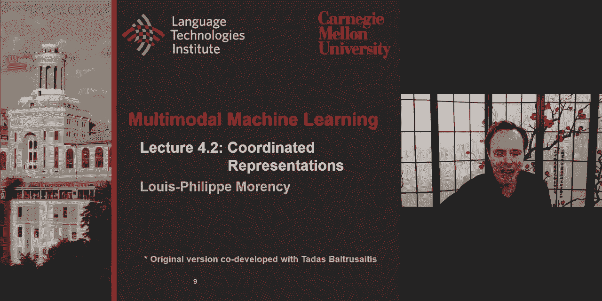

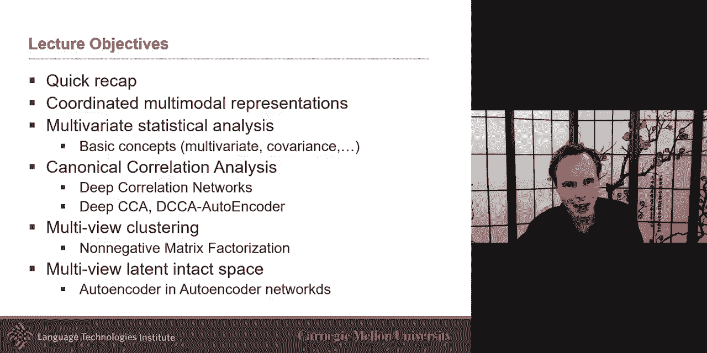

在本节课中，我们将学习多模态协调表示。我们将快速回顾多模态联合表示，然后深入探讨协调表示的核心概念。课程将涵盖多元统计分析基础、典型相关分析及其扩展，以及多视图聚类等主题。

---

## 多模态表示快速回顾 🔄

上一节我们介绍了多模态联合表示，本节中我们来看看协调表示。

在周二的课程中，我们讨论了生成模型。生成模型的有趣之处在于，一旦你能够训练一个生成模型，你几乎可以在任何方向上进行转换。例如，你可以根据文本生成图像，或者根据图像生成文本。这是因为我们建模了X和Y之间的完整联合分布，这使得我们可以执行许多有趣的条件概率或翻译任务。

我们可以使用从这些生成模型（如玻尔兹曼机）中学到的表示，或者使用其他无监督方法。一旦你有了这些表示，你就可以在其之上学习一两个层来执行其他任务，例如监督学习任务。在相关论文中，这个任务是基于表示进行图像检索。

我们还研究了另一种以无监督方式训练这些联合表示的方法，其中之一是堆叠自编码器。你可以端到端地学习。在这种情况下，损失函数是一个两部分的问题：一部分是你生成文本的好坏，另一部分是你生成图像的好坏。你可以同时使用图像和文本作为输入来训练它，或者你也可以决定只使用图像作为输入进行训练，但你的损失仍然同时包含文本和图像。

此外，还有使用前馈神经网络学习这些中间表示的想法，此时你正在执行翻译任务。在这里，你并不是在学习联合分布，更多的是在学习条件概率。例如，在图像描述任务中，你编码图像以生成文本。此时，中间表示预期是文本和图像之间的中间表示。在实践中，这个表示可能更接近文本或更接近图像，虽然没有强制要求它必须是真正的联合表示，但它肯定处于图像和文本之间的某个位置。

我们还讨论了这样一个事实：有些表示没有明确地建模所有不同的交互方式。因此，我们研究了双线性模型。其中一个例子是张量融合网络，它允许我们同时处理单模态和双模态特征。虽然这增加了参数数量，但它使得每个特征更具代表性，可能有助于网络后期阶段更容易找出哪些单模态或双模态特征对任务最有用。

---

## 如何学习更好的表示？ 🧠

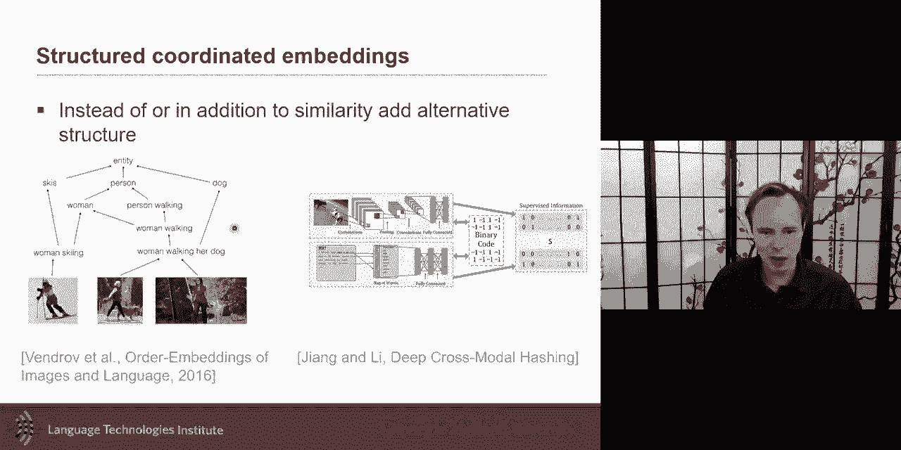

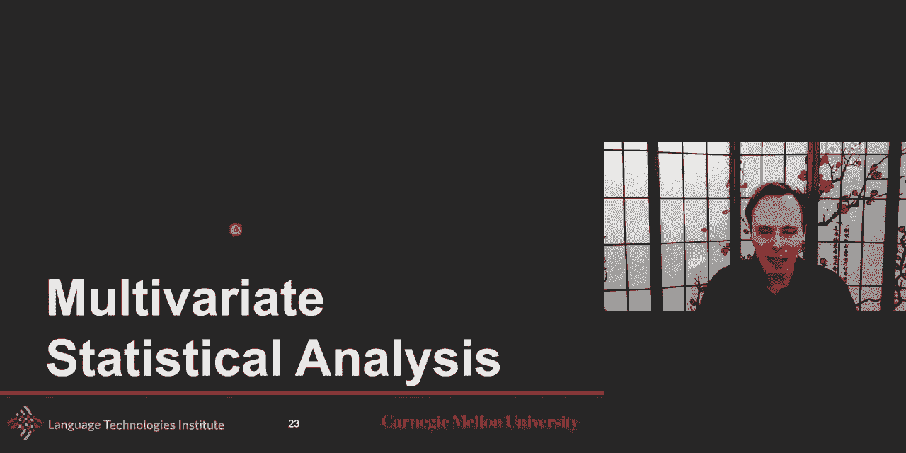

上一节我们回顾了联合表示，本节中我们来看看如何学习更好（或至少不同类型）的表示——协调表示。

协调表示的核心思想是，我们不为每种模态只学习一个表示，而是找到一种方法来协调它们。在周二的课程末尾，我们讨论了非常强的协调方式，例如要求两个表示几乎相同，并使用余弦距离作为损失函数。虽然这有时被称为无监督学习，但这种说法有点误导性，因为它仍然需要一些监督——图像和文本之间的配对关系仍然是学习这两个独立表示所必需的。

在强协调下，如果使用像余弦相似度这样强的度量，这两个表示几乎会是等价的。我们展示了一个例子，现在我们可以更好地理解发生了什么。实际上，你拥有成对的图像和文本数据。对于每一对，你有一张图像和一段文本描述。从图像中，你可能通过CNN编码得到特征；从文本中，你可能得到整个句子的词向量平均。目标是学习新的表示，使它们的夹角尽可能接近。这就是2014年那篇论文的妙处：他们在配对数据上训练，然后在测试时，取一张图像，将其前向传播得到其表示；取单词“蓝色”得到其表示；取单词“红色”得到其表示；然后进行一些算术运算，就可以采样出最接近的图像。

现在你可以更好地理解这篇视觉语义嵌入论文了。你可以在“白天”和“黑夜”上做类似操作。然而，这不会完美地工作，这是这种方法的一个问题。虽然它们被训练得彼此接近，但并非对所有可能的单词都有效。你不能简单地做“白天”减去“颜色”这样的运算，因为那样你可能会进入一个不同的表示区域，所以这种算术并不完美。但看到其中一些能工作是很好的。

当你训练这些表示时，你也可以在学习这些结构时保持顺序。你可以有两个嵌入，然后你说你希望它们以某种方式协调。你可以说，你希望图像和描述之间的余弦相似度尽可能高，这就是我们刚刚描述的方式。或者你也可以说使用顺序嵌入，这是一种更结构化的协调方式。你可能希望，如果两个实体在非常高的层次上是关于“人”的，那么它们应该彼此接近。例如，描述中谈到一个“农民”，而图像中是一个“滑雪者”。在某种意义上，他们并不完全相同，但在非常高的层次上，他们都是人。因此，这两个例子仍然应该是相关的，但可能不如描述和图像都是关于“滑雪者”时那么紧密。这就是这种更结构化方法的直觉。

另一种协调方式是，通过某种编码机制（如哈希表）将它们连接起来。这既能保证效率，也能强制执行它们之间的一些相似性。这些都是协调表示的其他例子。接下来，我们还将讨论典型相关分析和其他方法。

---

## 多元统计分析基础 📊

为了深入理解协调表示，特别是典型相关分析，我们需要回顾一些多元统计分析的基础知识。这些是理解后续内容的重要工具。

多元统计分析旨在理解高维数据中的关系。“多元”可以看作是多个变量或多个维度的数据。常见的例子包括方差分析和其多元版本MANOVA、主成分分析和因子分析，以及线性判别分析。我们稍后将讨论典型相关分析。

这一切的核心是随机变量。随机变量是随机现象数值结果的变量。有两种类型的随机变量：离散随机变量和连续随机变量。离散随机变量的可能取值是离散的，例如0, 1, 2, 3, 4，或者颜色、年龄等属性或数值。连续随机变量则有无限个连续值，例如某人的身高、体重。年龄通常可以表示为连续变量，但身高和体重通常被离散化。

有趣的是，这些变量之间可能是相关的。例如，年龄可能与身高和体重相关（至少在早期），身高和体重本身也可能相关。因此，相关性是研究随机变量时一个非常有趣的方面。

以下是几个关键术语的定义：

*   **期望值**：这是值的概率加权平均。在离散情况下，它是所有可能值乘以该值发生概率的总和。在许多情况下，如果所有观测值的概率相等，期望值就等于算术平均值。如果某些值比其他值更可能出现，期望值会考虑到这一点。
*   **方差**：衡量观测值的离散程度。它是数据值减去均值后的平方的期望值。方差等于标准差的平方。
*   **协方差**：衡量两个随机变量如何一起变化。如果你已经对数据进行了中心化处理（减去均值），那么协方差就是两个变量值的乘积。协方差很重要，因为它引出了相关性。
*   **相关性**：协方差的归一化版本。它衡量两个变量之间线性关系的程度。通过归一化，相关性值介于-1和1之间，这提供了一个很好的度量尺度。

相关性测试：如果X是横轴，Y是纵轴，每个点是一个样本（散点图）。如果散点图呈明显的从左下到右上的直线趋势，则X和Y正相关。如果点非常分散，没有明显趋势，则相关性很弱。如果呈从左上到右下的直线趋势，则为负相关。如果其中一个变量完全没有变化（方差为零），则相关性未定义（除以零）。

多元分析是上述概念的扩展。在单变量分析中，我们可能看年龄和体重。在多元分析中，对于一种视图（如语言），我们可能有多个随机变量（特征），例如X1是情感，X2是时态（过去/现在），这些都可以从词典中提取。对于图像，我们可能看特征，例如是否有人、人是否在微笑、他们在看哪里。这些都是一组特征随机变量。

在多元意义上，之前描述的一切仍然存在。

*   **协方差矩阵**：在一个模态内部（例如模态X），衡量不同特征随机变量之间如何相关。这个矩阵的对角线是每个特征与自身的协方差（即方差）。如果所有特征彼此完全不相关，那么所有非对角线元素将为零。
*   **交叉协方差矩阵**：这更有趣，因为它不是比较X与自身，而是比较X和Y。它查看例如语言情感非常积极时，如何与图像中的人是男性还是女性、是否微笑等特征共同变化。这个矩阵将显示所有特征如何彼此共同变化。这个矩阵的对角线将是X1和Y1如何共同变化等。特征的顺序在确定后应保持一致，但最初是任意的。更有趣的是观察这些特征如何与另一个模态的特征相关。

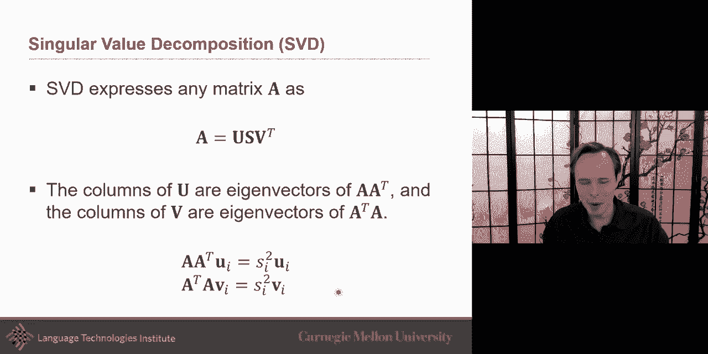

**相关性矩阵**可以看作是交叉协方差矩阵除以X和Y各自方差矩阵的乘积。

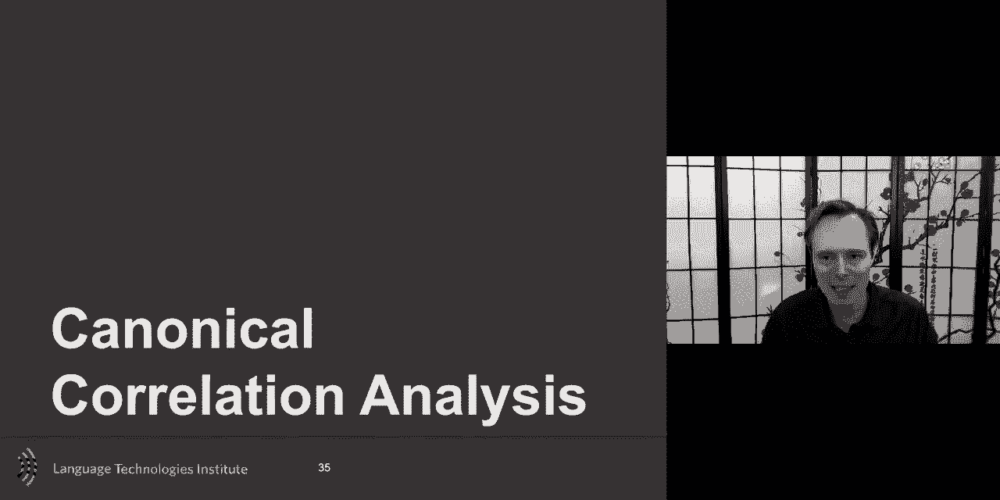

**迹**定义为矩阵对角线元素之和。对于相关性矩阵，对角线总是1，所以迹就是维度数。

**主成分分析** 是多元世界中广为人知的方法。PCA的思想是，你有一组可能相关的观测值，PCA将它们转换为一组线性不相关的变量，称为主成分。对于二维点云，PCA寻找方差最大的方向（第一特征向量），第二个特征向量总是与第一个垂直，并且方差较小。通常前几个特征向量解释了大部分信息，而特征值较小的特征向量可能只是噪声，可以被移除。

**奇异值分解** 是解决特征值问题的一种方法。对于矩阵A，SVD将其分解为U、Σ和V^T，其中U的列是AA^T的特征向量，V的行是A^TA的特征向量。我们将在讨论CCA时重用这个概念。

---

## 典型相关分析 🔗

上一节我们介绍了多元统计分析的基础，本节中我们来看看协调表示中的一个核心方法——典型相关分析。

在许多多视图学习问题中，例如你有 demographic 数据和 survey 响应，你试图匹配 demographic 如何与 survey 的不同方面对齐。在我们的案例中，你有音频和视频，你想看看它们如何相互关联。这就是典型相关分析发挥作用的地方。

“典型”意味着简化到最简单或最清晰的模式。典型相关分析分三步进行：

1.  **线性投影以最大化相关性**：我有文本和图像。目前可以称之为无监督，但它实际上是配对数据，因此具有某种监督性。直觉是，我希望图像和文本的嵌入表示尽可能相关。但这不是精确的说法，我将澄清一下。在高层次上，你可以说我希望这些嵌入尽可能“相关”。相关意味着一个增加，另一个也增加（正相关）或减少（负相关）。CCA的思想是学习两个线性投影。我已经有了X（文本）和Y（图像）的特征，我想对它们进行投影。对于线性CCA，我假设已经有了词向量和CNN特征，只想学习一个线性投影。但我想学习这些投影，使得这两个投影（即表示或嵌入）尽可能相关。如果我只做这一步，它不会被称为典型相关分析，而只是相关分析，因为这仅仅是使两者最相关。
2.  **寻找多个正交的相关方向**：CCA的美妙之处在于，它认识到数据可能不止一种相关方式。因此，我们希望找到数据的多个投影。这些投影彼此正交。我们将学习多个投影，使得第一个投影对之间的相关性最大，第二个次之，第三个再次之，依此类推。这意味着h_x和h_y之间可能存在不止一种相关方式。我们需要一种方法来强制这些投影是正交的或“典型”的。“典型”意味着最简单，而使其简单的方法就是使其正交。数学上，这意味着对于不同的投影对，它们的乘积应为零。
3.  **约束与求解**：另一种方式是，我们希望整个矩阵的非对角线元素为零，只关注迹（对角线）。我们可以重新表述问题为：在约束投影向量的方差为单位矩阵的条件下，最大化迹。这强制了非对角线元素为零。我们如何解决这个优化问题？当我们看到“最大化...受限于某些约束”时，可以想到使用拉格朗日乘数法。通过构建拉格朗日函数并求梯度，可以找到驻点。有趣的是，这个问题实际上与奇异值分解非常相关。可以通过SVD分解来求解CCA，从而得到特征向量和特征值。

**典型相关分析的优点**在于它找到了事物相关的多种方式。在协调表示的谱系中，我没有强制表示彼此相等，也没有强制它们完全相关（那将类似于联合表示）。这里你说，嘿，它们可以有不止一种相关方式。在大框架下，它仍然相对接近联合表示，但允许更松散的协调。

---

## CCA的非线性扩展 🚀

上一节我们介绍了线性典型相关分析，本节中我们来看看其非线性扩展，这更接近现代深度学习。

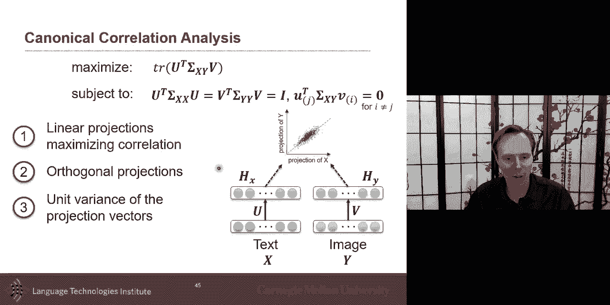

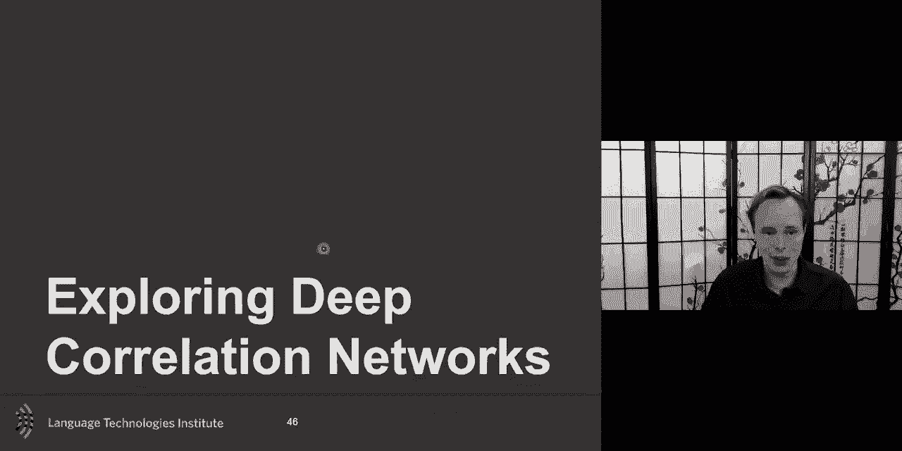

2013年有一篇受欢迎的论文，将CCA扩展到非线性版本。在这种情况下，不仅仅是线性投影，还会加入非线性层（可以有多层）。目标函数仍然是使损失函数中两个表示尽可能相关，因为对于配对数据，我们知道样本X应该与Y共现。为此，你需要计算h(x)和h(y)之间的梯度。只要能得到解析梯度（我们在上一节提到过这可以解析计算），那么这就是一种基于梯度的方法。深度神经表示都是关于解析梯度的，所以如果我能得到解析梯度，我就可以传播梯度，一切顺利。

这篇论文的妙处在于，你可以进行预训练。这个想法在现在语言模型中仍然非常流行：在大量数据上进行预训练。你可以先在文本基础上预训练，使用多个非线性投影层，也许还有一个线性投影层，最终得到一个中间表示，使得你可以重建文本。预训练之后，你可以进行微调，例如只微调线性投影层或微调所有层。

CCA的一个挑战是，相关性需要大量样本。如果我只给你一个图像样本和一个文本样本，你无法计算相关性（未定义）。因此，如果采用基于批处理的方法，使用大批次或全批次非常重要，然后使用像牛顿法这样的方法。

一个有趣的扩展是，不仅用自编码器预训练然后做CCA，还可以将它们结合在一起训练。这就是下面这个模型的妙处。

**深度典型相关自编码器**：观察这个模型，它的损失函数是什么？你有文本的自编码器、图像的自编码器，然后两者之间还有一些协调。所以，h(x)应该足够好，以便能重建图像（或图像特征）；h(y)应该能重建文本特征。那么，这三个损失如何组合？总损失将包含三部分：如何生成文本、如何生成图像，以及它们如何相关。你可以从强调前两个损失开始，然后逐渐希望它们相关。这就像是之前分步方法的一个平滑版本：先做自编码，然后做CCA。而在这里，你几乎是将它们同时进行。但即使同时进行，你可能也不希望在优化的每次迭代中所有损失的权重都相同。这是另一个需要考虑的问题。

CCA也可以以我们之前讨论过的堆叠方式学习。我不详细介绍LDA和MANOVA等方法了，但在我们所有人都使用相同工具集的领域，我真心鼓励你们去看看其他方法。有时它们看起来像旧工作，但其中有很多证明和有趣的结果。如果你将可解释性作为一个目标，这些统计方法可以给你更好、通常更可解释的结果，它们也带有置信区间等界限，这些是非常有用的信息。

---

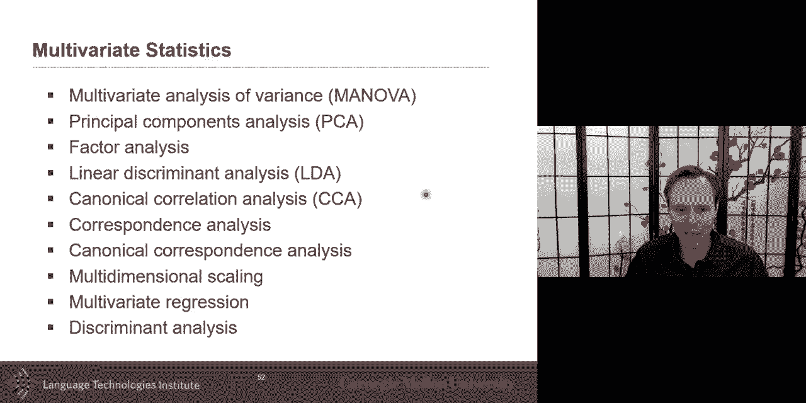

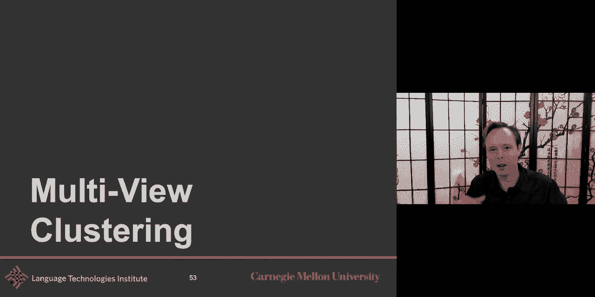

## 多视图聚类 👥

上一节我们讨论了基于相关性的协调方法，本节中我们来看看另一种协调思路——多视图聚类。

我们讨论了拥有配对数据的情况，并希望学习一个表示。但聚类本身还不是多视图聚类，它只是将数据样本进行划分，使得相似样本聚集在一起，不相似样本分开。在可解释模型的世界里，数据聚类的思想不仅是学习一个表示，还要在该表示中找出有哪些组或簇。

以下是几种基本的聚类方法：

*   **K均值聚类**：这是一种基于竞争学习的简单聚类，每个样本只能属于k个组中的一个。它是一个迭代过程：通常随机或预热设置每个组的中心，将每个样本分配到最近的组，然后重新计算簇中心，直到收敛。胜者通吃，所以是竞争性的。
*   **非负矩阵分解**：思想是你有一个矩阵X，你想将其分解为非负矩阵F和G。你可以将G看作是不同簇的中心，F则是每个样本属于每个簇的程度。这使得F是非负的才有意义，因为它代表了“属于”的程度。典型的NMF要求F和G都是非负的。半非负矩阵分解可能只要求其中一个非负。也有深度半非负矩阵分解的论文，它可以是多层的。我喜欢的一个方向是从多个视图学习数据划分。

到目前为止，这只是关于聚类。但如果我们有多个视图，那就更有趣了。例如，我不只有文本数据并想对其进行聚类（经典的主题建模），我还有这些网页中的图像，可能还有相关的音频。我想基于所有这三种模态进行聚类。这就是多视图聚类的有趣之处。假设我有配对数据，我知道每个实例来自相同的音频、文本和图像。

多视图聚类的两个重要原则是：

1.  **共识原则**：跨多个视图，你希望将信息分组在一起。在每个模态中，我可能有很多特征，但有一个特征子集具有共识，即它们是相似的。
2.  **互补性原则**：多个视图需要获得更全面和准确的描述，因此视图之间也存在互补性。

多视图子空间聚类是一种方法，它假设所有视图共享一个共同的子空间表示。你学习这个子空间，以便能够预测那个统一的表示。那么，如何在我们的多模态数据中进行数据聚类呢？这非常有趣。我有多种模态，我想学习文本和图像的表示，使得数据中自然形成聚类，并且这个聚类在不同模态间是一致的。

有一篇早期的论文邀请你去看看，即深度矩阵分解。它将视觉特征和语言特征（以离散方式表示）结合在一起，最终以某种方式进行分解，使得数据有一个良好的分解。在测试时，这也有助于图像标注。我邀请你们看看其他方法，因为我没有时间讨论所有不同的方式。一种方式是我们将其视为子空间，然后在该子空间中以某种方式进行分组。但你也可以在其中使用图，每个视图的子嵌入实际上是一个图，你希望以某种方式对图进行聚类，这更接近我们上周二讨论的内容。这些方法非常棒，因为你可以以某种方式在它们之间进行引导。例如，你在一个模态上进行聚类，获得一些知识，然后利用这些知识用于另一个模态的聚类，再进行知识传递，这是一种协同训练的方式。

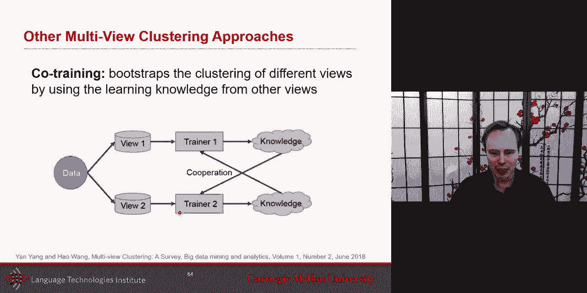

---

## 自编码器的自编码器 🌀

上一节我们探讨了多视图聚类，本节中我们来看协调表示谱系中的最后一个有趣扩展——自编码器的自编码器。

在协调表示的谱系中，我们讨论过非常强的协调（如余弦相似度）、相关性、典型相关性，以及聚类（我认为是较松散的协调，甚至是基于图的协调）。现在我们来讨论一种具有潜在空间直觉，但又有所扩展的方法。

快速回顾一下深度CCA：深度CCA的思想是，你有一个自编码器，有两个编码器，同时你还有一个损失项，使得它们在正交投影下也相关。

**多视图潜在完整空间** 的直觉是：存在一个真实的、完整的表示空间，然后每个模态或每个视图都是该空间的一个切片加上一些噪声。例如，我真心希望你们喜欢多模态机器学习并理解其意图，这存在于我的大脑中，你们观察不到。但存在这个完整的表示空间。当我讲话时，我试图分享这个不可见空间的一小部分视图。你们看到我的表情，听到我的声音，这些都是同一个完整空间的不同视图。所以，我有一个完整空间，我分享了一些东西，你们看到我的非语言行为、听到我的声音，这给了你们一个带有噪声的、关于我想说什么的版本。这是我想分享的第一个直觉：完整空间的思想。

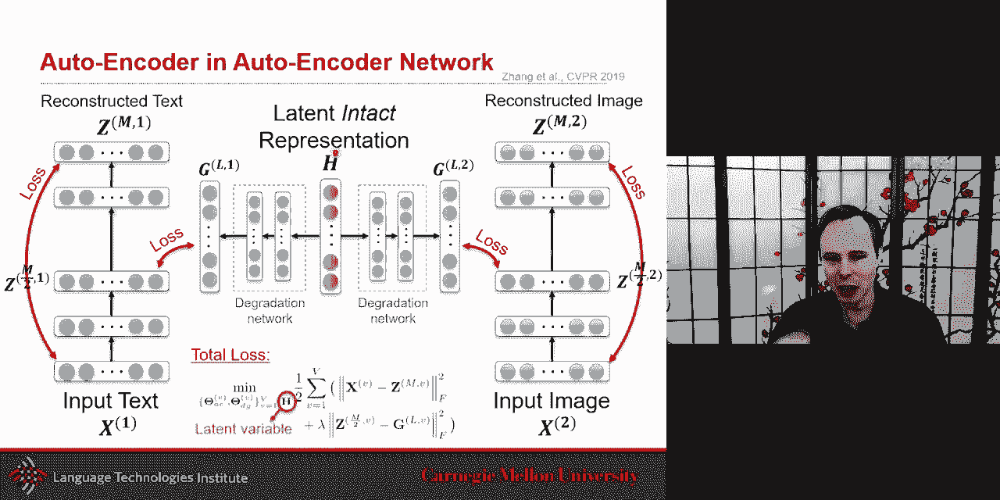

另一个更酷的直觉是：这个完整空间对于每个实例都是不同的。如果你看这个讲座的前五分钟，我有一个想分享的信息，那是那前五分钟我的完整空间。但接下来的五分钟，