# 9：L5.1 - 多模态对齐 👥

在本节课中，我们将要学习多模态对齐。这是一个非常有趣且核心的主题，因为在多模态机器学习中，对齐是连接不同模态信息的关键桥梁。

## 概述 📋

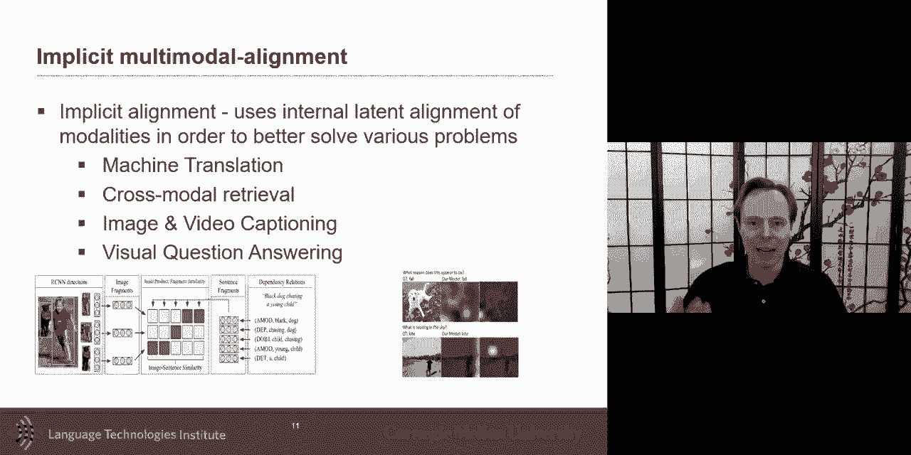

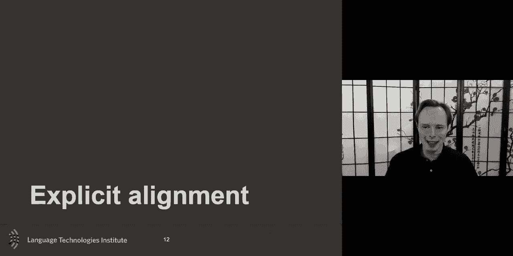

多模态对齐旨在寻找两个或多个模态之间的对应关系。在单个模态内部，我们拥有许多元素（例如时间序列中的时间点）。对齐的任务就是在这些元素层面建立联系。有些元素可能是某个模态独有的，有些信息可能在多个模态中是冗余的，而有些信息则可能是互补的，即结合多个模态才能产生新的含义。

我们将学习两种主要的对齐技术：**显式对齐**和**隐式对齐**。显式对齐将对齐本身作为优化目标，而隐式对齐则将对齐作为完成其他任务（如情感预测）的中间步骤。

## 显式对齐 🎯

上一节我们介绍了对齐的基本概念，本节中我们来看看显式对齐的具体方法。在显式对齐中，我们的损失函数直接优化对齐关系，目标就是找到模态间的对应。

### 动态时间规整

一个经典的显式对齐例子是音频与文本转录的词对齐，或者同步两个不同步的视频。动态时间规整是解决这类问题的关键技术。

假设我们有两个长度可能不同的时间序列 X 和 Y。我们的目标是找到一组索引映射，使得对齐后的序列差异最小。这可以形式化为一个优化问题，寻找索引向量 `p_tx` 和 `p_ty` 以最小化对齐损失，例如欧几里得损失：

`min || X[p_tx] - Y[p_ty] ||^2`

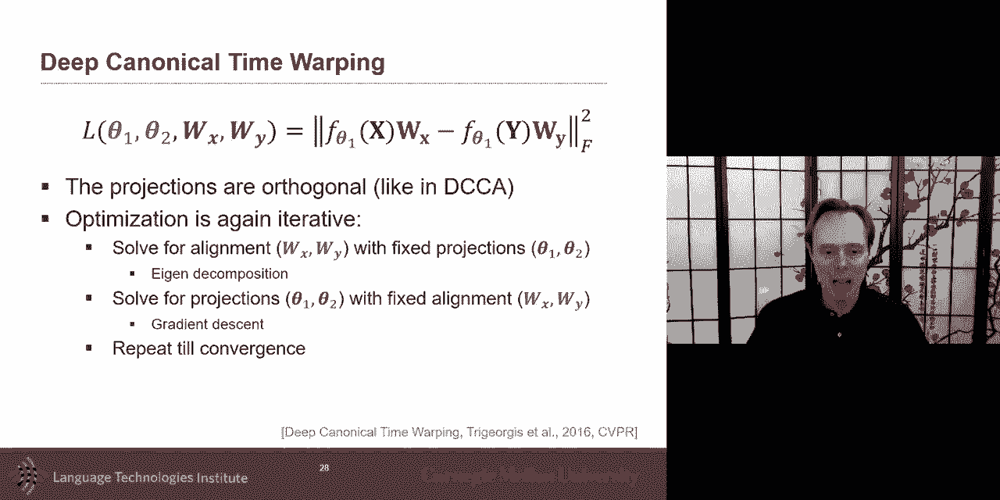

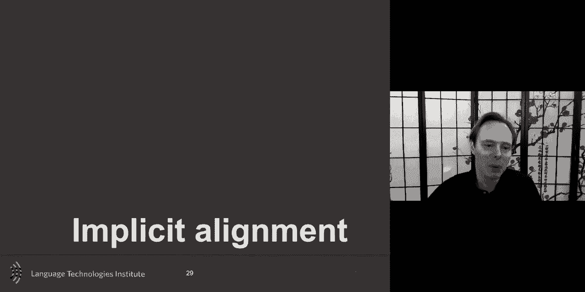

动态时间规整的核心思想是在一个成本矩阵中寻找最低成本的路径。它通常遵循单调性和连续性约束，确保序列在时间上不会“倒退”，并且每个元素都会被映射。求解过程通常使用动态规划算法。

### 从单模态到多模态

然而，基础的动态时间规整假设序列来自同一模态（单模态）。当 X 和 Y 来自不同模态（例如图像特征和文本特征）时，它们的特征空间和维度可能不同。这时，我们需要先将它们映射到一个可以比较的公共空间。

上周我们学习的**典型相关分析** 正是为此而生。CCA 可以学习一个投影空间，使得两个模态在该空间中的表示具有最大相关性。结合 DTW 和 CCA，就形成了**典型时间规整** 方法，它能在同一个损失函数中同时学习投影（表征学习）和对齐。

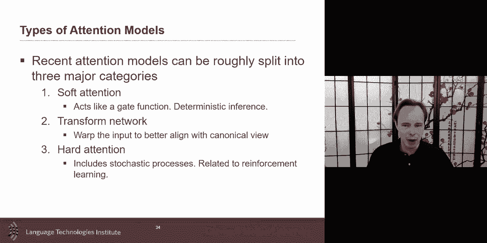

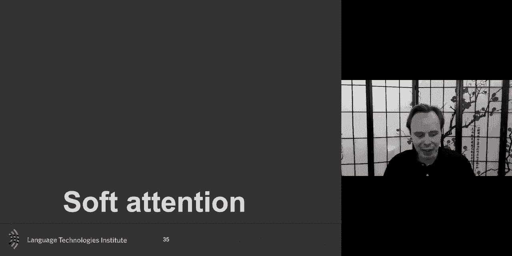

其优化过程通常采用坐标下降法：固定对齐参数，优化投影参数（使用特征分解或 SVD）；然后固定投影参数，优化对齐参数。

### 扩展到深度模型与多序列

为了获得更强大的非线性表征能力，我们可以将 CTW 扩展为**深度典型时间规整**。这本质上是深度 CCA 与广义时间规整的结合。优化过程与深度模型类似，使用梯度下降法。

此外，CTW 和 DCTW 都可以进一步推广到对齐**多个**来自不同模态的序列，例如同时对齐视频、音频和动作捕捉数据。

## 隐式对齐 🔍

上一节我们探讨了以对齐为直接目标的显式方法，本节中我们来看看更为流行的隐式对齐。在隐式对齐中，对齐本身不是最终目标，而是完成图像描述、视觉问答等任务所必需的中间步骤。注意力模型是这类方法的杰出代表。

注意力机制的核心直觉是：人在处理信息（如看图像或听声音）时，会在任一时刻聚焦于信息的某个子集。神经网络中的注意力模型借鉴了这一思想，动态地决定在每一步应关注输入中的哪些部分。

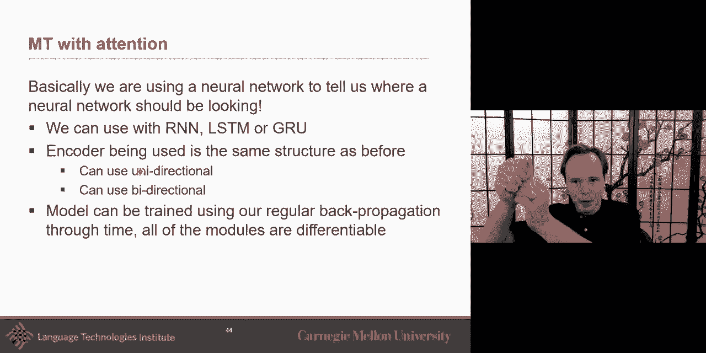

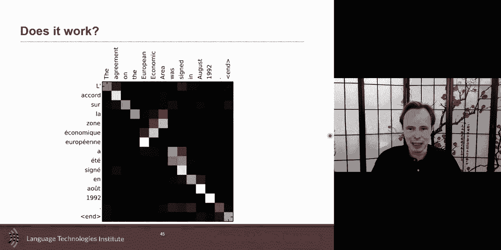

以下是几种主要的注意力机制类型：

### 1. 软注意力（自注意力）

这是最常见的一种。它不进行硬性选择，而是为所有输入元素分配一个0到1之间的权重（通常通过softmax归一化），然后进行加权求和。这使得整个过程是可微的，便于通过反向传播优化。

一个著名的历史应用是机器翻译中的序列到序列注意力模型。在该模型中，解码器在生成每一个目标语言单词时，都会计算源语言句子中所有单词的注意力权重，从而动态地聚焦于最相关的源语言上下文。这解决了长序列信息压缩和词序差异的问题。

将这种思想扩展到多模态任务（如图像描述生成），就产生了“Show, Attend and Tell”等工作。模型在生成描述中的每个词时，会对CNN卷积层输出的特征图（保留了空间信息）计算注意力权重，从而“看向”图像中与该词最相关的区域。

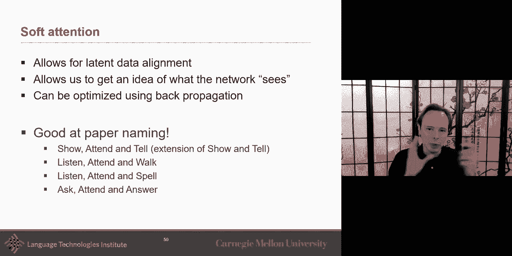

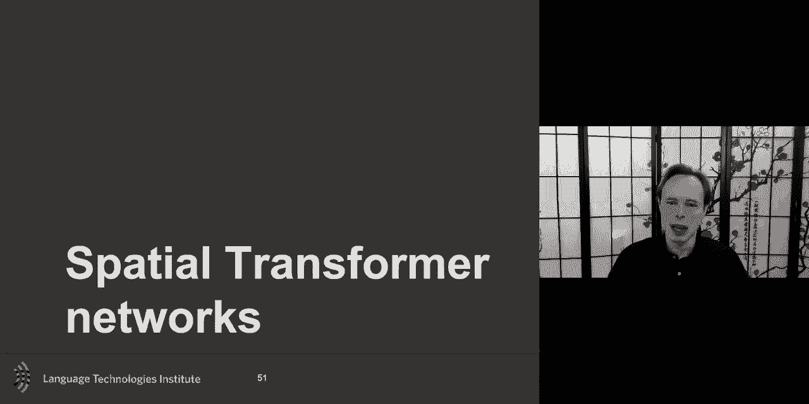

### 2. 空间变换网络

这种方法提供了一种不同的“注意”视角。它不是对特征进行加权，而是预测一组参数（如仿射变换参数），对输入图像（或特征）进行空间变换（如裁剪、旋转、缩放），从而让网络聚焦于特定区域。这个预测变换参数的模块本身也是一个可微的网络，可以与主任务一起训练。

### 3. 硬注意力

硬注意力机制每次只选择输入中的一个离散子集（例如图像中的一个特定区域）进行处理，而不是进行软加权。这种选择过程本质上是不可微的，因此通常需要借助强化学习（如策略梯度方法）来进行训练。一个例子是循环注意力模型，它像“视觉扫视”一样，在多个时间步依次关注图像的不同区域，最终做出决策。

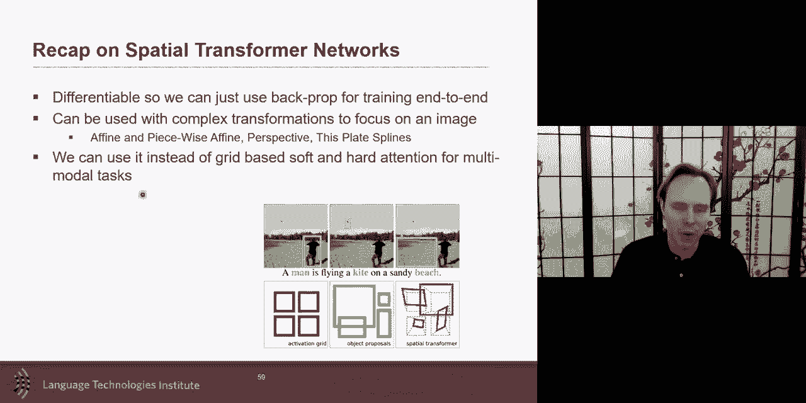

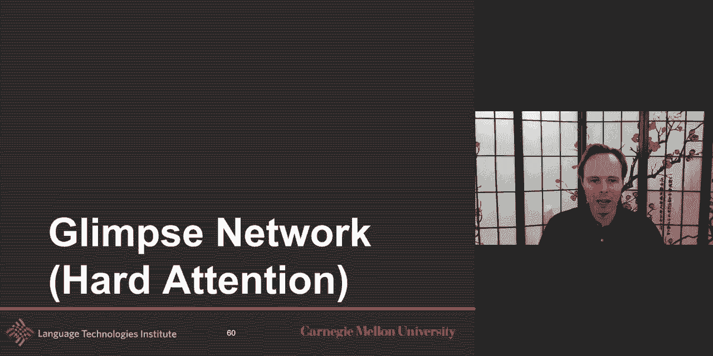

## 总结 🏁

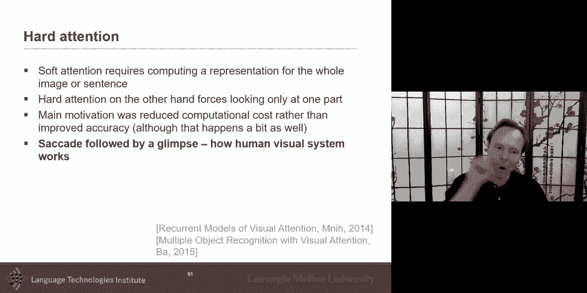

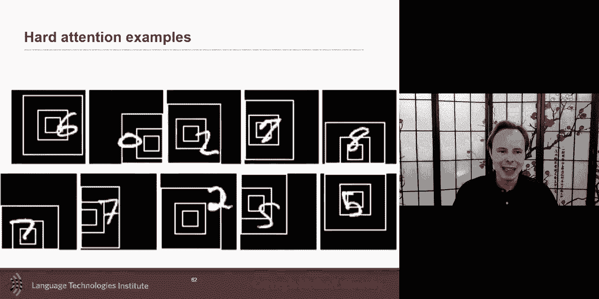

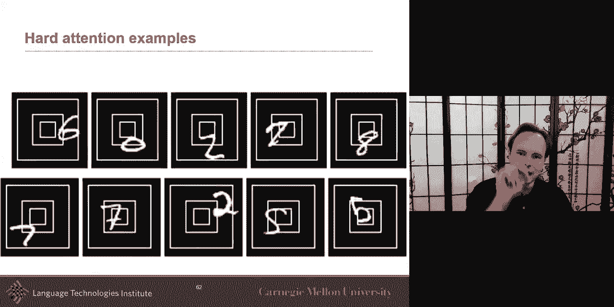

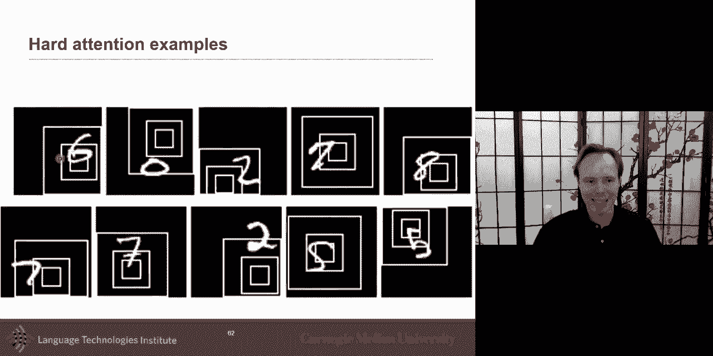

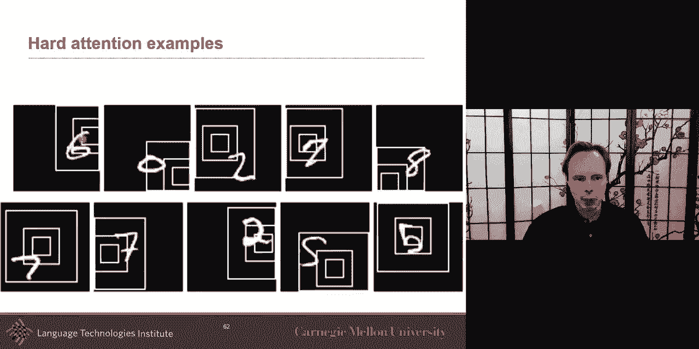

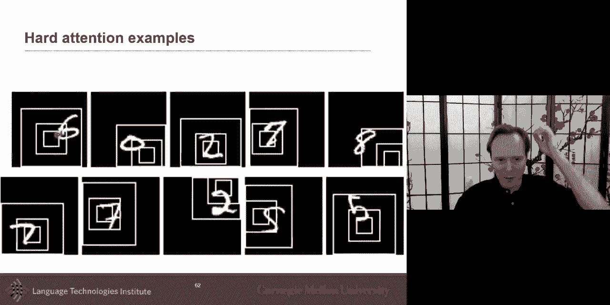

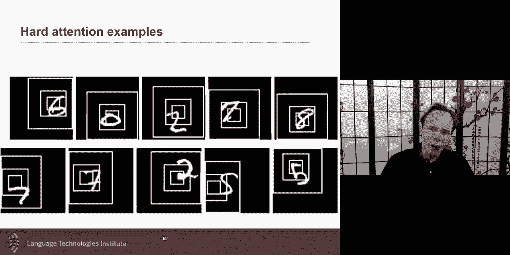

本节课中我们一起学习了多模态对齐的两种主要范式：

*   **显式对齐**：将对齐作为直接优化目标。我们深入探讨了**动态时间规整**及其在多模态场景下的扩展——**典型时间规整**和**深度典型时间规整**。这些方法通过联合优化投影和对齐，能够显式地建立模态间元素的对应关系。
*   **隐式对齐**：将对齐作为完成其他任务的中间步骤。我们重点介绍了以**注意力模型**为核心的各类方法，包括**软注意力（自注意力）**、**空间变换网络**和**硬注意力**。这些机制使模型能够动态地聚焦于输入中最相关的部分，极大地提升了如机器翻译、图像描述等任务的性能，并提供了某种程度的可解释性。

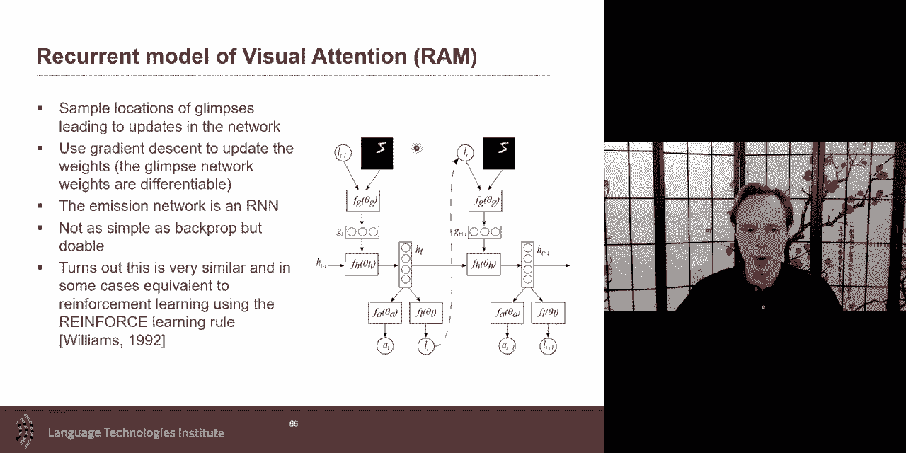

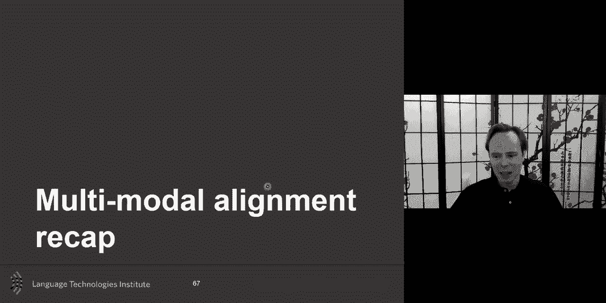

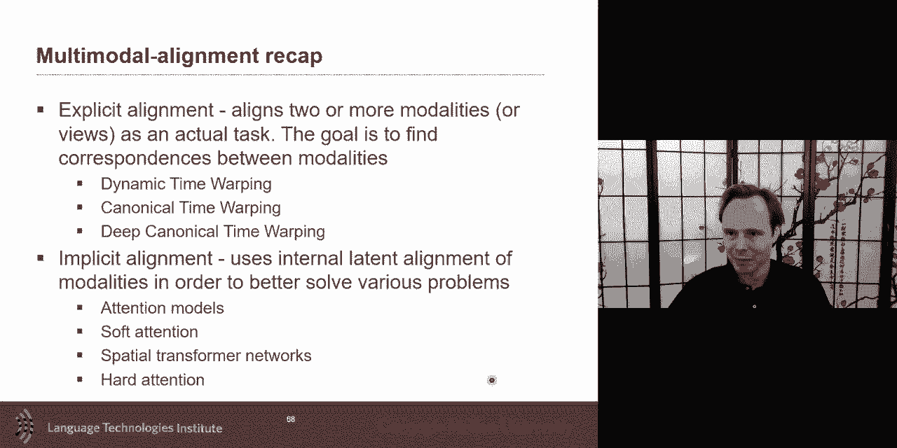

对齐是多模态机器学习中连接异构数据、实现信息融合的基础，理解其原理与方法对于构建有效的多模态系统至关重要。