# 10：L5.2 - 对齐与表示 🧠

在本节课中，我们将学习如何扩展对齐和注意力的概念，并开始研究句子级别的嵌入方法。我们将重点介绍一种在自然语言处理中极为流行，并逐渐在多模态领域普及的技术：自注意力机制，特别是 Transformer 架构。我们还将探讨在大规模数据上进行预训练的思想，并了解多模态预训练的基本概念。

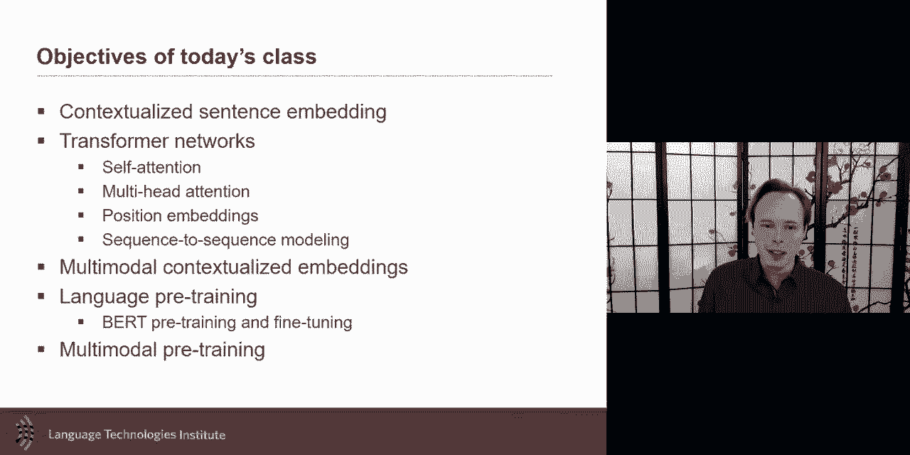

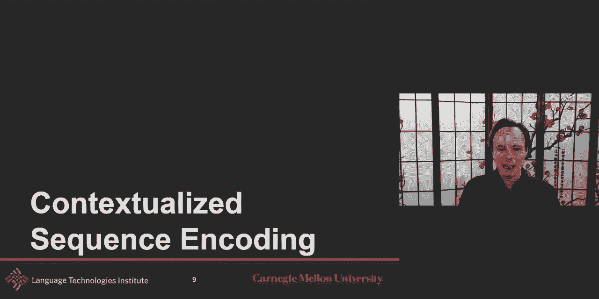

---

## 上下文序列编码

在之前的课程中，我们讨论了序列编码，即如何编码整个句子。本节中，我们将探讨一种序列编码类型，其目标是编码每个单词，但每个单词的编码都考虑了其他单词的上下文信息。例如，单词“plant”的含义可以通过其上下文来消除歧义。

另一种序列编码是为整个句子或序列生成一个单一的嵌入表示，这也是我们将要学习的内容。

那么，如何使用我们已经掌握的工具来实现这种序列嵌入呢？一种方法是使用**双向LSTM**。你可以想象使用一个LSTM或循环神经网络，先从一个方向进行上下文编码，再从另一个方向进行编码，从而得到考虑了其他单词信息的新版本嵌入。

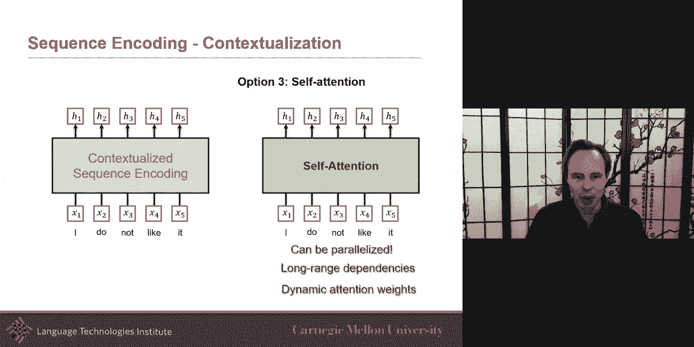

ELMo 就是一个例子，我们之前已经讨论过它。ELMo 等方法虽然很好，但并行化处理较难。对于很长的句子，为了嵌入某个单词，需要先处理完所有其他单词的嵌入，这种顺序处理使得并行化变得困难。

另一个可能来自计算机视觉领域的方法是**卷积**。我们可以使用多个卷积核，通过时间延迟卷积网络来处理序列。这种方法的好处是可以并行化，因为要推断某个位置的嵌入，只需要局部的卷积核信息，就像处理图像一样高效。

然而，卷积的挑战在于难以直接建模长距离依赖关系。除非使用多层卷积，否则默认的局部感受野意味着无法直接考虑长距离依赖。多层卷积虽然可以解决这个问题，但会增加计算复杂度。

此外，需要记住的是，这些卷积核在训练时是固定的模板，用于寻找特定类型的模式。在测试时，这些模式是相同的，即用于分析不同单词的卷积核是相同的。

因此，也许还有其他方法可以研究，而**自注意力**就是一种很好的上下文编码方式。它可以并行化，并且其注意力权重（几乎可以看作是动态的卷积核权重）是动态的，这带来了更大的灵活性。当然，它也有代价，例如参数数量可能更大，但它带来了巨大的优势。

---

## 自注意力机制

接下来，我们看看如何实现自注意力。我们的目标是：已经获得了每个单词的初始嵌入，但我们希望得到新的嵌入，这些新嵌入应该考虑其他单词的信息。

例如，如果我们想为第一个单词“I”获取新的嵌入，我们还需要知道其他单词的有用程度。直觉上，我们会使用**注意力机制**。

具体来说，对于这个单词“I”，我们会计算一个注意力权重，告诉我第二个单词“do”与它的相关程度有多高，第三个单词“not”与它的相关程度有多低。然后，我们使用这些注意力权重，乘以对应的单词嵌入，再进行求和，从而得到“I”的新嵌入。

我们对句子中的每个单词都重复这个过程。例如，对于单词“do”，我们会计算一套新的注意力权重，看看“do”与“I”、“not”等单词的相关性。然后，同样进行加权求和，得到“do”的新嵌入。

这就是自注意力的核心思想：我们动态地计算这些注意力权重，以确定其他单词对当前单词的重要性，然后利用所有这些注意力权重来计算新的嵌入表示。

到目前为止，这看起来很像普通的注意力机制，只是现在我们为每个单词都计算了一套注意力权重。基本概念是相同的：取注意力权重，乘以单词嵌入，然后求和得到新的嵌入 `h'`。

那么，如何计算这些注意力权重呢？这正是 Transformer 架构的精妙之处。

---

## Transformer 自注意力模块

在标准的自注意力中，输入是相同的。但对于 Transformer 架构，我们需要一种方法来计算注意力权重。一种非常流行的方法是 Transformer 的自注意力实现。

在原始论文中，他们决定将单词的初始嵌入投影到一个新的空间中。这个新嵌入不仅有助于生成当前单词的新表示，也有助于其他单词的计算。

具体操作是：取相同的输入，但用三个不同的矩阵进行投影，分别得到**查询**、**键**和**值**。目前，这三者都来自相同的输入，因此称为“自”注意力。

那么，如何得到注意力权重 `α` 呢？关键在于**相似度计算**。

对于当前单词（例如“I”），我们将其投影为查询向量 `q`。对于句子中的其他每个单词（例如“not”），我们将其投影为键向量 `k`。然后，我们计算查询向量 `q` 与每个键向量 `k` 的相似度。在 Transformer 中，这通常通过缩放点积注意力来实现：`相似度 = (q · k) / sqrt(d_k)`，其中 `d_k` 是键向量的维度。

这个相似度分数就代表了当前单词与另一个单词的相关性 `α`。然后，我们对所有 `α` 进行 softmax 归一化，得到注意力权重。

最后，我们用这些注意力权重对对应的**值向量** `v`（由单词嵌入投影而来）进行加权求和，从而得到当前单词新的上下文嵌入表示。

这个过程可以紧凑地表示为矩阵运算。对于所有单词，我们同时计算所有查询、键和值，然后通过一次矩阵运算得到所有单词的新嵌入。

Transformer 自注意力模块的美妙之处在于，它扩展了注意力的概念，使得句子中的每个部分都能被所有其他部分上下文化。这几乎就像图像中的每个像素都能被图像中所有其他像素上下文化一样。

---

## 多头自注意力

如果我们希望同时关注多个不同的子空间呢？例如，在句子“I do not like it”中，可能有一种上下文化方式专门关注**否定关系**（如“do not”），另一种方式关注**共指关系**（如“it”指代前面的某个事物），还有一种方式关注**词汇消歧**。

我们可能希望自注意力机制能有多个“头”，每个头专注于一种特定类型的上下文关系。这就是**多头自注意力**的直觉。

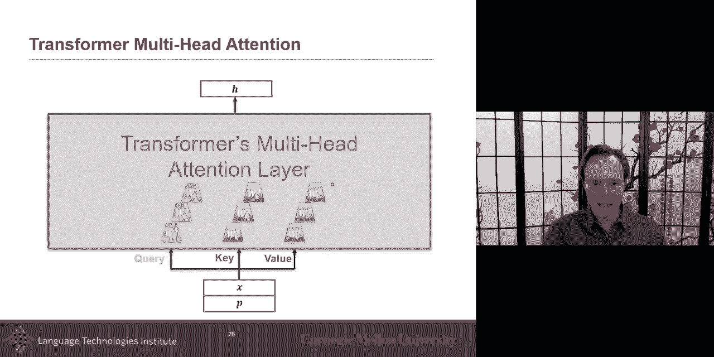

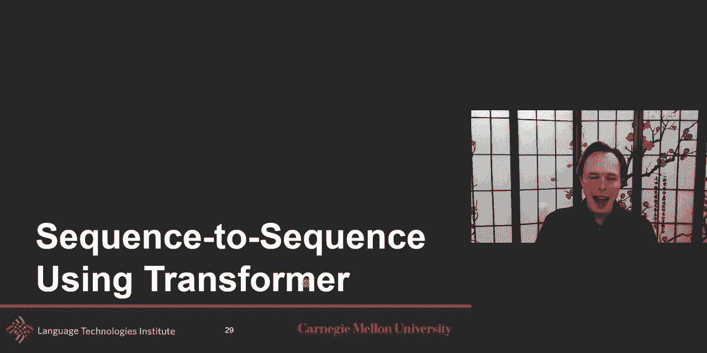

在实践中，我们并不强制每个头学习特定的关系，而是让模型自动学习。我们设置多个并行的自注意力层（即多个“头”），每个头都有自己的查询、键、值投影矩阵。这样，每个头可能会学习到不同类型的上下文信息。

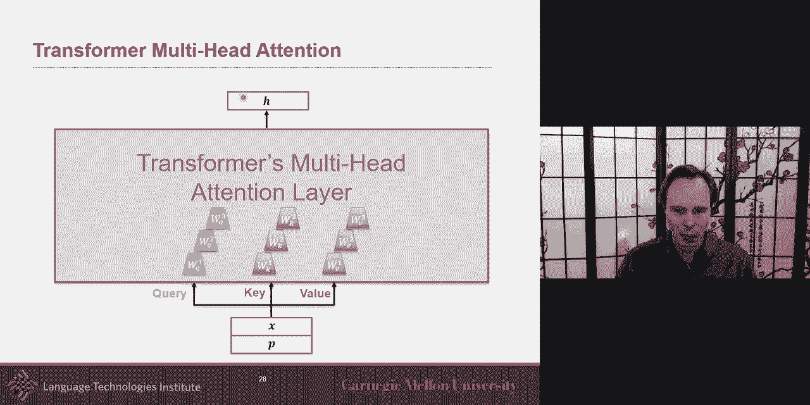

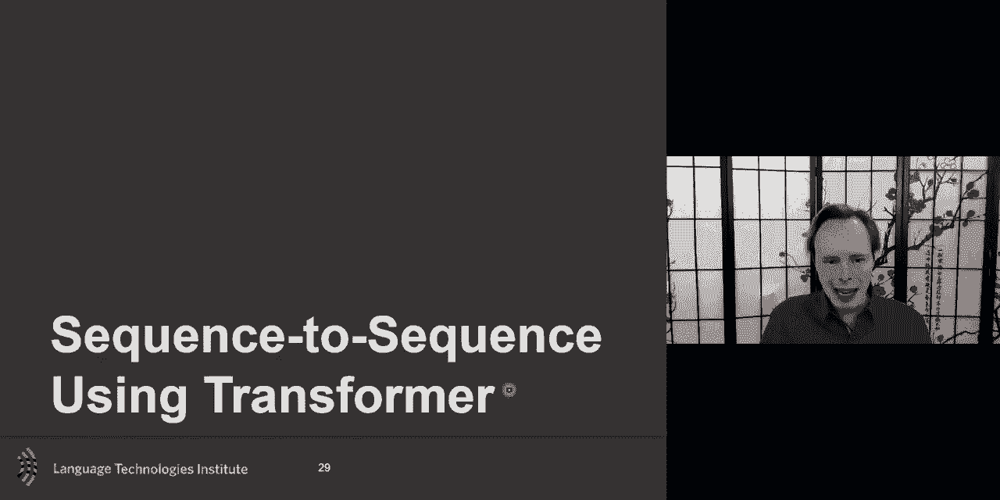

最后，我们将所有头的输出拼接起来，并通过一个线性投影层，融合成最终的单一嵌入表示。

公式上，对于第 `i` 个头：
`head_i = Attention(Q * W_q_i, K * W_k_i, V * W_v_i)`

最终输出为：
`MultiHead(Q, K, V) = Concat(head_1, ..., head_h) * W_o`

其中 `W_o` 是输出投影矩阵。

---

## 位置编码

现在思考一个问题：在当前的 Transformer 架构中，如果我们改变句子的词序会怎样？例如，将“I do not like it”改为“it like not do I”，单词“not”的新嵌入 `h_3` 会不同吗？

在目前描述的基本自注意力中，如果不做任何处理，输出将是完全相同的。因为自注意力机制只关注词与词之间的关系，而不考虑词的绝对或相对位置。这相当于一个“词袋”模型，失去了顺序信息。

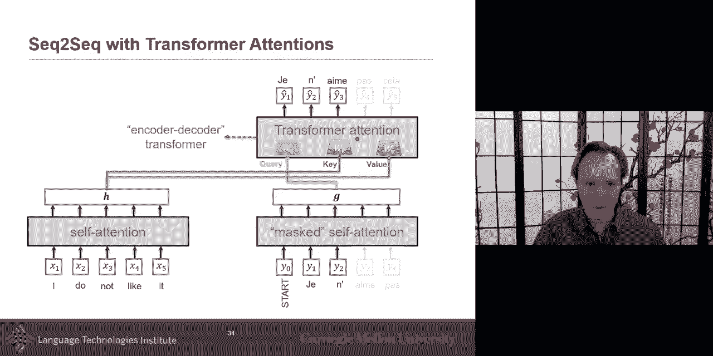

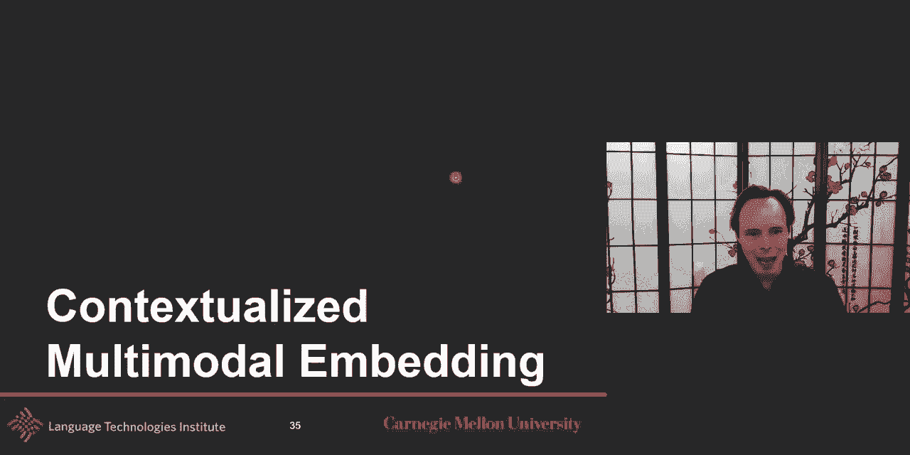

显然，我们需要解决这个问题。一种简单有效的方法是**位置编码**。

最直接的方法是为每个位置分配一个独热编码向量。例如，第一个位置是 `[1, 0, 0, ...]`，第二个位置是 `[0, 1, 0, ...]`，依此类推。

更常用的方法是使用正弦和余弦函数来生成位置编码向量，使其包含丰富的相对位置信息。对于位置 `pos` 和维度 `i`：
`PE(pos, 2i) = sin(pos / 10000^(2i/d_model))`
`PE(pos, 2i+1) = cos(pos / 10000^(2i/d_model))`

然后，我们将单词的初始嵌入 `x` 与位置编码 `p` 相加，作为 Transformer 的输入：`input = x + p`。

这样，当词序改变时，即使单词相同，其输入表示也会因位置编码不同而不同，从而让模型感知到顺序信息。

---

## 编码器-解码器与掩码自注意力

我们如何将 Transformer 用于序列到序列的任务，比如机器翻译或图像描述生成？

对于输入序列（编码器部分），我们可以直接使用之前介绍的自注意力。

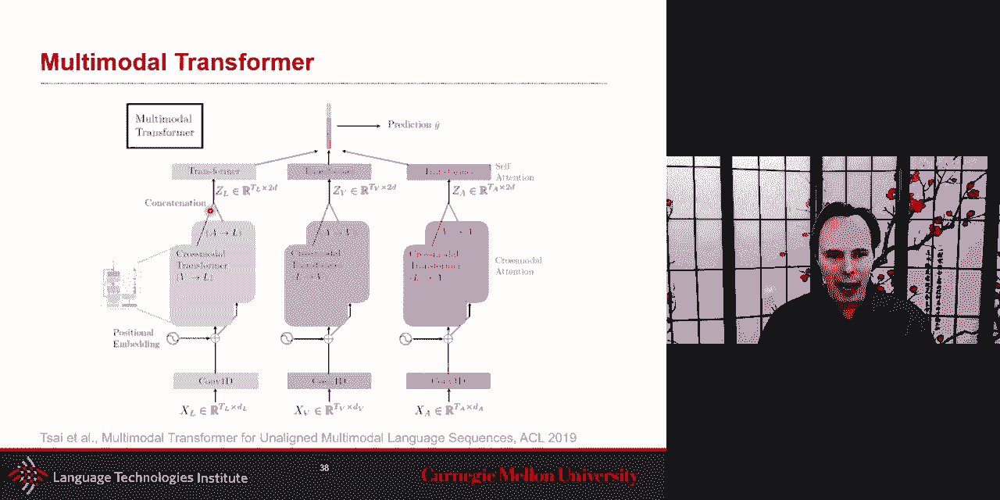

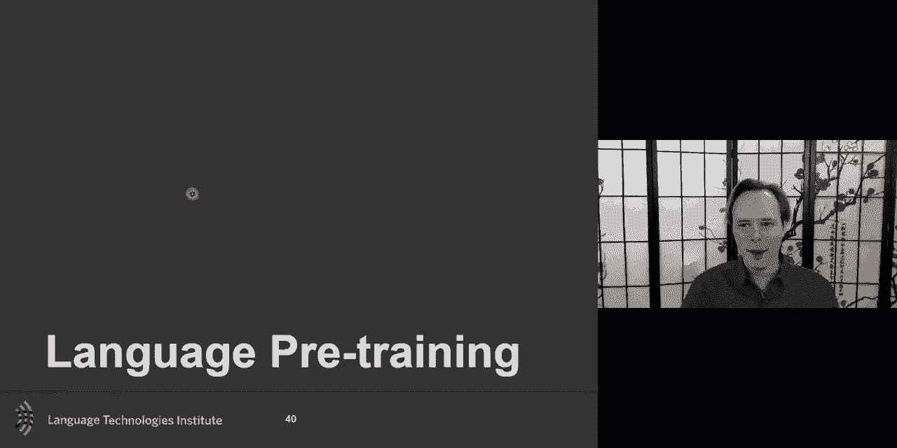

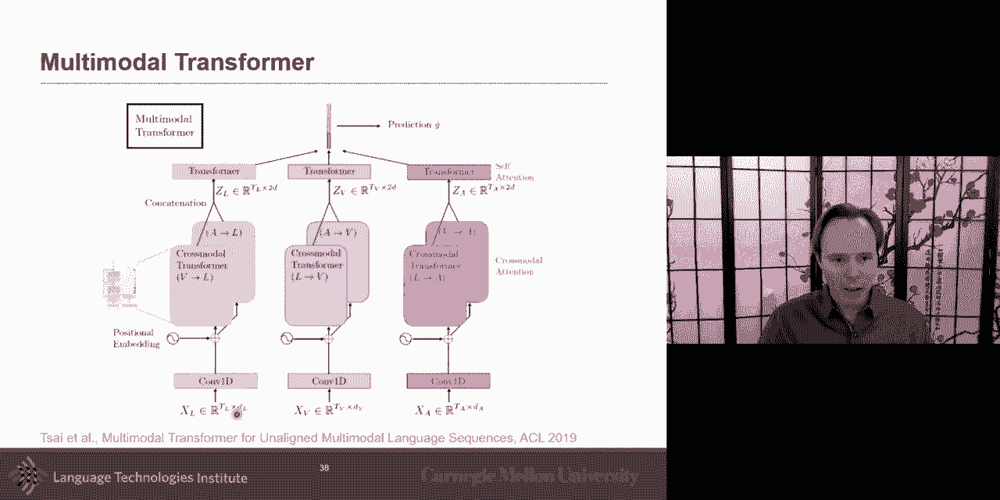

对于输出序列（解码器部分），生成过程是自回归的：我们根据已生成的部分来预测下一个词。在训练时，为了模拟这个过程并防止模型“偷看”未来的信息，我们需要使用**掩码自注意力**。

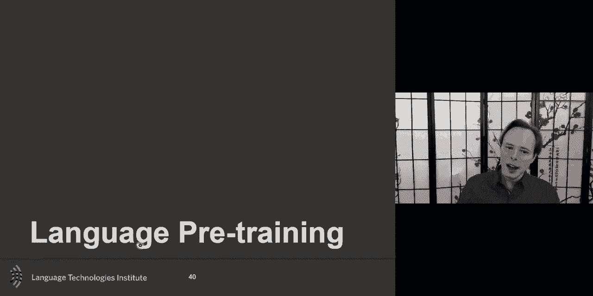

在掩码自注意力中，当计算某个位置（例如第三个词）的嵌入时，我们只允许它关注该位置之前的所有位置（第一、二个词），而屏蔽掉之后的位置。这通过一个掩码矩阵来实现，将未来位置的注意力权重设置为负无穷大，这样经过 softmax 后其权重就为 0。

此外，在标准的 Transformer 解码器中，还有一层**编码器-解码器注意力**。在这一层中，**查询**来自解码器上一层的输出，而**键**和**值**则来自编码器的最终输出。这使得解码器在生成每个词时，都能有选择地关注输入序列中最相关的部分。

所以，完整的 Transformer 模型包含：
1.  **编码器**：由多层自注意力层和前馈网络层组成。
2.  **解码器**：由掩码自注意力层、编码器-解码器注意力层和前馈网络层组成。

---

## 扩展到多模态

如何将自注意力思想扩展到多模态任务，例如同时处理语言、视觉和听觉信息？

最简单的方法是将所有模态的输入**拼接**成一个长序列。例如，将6个词嵌入、5个图像区域特征和10个声学特征拼接成一个包含21个向量的序列。然后，直接在这个拼接序列上应用一个大的自注意力 Transformer。最后，我们可以从这个 Transformer 的输出中，取出对应不同模态的部分，作为各自的上下文嵌入。

为了区分不同模态和不同位置，我们可以在输入中加入**模态嵌入**和**位置嵌入**。模态嵌入可以是一个简单的独热向量，表示该输入属于语言、视觉还是听觉。

另一种更精细的方法是使用**跨模态注意力**。例如，如果我们想用视觉信息来增强语言表示，我们可以让语言表示作为**查询**，视觉特征作为**键**和**值**，计算一个注意力上下文向量。然后，通过残差连接将这个上下文信息加到原始的语言表示上。我们可以为每对模态之间都建立这样的跨模态注意力连接。

---

## 预训练：BERT

如何以无监督的方式训练这样的 Transformer 模型，并使其能够用于下游任务？这里我们介绍 **BERT**。

BERT 的核心思想是利用**分布假说**进行预训练。它使用两种主要的无监督任务：

1.  **掩码语言模型**：随机掩盖输入句子中15%的单词，然后训练模型根据上下文来预测这些被掩盖的单词。这迫使模型学习强大的双向上下文表示。
    `Loss_MLM = - Σ log P(masked_word | context)`

2.  **下一句预测**：给定两个句子 A 和 B，训练模型判断 B 是否是 A 的下一句。这帮助模型学习句子间的关系，并获得句子级别的表示。
    `Loss_NSP = - [y * log(p) + (1-y) * log(1-p)]`，其中 `y=1` 表示 B 是 A 的下一句。

BERT 的输入格式很特别：在每个序列开头添加一个 `[CLS]` 标记，其最终的隐藏状态可用于句子级别的分类任务；在不同句子之间添加一个 `[SEP]` 标记作为分隔。此外，输入嵌入是**词嵌入**、**段嵌入**（区分句子A和B）和**位置嵌入**三者的和。

经过在大规模语料上预训练后，BERT 可以很容易地通过**微调**适应各种下游任务：
*   **句子分类**：使用 `[CLS]` 标记的最终输出，接一个分类层。
*   **词性标注**：使用每个词对应的最终输出，分别接分类层。
*   **问答**：将问题和篇章拼接输入，模型输出两个向量分别预测答案在篇章中的开始和结束位置。

---

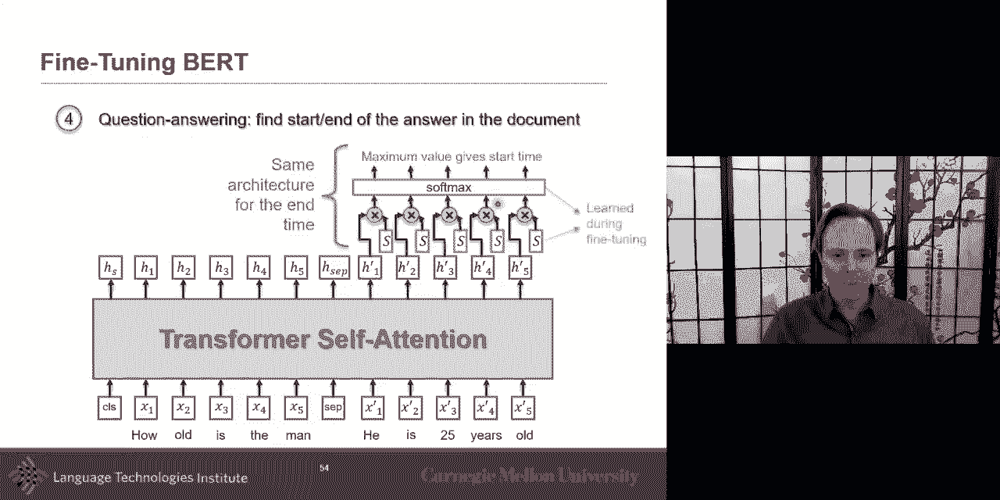

## 总结

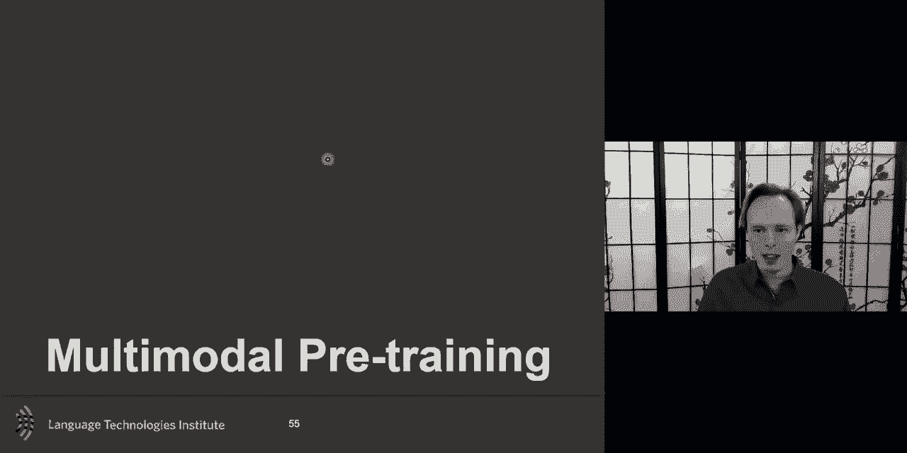

本节课中，我们一起深入学习了自注意力机制和 Transformer 架构。我们从上下文序列编码的需求出发，探讨了自注意力的基本原理，以及如何通过查询、键、值的投影和相似度计算来实现动态的上下文编码。我们了解了多头自注意力如何让模型同时关注不同类型的信息，以及位置编码如何让模型感知序列顺序。

我们还探讨了 Transformer 在编码器-解码器架构中的应用，包括掩码自注意力和跨模态注意力的思想。最后，我们介绍了如何通过 BERT 式的预训练任务，在大规模无监督数据上训练 Transformer，并将其微调到各种下游任务中，包括多模态场景。

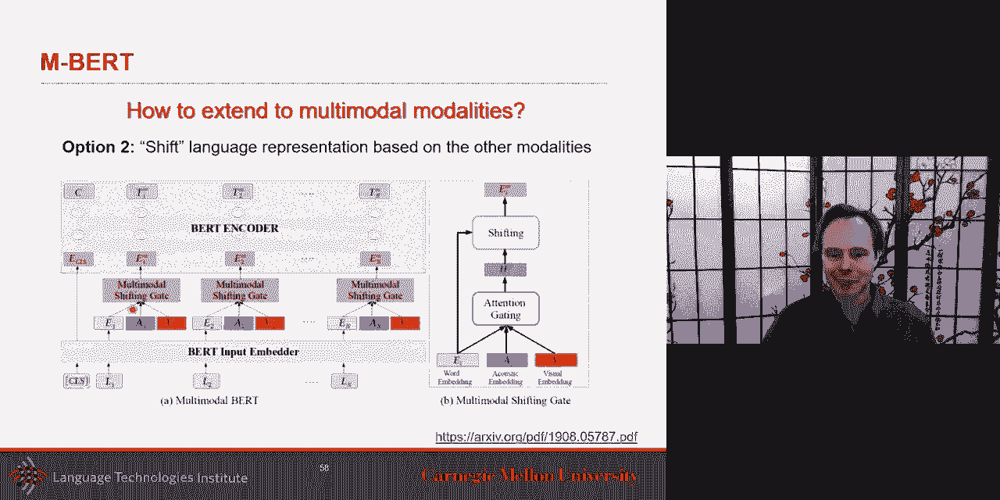

Transformer 及其衍生模型已成为现代自然语言处理和多模态理解的基石，其灵活性和强大能力值得我们深入理解和掌握。