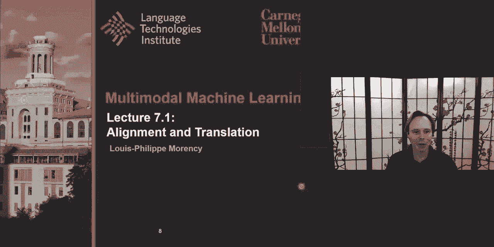
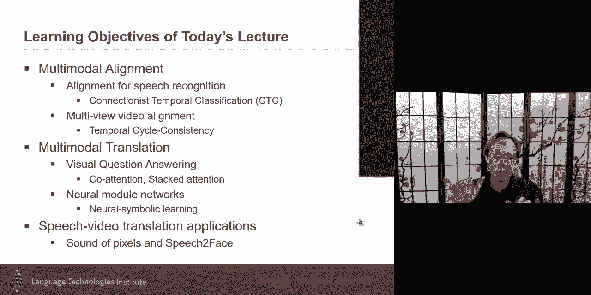

# 11：L7.1 - 对齐与平移（映射） 🎯

在本节课中，我们将要学习多模态对齐与翻译的核心概念。我们将首先探讨语音识别中的对齐问题，特别是连接主义时序分类（CTC）方法。接着，我们会研究视频对齐中的时序循环一致性方法。最后，我们将转向多模态翻译任务，重点分析视觉问答（VQA）及其相关的注意力机制与神经模块网络。

---

## 概述 📋

对齐与翻译是多模态学习中的两个基本任务。对齐关注如何在不同模态（如音频与文本、视频与视频）之间建立对应关系。翻译则涉及将信息从一种模态转换到另一种模态，例如从图像生成描述或回答关于图像的问题。

---

## 语音识别中的对齐 🔉

上一节我们概述了对齐任务，本节中我们来看看它在语音识别中的具体应用。语音识别是一个典型的多模态翻译任务，它将声学信号（音频）转换为语言（文本）。这个过程涉及从高粒度、连续的音频信号到低粒度、离散的语言符号的映射。

### 挑战：从帧到音素的映射

音频信号通常以高帧率（如每秒100帧）表示，而音素（语言的基本声音单位）的出现频率则低得多（如每秒10-12个）。这造成了**多对一映射**的挑战：许多连续的音频帧可能对应同一个音素。

**核心问题**：如何将一系列音频帧 $X = [x_1, x_2, ..., x_T]$ 对齐并映射到一系列音素 $Y = [y_1, y_2, ..., y_U]$，其中 $T > U$？

### 解决方案：连接主义时序分类（CTC）

CTC是一种专门为解决这种多对一对齐问题而设计的损失函数和算法。它允许模型在不需要帧级别精确标注的情况下进行训练。

**CTC的核心思想**：
1.  模型为每个输入帧预测一个**音素分布**，并额外引入一个特殊的 **`空白`（blank）** 标签。
2.  模型考虑所有可能的音素对齐路径（允许重复和空白）。
3.  通过动态规划（前向-后向算法）高效地计算所有有效路径的总概率。
4.  训练目标是最大化**正确音素序列**（合并重复音素并移除空白后）的概率。

**CTC损失函数公式**：
$L_{CTC} = - \log P(Y|X) = - \log \sum_{\pi \in \mathcal{B}^{-1}(Y)} P(\pi|X)$
其中，$\pi$ 是一条可能的对齐路径，$\mathcal{B}$ 是一个操作，用于合并路径中的重复字符并移除空白标签。

**CTC的优势**：它不要求精确的音素边界，只关注音素之间的**转换**。这使得模型对音频和文本之间的微小时间错位更加鲁棒。

---

## 视频对齐中的时序循环一致性 🎬

上一节我们介绍了CTC这种针对序列的特定对齐方法，本节中我们来看看一种更通用、可学习的对齐方法，它适用于视频等模态。

时序循环一致性（Temporal Cycle Consistency）是一种自监督学习方法，用于对齐两个未标注但内容相关的视频序列（例如，两个人执行相同的动作）。

### 核心直觉

其核心思想是**循环一致性**：如果视频A中的一帧在视频B中找到了最相似的帧（最近邻），那么这帧B中的帧也应该在视频A中把原始的那帧A作为它的最近邻。

### 方法步骤

1.  **编码**：使用神经网络编码器（如CNN）将每个视频帧编码为特征向量。
2.  **软最近邻查找**：对于视频A中的一帧 $f_a$，计算它与视频B中所有帧的相似度（如余弦相似度），得到一个注意力分布（软对齐）。
3.  **循环验证**：通过步骤2找到视频B中与 $f_a$ 最相关的帧 $\hat{f}_b$。然后，反过来查找视频A中与 $\hat{f}_b$ 最相关的帧 $\hat{f}_a$。
4.  **损失函数**：目标是让 $\hat{f}_a$ 尽可能接近原始的 $f_a$。损失函数惩罚这个距离，鼓励编码器学习到使循环一致的对齐更容易的特征。

**损失函数示意**：
$L_{TCC} = \text{Distance}(f_a, \hat{f}_a)$
其中，$\hat{f}_a$ 是通过“A->B->A”的循环查找得到的。

### 优势与应用

*   **自监督**：不需要人工标注的对齐数据。
*   **联合学习**：在学对齐的同时，也学习到了更好的视频帧特征表示，这些特征可用于下游任务（如动作识别）。
*   **可扩展性**：此思想可被扩展到多模态对齐（如视频-语言），但挑战在于如何设计跨模态的相似度度量。

---

## 多模态翻译：以视觉问答为例 ❓🖼️

前面我们讨论了对齐，现在我们将焦点转向翻译。在多模态语境中，翻译的一个典型例子是**视觉问答**。

### 什么是视觉问答？

VQA任务要求模型根据给定的图像和一个关于该图像的自然语言问题，生成或选择一个正确的答案。

**示例**：
*   **图像**：一张街景图。
*   **问题**：“天空中有云吗？”
*   **答案**：“是。”

VQA的优势在于其评估相对客观（对于分类式答案），避免了图像描述生成任务中存在的多种合理答案带来的评估难题。

### 关键技术：注意力机制

解决VQA的核心是让模型学会在问题和图像之间建立联系，即**对齐**问题中的词语与图像中的区域。

**堆叠注意力网络**：
这是一种进阶的注意力机制。模型不是只做一次图像-问题对齐，而是进行多轮（堆叠）的注意力。
1.  第一轮注意力根据问题初步聚焦图像的某些区域。
2.  基于第一轮聚焦的结果和原始问题，模型生成一个更新的查询向量。
3.  用这个更新的查询向量进行第二轮注意力，进一步细化聚焦的区域。
4.  这个过程可以重复多次，使模型能够迭代地推理，逐步找到回答问题所需的确切视觉信息。

### 引入先验知识：神经模块网络

为了处理更复杂的推理问题，神经模块网络（NMN）被提出。它不将问题视为一个整体，而是根据问题的**语法结构**（如依存句法分析树）将其分解为多个子步骤。

**工作原理**：
1.  **解析**：将问题（如“公共汽车上坐满乘客了吗？”）解析成语法树。
2.  **模块化**：预定义一系列可微的神经“模块”，每个模块执行一个特定功能（如“查找物体”、“合并属性”、“判断是否存在”）。
3.  **组装**：根据语法树，将对应的神经模块组装成一个可执行的“程序”（计算图）。例如，先调用“查找[公共汽车]”模块，再调用“查找[乘客]”模块，最后调用“判断[是否满]”模块。
4.  **执行与学习**：这个组装好的网络在图像上执行，端到端地进行训练。模型同时学习每个模块的参数以及如何根据问题组装它们。

**优势**：
*   **可解释性**：推理过程清晰，类似于分步解题。
*   **样本效率**：引入了语言结构先验，可能更擅长处理复杂、长尾的推理问题。
*   **灵活性**：可以为特定领域设计专门的模块。

### 进一步发展：神经符号学习

神经符号学习是NMN的延伸，旨在获得更高的可解释性。其核心思想是：
1.  将视觉特征（如来自Mask R-CNN的区域特征）进一步抽象为**符号化属性**（如颜色、形状、材质、空间关系）。这些属性是人类可读的。
2.  同样根据问题生成一个符号化的程序（如 `filter(color=‘red’)`， `relate(left_of)`）。
3.  在符号属性上执行该程序，得到答案。

这种方法将神经网络的感知能力与符号系统的推理可解释性结合起来。

---

## 应用与思考 💡

对齐与翻译技术催生了许多有趣的应用，例如：
*   **声音定位**：仅从视频学习物体发声的位置（如“像素的声音”）。
*   **语音转面部**：从声音预测说话者的面部特征（需注意此类技术可能带来的偏见问题）。

在研究这些应用时，我们必须积极思考其**伦理影响**和**潜在偏见**，确保技术被负责任地使用。

---

## 总结 🎓

本节课我们一起学习了多模态中的对齐与翻译。
*   我们首先深入探讨了**语音识别中的CTC方法**，它通过允许空白和重复标签，优雅地解决了音频帧与音素之间的多对一对齐问题。
*   接着，我们学习了**时序循环一致性**这一自监督对齐方法，它通过强制循环一致性约束，在视频对齐中学习有意义的特征表示。
*   最后，我们转向**多模态翻译**，以视觉问答为范例，分析了如何通过**注意力机制**建立视觉与语言的桥梁，以及如何利用**神经模块网络**和**神经符号学习**引入先验知识，实现更复杂、可解释的推理。

理解这些基础方法，是构建更强大、更智能的多模态系统的关键一步。