# 12：L7.2 - 生成模型 🧠

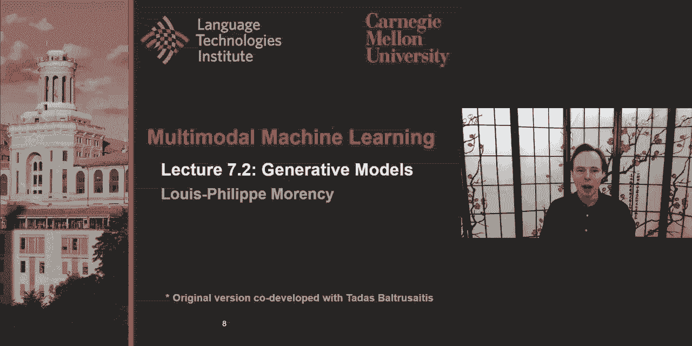

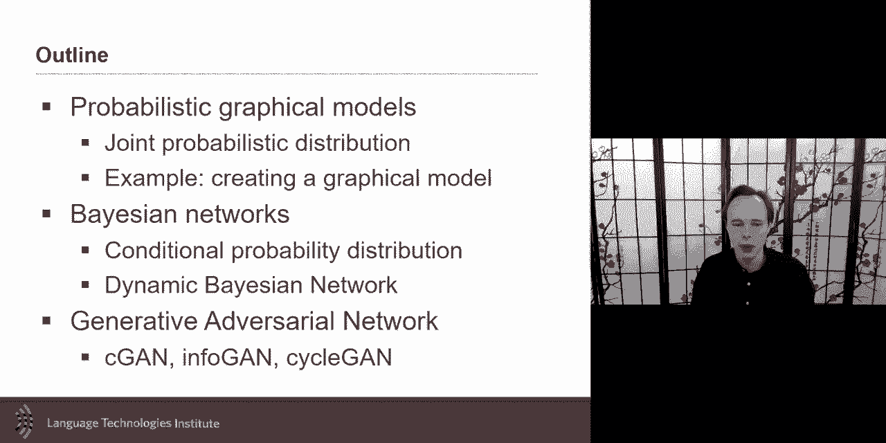

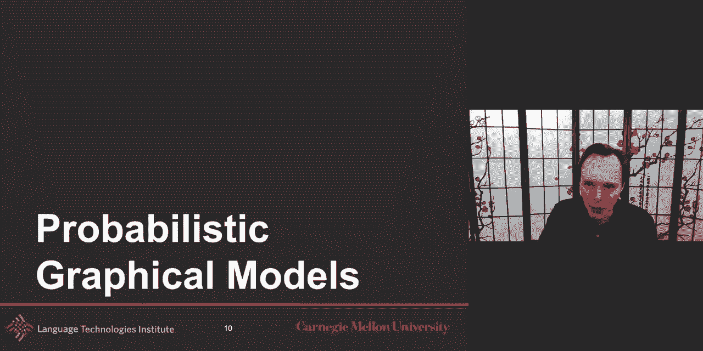

在本节课中，我们将学习生成模型。我们将从概率图模型入手，理解其如何将领域知识融入模型设计，并探讨其在数据有限情况下的优势。接着，我们会介绍神经生成模型，特别是生成对抗网络，了解其如何生成逼真的数据。

---

## 概率图模型 📊

上一节我们概述了生成模型，本节中我们来看看概率图模型。概率图模型是一种形式化方法，它通过图结构来紧凑地表示联合概率分布，并直观地展示变量间的依赖关系。

概率图模型是一种图表示形式，它能在数学和视觉上紧凑地建模联合概率分布。这种紧凑建模的优点是，同一个图模型既能提供紧凑的表示，也能清晰地展示变量间的依赖关系。

### 联合概率分布的重要性

为了深入理解，我们先聚焦于一种特定的概率分布：所有存在变量的联合分布。学习完整的联合分布非常重要，因为它是一个强大的工具。例如，如果你有五个离散随机变量，其联合分布可以表示为一个五维张量。这个张量中的每个元素都代表一个特定事件（例如，A=1，B=‘汽车’，C=2，D=‘香蕉’，E=10）的概率。

一旦学习了联合概率，你就可以进行多种操作。例如，你可以计算条件概率。假设我们有一个查询变量集合 **X** 和已知赋值的变量集合 **Y**，同时存在其他我们不关心的变量 **Z**。我们可以通过边缘化（对 **Z** 求和或积分）和利用逆概率规则来计算条件概率 **P(X|Y)**。其通用公式如下：

**P(X|Y) = α * Σ_{Z} P(X, Y, Z)**

其中，α 是一个归一化常数，与 **Y** 的先验概率有关。

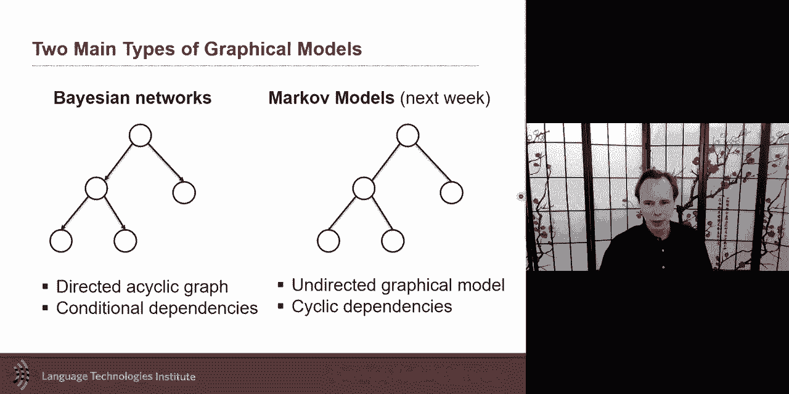

### 知识的引入与模型简化

然而，当变量数量很多时，显式建模所有交互可能会非常庞大且低效。这时，我们可以利用关于问题的先验知识来简化模型。概率图模型正是为此而生，它允许我们利用条件独立性假设，将庞大的联合概率分解为多个更小、更简单的因子乘积。

以下是两种基本的独立性关系：
*   **独立性**：如果两个变量 **X** 和 **Y** 独立，则 **P(X, Y) = P(X) * P(Y)**。
*   **条件独立性**：在已知变量 **Z** 的条件下，**X** 和 **Y** 独立，即 **P(X|Y, Z) = P(X|Z)**。

利用这些简单的规则，我们可以将任何问题的依赖关系用图表示出来，这就是图模型。图模型与数学形式化存在一一对应关系，是可视化这些条件依赖关系的工具。

---

## 贝叶斯网络 🕸️

上一节我们介绍了概率图模型的基本思想，本节中我们具体探讨一种重要的有向图模型——贝叶斯网络。

贝叶斯网络为条件独立性断言提供了一种简洁的图形化表示，从而能够紧凑地指定完整的联合分布。其定义包含三个部分：
1.  一组随机变量（节点）。
2.  一个连接这些节点的有向无环图。
3.  每个节点都有一个条件概率分布，该分布由其父节点决定，即 **P(节点 | 父节点)**。

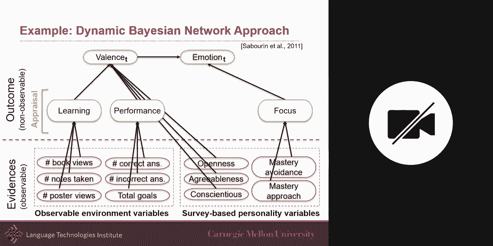

### 构建你的第一个贝叶斯网络

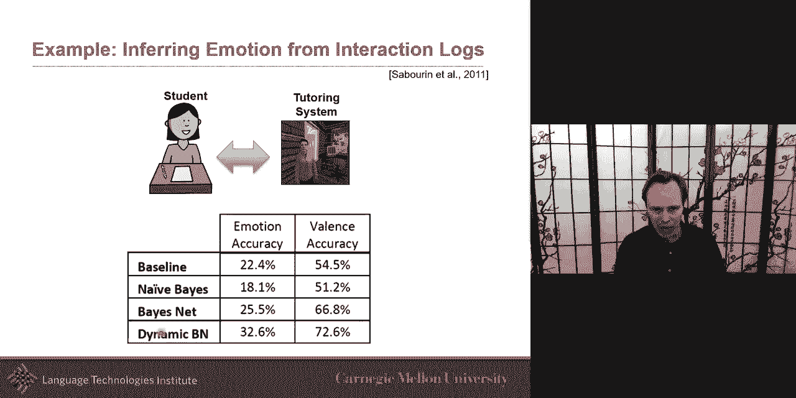

让我们通过一个例子来实践如何构建贝叶斯网络。假设我们要从学生与辅导系统的交互日志中推断其情绪。我们拥有的数据包括：学习能量、表现分数、专注度、个性特征，以及我们希望预测的情绪。

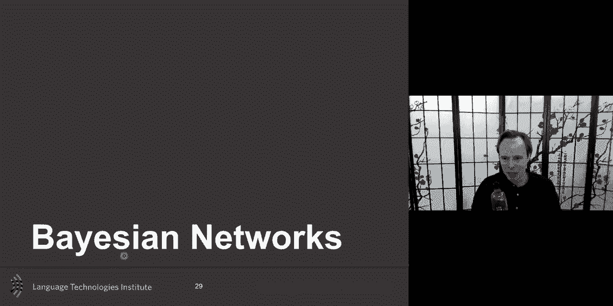

根据情绪评估理论，情绪是对外部事件与个人目标之间兼容性的评估结果。基于此理论，我们可以设计以下贝叶斯网络：
*   **学习能量**和**表现分数**共同影响**平衡**（即目标与结果的兼容性）。
*   **专注度**和**个性**也影响**平衡**。
*   **平衡**直接影响**情绪**。

这个网络结构融入了我们的领域知识（情绪评估理论），使得我们能够在数据有限的情况下进行更有效的学习。

### 动态贝叶斯网络

贝叶斯网络还可以扩展为动态贝叶斯网络，以建模序列或时间依赖关系。典型的动态贝叶斯网络采用一阶马尔可夫假设，即当前状态只依赖于前一个状态。

最著名的动态贝叶斯网络是隐马尔可夫模型。在HMM中，我们有一系列观测值 **X** 和一系列未观测的隐状态 **H**。HMM假设：
*   当前隐状态 **H_t** 只依赖于前一个隐状态 **H_{t-1}**。
*   当前观测值 **X_t** 只依赖于当前隐状态 **H_t**。

其图结构类似于一个链式的朴素贝叶斯分类器，但隐状态是潜在的、需要推断的变量。HMM可以看作是沿着时间轴进行“聚类”，每个隐状态对应一个生成观测值的概率分布。

### 多模态扩展

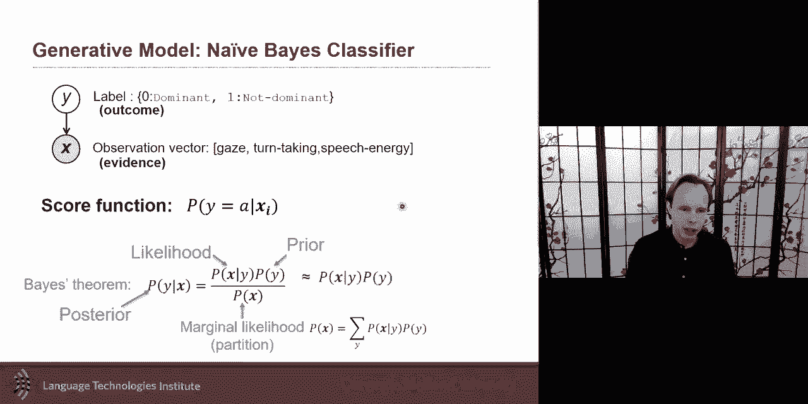

动态贝叶斯网络可以进一步扩展以处理多模态数据（如同时包含音频和视频的数据流）。早期的一些多模态神经网络架构就受到了这些图模型思想的启发。

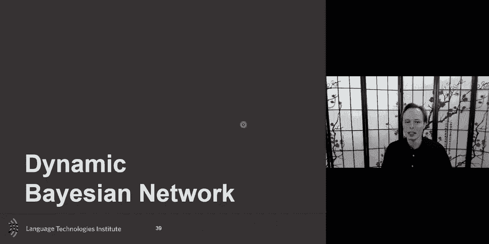

例如：
*   **因子化HMM**：假设单个观测流是由多个独立的隐状态过程共同生成的。
*   **耦合HMM**：两个模态（如音频和视觉）的隐状态序列相互影响。
*   **玻尔兹曼机及其变体**：提供了更灵活的建模方式。

这些模型中的耦合程度（如一个模态的隐状态如何影响另一个）等设计选择，后来在多模态LSTM等神经网络中也有所体现。

---

## 神经生成模型与GANs 🤖

上一节我们讨论了基于概率图模型的生成方法，本节中我们来看看基于神经网络的生成模型，特别是生成对抗网络。

在神经网络领域，有一类模型也旨在生成数据，它们有时被称为“生成式”神经模型。需要注意的是，这里的“生成式”术语有时用法更宽泛，不一定严格指建模联合分布的模型。

### 从自编码器到生成

一个简单的神经生成思路是使用自编码器。自编码器包含一个编码器（将输入数据压缩到潜在空间 **Z**）和一个解码器（从 **Z** 重建数据）。训练完成后，我们可以丢弃编码器，仅使用解码器，并通过在潜在空间 **Z** 中插值来生成新数据。

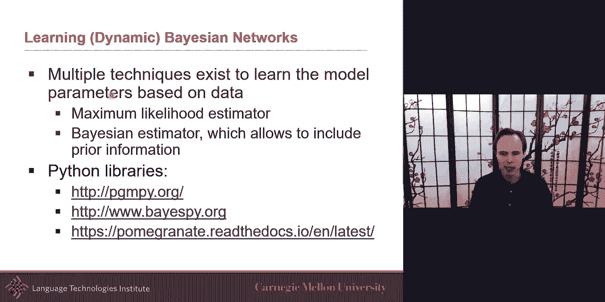

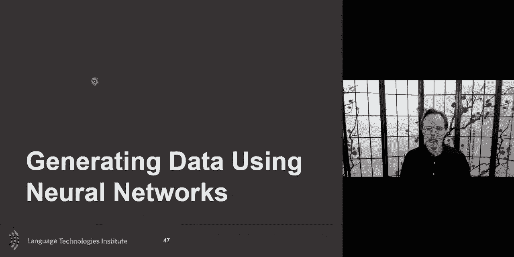

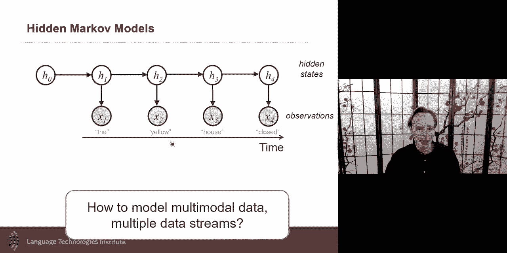

然而，直接这样做的问题在于，潜在空间 **Z** 可能结构不佳（例如，数据点聚集成簇，簇之间存在空白区域），导致插值产生的点没有意义。变分自编码器通过强制潜在空间 **Z** 的分布接近某个先验分布（通常是标准正态分布）来解决这个问题，使得整个潜在空间变得连续且可采样。

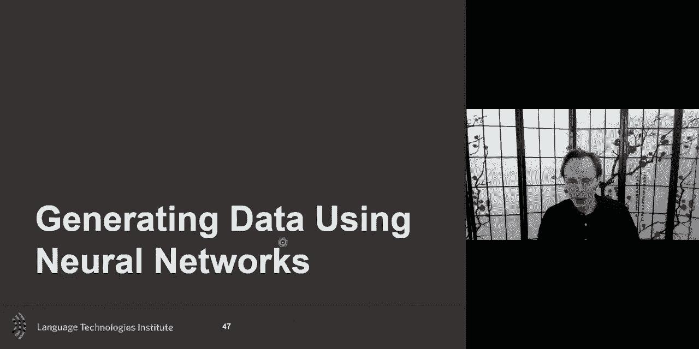

### 生成对抗网络

尽管VAE能生成数据，但生成样本的逼真度有时不足。生成对抗网络提供了一种不同的、非常强大的生成方法。

GAN的核心思想是让两个网络——生成器 **G** 和判别器 **D**——相互竞争（博弈）：
*   **生成器 G**：接收一个随机噪声向量 **z**，并尝试生成一张逼真的假图像 **G(z)**。
*   **判别器 D**：接收一张图像（可能是真实的，也可能是生成器生成的），并尝试判断它是“真实的”还是“伪造的”。

训练目标是达成一个纳什均衡：生成器生成的数据如此逼真，以至于判别器无法区分（即对于任何输入，判别器都给出50%的真实概率）。这可以通过一个极小极大博弈公式来描述：

**min_G max_D V(D, G) = E_{x~p_data(x)}[log D(x)] + E_{z~p_z(z)}[log(1 - D(G(z)))]**

其中，判别器 **D** 试图最大化这个目标（正确识别真实和伪造数据），而生成器 **G** 试图最小化这个目标（让判别器将其生成的数据误判为真实）。

### GAN的变体与应用

基础GAN可以扩展为条件GAN，通过额外输入条件信息（如图像类别、音频等）来控制生成的内容。这只需在生成器和判别器的输入中同时加入条件变量即可。

以下是几个有趣的应用方向：
*   **音频到场景生成**：根据输入音频生成对应的视觉场景。
*   **说话头生成**：根据输入的人脸标志点和身份图像，生成该人物说话的视频。
*   **双向GAN**：不仅学习从噪声 **z** 到图像 **x** 的生成器，还学习从图像 **x** 到潜在编码 **z** 的编码器，使模型具备编码和解码双重能力。
*   **循环一致性GAN**：用于解决未配对数据间的转换问题（例如，将马转换为斑马，而没有成对的马-斑马图片）。它引入一个循环重建损失，确保转换后的图像能够再转换回原始域。

---

## 总结 🎯

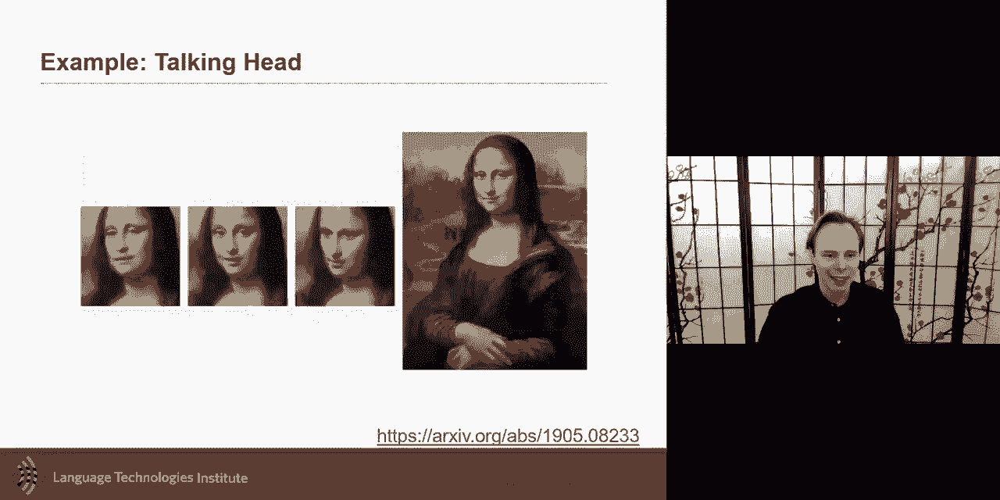

本节课中我们一起学习了生成模型的两大主要范式。

首先，我们深入探讨了**概率图模型**，特别是贝叶斯网络和动态贝叶斯网络。我们了解了它们如何通过图结构紧凑地表示联合概率分布，并利用条件独立性整合领域知识。这对于数据有限或需要强解释性的场景非常有用。我们还看到了它们如何扩展到序列和多模态数据建模。

其次，我们介绍了**神经生成模型**，重点是生成对抗网络。GAN通过一个生成器和一个判别器之间的对抗博弈，学习生成高度逼真的数据。我们讨论了基础GAN、条件GAN以及一些高级变体（如CycleGAN）的原理和应用。

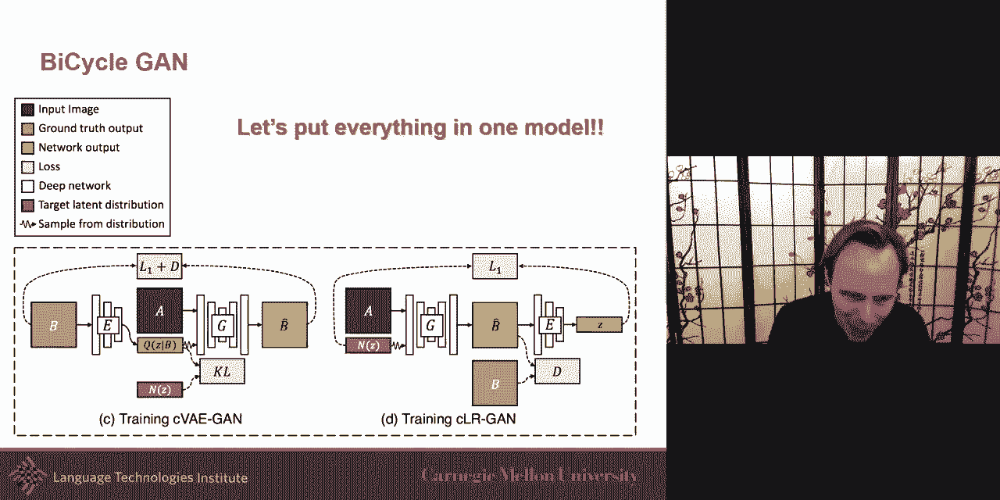

这两种方法各有优势：概率图模型更注重可解释性和融入先验知识，而神经生成模型（如GAN）在生成复杂、高维数据（如图像、音频）的逼真度方面表现卓越。理解这两种思路将为你在不同场景下选择合适的生成方法奠定坚实的基础。