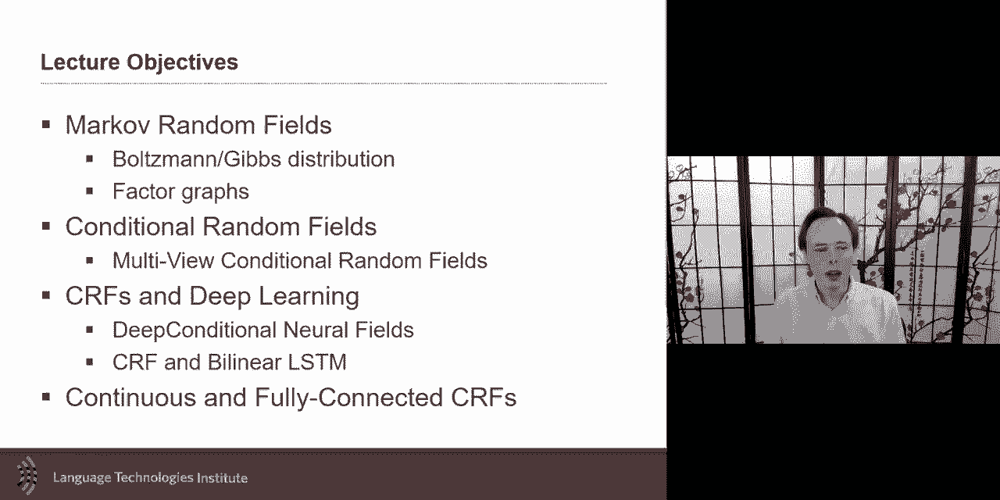
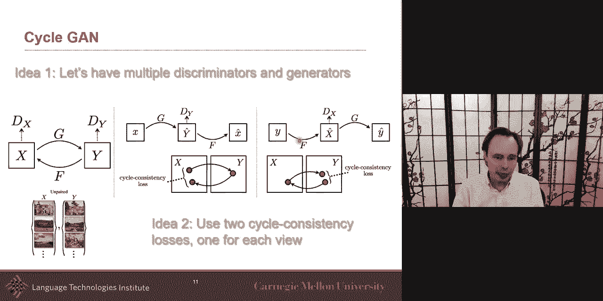
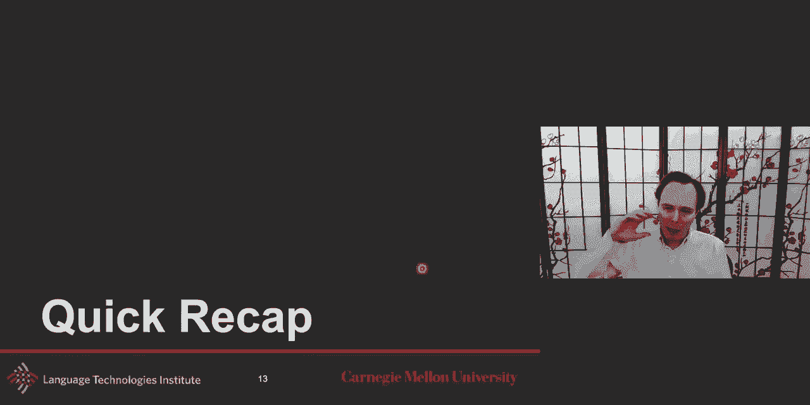
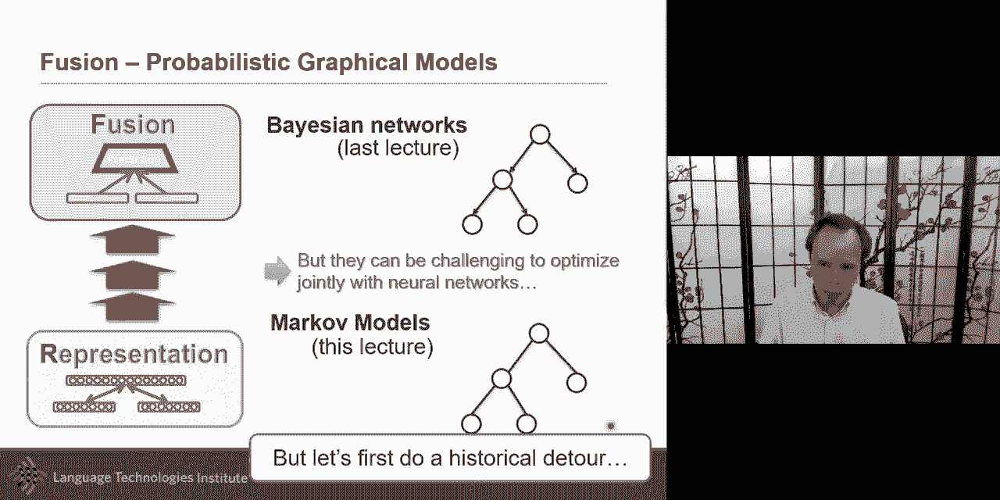
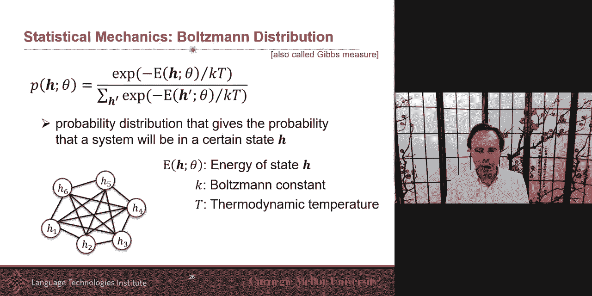
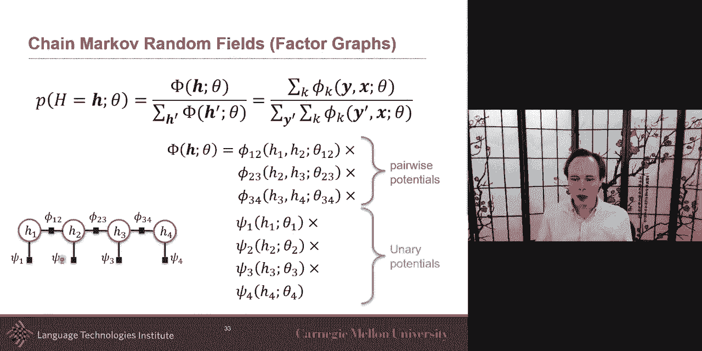
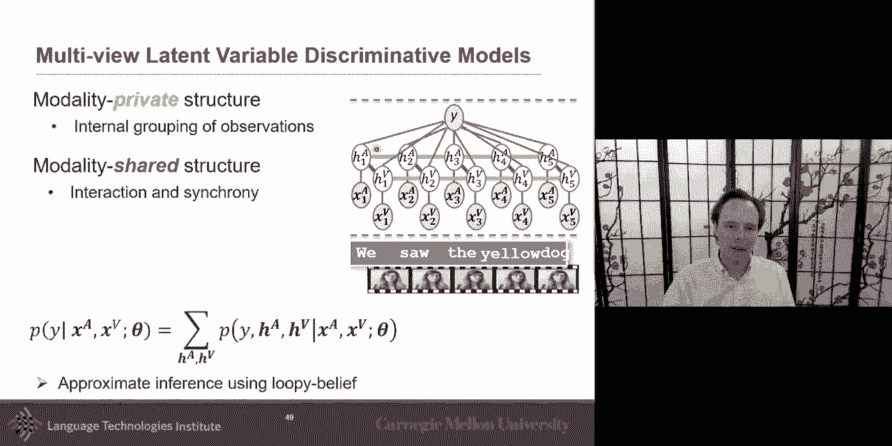
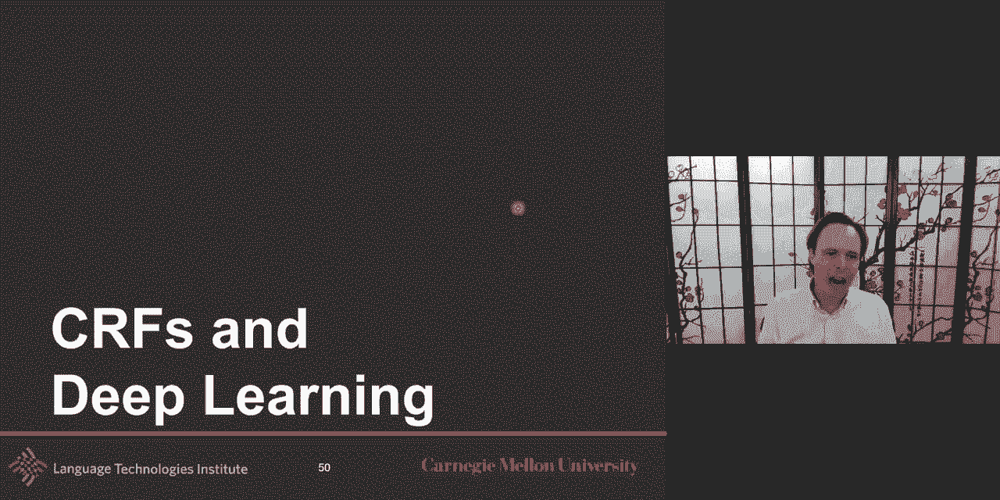
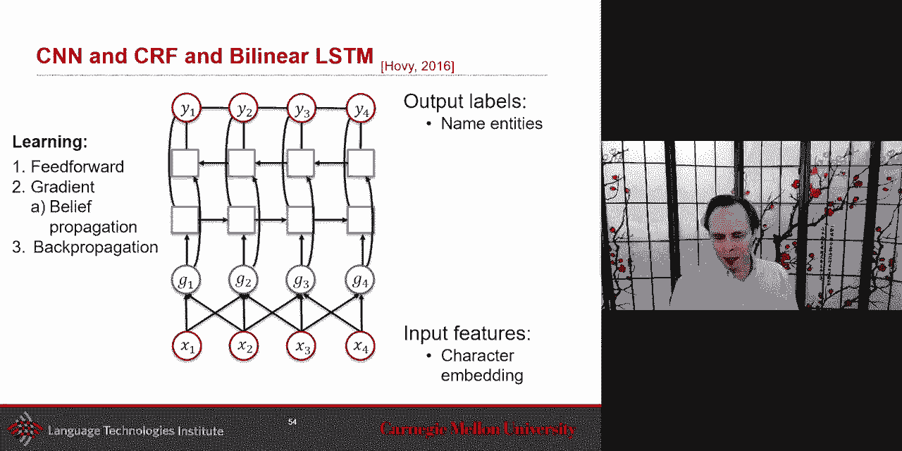
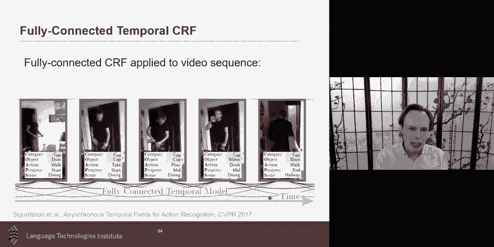

# 13：L8.1 - 判别式图模型 📘

在本节课中，我们将学习判别式图模型，特别是基于马尔可夫随机场的模型。我们将探讨它们如何与神经网络结合，并介绍条件随机场及其扩展。

---

## 🔄 回顾与衔接

上一周我们讨论了贝叶斯网络作为一种概率图模型。本节中，我们将探讨另一类基于马尔可夫随机场的模型。这些模型在优化视角下与神经网络有更好的兼容性，并能提供一些自然的构建模块。

首先，我们简要回顾上节课的最后几页内容，并对过去七周的学习进行总结，为后续内容打下基础。

---

## 🖼️ 生成模型回顾

我们回顾了生成对抗网络及其变体。生成对抗网络的核心是通过生成器和判别器的对抗来生成逼真的图像。

以下是生成对抗网络的两种重要扩展：

*   **双向生成对抗网络**：该架构同时训练生成器和编码器。生成器从随机向量生成图像，编码器将真实图像编码为低维表示。判别器的任务是区分“真实图像与真实编码”和“生成图像与生成编码”的组合。
*   **循环生成对抗网络**：该模型用于处理未配对的数据。它学习两个生成器：一个从域X映射到域Y，另一个从域Y映射回域X。通过引入循环一致性损失，即使没有精确配对的数据，也能训练出有效的跨域转换模型。

---

## 🧩 融合与图模型

在课程中，我们探讨了多模态学习的五大挑战：表示、对齐、翻译、融合和协同学习。融合是更接近最终预测的步骤，它涉及整合不同模态的信息以进行预测。

概率图模型在融合阶段特别有用，因为它们允许我们融入领域知识。例如，在情感分析中，我们可以利用关于情感潜在结构的理论来构建模型。图模型还能在预测标签时强制执行一致性，例如在语义分割或词性标注中，相邻像素或单词的标签应该具有连贯性。

上周我们讨论了贝叶斯网络，但将其与神经网络结合优化时存在一些挑战。马尔可夫模型及其公式化在优化方面更为流畅，能更好地与神经网络集成。

---

## ⚛️ 受限玻尔兹曼机

作为马尔可夫模型的引入，我们回顾受限玻尔兹曼机。这是最早用于多模态的神经网络模型之一，是一种生成模型。

受限玻尔兹曼机是一种无向图模型，其连接仅定义在可见层和隐藏层之间，同层内没有连接，这简化了推断。它是一个基于能量的模型。

其联合概率分布由以下公式定义：
`P(x, h; θ) = (1/Z(θ)) * exp(-E(x, h; θ))`
其中，`E(x, h; θ)` 是能量函数，`Z(θ)` 是归一化常数（配分函数）。能量函数通常包含可见单元与隐藏单元之间的交互项以及各自的偏置项。

---

## 🕸️ 马尔可夫随机场

马尔可夫随机场与玻尔兹曼机非常相似，但提供了更大的灵活性。它也是一种无向图模型。

其概率分布同样采用吉布斯分布的形式：
`P(X) = (1/Z) * exp( -∑_c E_c(X_c) )`
其中，`E_c` 是定义在团 `c` 上的能量函数，`Z` 是配分函数。能量函数越低，该配置的概率越高。

完全连接的马尔可夫随机场很少见，通常我们只根据领域知识定义部分连接（即因子）。因子图是表示马尔可夫随机场的一种强大方式，它允许我们显式地表示涉及两个以上变量的因子（团）。

---

## 🔗 从马尔可夫随机场到条件随机场

基本的马尔可夫随机场是生成模型，它建模联合概率 `P(Y, X)`。然而，我们通常更关心判别任务，即建模条件概率 `P(Y|X)`。

条件随机场正是这样一种判别式模型。它直接对给定输入 `X` 时输出 `Y` 的条件概率进行建模，其形式与马尔可夫随机场类似，但条件是 `X`：
`P(Y|X) = (1/Z(X)) * exp( ∑_k λ_k f_k(Y, X) )`
其中，`f_k` 是特征函数（可以看作势函数），`λ_k` 是其权重，`Z(X)` 是依赖于 `X` 的归一化常数。

在序列标注等任务中，我们通常使用链式条件随机场，并绑定不同时间步的权重参数，以处理任意长度的序列。

---

## 🧠 潜在动态条件随机场

有时，在观测值 `X` 和标签 `Y` 之间引入潜在变量 `H` 是有益的。潜在动态条件随机场就是这样一种模型。

它假设每个标签 `Y` 对应一组潜在的隐藏状态 `H`。模型学习将观测值聚类到这些隐藏状态中，并同时学习隐藏状态内部（类内）和隐藏状态之间（类间）的转移动态。这类似于隐马尔可夫模型，但以判别方式训练。

---

## 🌐 多视图与神经网络集成

对于多模态数据（如音频和视频），我们可以构建多视图条件随机场，每个模态有自己的潜在动态，并通过势函数进行耦合。这种模型可以处理异步的多模态数据。

更重要的是，我们可以将神经网络与条件随机场结合起来。神经网络擅长从高维原始数据（如图像、文本）中学习好的表示，而条件随机场则擅长在输出标签上施加结构约束（如时序一致性、空间一致性）。

这种组合通常采用以下模式：使用神经网络（如CNN、LSTM）作为特征提取器，然后将其输出送入条件随机场进行结构化预测。训练时，可以通过反向传播联合优化神经网络和条件随机场的参数。

---

## 📈 扩展：连续与高阶条件随机场

条件随机场可以扩展到预测连续值输出，例如在时间序列回归中。这需要选择特定的特征函数，使得配分函数 `Z(X)` 有闭式解（例如，通过将其表述为多元高斯积分）。

此外，我们还可以构建全连接条件随机场，其中每个输出变量都与其他所有输出变量相连。这在图像语义分割中非常有用，每个像素的标签都与所有其他像素的标签相关。由于精确推断困难，通常采用均值场近似等方法进行高效近似推断。

---

## ✅ 总结

本节课我们一起学习了判别式图模型。我们从回顾生成对抗网络开始，然后介绍了马尔可夫随机场和条件随机场的基本概念。我们探讨了如何将领域知识融入图模型的结构中，以及如何将强大的神经网络表示学习与条件随机场的结构化预测能力相结合。最后，我们了解了条件随机场的一些扩展，如潜在动态模型、多视图模型、连续输出模型以及全连接模型。这些模型为处理复杂的多模态预测任务提供了强大的工具。