# 15：L9.1 - 强化学习基础 🎓

在本节课中，我们将学习强化学习的基本概念、核心框架以及一些基础算法。我们将从马尔可夫决策过程开始，逐步深入到如何在实际问题中应用这些理论。

---

## 📖 概述

强化学习是机器学习的一个重要分支，它关注智能体如何通过与环境的交互来学习最优策略。近年来，深度强化学习的结合在许多领域取得了显著成功，例如自动驾驶、游戏AI和机器人控制。

---

## 🤖 什么是强化学习？

强化学习涉及两个关键组成部分：智能体和环境。智能体从初始状态 `s0` 开始，根据当前状态采取行动 `a`。环境随后返回一个奖励 `r` 和下一个状态 `s'`。这一系列交互构成了智能体在环境中的轨迹。

**核心交互循环**：
```
状态 s -> 行动 a -> 奖励 r & 新状态 s'
```

例如，在足球游戏中：
*   **状态 s0**: 开球时所有球员的位置。
*   **行动 a**: 球员移动、传球或射门。
*   **奖励 r**: 进球（正奖励）、犯规（负奖励）。

这个框架非常通用，几乎涵盖了任何形式的智能体与环境交互。

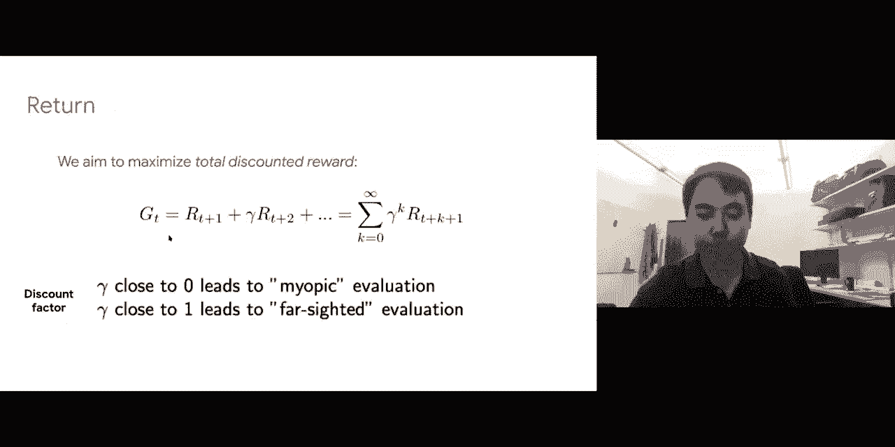

---

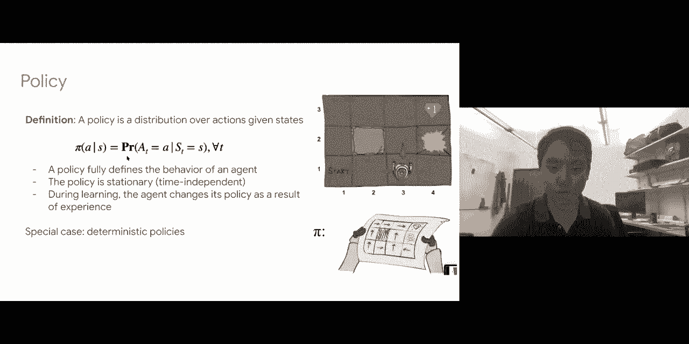

## 📐 马尔可夫决策过程

为了形式化地描述强化学习问题，我们使用**马尔可夫决策过程**。一个MDP由以下七元组定义：
*   **状态集合 S**: 智能体可能处于的所有状态。
*   **行动集合 A**: 智能体可以采取的所有行动。
*   **转移函数 T(s'|s, a)**: 在状态 `s` 采取行动 `a` 后，转移到状态 `s'` 的概率分布。
*   **奖励函数 R(s, a, s')**: 在状态 `s` 采取行动 `a` 并到达状态 `s'` 后获得的奖励。
*   **起始状态 s0**: 交互的起点。
*   **折扣因子 γ**: 介于0和1之间，用于权衡即时奖励和未来奖励的重要性。
*   **时间范围 H**: 智能体与环境交互的总步数。

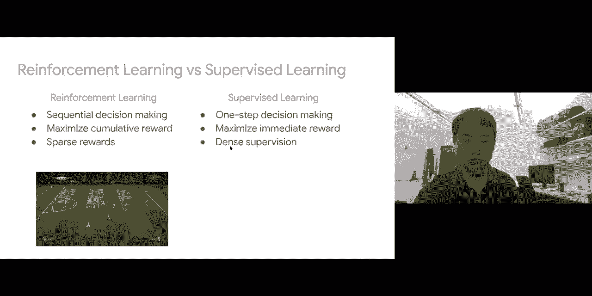

MDP必须满足**马尔可夫性质**，即未来状态仅依赖于当前状态和行动，而与历史无关。例如，如果指令是“去厨房拿苹果”，那么每个状态都需要同时包含当前位置和这条指令信息，才能满足马尔可夫性质。

---

## 🎯 强化学习的目标

智能体的目标是最大化其在整个交互过程中获得的**累积折扣奖励**。其数学表示为：

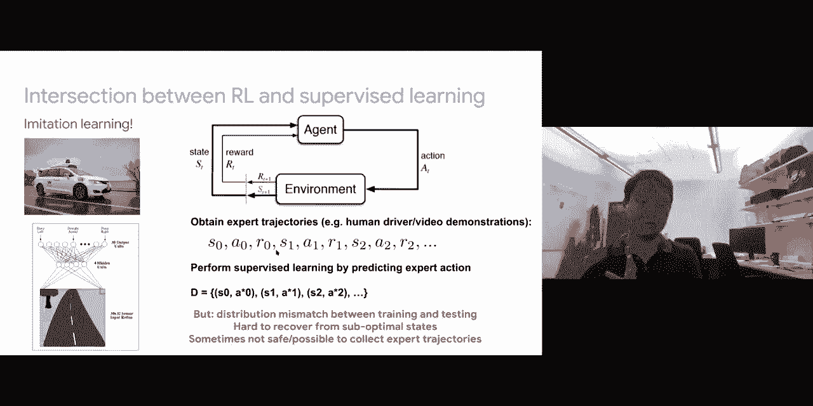

**公式**：
```
G_t = R_{t+1} + γ * R_{t+2} + γ^2 * R_{t+3} + ...
```

其中，`γ` 是折扣因子。
*   `γ` 接近 0：智能体更关注即时奖励（短视）。
*   `γ` 接近 1：智能体更重视未来奖励（长远规划）。

折扣因子在理论和实践上都有助于算法收敛，并鼓励智能体更快地达成目标。

---

## 🗺️ 策略：智能体的行为指南

**策略 π(a|s)** 定义了在给定状态 `s` 下，智能体采取每个可能行动 `a` 的概率分布。策略完全决定了智能体的行为。

强化学习的终极目标就是找到那个能最大化累积折扣奖励的**最优策略 π***。

---

## 🔍 价值函数：评估状态与行动

为了评估策略的好坏，我们引入了价值函数。

*   **状态价值函数 V^π(s)**: 从状态 `s` 开始，始终遵循策略 `π` 所能获得的期望累积回报。
    **公式**：`V^π(s) = E_π[ G_t | S_t = s ]`

*   **行动价值函数 Q^π(s, a)**: 在状态 `s` 采取行动 `a`，然后遵循策略 `π` 所能获得的期望累积回报。
    **公式**：`Q^π(s, a) = E_π[ G_t | S_t = s, A_t = a ]`

最优价值函数则是在所有可能策略中取最大值：
*   `V*(s) = max_π V^π(s)`
*   `Q*(s, a) = max_π Q^π(s, a)`

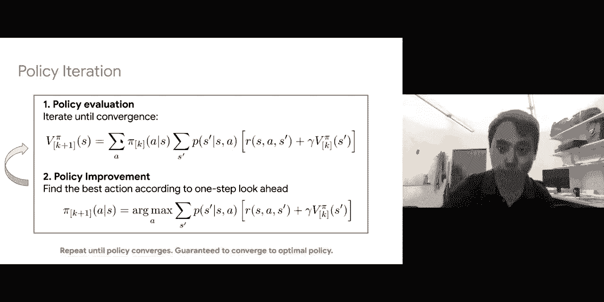

如果我们知道了最优行动价值函数 `Q*`，就可以直接得到最优策略：在状态 `s` 下，选择使 `Q*(s, a)` 最大的行动 `a`。

---

## ⚙️ 算法一：动态规划（已知MDP）

当MDP完全已知（即状态、行动、转移概率、奖励都已知）且规模较小时，我们可以使用动态规划方法精确求解。

上一节我们介绍了价值函数，本节我们来看看如何利用贝尔曼方程进行迭代求解。

### 贝尔曼期望方程
它描述了特定策略下价值函数自身的递归关系。
对于 `V^π(s)`：
**公式**：
```
V^π(s) = Σ_a π(a|s) Σ_s‘ T(s'|s, a) [ R(s, a, s') + γ * V^π(s') ]
```
对于 `Q^π(s, a)`：
**公式**：
```
Q^π(s, a) = Σ_s‘ T(s'|s, a) [ R(s, a, s') + γ * Σ_a‘ π(a'|s') Q^π(s', a') ]
```

### 贝尔曼最优方程
它描述了最优价值函数之间的递归关系，无需指定策略。
对于 `V*(s)`：
**公式**：
```
V*(s) = max_a Σ_s‘ T(s'|s, a) [ R(s, a, s') + γ * V*(s') ]
```
对于 `Q*(s, a)`：
**公式**：
```
Q*(s, a) = Σ_s‘ T(s'|s, a) [ R(s, a, s') + γ * max_a‘ Q*(s', a') ]
```

利用这些方程，我们可以设计出迭代算法：

*   **策略迭代**：
    1.  **策略评估**：给定当前策略 `π_k`，通过迭代求解贝尔曼期望方程，计算其价值函数 `V^{π_k}`。
    2.  **策略改进**：根据 `V^{π_k}`，采用贪心策略生成一个更好的新策略 `π_{k+1}`。
    重复以上两步直到策略收敛。

*   **价值迭代**：
    直接迭代求解贝尔曼最优方程，不断更新 `V(s)` 的估计值，直到收敛。收敛后，最优策略可通过一步前瞻得到：`π*(s) = argmax_a Σ_s‘ T(s'|s, a) [ R(s, a, s') + γ * V*(s') ]`

**局限性**：需要完全已知的MDP模型，且必须能枚举所有状态和行动（表格法），无法处理高维或连续状态空间。

---

## 🔄 算法二：蒙特卡洛与时序差分学习（未知MDP）

在现实世界中，MDP模型通常是未知或过于复杂而无法精确建模的。我们需要通过与环境的实际交互来学习。

上一节我们讨论了在已知模型下的精确求解，本节我们来看看如何在未知模型下通过采样进行学习。

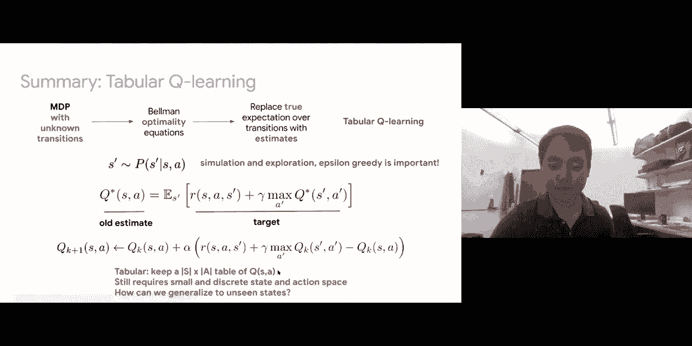

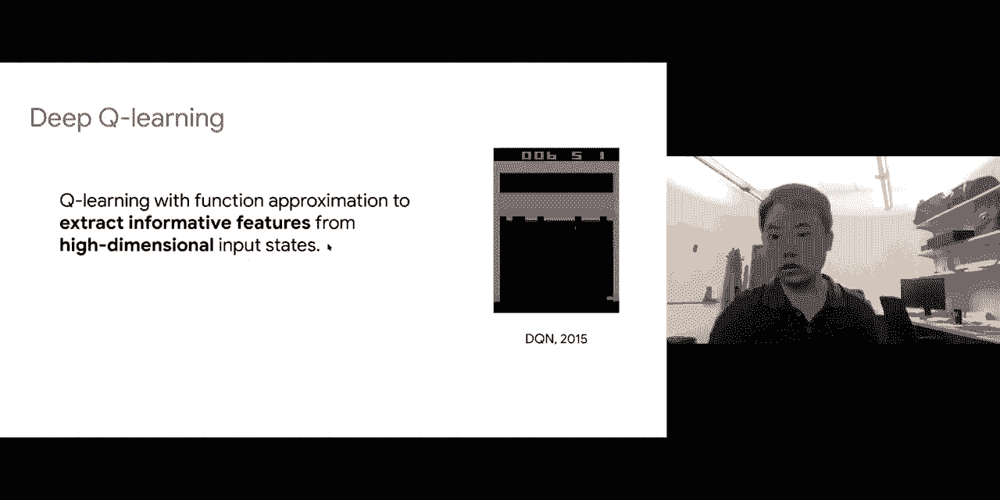

核心思想是将贝尔曼最优方程中的期望用采样均值来近似。

以下是基于Q学习的一种经典算法：

### 表格Q学习
1.  初始化一个表格 `Q(s, a)`，为所有状态-行动对赋初值。
2.  对于每一步交互：
    *   使用 **ε-贪心** 策略选择行动：以概率 `ε` 随机探索，以概率 `1-ε` 选择当前 `Q` 值最大的行动（利用）。
    *   执行行动 `a`，观察奖励 `r` 和下一个状态 `s‘`。
    *   更新 `Q` 值：
        **公式**：
        ```
        Q(s, a) ← Q(s, a) + α * [ r + γ * max_a‘ Q(s‘, a‘) - Q(s, a) ]
        ```
        其中 `α` 是学习率。`r + γ * max_a‘ Q(s‘, a‘)` 被称为**目标值**，`[...]` 内的部分是**时序差分误差**。

**ε-贪心探索**至关重要：初期需要大量随机探索（`ε` 较大）以发现高奖励区域，随后逐渐减少 `ε` 以利用学到的策略。

**优势**：即使遵循非最优策略（ε-贪心）收集数据，Q学习也能保证收敛到最优策略（离策略学习）。
**局限性**：仍需维护 `Q(s, a)` 表格，无法处理大规模或连续状态/行动空间，也无法泛化到未见过的新状态。

---

## 🧠 算法三：深度Q网络（高维状态空间）

为了克服表格法的限制，我们引入函数逼近器（如神经网络）来近似 `Q` 函数。

上一节我们介绍了通过采样更新表格Q值的方法，本节我们来看看如何用神经网络来拟合这个Q表。

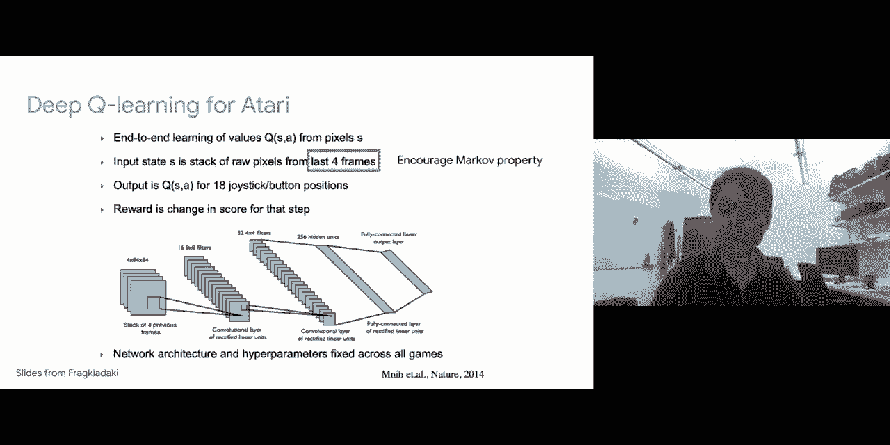

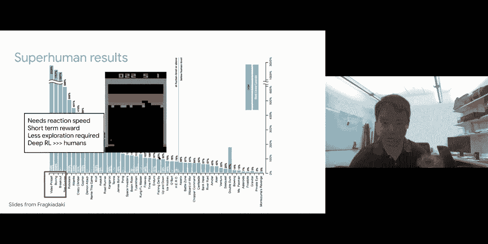

### 深度Q网络
我们用一个参数为 `w` 的神经网络 `Q(s, a; w)` 来近似 `Q*(s, a)`。网络的输入是状态 `s`（如图像），输出是所有可能行动 `a` 对应的Q值。

训练目标是最小化贝尔曼最优方程两侧的差异。我们定义损失函数为：
**公式**：
```
L(w) = E_{(s,a,r,s‘)} [ ( r + γ * max_a‘ Q(s‘, a‘; w^-) - Q(s, a; w) )^2 ]
```
这里 `w^-` 是**目标网络**的参数，它定期（如每1000步）从当前网络 `w` 复制而来，用于计算稳定的目标值。

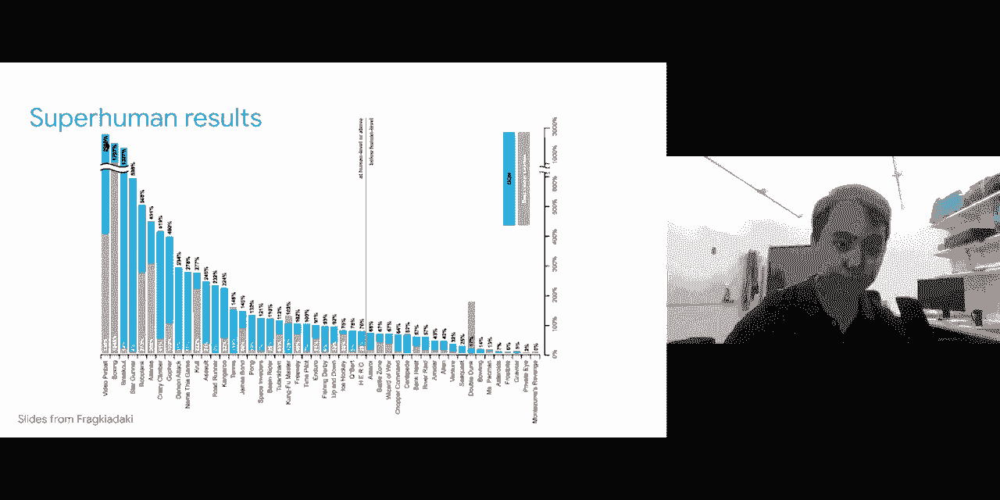

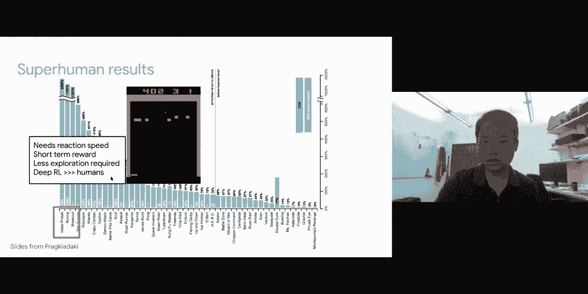

直接训练DQN面临两大挑战：
1.  **样本相关性**：连续交互得到的样本序列高度相关。
2.  **非平稳目标**：用于计算目标值的网络 `Q(s‘, a‘; w)` 本身也在不断变化。

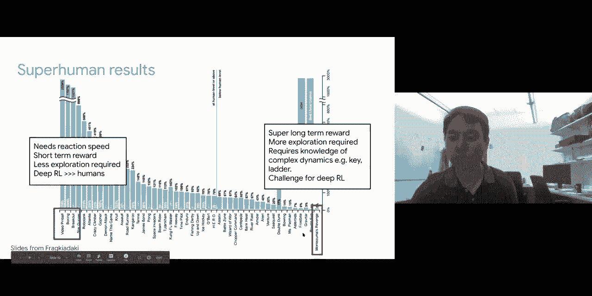

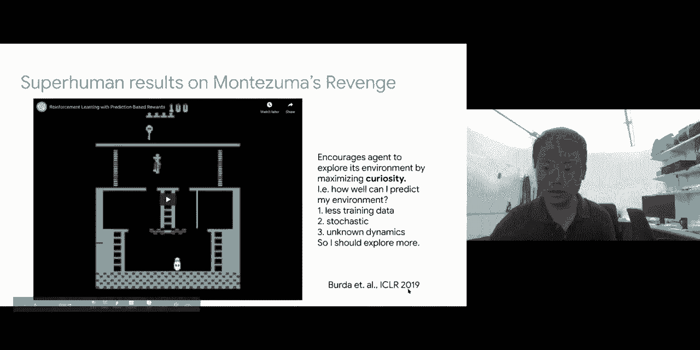

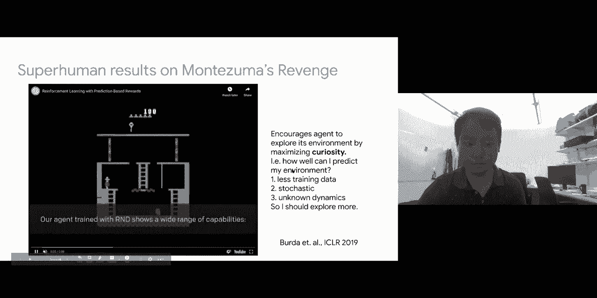

解决方案：
*   **经验回放**：将交互得到的数据 `(s, a, r, s‘)` 存储在一个缓冲池中。训练时，从池中随机抽取小批量样本，打破了数据间的相关性。
*   **固定目标网络**：使用一个独立的、更新缓慢的目标网络 `Q(s‘, a‘; w^-)` 来计算目标值，缓解了目标值波动的问题。

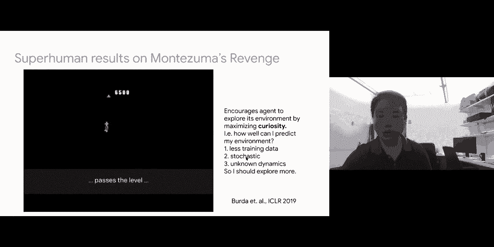

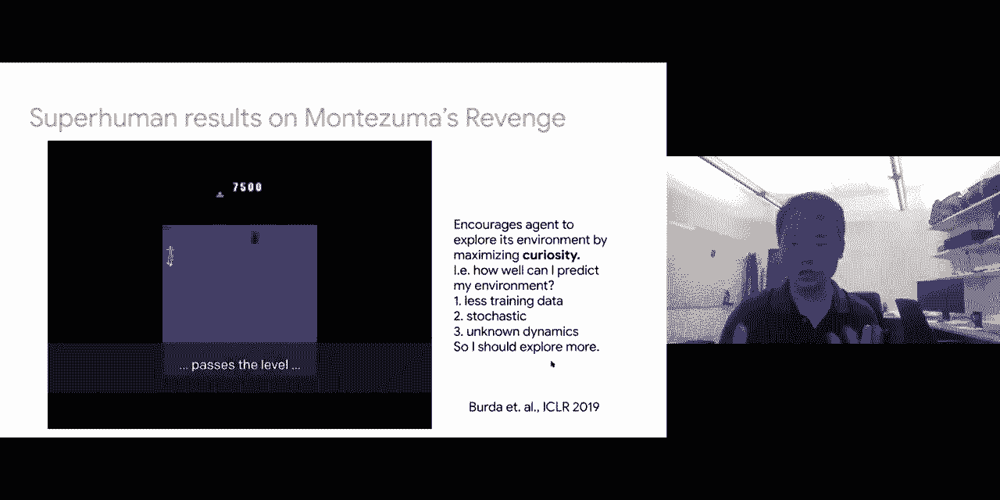

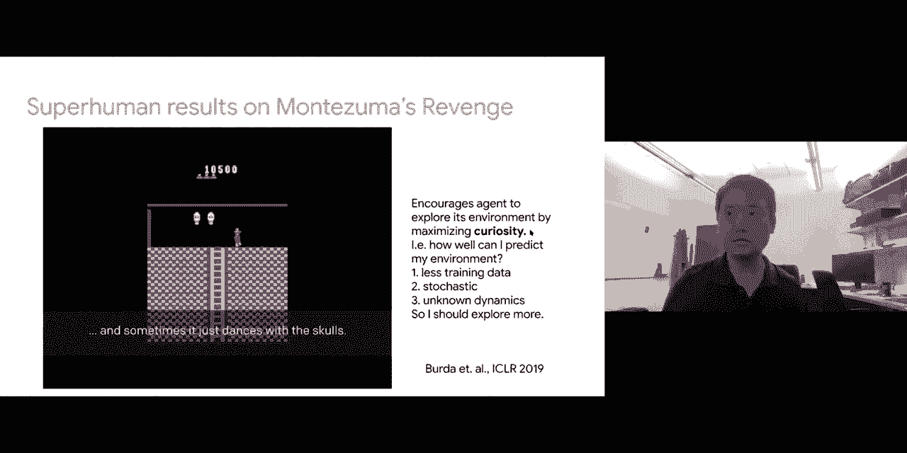

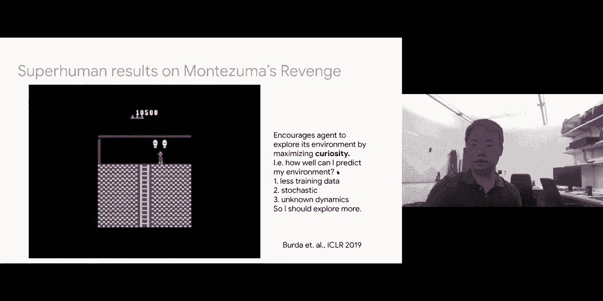

DQN在诸如Atari游戏等高维状态空间任务上取得了超越人类的性能，尤其是在奖励密集、需要快速反应的游戏上。然而，在需要长期规划、探索难度大的游戏（如蒙特祖马的复仇）中，传统DQN仍面临挑战，后续研究通过引入好奇心驱动等内在奖励机制来改善探索。

---

## 💬 强化学习与自然语言处理

强化学习与自然语言处理的结合是一个活跃的研究领域。主要可以分为两类：

1.  **任务无关方法**：任务本身不需要语言，但使用语言预训练的知识（如词向量）来辅助智能体理解环境中的物体（如“钥匙”、“梯子”）。
2.  **任务相关方法**：任务执行过程中依赖语言信息。
    *   **语言条件式**：任务由语言指令定义（如“去拿绿色的火炬”）。没有指令，任务就不成立。研究重点在于多模态（视觉-语言）对齐与融合。
    *   **语言辅助式**：没有语言指令也能完成任务，但语言提供了额外辅助信息，使任务更容易完成（如用语言描述游戏中的子目标）。

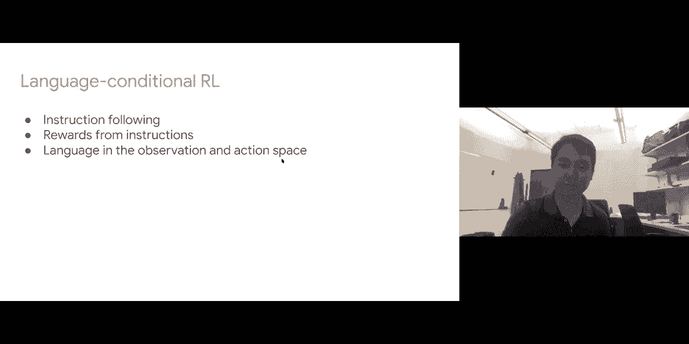

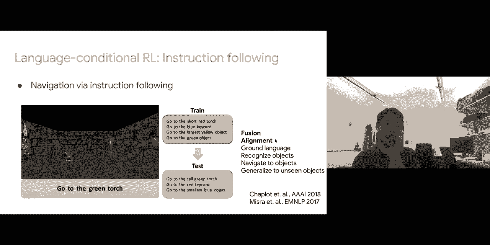

这些方法在视觉问答、指令跟随、复杂游戏探索等任务上展示了巨大潜力。

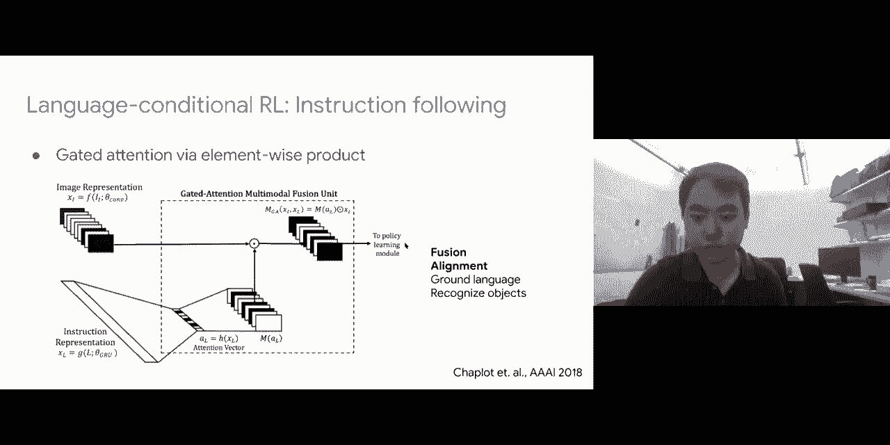


---

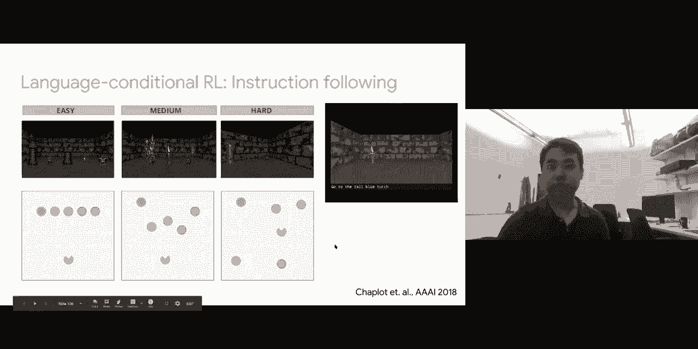

## 📝 总结

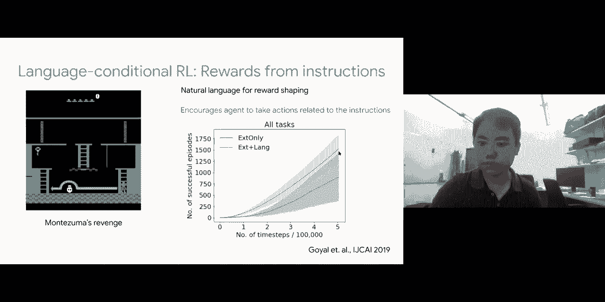

本节课我们一起学习了强化学习的基础知识：
1.  我们了解了强化学习的基本框架：智能体、环境、状态、行动、奖励。
2.  我们学习了用马尔可夫决策过程来形式化描述强化学习问题。
3.  我们定义了策略、状态价值函数和行动价值函数，并明确了最大化累积折扣奖励的目标。
4.  我们推导了贝尔曼期望方程和最优方程，它们是许多强化学习算法的基石。
5.  我们介绍了三种主要算法：
    *   **动态规划**（策略迭代、价值迭代）：适用于已知且规模小的MDP。
    *   **表格Q学习**：通过采样与环境交互，适用于未知但状态-行动空间离散且不大的MDP。
    *   **深度Q网络**：利用神经网络进行函数逼近，能够处理高维状态空间并具备一定的泛化能力，是深度强化学习的代表算法。
6.  我们简要探讨了强化学习在自然语言处理领域的应用前景。

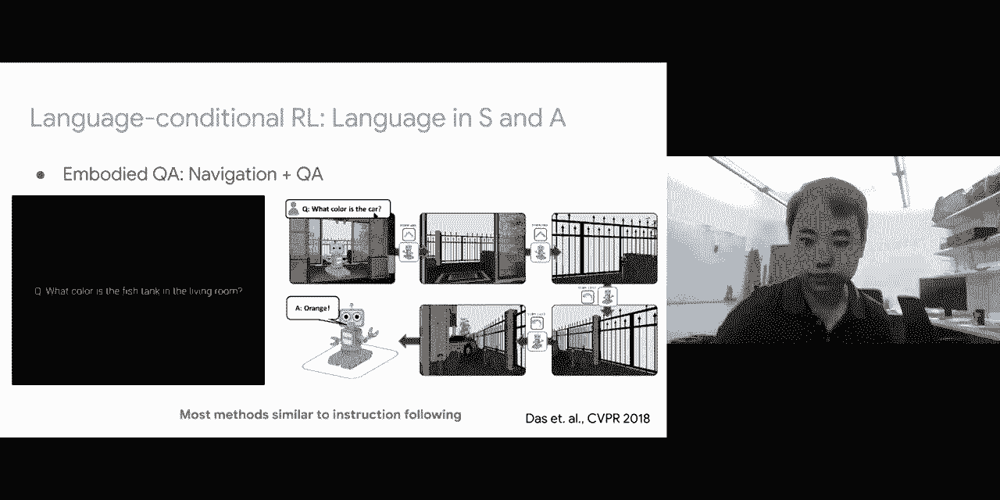


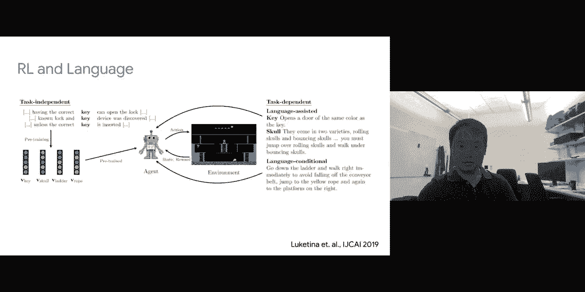

下节课我们将继续深入，学习策略梯度等更多强化学习算法，并进一步探讨其在多模态任务和文本生成中的应用。