# 16：L9.2 - 多模态强化学习 🧠🤖

## 概述

在本节课中，我们将深入学习多模态机器学习中的强化学习，并探讨如何将强化学习的思想应用于文本生成等涉及离散符号的任务。我们将从回顾上周的内容开始，逐步介绍基于策略的强化学习方法，并将其与基于价值的方法进行对比，最后探讨其在文本生成等领域的应用。

---

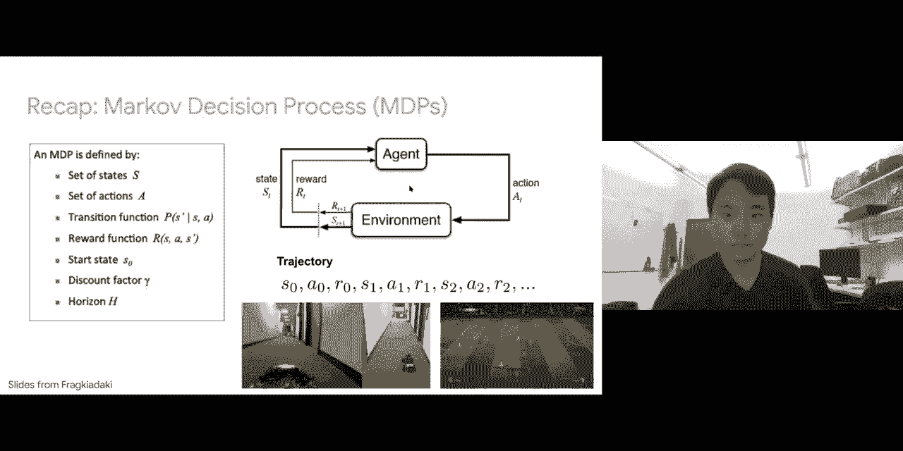

## 课程管理与回顾

上一节课我们介绍了深度生成模型及其在图像生成中的应用，但未涉及文本生成部分。本节课我们将完成对强化学习的讨论，并探讨如何利用强化学习的思想来生成离散的文本标记。

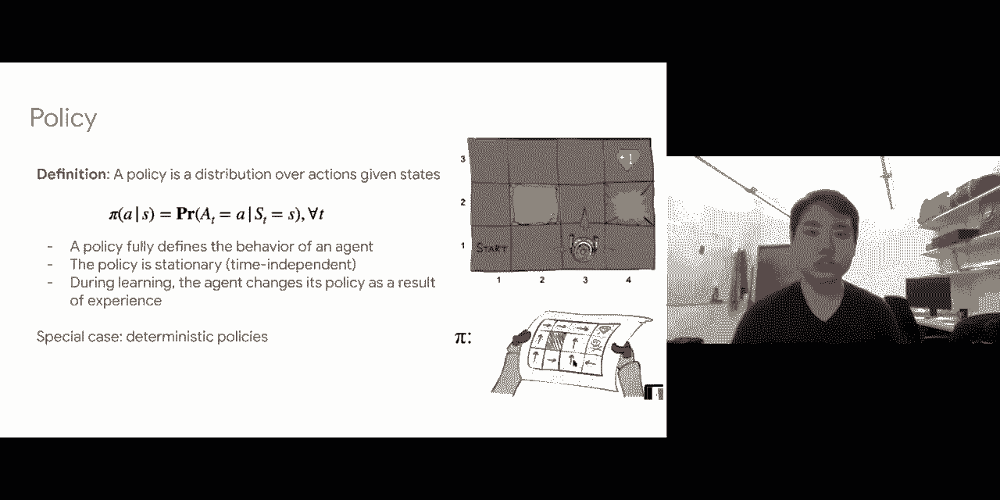

首先是一些课程管理事项。期中报告和期中演示的说明已在 Piazza 上发布。请注意，您需要先完成一个预先录制的演示，截止日期是 11 月 13 日（周五），大约还有两周时间。同时，您还需要撰写一份期中报告，截止日期大约在 11 月 15 日。请确保现在就开始着手准备这两项期中作业，不要拖延到最后一刻。期中报告的主要目标是针对您的问题实现一些多模态基线模型，并对这些模型进行深入的误差分析。

此外，Piazza 上还发布了关于阅读作业“通配符”的帖子。我们已经宣布项目作业可以使用通配符（即 24 小时免费延期），现在阅读作业也引入了这一机制。每位学生可以获得一张通配符，用于将一次阅读作业的截止日期延长最多 24 小时。请务必查看 Piazza 上的详细信息。

在讲座期间，欢迎随时在聊天区提问，我会实时查看。您也可以在 Piazza 上发布问题，其他助教也会跟进解答。

---

## 强化学习问题回顾

让我们开始今天的讲座。首先，感谢伯克利和卡内基梅隆大学的 DeepARA 课程提供的素材。我将从高层次介绍强化学习，并重点讨论其多模态应用。如果您想深入了解，我鼓励您查看其他大学开设的学期课程。

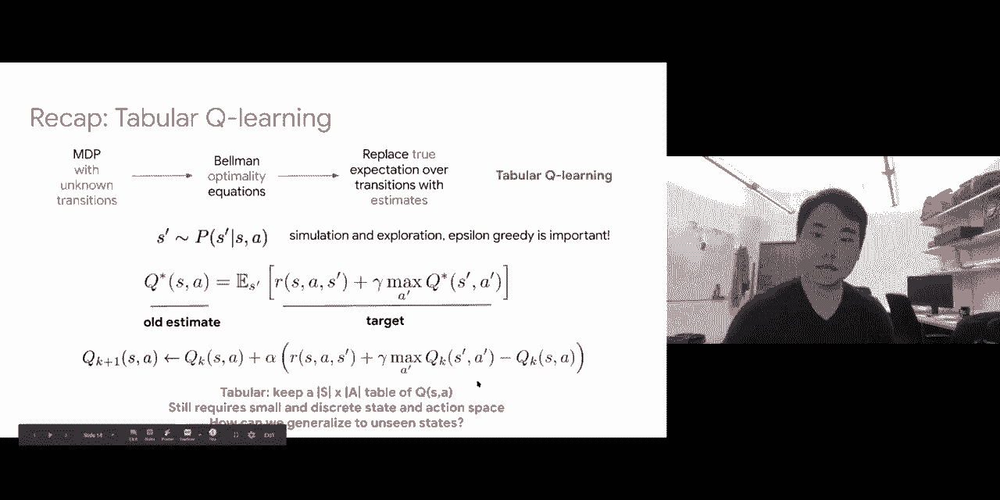

快速回顾一下上周的内容。我们探讨了强化学习问题：一个智能体处于某个环境中，从某个初始状态开始，持续采取行动、观察奖励并转移到下一个状态。这个状态、行动和奖励的序列被称为轨迹。

我们还回顾了强化学习的形式化定义：存在一组状态 **S**，智能体可以处于其中；智能体从一组行动 **A** 中采样行动；存在一个转移函数 **T(s'|s, a)**，它定义了在给定状态 **s** 和行动 **a** 时，转移到下一个状态 **s'** 的概率分布；以及一个奖励函数 **R(s, a, s')**，它定义了在状态 **s** 采取行动 **a** 并转移到状态 **s'** 时获得的奖励。智能体从某个初始状态开始，强化学习的目标是最大化长期累积折扣奖励。

我们看到了马尔可夫决策过程如何概括许多现实世界中的强化学习应用，例如机器人在环境中探索，或多智能体强化学习（如两名球员踢足球）。

---

## 目标与折扣因子

在强化学习中，目标是最大化长期累积奖励。在特定时间步 **t**，我们将其表示为 **G_t**，其计算公式为：

**G_t = R_{t+1} + γ * R_{t+2} + γ^2 * R_{t+3} + ...**

其中，**γ** 是折扣因子，用于对未来奖励进行折现。折扣因子 **γ** 的目的是确保在经验上和理论上都能构建策略并使其收敛。这个概念借鉴自经济学，即未来的货币价值会折现。

强化学习的目标是最大化总折扣奖励。这与监督学习的主要区别在于：监督学习只关心即时奖励，而强化学习关心长期折扣奖励。

回顾一下，折扣因子 **γ** 接近 0 意味着未来的奖励被大幅折现，智能体更关心短期奖励；而 **γ** 接近 1 意味着智能体更关心长期奖励，可能以牺牲短期奖励为代价。

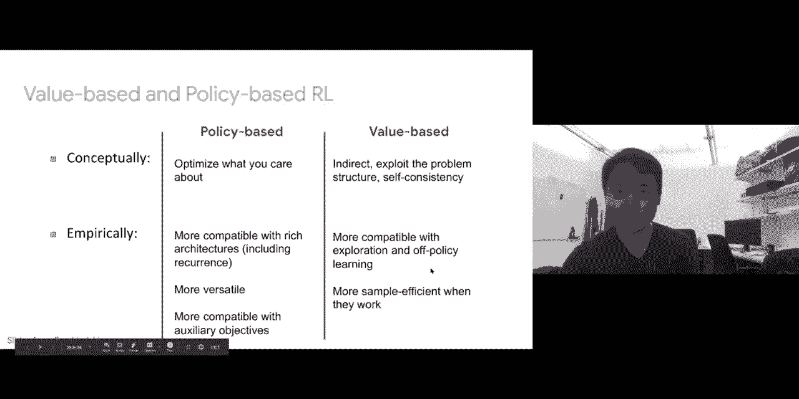

强化学习的整个目标是学习一个策略 **π(a|s)**，它描述了在给定状态 **s** 下采取行动 **a** 的概率分布。策略告诉我们在特定状态下应该采取哪些行动。

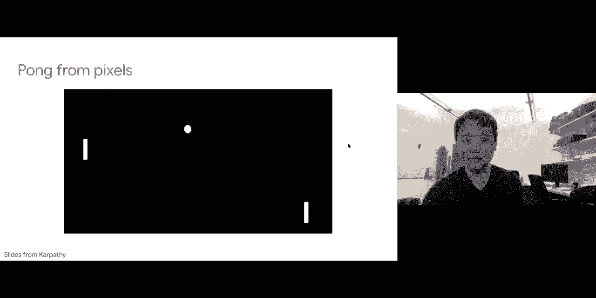

---

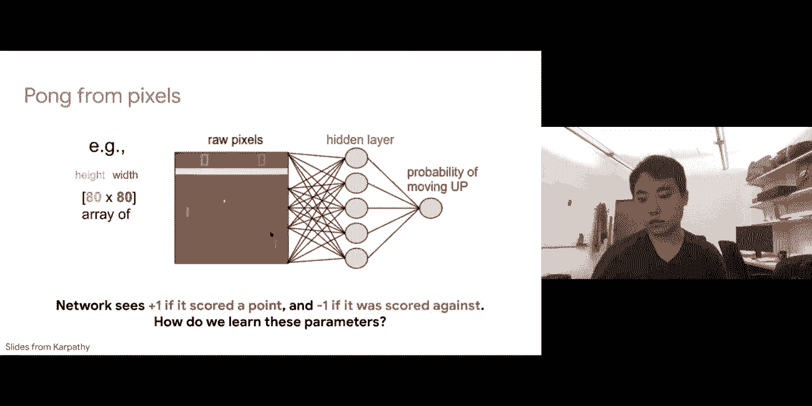

## 强化学习与监督学习的区别

以下幻灯片总结了所有内容：智能体处于某个环境中，MDP 中的重要术语是找到最佳策略，即对所有策略取 **argmax**，以最大化期望长期奖励。

上周二我们还探讨了强化学习与监督学习的主要区别：
*   强化学习涉及序列决策，允许查看累积奖励，而监督学习只关注单步决策和最大化即时奖励。
*   强化学习还会遇到稀疏奖励问题，即在很长的时间范围内采取多个行动，只在最后观察到奖励。而在监督学习中，每个预测都有密集的奖励。
*   在强化学习中，环境可能是未知的（例如 MDP 中的转移概率未知），而在监督学习中，环境（即您的预测集）总是已知的。

---

## 已知 MDP 的求解方法

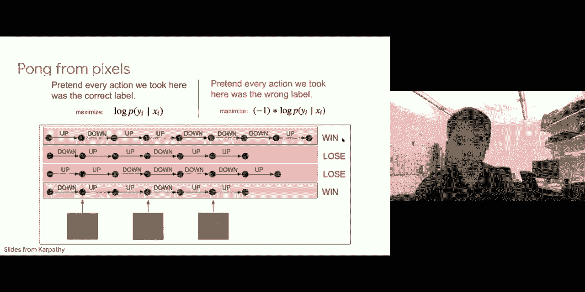

快速回顾上周二的内容。我们首先研究了完全已知的马尔可夫决策过程，即我们可以枚举所有状态，知道转移概率和奖励。我们推导了贝尔曼最优性和期望方程。这些方程涉及 **Q\*** 或 **Q_π**。

**Q\*(s, a)** 表示在最优策略下，从状态 **s** 采取行动 **a** 的期望长期奖励。
**V\*(s)** 表示从状态 **s** 开始，遵循最优策略的期望长期奖励。

这些是您想要计算的 MDP 的价值。我们展示了可以使用方程推导出这些最优性方程，将特定状态和行动的 **Q\*** 与未来其他状态和行动的 **Q\*** 联系起来。因此，我们可以优化我们的 **Q\*** 以符合这个最优性方程。

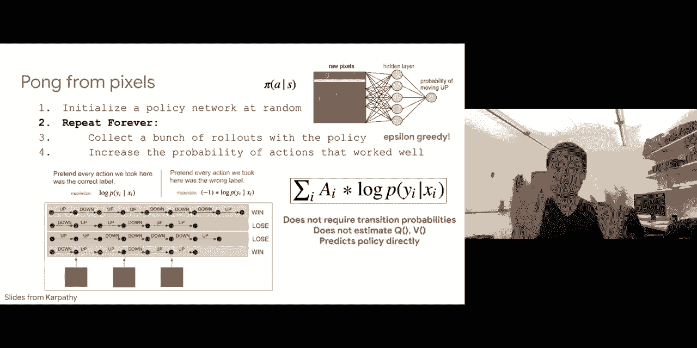

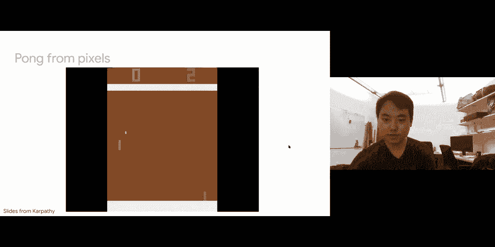

如果您处理的是最优性方程，则称为 Q 值迭代和价值迭代；如果您处理的是期望方程（即计算特定策略 **π** 下的 **Q_π** 或 **V_π**），则称为 Q 策略迭代或策略迭代。

我们展示了至少在可以完全枚举状态、精确计算转移期望的简单情况下，可以保证收敛到最优策略。但在现实世界中，这些假设并不成立。这只适用于小型离散状态和行动空间，不适用于高维状态（如图像）和连续行动。同样，它要求 MDP 中的转移概率已知，而这在现实世界中是无法获得的。

---

## 未知转移 MDP 与 Q 学习

为了放宽这个假设，我们研究了转移未知的 MDP。我们从贝尔曼最优性方程转向用近似期望（即下一个状态的样本）替换真实期望。换句话说，当您处于某个状态并采取特定行动时，您只需将其交给环境，观察环境返回的下一个状态，而无需知道确切的转移概率。

我们看到了探索环境的重要性，需要使用 **ε-greedy** 方法。即以 **ε** 的概率随机探索环境，而不是完全依赖当前策略，因为当前策略可能不好。

同样，一旦用样本替换了这个期望，您就想求解满足贝尔曼最优性方程的 **Q\***。您可以将右侧视为目标，左侧视为旧估计，计算差异，并希望更新 Q 值。问题在于，您必须分别保存所有 **Q(s, a)**，即维护一个具有 **S** 行和 **A** 列的表。这仍然需要小型离散的状态和行动空间，尽管现在您不需要使用真实的转移概率来计算期望，而是使用样本。

---

## 深度 Q 学习

下一个问题是如何将其推广到处理未见过的状态以及大型连续状态和行动空间。这就是为什么我们将表格 Q 学习扩展到深度 Q 学习。其思想是，不再为所有状态和行动维护一个 Q 值表，而是通过学习一个单一的权重函数（在实践中是一组神经网络参数）来分摊成本。这个网络接收状态 **s**，并预测所有可能行动的 **Q(s, a)**。

这样做的好处是，由于拥有强大的函数逼近器，如果您已经针对特定状态训练了模型来预测其 Q 值，那么对于非常相似的状态，您也可以通过函数逼近得到相似的 Q 值。因此，现在它可以处理高维状态空间（无论是卷积网络、循环模型还是 Transformer）。

优化思想相同：将右侧视为目标，左侧视为先前的估计。我们知道左右两侧的 **Q\*** 应该相等，因此可以计算差异并尝试使用梯度下降将其最小化到零。

我们发现这种简单方法可能存在样本相关性和非平稳目标的问题。我们还探讨了如何通过使用经验回放缓冲区来缓解这些问题：采样一小批不相关的转移，并固定一组权重（目标网络）来解决非平稳目标问题，只更新预测网络的权重，并每隔一定迭代次数（例如 1000 次）用最新的权重替换旧的权重。

这些都是周二讨论过的内容。这只是对深度 Q 学习的快速回顾：结合梯度下降、探索（ε-greedy）、经验回放和固定 Q 目标，这种方法可以处理高维状态和行动空间，并能泛化到未见过的状态。我们已经看到它至少可以用于 Atari 游戏等场景，其中图像作为状态输入。

---

## 从价值函数到策略

回顾一下我们目前所做的：我们研究了三种基本估计 **Q\*** 的方法。我们从策略迭代和价值迭代开始，精确求解；然后研究了 Q 学习，近似求解；最后是深度 Q 学习，进一步涉及深度网络。所有这些都是为了找到 **Q\***，即特定状态和行动的行动价值函数。

如果我们有了 **Q\***，我们知道可以通过 ε-greedy 方法获得最优策略：如果行动满足对所有行动的 **argmax**，则以高概率采取该行动；否则，以很小的概率随机采取行动。

同样，另一种方法是求解 **V\***（价值迭代）。我们也可以将 **Q\*** 和 **V\*** 联系起来。如果我们求解了 **V\***，我们也可以获得最优策略，但现在需要进行一步前瞻。换句话说，给定一个状态 **s**，我将对所有可能的行动取最大值，对于每个行动，计算对可能的下一个状态的期望（获得的奖励加上下一个状态的最优价值函数）。这允许我们计算每个行动的效用，满足 **argmax** 的行动将是最优策略采取的行动。

在周二讨论的所有方法中，我们将 **Q\*** 和 **V\*** 定义为获得策略之前的中间步骤。

---

## 基于策略的方法：直接优化策略

在今天的讲座中，我们将从另一个角度看待强化学习。我们将尝试直接优化策略，而不是先优化价值函数（**Q\*** 和 **V\***），然后再推导策略。我们将忘记所有这些 **Q\***、**V\*** 和 MDP，直接优化这个策略。我们将看看是否能为此推导出一些好的算法。

之后，我们将研究一组称为“行动者-评论家”的方法，它结合了上周二讲座和今天讲座的内容。然后，我们将探讨一些应用。

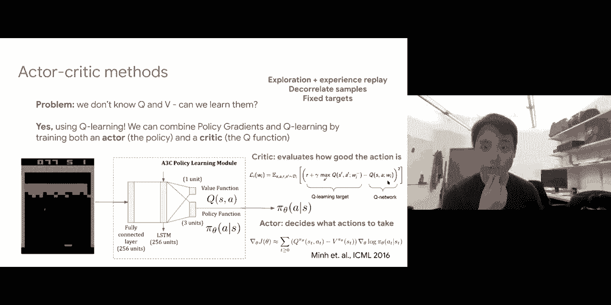

周二我们研究了所有这些状态价值函数和行动价值函数（V 和 Q），在获得这些最优的 V 和 Q 之后，我们再推导出策略。这通常被称为**基于价值的强化学习**，因为我们试图推导这些最优的状态和行动价值函数。

强化学习的另一个视角被称为**基于策略的强化学习**。换句话说，我们将完全忘记这些价值函数（Q 和 V），而是直接学习一个策略。

---

## 策略参数化与动机

那么策略会是什么样子呢？策略会接收一个状态，并尝试输出一组行动。通常，我们假设有一组参数化的策略，给定一个状态（例如图像），通过一系列神经网络参数 **θ**，输出行动的概率分布。

例如，在一个简单的上下移动游戏中，您可能只有一个输出神经元，代表向上移动的概率，而 1 减去该值就是向下移动的概率。在这种情况下，您完全不涉及 Q 和 V，只是直接通过一组参数将状态映射到行动。

为什么我们要这样做呢？有几个原因：
1.  通常，您的策略 **π** 可能比 Q 和 V 更简单。例如，训练机械臂抓取物体。如果要为机械臂定义 MDP，可能需要定义所有状态（所有关节的可能参数），您的 **Q(s, a)** 和 **V(s)** 可能维度非常高。但您的策略可以抽象所有这些低维状态，只定义一些高级语义策略，例如“张开手”或“闭合手”。因此，您可以训练一个只有两个输出神经元（张开手的概率和闭合手的概率）的模型。
2.  另一个问题是，对于 V 和 Q，一旦计算出来，在推导最优策略之前还需要额外步骤。对于 **V\***，您需要进行一步前瞻，如果可能转移到的下一个状态数量非常多，计算这个期望可能很困难。同样，即使计算一步前瞻不困难，您也需要对行动取 **argmax** 才能获得最佳策略，这对于连续和高维行动空间可能并不容易。

因此，有时直接优化策略比计算 **Q\*** 和 **V\*** 更有意义。这就是今天讲座的主要动机：周二我们研究了基于价值的方法，今天我们将深入基于策略的方法。我们将学习一个策略，并在讲座最后研究“行动者-评论家”方法，它结合了这两种思想。

---

## 价值方法与策略方法的权衡

显然，既然强化学习有基于价值和基于策略两个分支，那么必然存在一些权衡。

**概念上**：
*   基于策略的方法直接学习策略，优化您关心的目标。
*   基于价值的方法间接解决问题，因为它首先求解 MDP（这很好，因为它利用了问题结构），但在某种意义上，您是间接求解最优策略。

**经验上**：
*   基于策略的方法在实践中与深度网络更兼容，更通用、更灵活。我们还将看到如何将这些基于策略的方法扩展到强化学习之外的文本生成。
*   基于价值的方法更兼容探索（如定义 ε-greedy）、离策略学习，并且因为它们利用了 MDP 的问题结构，所以在有效时样本效率更高。

因此，两者之间存在一系列权衡。

---

## 基于策略的方法实践：Pong 游戏示例

现在让我们详细看看这些基于策略的方法具体如何工作。我们将看一个非常简单的游戏：Pong 游戏。对手控制一个球拍，您控制另一个球拍。目标是将球弹到对手区域，同时防止对手将球弹到您的区域。

这是一个非常简单的 Pong 游戏，我们将看看如何设计一个基于策略的方法来解决它。这个游戏基于原始像素运行：图像显示您和对手的得分、球拍位置以及球的位置。这是一个 80x80 的图像。

我们将定义一个模型（可以是神经网络或带有隐藏层的卷积模型），其参数为 **θ**，预测向上移动的概率。由于只有两个行动，您可以只定义一个神经元代表向上移动的概率，向下移动的概率则是 1 减去该值。

在这个游戏中，如果您成功将球弹过对手，则获得 +1 的奖励；如果球被对手弹过您这边，则获得 -1 的奖励。目标是如何学习这组参数 **θ**，使其能够规定一系列好的行动，从而赢得比赛。

---

## 从监督学习到策略梯度

现在假设为了简单起见，我们拥有训练标签。换句话说，给定所有状态 **x1, x2, x3...**，我们知道应该做什么。也许我们可以让人类专家来玩这个游戏，对于所有状态，给出获得奖励的完美行动序列。那么您可能会将这个问题视为监督学习问题：给定一些输入和人类专家给出的目标（应该向上还是向下移动），您将尝试最大化正确行动的对数概率。这简单地就是交叉熵损失，您将对数据点取平均，这将是您的目标函数，并使用基于梯度的方法求解。

但主要问题是我们没有标签，我们不想或没有人类专家为我们标注。那么问题是我们应该向上还是向下移动？我们应该采取什么行动？

让我们尝试根据当前策略行动。这个模型定义了一个策略，即给定状态下向上和向下的概率。我将遵循这个策略。也许在初始状态，它输出较高的向上移动概率，采样后您实际上向上移动，这使您进入一个新状态。给定这个新状态，我将其放回当前模型，模型描述当前策略，可能告诉我再次向上移动，依此类推。根据当前策略规定的一系列状态，您会采取一系列行动。

如果您回想一下，由当前策略定义的状态行动序列被称为轨迹。经过长时间的游戏，显然我们在强化学习中会遇到稀疏奖励问题：我们花费每个时间步，但在一系列步骤之后，也许我们最终观察到一些奖励。例如，经过六个步骤，您成功将球弹到对手一侧并获胜，获得 +1 奖励。

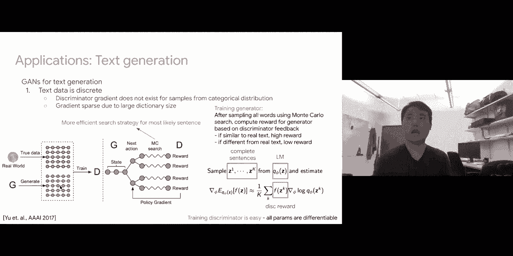

我将继续这样做：使用我的当前策略，最终获胜；重置初始状态，再次遵循策略，可能更快结束因为我输了；再试一次，输了；第四次，赢了。我可以根据当前策略收集许多这样的“回合”。

使用这些回合，我能做什么？我们知道，在这个行动序列中，我们最终获得了正奖励，所以我们知道它总体上是好的。同样，对于这个序列，我们最终获得了负奖励，所以我们知道它总体上是坏的。

我们要做的是假装对这个轨迹中采取的所有行动给予同等的功劳。对于获胜的轨迹，我将最大化再次看到相同状态时采取那些行动的对数概率，因为我知道那些是好的行动，过去采取它们让我获得了正奖励。另一方面，对于最终失败的轨迹，我会说在这些状态下采取这些行动最终导致了 -1 奖励，因此我将尝试降低未来采取这些行动的概率。换句话说，我将最大化 -1 乘以采取那些行动的对数概率。

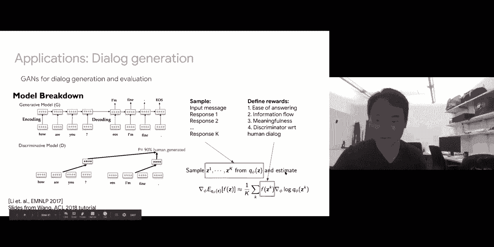

这非常直观，对吧？因为我们想在强化学习环境中工作，我们将结合折扣奖励。换句话说，我将对过去的奖励进行折现。对于最后一步采取的行动，我将用 -1 缩放；对于之前的行动，我将用 **γ** 折现（例如 -0.9，然后 -0.81，等等）。这将简单地修改我们的目标函数：您将尝试优化在给定状态下采取那些行动的对数概率，但现在奖励被缩放为 +1 或 -1，并乘以折扣因子。

---

## REINFORCE 算法

这提出了一个非常简单的算法。您定义一个策略 **π**，它接收状态，通过参数 **θ**，输出行动。您随机初始化策略网络（参数随机）。然后我将重复：使用该策略进行一系列回合（轨迹采样）。使用该策略，我将采样一系列行动，观察最终进入的状态和获得的奖励。我们知道，其中一些回合会获得高奖励的好行动序列，而另一些则会获得低奖励的坏行动序列。

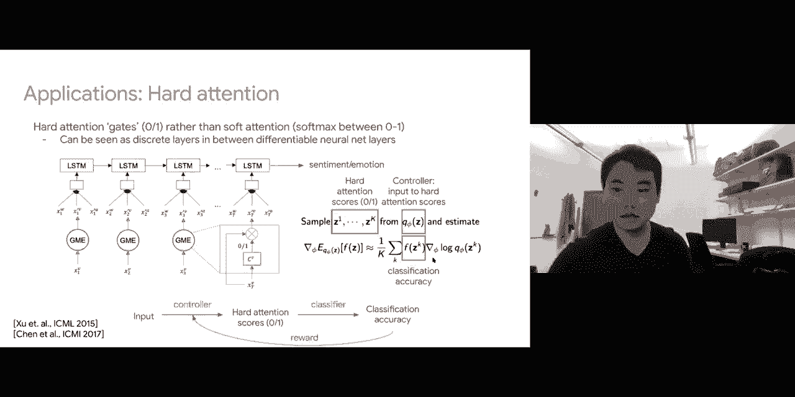

给定我采取的所有行动和获得的所有奖励，我将增加那些效果好的行动（即获得高奖励的行动）的概率，最大化所有这些行动的对数概率（带有折扣因子）。对于所有失败的回合，我将通过乘以 -1 和某个折扣因子来降低这些行动的对数概率。

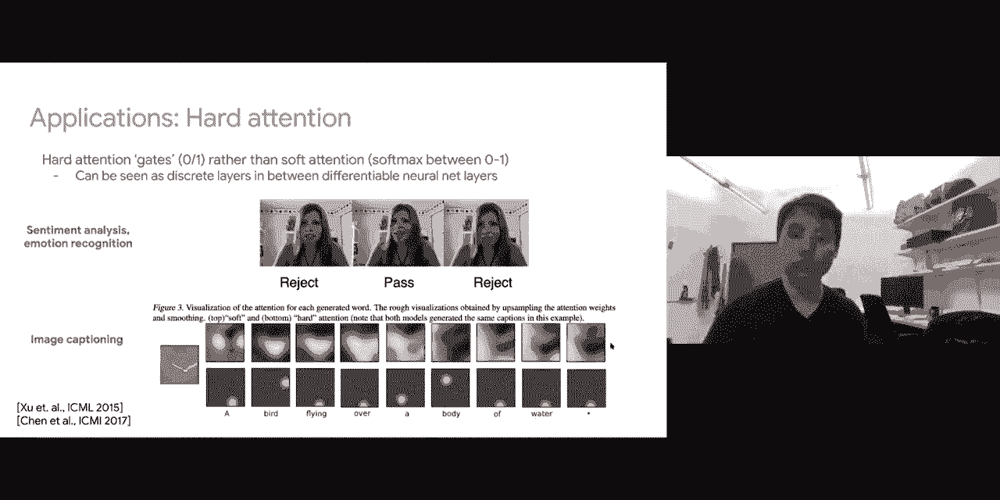

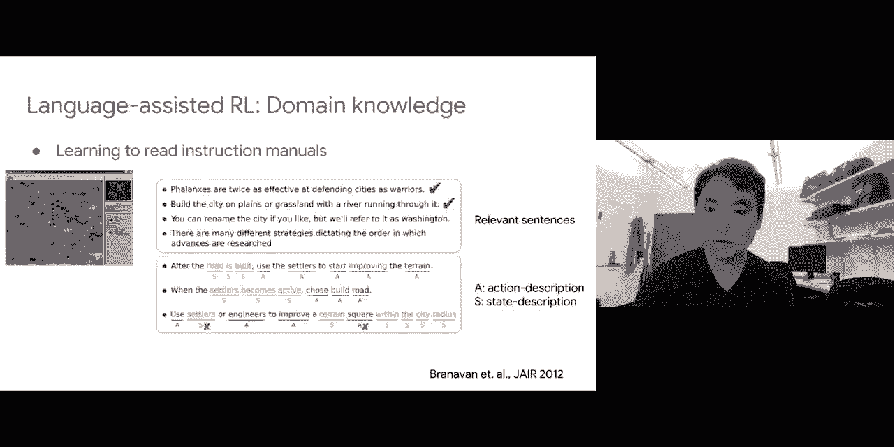

这提出了一个非常简单的算法。这里我们也可以加入 ε-greedy 探索：不是总是从当前策略中采样行动，而是保留 **ε** 的概率进行随机探索。

这种方法的一些好处是：它不需要转移概率（我们的 **Q\*** 或 **V\*** 最优性方程涉及转移概率和期望），它直接预测策略。这实际上是一个非常简单的算法。

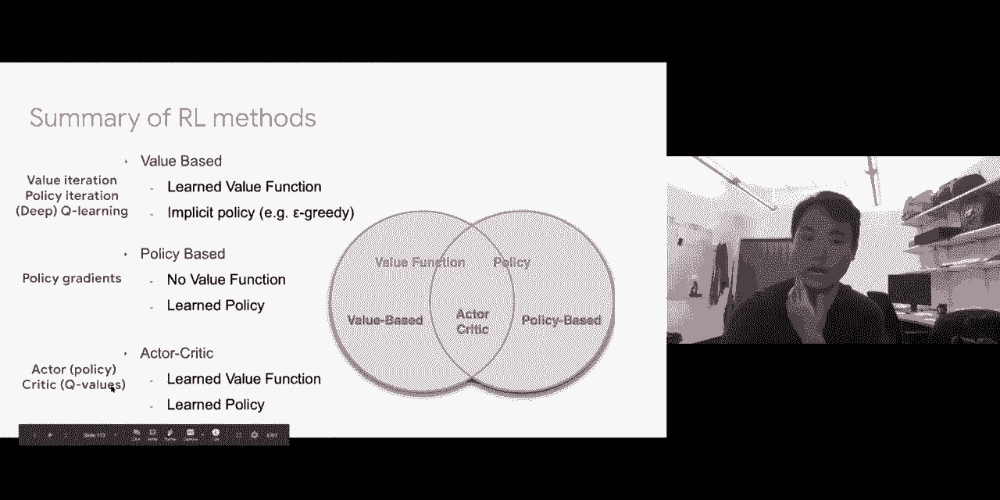

您可能会想，经过上周二推导 **Q\*** 和 **V\*** 的所有麻烦之后，如果这种方法效果很好，那将是一个惊喜，对吧？但在实践中，它确实有效。训练一段时间后，您可以看到智能体实际上表现得很好，能够持续击败对手。

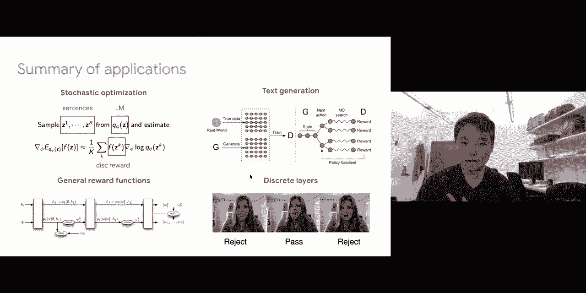

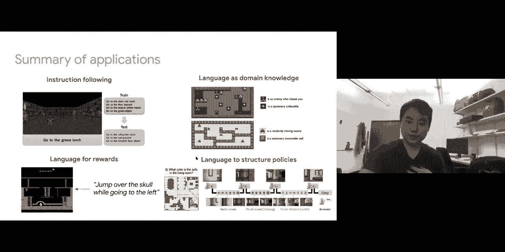

那么问题是：为什么这样一个简单的算法会有效？如果它真的效果这么好，为什么我们还要经历周二推导价值和策略迭代方法的所有麻烦？如果它有效，在什么场景下有效？在什么场景下这种方法可能存在缺陷？我们将更详细地研究这个方法，看看是否