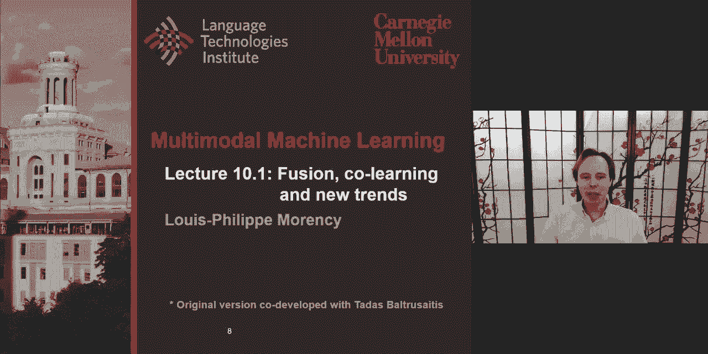
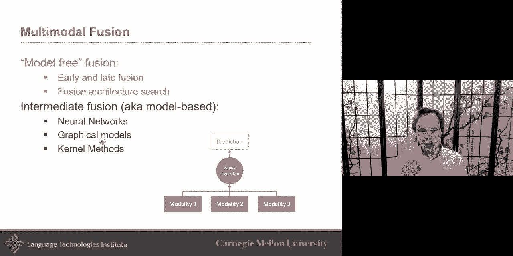
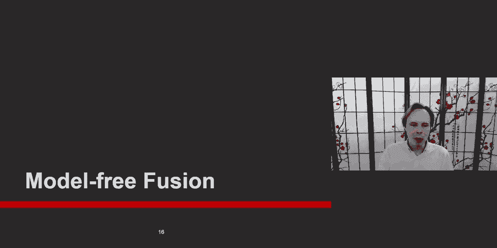
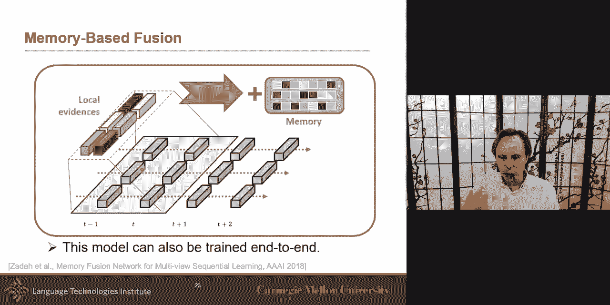
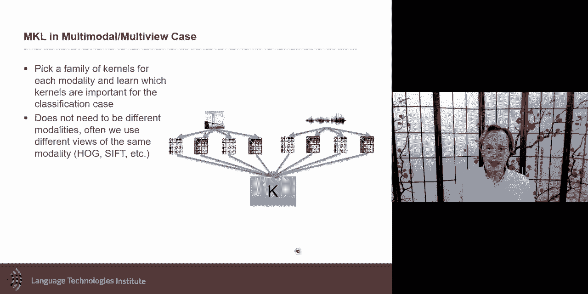
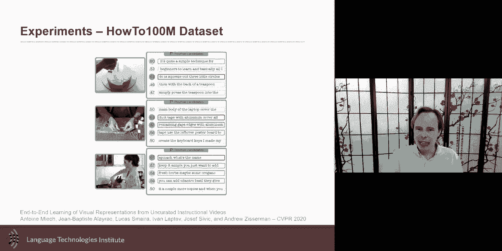
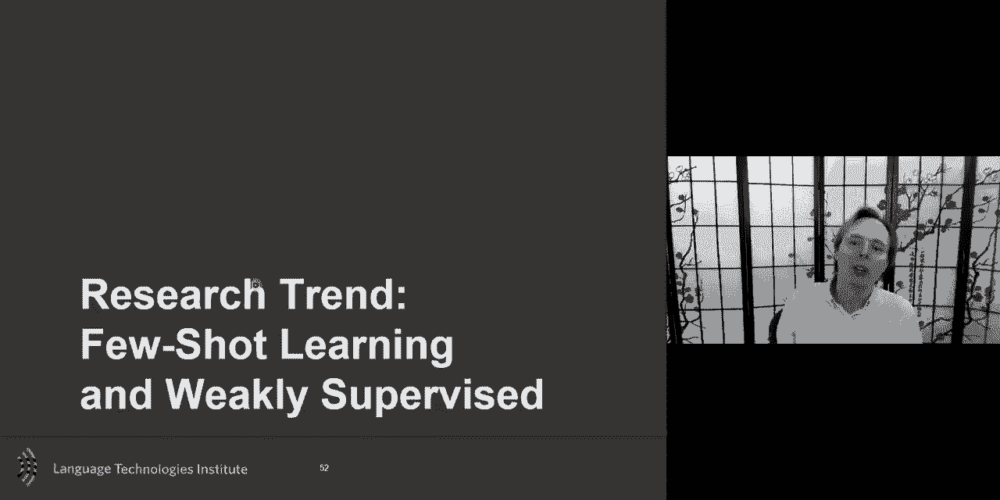
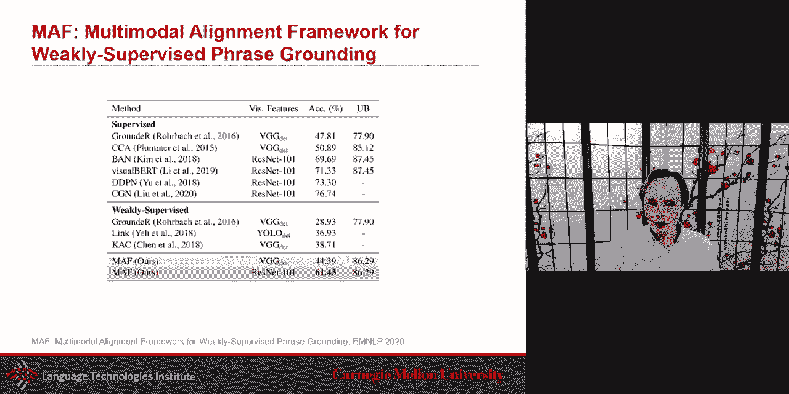

# 17：L10.1 - 融合、协同学习与新趋势 🚀



在本节课中，我们将要学习多模态机器学习中的融合与协同学习，并探讨该领域的一些新兴趋势。我们将首先回顾模型无关的融合方法，然后深入探讨基于核函数的局部融合，接着介绍协同学习的概念及其在强配对与弱配对数据下的应用，最后会简要介绍小样本学习和弱监督学习这两个新趋势。

## 多模态融合快速回顾 🔄

上一节我们介绍了多模态融合的基本概念。融合是指将两个或多个模态的信息结合起来，以执行某些预测任务的过程。例如，结合音频和视觉信息进行语音识别，或者结合声音和面部表情来推断情绪。



在之前的课程中，我们讨论了基于神经网络的融合方法和基于图模型的融合方法。本节课，我们将重点介绍**模型无关的融合**方法，并探讨**基于核函数的局部融合**。



## 模型无关的融合 🧩

模型无关的融合是早期多模态研究中的两种主要范式：早期融合和晚期融合。它们代表了融合过程的两个极端。

### 早期融合

早期融合的核心思想是在特征层面进行早期连接。

*   **方法**：将来自不同模态的特征向量在输入阶段直接拼接起来，然后输入到一个统一的分类器或回归器中进行处理。
*   **优点**：实现简单，可以直接利用现有的机器学习模型。分类器内部有望学习到不同特征之间的交互。
*   **挑战**：当特征维度很高或不同模态的特征粒度不一致时（例如，语言符号与视觉像素），模型学习可能变得困难。

**公式表示**：
假设有两个模态的特征向量 `x_a` 和 `x_v`，早期融合后的联合特征为：
`x_fused = concat(x_a, x_v)`

### 晚期融合

晚期融合的核心思想是让每个模态先独立地进行预测，然后在决策层面进行融合。

*   **方法**：为每个模态单独训练一个模型（分类器）。这些模型在各自模态上针对同一任务进行训练。训练完成后，固定这些单模态模型，设计一个融合机制来整合它们的输出，以做出最终决策。
*   **优点**：每个模态的模型可以独立训练，甚至可以利用不同数据集（例如，某些数据集只有文本，某些只有图像）。这提供了更大的灵活性。
*   **缺点**：流程多步，通常不是端到端训练。由于融合发生在高层表示之后，可能无法捕捉低层次的跨模态交互。

**代码表示（简单投票融合）**：
```python
# 假设有三个单模态模型的预测概率
pred_audio = model_audio(input_audio) # 形状: (batch_size, num_classes)
pred_visual = model_visual(input_visual)
pred_text = model_text(input_text)

# 晚期融合：平均投票
final_prediction = (pred_audio + pred_visual + pred_text) / 3
```

### 现代视角：神经架构搜索与中间融合

现代方法更倾向于“中间融合”，即在神经网络的中间层进行信息交互。一种有趣的方法是使用**神经架构搜索**来自动寻找最优的融合结构。

其基本思想是：
1.  将每个模态的处理网络视为由多个层组成的栈。
2.  融合单元可以连接任意两个模态的任意中间层。
3.  搜索空间随着层数和模态数指数级增长，直接枚举不可行。
4.  使用一个**代理模型**来预测不同融合架构的性能。先从简单的融合层级开始评估，用这些数据训练代理模型，然后让它指导对更复杂融合层级的搜索，逐步迭代。



这种方法不仅自动化了设计过程，还带来了一定程度的可解释性，例如，可以揭示是早期特征还是晚期特征对融合更重要。


## 基于核函数的局部融合 ⚙️

现在，让我们从局部融合的角度，重新审视一些流行的模型，特别是**自注意力机制**和**Transformer**。我们可以将它们核心的相似度计算部分视为一种**核函数**。

### 核函数简介

核函数是一种衡量两个数据点相似度的函数。其关键思想是，通过一个映射函数 `φ` 将数据从原始空间转换到另一个高维（甚至无限维）特征空间，然后在该空间计算内积相似度。

**核技巧**在于，我们无需显式计算复杂的映射 `φ(x)`，而可以直接通过一个核函数 `K(x, y)` 计算出在高维空间的内积结果。

**常见核函数示例**：
*   线性核：`K(x, y) = x^T y`
*   径向基函数核：`K(x, y) = exp(-γ * ||x - y||^2)`

### 将Transformer注意力视为核函数

在Transformer的自注意力机制中，计算注意力权重的关键步骤是计算查询向量 `q` 和键向量 `k` 的相似度。

**标准Transformer中的相似度计算**：
`相似度(q, k) = softmax( (q * W_q) * (k * W_k)^T / sqrt(d_k) )`
其中，`q * W_q` 和 `k * W_k` 是线性投影。点积操作 `(q * W_q) * (k * W_k)^T` 本质上就是一种线性核。

通过这个视角，我们可以思考：对于多模态数据，查询和键可能来自不同模态，具有异构性。标准的点积相似度（线性核）可能不是最优的。

**改进思路**：我们可以用更复杂的核函数来替换标准的点积，以更好地捕捉跨模态的相似性关系。例如，一些研究尝试使用高斯核（RBF）的变体，或者在计算注意力时，对位置编码的相似度也使用独立的核函数进行处理。实验表明，即使是在机器翻译这样的单模态任务中，改进相似度核函数也能带来性能提升。

### 多核学习用于晚期融合

核函数的理念也可以直接应用于晚期融合。**多核学习** 方法为每个模态（或模态内的不同方面）分配一个或多个核函数，然后学习这些核函数的最佳组合，以构建一个跨模态的联合相似度度量或分类器。

这启发了我们，在多模态融合中，相似性可以从多个角度衡量（例如，句法相似性、语义相似性、情感相似性），而核函数提供了形式化这些度量的强大工具。




## 协同学习 🤝

协同学习是多模态机器学习的第五大挑战，其核心思想是**利用一个模态的知识来帮助另一个模态的学习**。即使在测试时可能只使用一个模态，训练时利用的跨模态知识迁移也能提升该模态模型的性能。

根据模态间数据的配对强度，协同学习可分为两类。

### 强配对数据下的协同学习

强配对数据指每个数据样本在不同模态间都有精确的对应项（例如，一张图片及其对应的详细描述）。

**示例：利用视觉属性改进词嵌入**
*   **目标**：学习更好的词向量表示。
*   **方法**：许多词的含义包含视觉或物理属性（如“柔软”、“粗糙”），这些属性在纯文本的上下文共现中难以充分学习。我们可以利用已标注的“词-视觉属性”配对数据，在训练词嵌入时，通过一个双线性模型等结构，将视觉属性信息融入词向量的学习过程中。这样得到的新词向量能更好地编码视觉相关的语义属性。

**示例：通过视觉进行语音情感编码的循环一致学习**
*   **目标**：从语音中学习更好的情感表示。
*   **方法**：训练一个编码器-解码器框架。编码器将语音编码为一个表示，这个表示要能同时完成两个任务：1）重构输入语音；2）预测与之同步的面部表情（视觉模态）。关键是要引入**循环一致性损失**，即从预测的面部表情再解码回的语音也应接近原始语音。这确保了学习到的语音表示是信息丰富的，而不仅仅是面部表情的“转码器”。测试时，仅用语音即可进行情感分析，并且性能可能超过同时使用多模态输入的模型。

### 弱配对数据下的协同学习

弱配对数据指模态间存在关联，但不是精确对齐（例如，一个教学视频和它的整体解说文本，但不知道每一句话具体对应哪一帧画面）。

**示例：教学视频中的自监督对比学习**
*   **挑战**：视频片段与语音解说在时间上未精确对齐。
*   **方法**：采用**多示例学习**和**对比学习**框架。
    *   将一个短视频片段视为一个“包”，将一段时间窗口内的所有语音句子视为该包的“实例”。
    *   假设至少有一个句子实例是与视频内容相关的。
    *   目标是通过对比学习，拉近视频表示与其相关句子表示的距离，同时推远它与不相关句子表示的距离。
*   **优势**：这种自监督方式无需人工标注对齐数据。学到的视频表示不仅能用于跨模态检索，还能提升纯视觉下游任务的性能，体现了协同学习的知识迁移本质。

## 新趋势展望：小样本学习与弱监督学习 🌟

最后，我们简要介绍两个与协同学习紧密相关的新趋势。

### 小样本/零样本学习



*   **核心问题**：如何让模型在只看到极少（小样本）甚至没有（零样本）某个类别示例的情况下，识别该类别。
*   **多模态的作用**：利用其他模态的知识进行迁移。例如，在零样本学习中，通过类别的语言描述（属性、定义）来建立视觉类别与已见类别之间的联系，从而识别未见过的视觉对象。
*   **进阶研究**：结合元学习与多模态。例如，让智能体在强化学习环境中，通过语言指令快速学习操作新物体。模型采用“慢速”和“快速”两种权重，慢速权重从大量任务中学习通用知识，快速权重则根据新任务的语言指令进行快速适配，实现小样本下的高效学习。



### 弱监督学习

*   **核心问题**：如何使用不完整、不精确或噪声较大的标注进行学习。
*   **多模态应用示例**：短语定位。给定一张图片和一段描述性文本，目标是确定文本中每个短语对应图片中的哪个区域。强监督需要标注每个短语的边界框，成本高昂。弱监督方法则只提供图片-文本对，不提供短语-区域的对齐信息。
*   **方法**：一种方法是利用对比学习。通过建模短语和图像区域之间的相似性，在训练中拉近匹配的短语-区域对，推远不匹配的对。这可以看作是一种在两种模态间进行细粒度对齐的协同学习，最终能学到更好的视觉和语言表示。

## 总结 📚

本节课我们一起深入探讨了多模态机器学习中的融合与协同学习。

*   我们回顾了**模型无关的融合**，包括早期融合和晚期融合，并介绍了利用神经架构搜索自动化设计融合结构的方法。
*   我们从**核函数**的视角重新审视了Transformer等模型中的注意力机制，理解了局部融合的相似度计算本质，并探讨了改进多模态相似度计算的可能。
*   我们重点学习了**协同学习**，了解了如何利用强配对或弱配对数据，将一个模态的知识迁移到另一个模态，以提升模型性能，特别是在数据稀缺或测试时模态不全的场景下。
*   最后，我们展望了**小样本学习**和**弱监督学习**这两个与协同学习密切相关的新兴趋势，看到了多模态技术在这些前沿方向上的应用潜力。



这些内容展示了多模态机器学习如何通过巧妙地结合不同模态的信息，来构建更强大、更灵活、更具通用性的AI系统。