# 18：L10.2 - 多模态机器学习的新研究方向 👨‍🔬

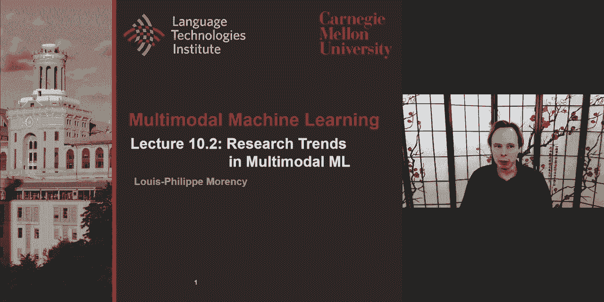

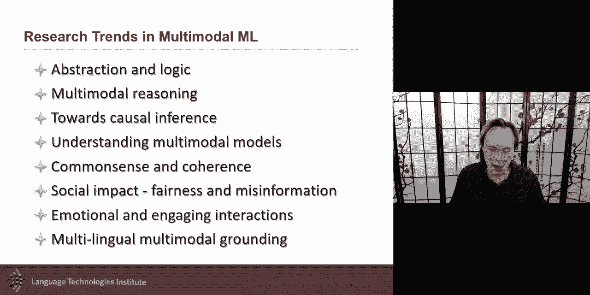

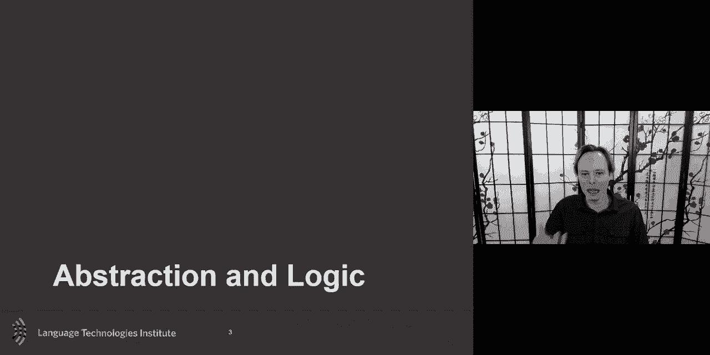

在本节课中，我们将探讨过去一年中多模态机器学习领域涌现的一些新研究趋势。我们将介绍八个主要方向，并为每个方向提供两篇代表性论文作为示例。这些趋势涵盖了从抽象推理、因果推断到模型理解、社会影响等多个方面，旨在帮助初学者了解该领域的前沿动态。

## 1. 抽象与逻辑推理 📊

上一节我们概述了课程内容，本节中我们来看看第一个趋势：抽象与逻辑推理。这一趋势的核心是，研究者们正重新审视如何将密集的神经表示与更离散、可解释的符号化知识（如知识图谱）相结合，以进行更复杂的推理。

其核心思想是，将原始的高维数据（如图像和文本）转化为更结构化的表示（如场景图），然后在这些结构化表示上进行逻辑推理。这有助于模型更好地泛化到新的、未见过的任务表述方式。

以下是实现这一思路的关键步骤：

*   **图像结构化**：首先，将图像转化为结构化表示，例如场景图。这通常涉及检测图像中的对象，并识别对象之间的关系。
    *   **对象检测**：识别图像中的实体（如“男孩”、“咖啡机”）。
    *   **属性关联**：为每个实体关联一组可能的属性（如“棕色”、“红色”），这可以看作是一个概率分布。
    *   **关系识别**：定义实体之间的可能关系（如“在...右边”、“在...里面”），并计算这些关系存在的概率。
*   **文本结构化**：同时，将自然语言问题也转化为结构化的指令序列，例如通过句法分析将其分解为短语或操作。
*   **基于状态的推理**：将生成的结构化图视为一个状态机。模型根据文本指令，逐步遍历这个状态机（图），每一步都基于当前节点和指令决定下一个状态（节点），最终得出答案。

**公式/代码示意**：推理过程可以形式化为在状态机 `G`（场景图）上，根据指令序列 `I` 进行状态转移，最终到达答案节点 `A`。
```
状态 S_t = (节点 N_t, 指令 I_t)
下一个状态 S_{t+1} = Transition_Network(S_t, G)
答案 A = Node_Representation(S_final)
```

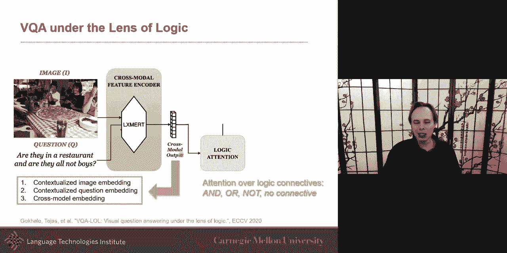

这种方法的一个优势是能提高模型对问题表述变化的鲁棒性（例如，处理否定或不同句式），因为它学习的是在抽象表示上的操作，而非依赖于数据中的表面相关性。

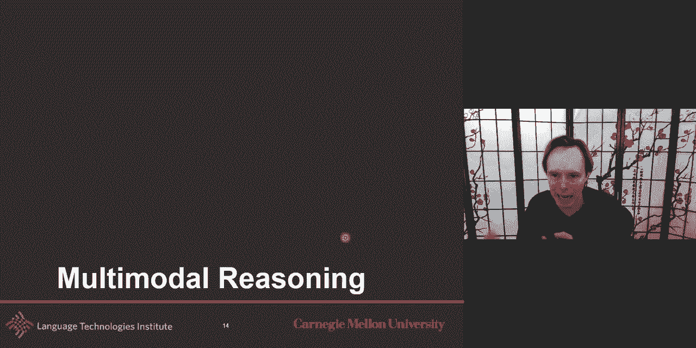

## 2. 因果推断 🔗

在了解了基于抽象表示的推理后，我们转向另一个深刻影响模型性能和理解的方向：因果推断。因果图是分析多模态任务中变量间因果关系的有力工具。

一个典型的视觉问答（VQA）或视觉对话任务可以建模为包含问题 `Q`、图像 `I`、历史 `H` 和答案 `A` 的因果图。当前许多模型隐含的因果假设是：`Q`、`I`、`H` 共同导致一个更好的图像表示 `V`，进而与 `Q`、`H` 一起导致 `A`。

然而，数据中可能存在**混淆变量**，导致模型学到虚假关联而非真正的因果关系。例如：
*   **历史长度偏差**：在视觉对话中，如果模型在预测答案时直接使用历史 `H`，它可能仅仅学会生成与历史回答长度相似的答案，而不是基于问题内容。
*   **标注者偏差**：问题和答案可能由同一位标注者创建，导致答案风格与问题存在虚假关联，而非由问题内容本身决定。

研究通过显式地对这些混淆变量建模或移除虚假的因果链接，来迫使模型学习更真实的因果关系。例如，一篇论文通过移除从历史 `H` 到答案 `A` 的直接链接，并引入一个代表混淆因素的潜在变量，从而减少了模型对历史长度的依赖，提升了泛化能力。

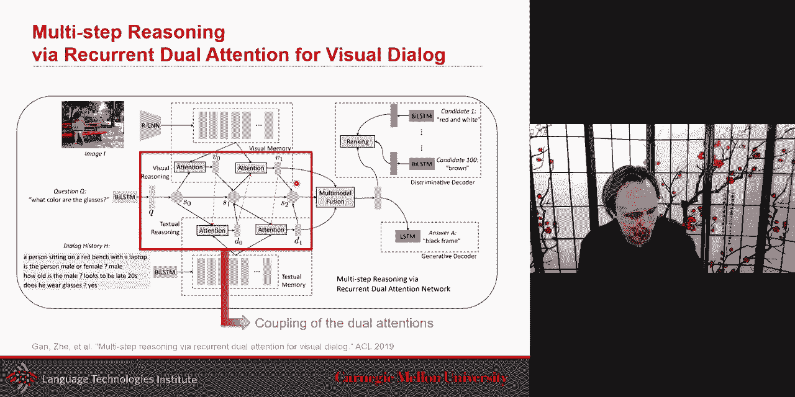

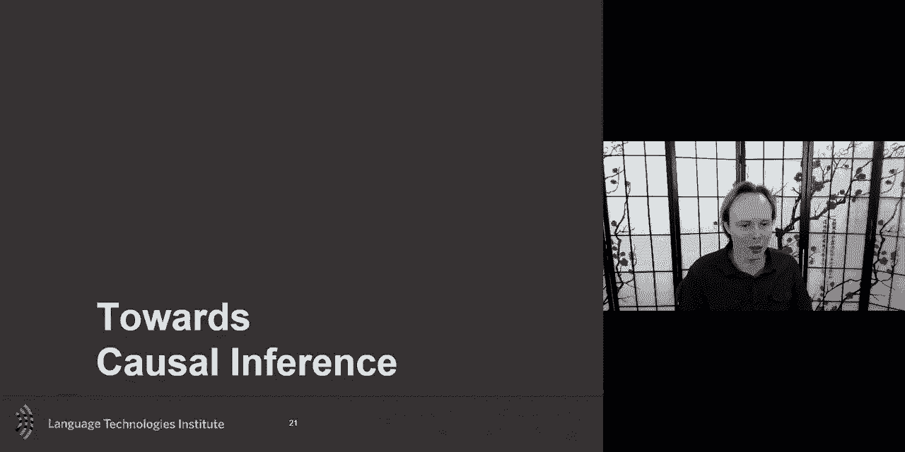

## 3. 理解多模态模型 🧠

既然我们讨论了模型可能存在的偏差，接下来自然要问：我们如何更好地理解多模态模型为何有效或失效？这一研究方向旨在诊断和改进模型的训练与泛化。

一个反直觉的现象是，在多模态学习中，简单地融合更多模态的信息并不总是带来性能提升，有时甚至会导致更严重的过拟合。

以下是导致这一问题的两个可能原因及解决方案：

*   **过拟合与泛化失衡**：不同模态的过拟合和泛化速度可能不同。使用单一的优化策略联合训练所有模态可能不是最优的。
*   **解决方案：动态调整训练**：一篇论文提出计算每个模态的“过拟合-泛化比率”（OGR），即验证损失与训练损失之间的差距变化率。这个比率反映了该模态的过拟合程度。在训练多模态模型时，同时并行地训练每个单模态模型，利用单模态模型的 OGR 来动态调整多模态训练中对应模态的学习率或关注度，从而更平衡地优化所有模态。

## 4. 常识推理 🧩

多模态系统要真正理解世界，需要具备常识。常识推理研究关注如何让模型掌握关于物理世界和社会互动的基本知识。

例如，在情感分析对话中，仅仅根据当前文本上下文可能不足以准确判断说话者的情感或意图。模型需要结合常识：如果一个人之前很悲伤，然后被嘲笑，他更可能变得愤怒。

一篇相关的研究通过扩展数据集，不仅标注对话中的情感，还标注了话语的**意图**（如“讽刺”、“安慰”）和可能引发的**听者反应**。模型在预测时，不仅考虑上下文，还利用外部常识知识库（如 COMET）来推断当前话语对对话双方心理状态的影响，从而做出更符合人类常识的判断。

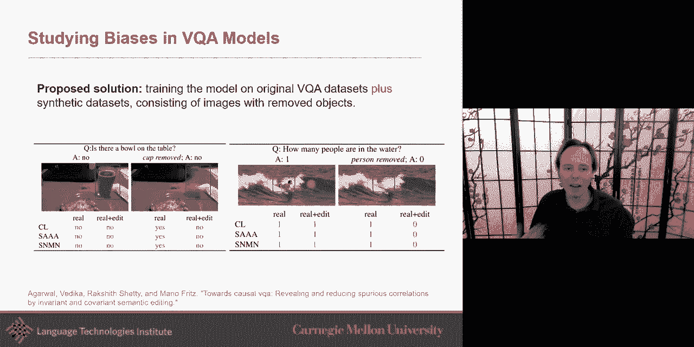

## 5. 社会影响：公平性与虚假信息 ⚖️


构建强大的多模态模型也带来了重大的社会责任。我们必须关注其社会影响，特别是公平性和虚假信息问题。

*   **公平性与偏见**：多模态模型可能从训练数据中学习并放大社会偏见（如性别、种族偏见）。例如，一个根据视频内容筛选简历的系统，如果训练数据存在偏差，可能会对特定群体产生不公平的结果。研究社区正在创建带有偏见标注的数据集，并开发方法来检测和缓解模型中的偏见。
*   **虚假信息检测**：“假新闻”通常结合具有误导性的文本和图像/视频来传播。多模态虚假信息检测旨在识别这种跨模态的不一致或欺骗性内容，是当前一个非常重要且活跃的研究领域。

## 6. 参与度与多文化性 🌍

最后，我们来看看如何让多模态系统更具吸引力和包容性。

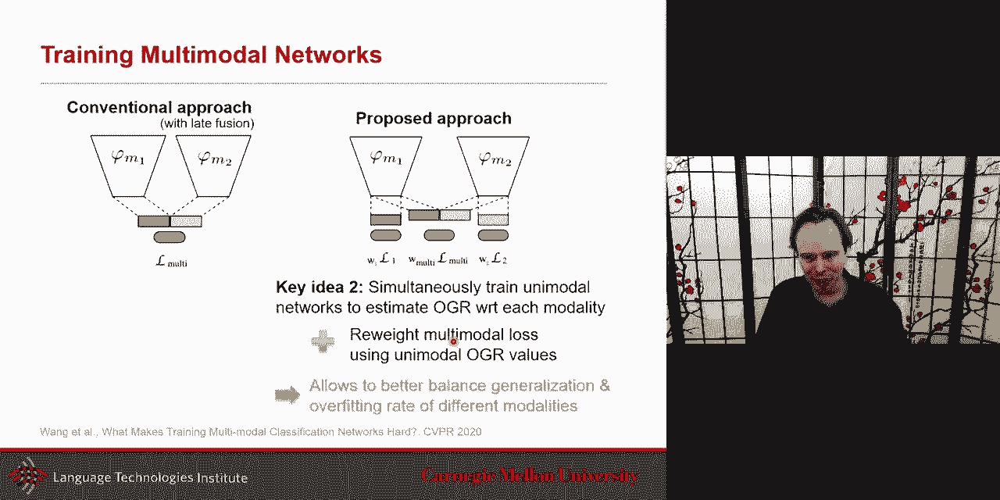

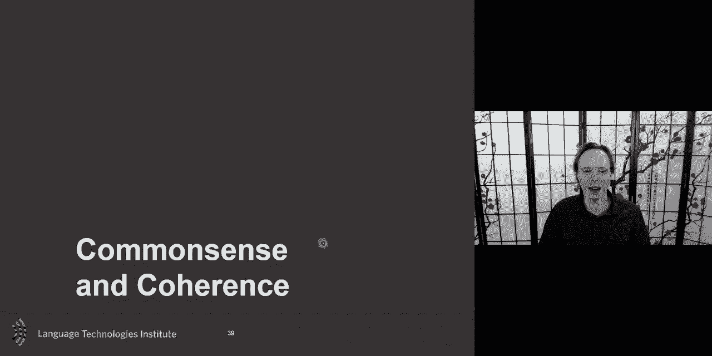

*   **情感与参与度**：通过识别和生成富有情感的内容（如带有情感的对话、故事生成），可以使多模态系统与用户的互动更加自然和吸引人。
*   **多语言与多文化性**：目前大多数多模态研究集中在英语等少数语言上。一个重要趋势是开发支持多种语言和文化背景的多模态系统，确保技术成果能够惠及全球更广泛的用户群体，并理解不同文化语境下的表达差异。

---

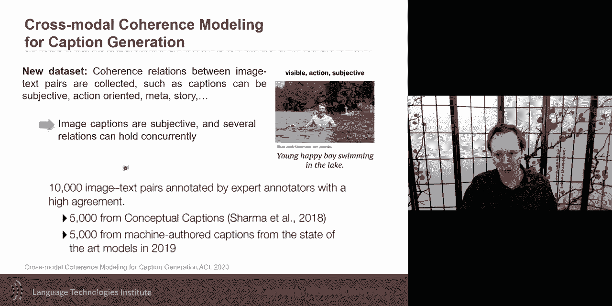

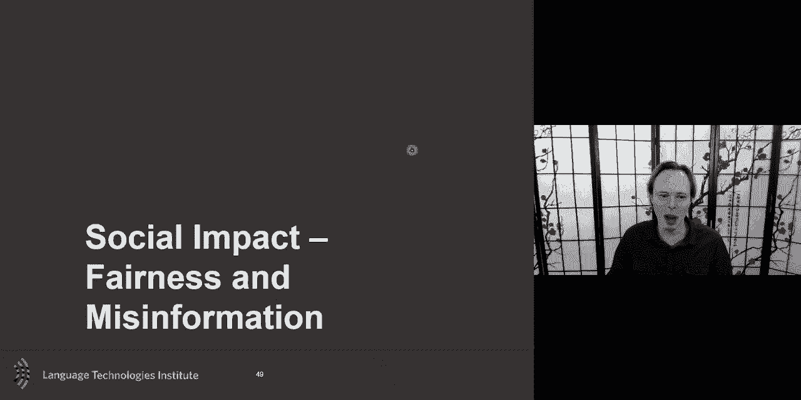

**总结**：本节课我们一起学习了多模态机器学习领域的八个新兴研究方向：
1.  **抽象与逻辑推理**：结合神经表示与符号化知识进行可解释的推理。
2.  **因果推断**：使用因果图分析并改善模型，避免学习虚假关联。
3.  **模型理解**：诊断多模态训练中的过拟合问题，并动态调整优化策略。
4.  **常识推理**：让模型掌握关于世界的基本知识，以进行更深层次的理解。
5.  **社会影响（公平性）**：检测和缓解模型中的社会偏见。
6.  **社会影响（虚假信息）**：识别跨模态的误导性内容。
7.  **情感与参与度**：构建更具情感交互能力的系统。
8.  **多语言与多文化性**：开发包容性的、支持多种语言文化的模型。

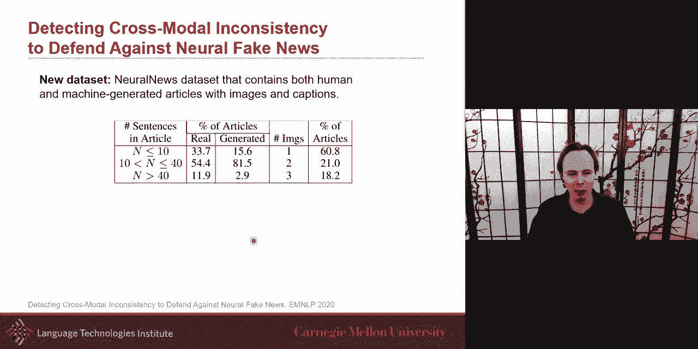


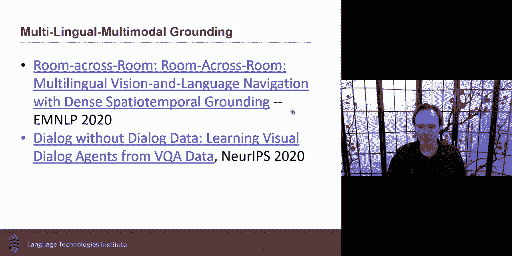

这些方向展示了多模态机器学习正朝着更鲁棒、更可解释、更负责任且更通用的方向发展。希望本课能为你探索该领域的前沿工作提供一个起点。