# 1：课程导览与安排 📋

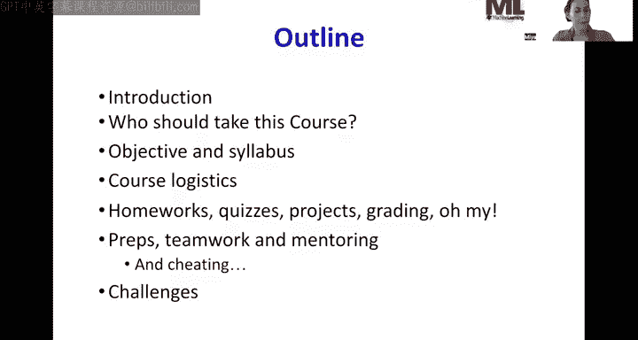

在本节课中，我们将学习卡内基梅隆大学《深度学习导论》课程（2024年秋季）的整体安排、课程目标、评估方式以及学习准备。我们将了解神经网络的基本概念、课程结构、作业与项目要求，以及如何有效地参与课程学习。

---

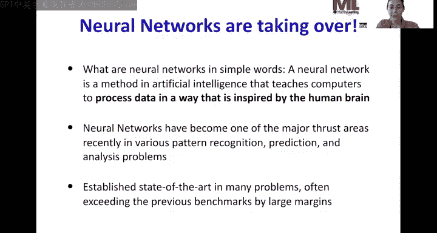

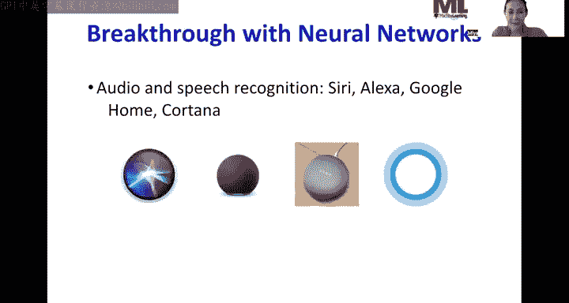

## 什么是神经网络？🧠

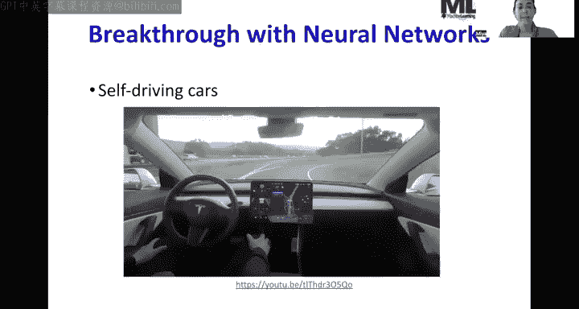

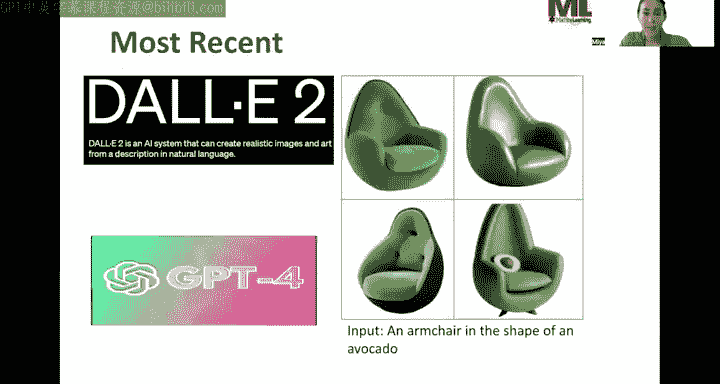

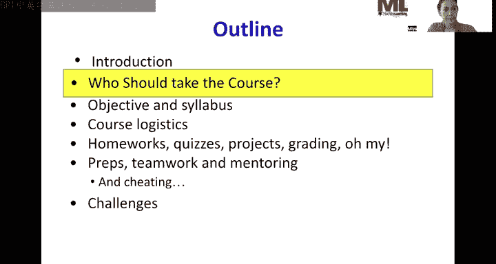

神经网络是人工智能中的一种方法，它教会计算机以受人类大脑启发的方式处理数据。近年来，它已成为各种模式识别、预测和分析问题的主要研究方向之一。神经网络在许多问题上确立了最先进的技术水平，并且常常大幅超越之前的基准。

上一节我们介绍了神经网络的基本定义，本节中我们来看看神经网络带来的一些突破性应用。

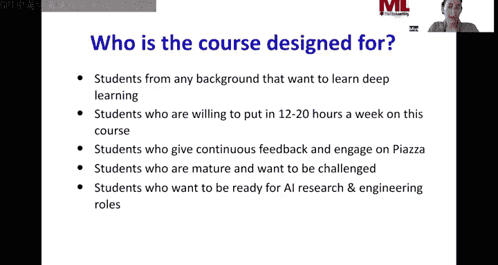

以下是神经网络取得突破的一些领域：
*   **语音助手**：例如 Siri、Alexa、Google Assistant。
*   **视觉与感知**：例如人脸检测、人脸识别、物体检测、语义分割。
*   **自动驾驶汽车**。
*   **音乐生成**。
*   **图像生成（如DALL-E）** 以及 **ChatGPT**。

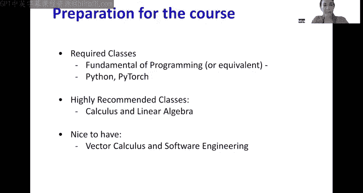

---

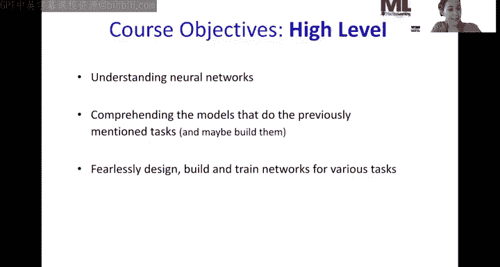

## 谁适合学习本课程？🎯

本课程专为任何希望学习深度学习并愿意每周投入12至20小时（取决于已有知识基础）的人设计。我们希望学生愿意持续在Piazza论坛上提供反馈并进行互动，因为这是本课程的主要沟通方式。同时，我们希望学生乐于接受挑战，并为未来的AI研究做好准备。

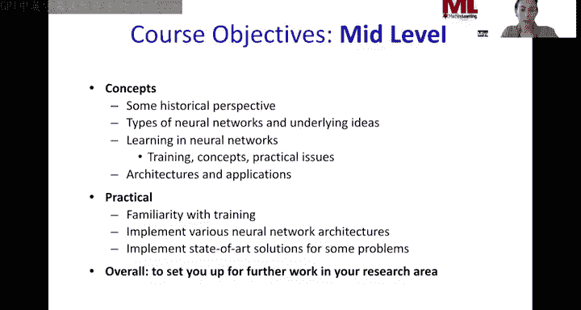

为了学习本课程，你需要具备以下基础知识：
*   **编程**：需要掌握Python，本课程将使用PyTorch。至少应学过编程基础。
*   **数学**：需要了解微积分和线性代数。如果具备向量微积分和软件工程背景会更有帮助，但最重要的是掌握Python、微积分和线性代数。

---

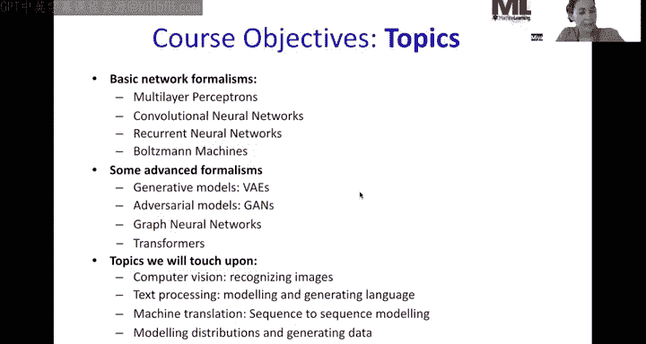

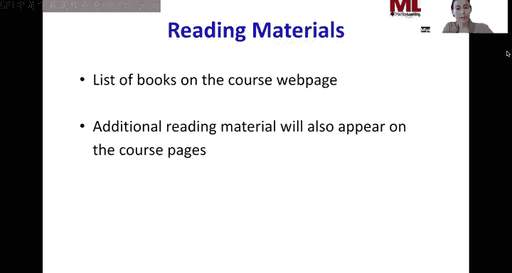

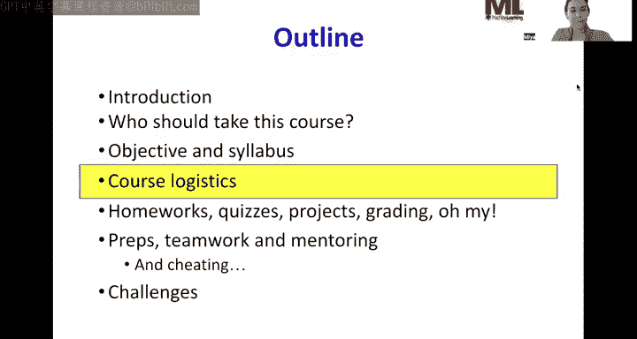

## 课程目标与内容概览 🗺️

从宏观角度看，本课程旨在让你理解神经网络，并理解那些能够完成前述任务（如语音识别、图像生成等）的模型。我们希望你能无畏地为各种任务设计和训练这些网络。

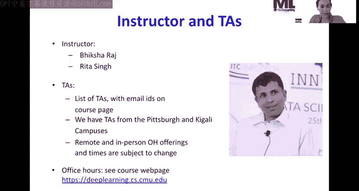

更具体地看，本课程将涵盖以下概念：
*   神经网络发展的简要历史视角。
*   神经网络的类型及其核心思想。
*   学习是如何发生的。
*   神经网络的架构与应用。

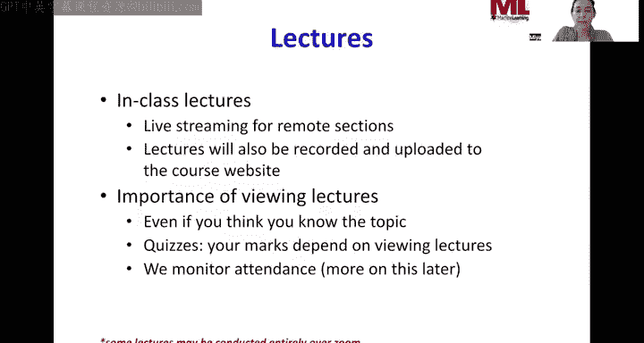

在实践层面，我们希望你能熟悉训练过程，能够实现各种不同的架构，并了解某些问题的最先进解决方案。总体目标是为你未来的研究领域工作打下基础。

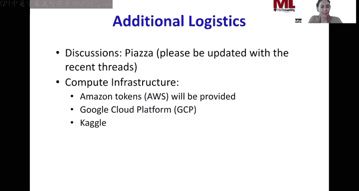

以下是本课程将涵盖的主题列表：
*   **基础网络形式**：包括多层感知机、卷积神经网络、循环神经网络、玻尔兹曼机。
*   **高级形式**：包括生成模型、对抗模型、图神经网络以及Transformer。
*   **应用领域**：计算机视觉（图像识别）、文本处理（语言建模与生成）、机器翻译（序列到序列建模）、分布建模与数据生成，以及语音识别。

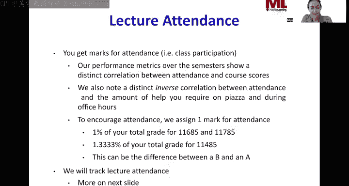

课程网页上列出了参考书目，并且在每节课的页面中也会提供额外的阅读材料（文章）。

---

## 课程安排与后勤 📅

### 教师与助教

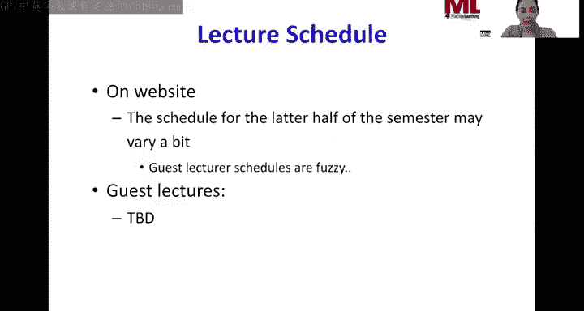

本课程的主讲教师是Bhiksha Raj教授，他将负责所有讲座。课程助教名单及其联系方式公布在课程网站上，他们来自匹兹堡和基加利校区，提供线上和线下的办公时间。

### 讲座与讨论

课程讲座将进行直播以供远程学生观看，同时也会被录制并上传到课程网站。**观看讲座非常重要**，因为测验内容与讲座相关，并且我们会记录出勤情况。

课程讨论将在Piazza论坛上进行，请务必关注最新动态。计算基础设施方面，我们将为所有学生提供Amazon代金券，并协助使用Google Cloud。

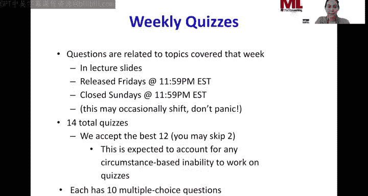

### 出勤与参与

出勤将计入成绩（占1%），因为我们注意到出勤的学生通常表现更好。我们主要通过课堂实时投票来追踪出勤。教授会在讲座中发起投票，你需要在Piazza或Zoom（如果教授远程授课）上在规定时间内（通常30秒）作答。答案对错不重要，重要的是参与。对于时区不便的学生，可以通过观看录制讲座来获得出勤分，但必须在讲座后一周内完整观看视频。

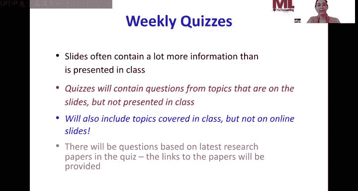

课程后半部分的日程可能会根据教授的行程和客座讲座安排略有调整。

---

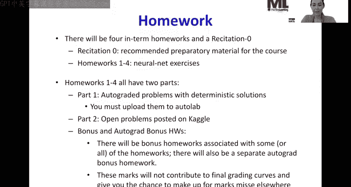

## 作业、测验、项目与评分 📝

### 测验

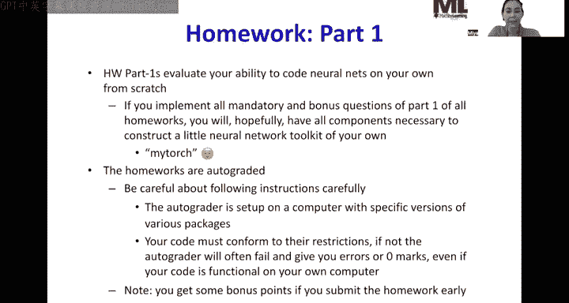

每周会有一次测验，问题涉及当周讲座幻灯片中涵盖的主题。测验通常在周五晚上发布，周日晚上截止。本学期共有14次测验，我们将取其中最好的12次成绩计入最终评分。每次测验包含10道选择题，你有3次尝试机会以取得最佳成绩。

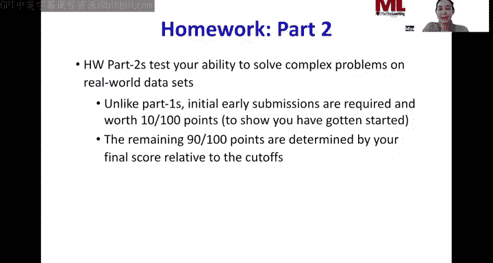

**请注意**：测验问题可能来自幻灯片上提及但教授未在课中讲到的内容，也可能来自教授在课中提到但未写在幻灯片上的内容。有时还会涉及需要阅读指定论文才能回答的问题。

### 作业

本学期有4次计分作业（作业1至4），以及一次不计分的预备练习（第0次辅导课）。每次作业分为两部分：
1.  **第一部分**：自动评分的编程问题，使用自定义的神经网络工具包（如`my_torch`）从头开始实现。这部分考察你独立编写神经网络代码的能力。提交时需要特别注意软件包版本，否则自动评分器可能给出零分。提前提交可获得加分。
2.  **第二部分**：在真实数据集上解决复杂问题的开放性问题，以竞赛形式在Kaggle上进行评分。评分基于你在排行榜上的表现，采用线性插值法计算得分。有早期提交截止日期（占10分，旨在督促起步）和准时提交截止日期（占90分）。整个学期共有10天的延迟提交额度（总计，非每次作业）。

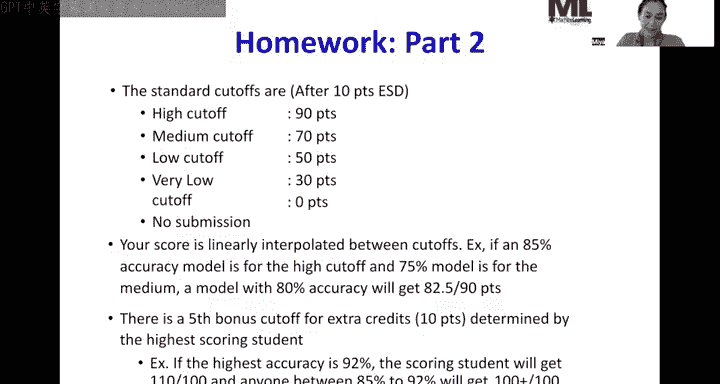

### 项目（仅限11-785和11-685课程）

项目旨在锻炼你理解和实现超越作业范围的新想法的能力。项目范围很广，你可以：
*   实现并评估最新论文中的前沿思想。
*   尝试解决一个问题，如果做得好，可能导向发表。
*   尝试全新的想法，例如新的学习算法、技术或模型。

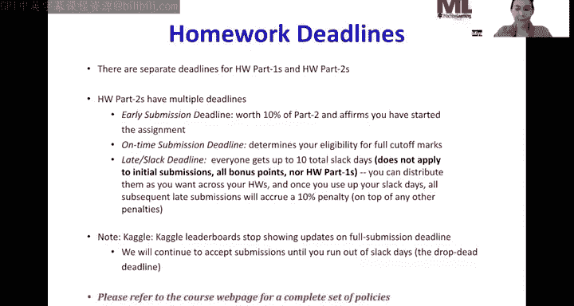

项目以小组形式进行（11-785课程为3-4人，11-685课程为2人）。要求包括提交项目提案、中期报告、最终报告以及一个5分钟的视频演示。每个小组都会分配一名助教作为导师。视频发布后，你需要回答其他同学在Piazza上提出的问题。

### 评分构成

*   **每周测验**：占总成绩的 **24%**。
*   **作业**：占总成绩的 **50%**。
*   **团队项目**：占总成绩的 **25%**（11-485课程无此项，评分比例会相应调整）。
*   **出勤**：占总成绩的 **1%**。

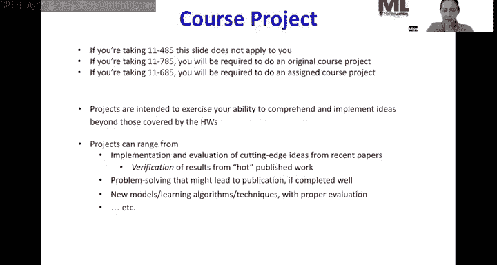

---

## 学习准备、团队合作与指导 🤝

### 准备工作

本课程实践性很强，涉及大量编码和实验，需要处理大型数据集。主要使用Python和PyTorch。如果你觉得起点较低，强烈建议完成第0次辅导课的练习。

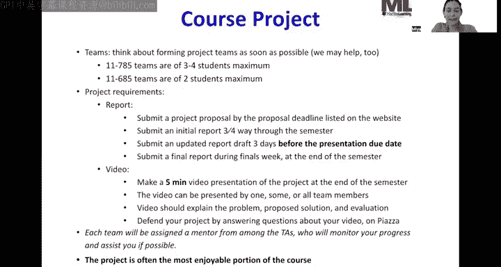

### 课程沟通

所有课程沟通都在Piazza上进行，包括课堂投票、问答、公告、团队协作以及教授的笔记。请务必下载该应用。

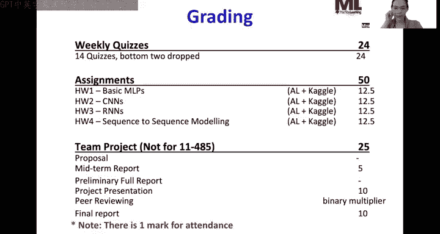

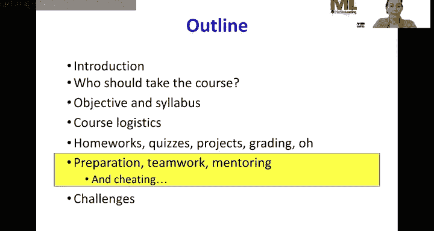

### 学习小组

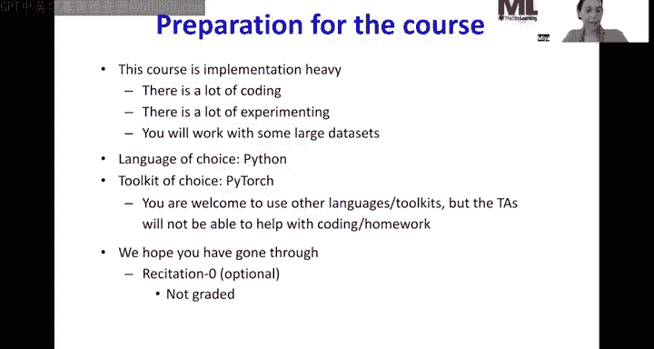

每位学生都必须加入一个学习小组，并会分配一名助教导师。我们建议每组3-4人。在学习小组中，你们可以讨论作业、论文、课堂内容和测验。小组成员也可以同时是项目团队成员。

### 学术诚信

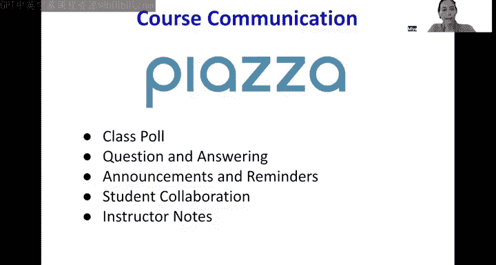

合作学习很重要，但必须遵守规则：
*   **测验**：必须独立完成。可以讨论问题，但答题时必须独自进行。
*   **作业**：必须独立解决。可以讨论代码和调试，但最终提交的每一行代码都必须是自己的成果。
*   **严禁抄袭**。你是来学习深度学习的，请挑战自己，不要降低标准。

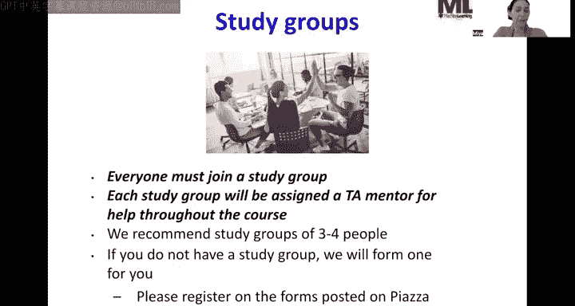

### 寻求帮助

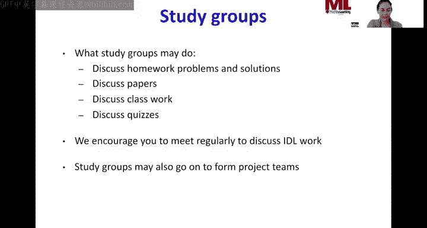

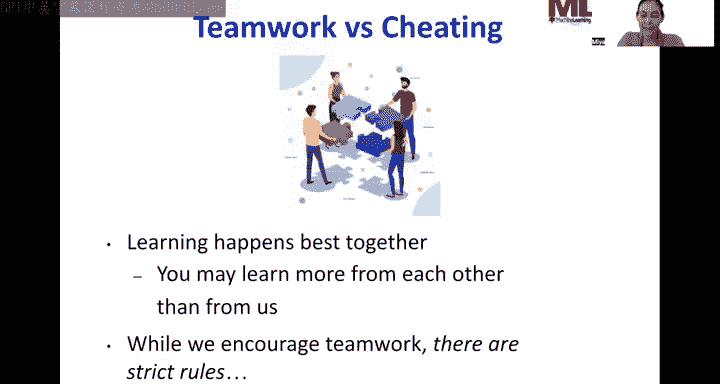

如果你的测验或作业成绩突然大幅下滑，你的助教导师可能会主动联系你。如果你遇到困难、感到落后或课业压力过大，请主动联系你的导师、任何助教或教师。课程还提供了关于如何应对困难的特定辅导视频。

---

## 课程挑战与成功秘诀 💪

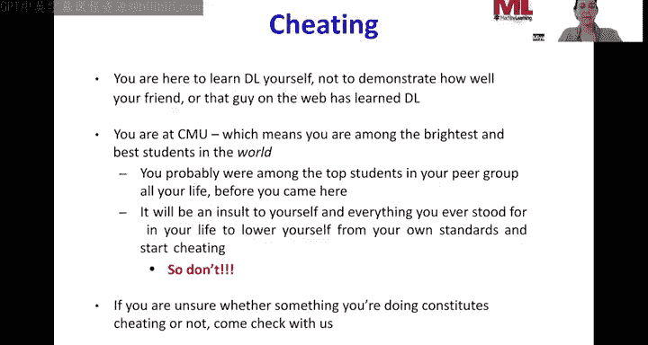

本课程难度很高，需要每周投入大量时间。但如果你能跟上进度，它会充满乐趣。课程采用掌握性评估：
*   测验旨在检验你对讲座概念的理解。
*   作业教你实现和优化复杂的神经网络。
*   项目让你接触解决真实世界问题的过程。

**任何在本课程中获得A的学生，从技术上讲都已准备好从事深度学习相关的工作。**

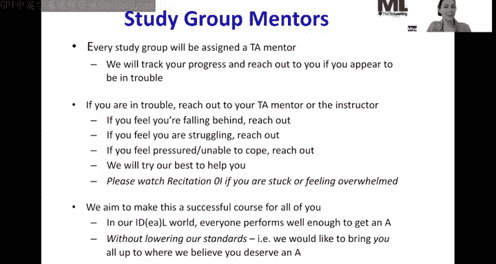

再次强调，如果你对课程准备程度有疑虑，请务必完成第0次辅导课。作业1的第一部分包含了对后续课程有帮助的内容，争取拿到满分，它也是最容易的作业。

如有任何问题，请在Piazza上发帖，我们会尽力在5分钟内回复。

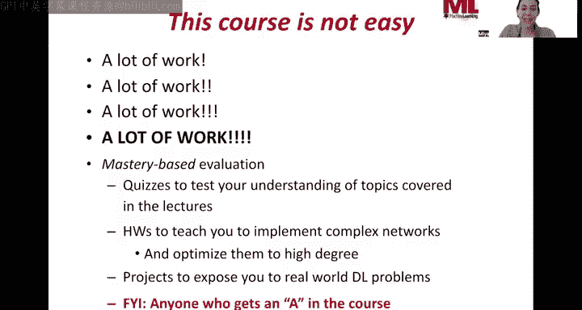

感谢你选修本课程，期待在讲座和办公时间见到你！

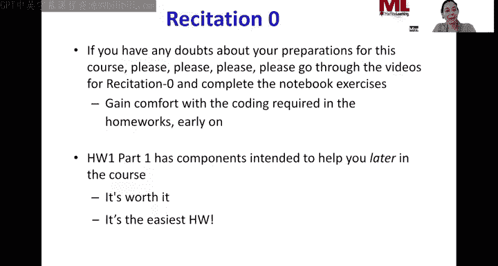

---

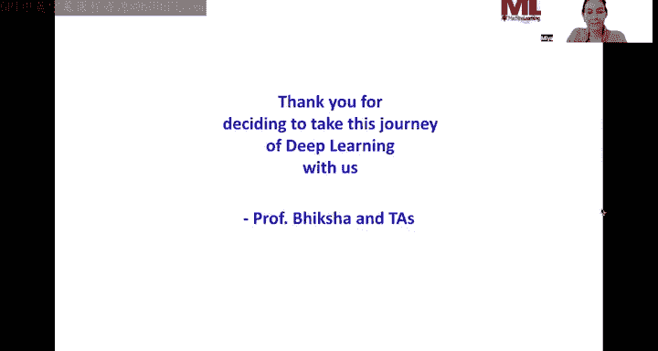

**本节课总结**：我们一起学习了《深度学习导论》课程的总体安排，包括神经网络简介、课程目标、适合人群、课程内容结构、详细的评分与考核方式（测验、作业、项目），以及成功完成课程所需的学习准备、团队合作规范和可用的支持资源。记住，积极参与、独立完成作业并善用沟通渠道是成功的关键。