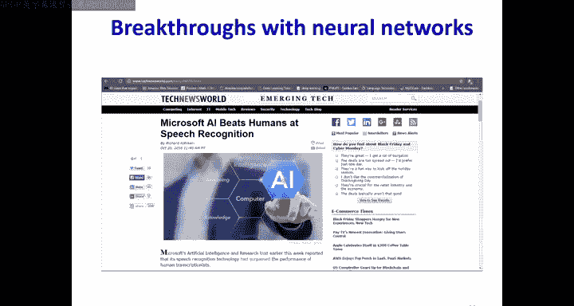
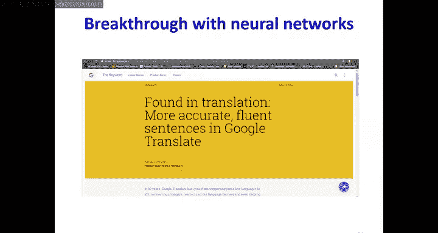
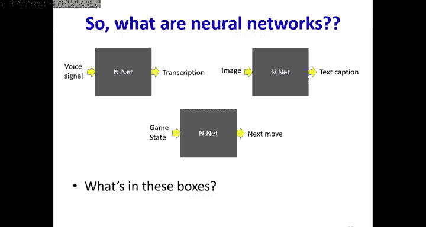
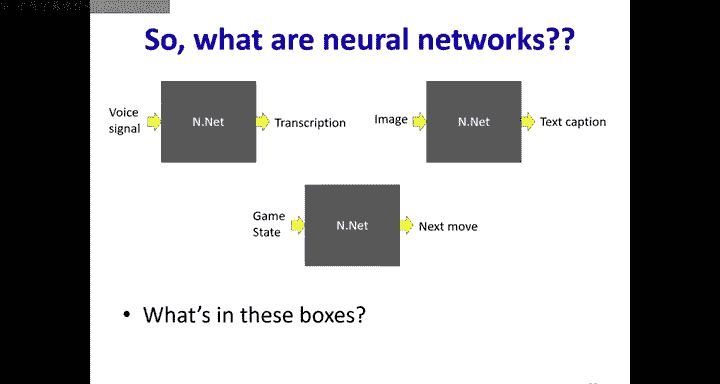
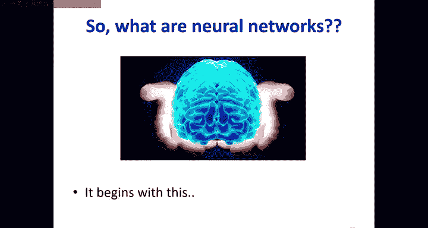
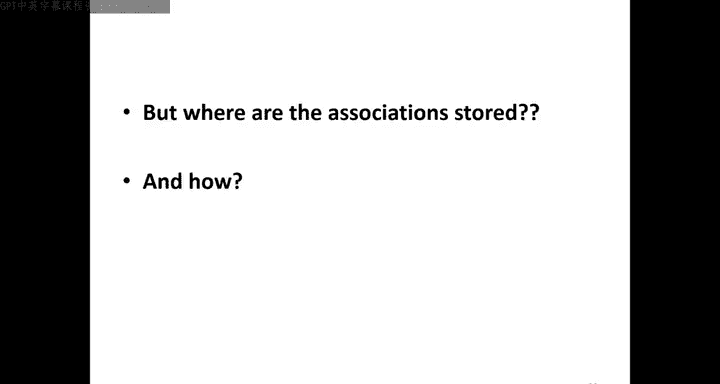
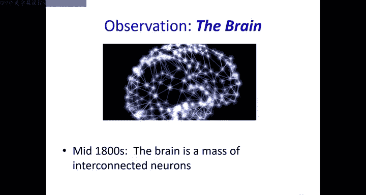
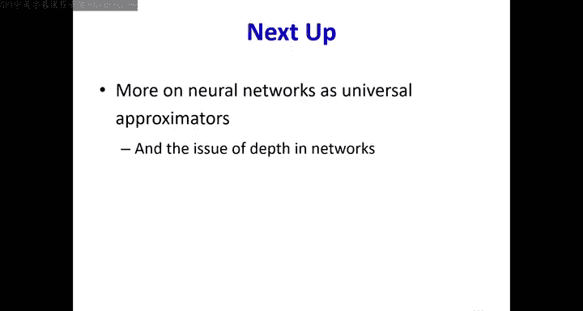

# 2：深度学习导论与神经网络基础 🧠

在本节课中，我们将学习深度学习与神经网络的基本概念。我们将从历史背景出发，探讨连接主义思想，了解早期模型及其局限性，并最终介绍现代神经网络的基本原理和强大能力。

## 概述：为什么是神经网络？

近年来，神经网络已应用于几乎所有能想到的问题，并在许多领域达到了最先进的水平。从2016年左右开始，基于神经网络的AI无处不在，这正是我们学习它的原因。

## 从大脑到机器：连接主义思想

上一节我们看到了神经网络的广泛应用，本节中我们来看看其思想根源——连接主义。

人类大脑由约800亿个神经元和约100万亿个连接构成。大脑的处理能力完全取决于这些神经元之间的连接方式，而非单个神经元本身。这就是连接主义的核心思想：知识存储在连接中。

这与传统的冯·诺依曼计算机架构形成鲜明对比：
*   **冯·诺依曼架构**：处理器和内存分离。程序存储在内存中，要执行不同任务，只需更改程序。
*   **连接主义架构**：机器结构本身就是程序。要执行不同操作，必须改变机器（网络）本身的连接方式。

因此，当前的神经网络模型都是连接主义机器，它们模拟了大脑的结构。

## 早期神经元模型及其演进

理解了连接主义思想后，我们来看看人们如何尝试用计算模型来模拟神经元。

### 麦卡洛克-皮茨模型 (1943)

这是第一个神经元的计算模型。该模型将神经元视为布尔阈值单元：
*   接收来自其他神经元的兴奋性或抑制性输入。
*   如果总输入超过阈值，则“激发”（输出1），否则不激发（输出0）。

该模型表明，仅使用这种简单机制，就可以构建任何布尔逻辑门，从而将大脑视为一个巨大的布尔机器。但它没有提供学习规则。

### 赫布学习规则 (1949)

唐纳德·赫布提出了一个著名的学习规则：“一起激发的神经元，连接在一起。”用公式可表示为：
`W_xy = W_xy + η * x * y`
其中，`x`和`y`是神经元的激活状态（0或1），`η`是学习率。

**局限性**：权重只增不减，最终会导致所有连接变得非常强，网络变得无用，因此该规则本质上是**不稳定**的。

### 罗森布拉特感知机 (1958)

弗兰克·罗森布拉特提出了“感知机”模型，这是一个更完整的模型。单个感知机单元的结构如下：
1.  计算输入的加权和：`z = w1*x1 + w2*x2 + ... + b` （`b`是偏置，即阈值项的负值）。
2.  通过一个**激活函数**（如阶跃函数）输出：如果 `z > 0`，输出1；否则输出0。

罗森布拉特的关键贡献是引入了**期望响应**的概念，并提出了一个可证明收敛的学习算法（适用于线性可分问题）。单个感知机可以计算AND、OR、NOT等布尔函数。

**局限性**：单个感知机无法计算**异或（XOR）** 函数，因为XOR是线性不可分的。

## 现代神经网络：多层感知机

既然单个感知机能力有限，本节我们来看看如何通过组合它们来构建更强大的模型。

通过将多个感知机连接成层，就形成了**多层感知机**。在这种网络中：
*   **隐藏神经元**：中间层的神经元，其输出模式并非我们直接关心的。
*   **输出神经元**：最终产生我们感兴趣结果的神经元。

一个关键见解是：单个感知机定义一个线性决策边界（一条直线或超平面）。通过组合多个感知机的输出，可以形成复杂的、非线性的决策边界。

以下是多层感知机（MLP）的强大能力：

1.  **通用布尔函数**：给定任何布尔函数，都可以构造一个MLP来计算它。
2.  **通用分类器**：MLP可以近似任何复杂的决策边界，对输入空间进行划分。例如，要识别数字“2”，MLP可以学习在784维像素空间中划出代表“2”的区域。
3.  **通用函数逼近器**：通过使用适当的激活函数（不仅仅是阶跃函数）和足够多的隐藏单元，MLP可以以任意精度逼近任何连续函数。这意味着神经网络本质上是一个**函数**，它将输入映射到输出。

因此，无论是语音识别（音频→文本）、图像描述（图像→文字）还是游戏（状态→动作），都可以被看作是一个由神经网络实现的复杂函数。

## 总结与展望

本节课中，我们一起学习了：
*   神经网络源于对大脑和认知的连接主义建模。
*   早期模型（麦卡洛克-皮茨、赫布、感知机）奠定了基础，但各有局限。
*   现代**多层感知机（MLP）** 通过组合简单单元，成为了**通用函数逼近器**，能够进行分类、回归和模拟复杂输入输出关系。

在下一节课中，我们将更深入地探讨神经网络如何计算这些函数，理解“深度”的含义，并讨论神经网络的局限性。