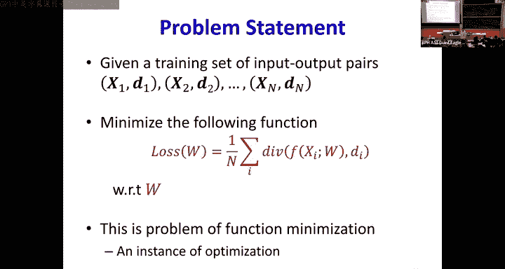
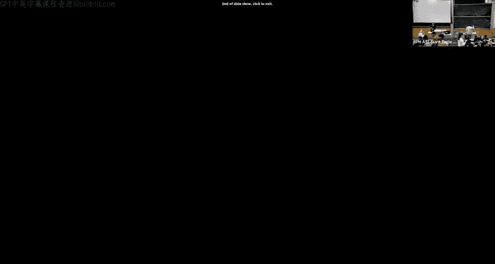

# 4：如何训练神经网络 🧠

在本节课中，我们将学习如何训练一个神经网络。我们将描述学习问题的本质，介绍感知器规则，并引入经验风险最小化的概念来训练神经网络。

---

## 神经网络学习问题

在过去的几节课中，我们介绍了什么是神经网络。它们是这些简单单元的层级组合，这些单元共同协作，能够完成许多复杂的任务。

我们了解到，这些网络实际上可以建模任何布尔函数，这意味着如果你给我一个布尔函数，我可以为其设计一个网络。它们可以以任意精度建模任何分类边界，并且也能建模任何连续值函数。

然而，要使网络能够执行这些操作，它必须具备足够的架构：足够深的网络，其中每一层都足够宽且连接充分。

### 核心问题：参数学习

给定所有这些，我们发现，在各种人工智能任务中，神经网络是一个神奇的盒子，它接收输入并产生输出。这个盒子本身就是一个函数。

一旦我们意识到这个盒子是一个函数，一些问题就出现了。我们谈论的是数学对象，而当我观察这个AI任务时，输入的是游戏状态，输出的也是游戏状态，这些都不是数学对象。那么，我们如何将它们转换成函数可以实际操作的形式呢？

我们有几个问题需要回答：
1.  如何表示输入和输出？输入和输出必须是数学对象，必须是数字或向量。
2.  如何组合网络来计算所需的函数？

今天，我们将专注于第二个问题：如何组合执行特定函数的网络。

---

## 网络结构与参数

我们定义网络为非常简单的单元组成的网络。最基本的单元是感知器。

感知器接收一组输入，每个输入对应一个权重。它计算输入的加权和，并与一个阈值进行比较。如果超过阈值，它就“激活”。这是感知器最简单的版本。

更进一步，我们可以将感知器视为计算输入的仿射函数（即输入的加权和加上一个偏置），然后应用某种激活函数。最简单的激活函数就是阈值函数。

一旦我们以这种方式分解感知器的操作，激活函数本身可以是任何函数。因此，感知器也可以这样重画：偏置可以表示为一个固定为1的额外输入，该输入的权重就是偏置。

激活函数可以是任何函数：阈值函数、Sigmoid函数或其他类型的函数。这是基本的单元。

但我们实际计算的函数是由这些单元组成的网络。我们假设网络是一个前馈网络，这意味着在处理任何输入时，信息从输入单向流向输出，没有循环。

当我们决定网络结构后，设计网络时需要回答的问题包括架构本身：有多少层，每层有多宽等等。目前，由于我们讨论的是函数逼近，我们将假设我们拥有的任何网络都具有能够建模我们试图建模的特定函数的架构。

现在，网络是一个由这些基本单元组成的层级结构。每个单元都有一些权重和一个偏置。因此，整个网络是一个数学结构，它接收一些输入，最终计算出一个输出。它拥有参数，即网络中神经元的权重和偏置。

因此，你可以用函数形式表示整个网络：`F(x; W)`。分号后的任何内容表示参数，分号前的内容表示输入。所以这是一个参数化函数，参数是W。

整个网络只是一个参数化函数。因此，当我们谈论学习一个网络时，我们实际上是在谈论学习参数W，因为我们假设网络的架构是给定的。

问题是，我们如何设置这些参数W，以使网络执行你想要它做的任何事情。

---

## 从函数逼近到经验风险

我们已经看到，多层感知器可以表示任何函数。这意味着无论你给我什么函数，我总能构造一个MLP来计算这个函数。由于我们特别假设网络架构是给定的，这意味着我们总能选择一组参数W，使网络计算这个函数。

那么，给定一个网络和一个它必须计算的函数，我如何设置网络的参数W，使网络精确地计算这个函数而不是其他东西？

对于非常简单的函数，你可以直接手工设计网络，手动设置参数。但这只适用于最简单的函数。当函数变得更复杂时，你将无法手动设计网络参数。

那么，我们如何为更通用的函数设计网络？如何设置参数值？

### 可视化学习问题

我们可以这样可视化问题：假设我们有一个目标函数 `G(x)`。网络本身是一个参数化函数 `F(x; W)`。当我们谈论训练网络时，我们问自己的问题是：如何设置这些参数W，使得网络计算的函数与目标函数之间的差距最小化？换句话说，如何设置W使得两者之间的“面积”最小化？如果这个面积变为0，那么网络就在计算正确的函数。

为了能够指定这一点，我需要一种量化这个面积的方法。为了量化面积，我首先需要定义一个误差函数，用于量化网络当前计算的结果与你希望它计算的结果之间的差距。

这个阴影面积将是整个输入空间上误差的积分。我们的问题是确定最小化这个误差的W。

### 实际问题：未知的目标函数

这里可能有什么问题？问题在于，要使这种方法有效，`G(x)` 必须在所有地方都被指定。而在实践中，我们并不知道 `G(x)` 是什么。那么我们该怎么办？

我们将对函数进行采样。我们不会知道所有地方的 `G(x)`，而是会收集一堆 `x`，并在每个 `x` 处获取对应的 `G(x)` 值。因此，我们有一堆输入-输出对。

我们只剩下了一组输入-输出对。从这组输入-输出对中，我们将尝试学习这个函数。

回到我们最初的图示，我们现在拥有的是一堆经验性的输入 `x` 和对应的 `G(x)` 值。现在，你的网络将在这些输入处计算其他值。因此，我们不是试图最小化整个阴影面积，而是最小化这些红线（误差）在我们获得的样本集合上的平均误差。

收集样本集很容易。你基本上会为你的数据收集输入-输出对，如图像及其标题、语音及其转录。因此，采样函数很容易，我们可以计算这个经验误差估计。

然后，我们可以尝试估计最小化这个经验误差的参数W。

### 经验误差与真实误差

最小化经验误差是否必然也会最小化网络与你想要的函数之间的实际误差？这是一个我们做出的假设，但并不能保证。

因此，我们的问题归结为：给定一组训练样本（基本上是 `G(x)` 的样本），我们计算经验误差（即网络输出与训练集合上实际函数输出之间的平均误差）。我们将尝试找到使这个平均误差最小化的网络参数。

我们希望，如果我们做得正确，网络学习到的函数将处处成立。但这只是一个希望，没有保证。

---

## 故事梗概

到目前为止，学习神经网络就是确定网络参数（权重和偏置）的问题。网络必须具备足够的能力（即足够的宽度和深度），我们才有机会学习到能够捕捉目标函数的网络。我们假设它具有足够的能力。

因此，学习问题仅仅是确定其参数，以使误差最小化。

理想情况下，你希望优化网络以在所有地方表示所需的函数。但这需要知道所有地方的函数。因此，在实践中，我们做的是抽取输入-输出训练实例。这些训练实例是你的函数的样本。

我们将估计网络参数以拟合这些训练实例上的输入-输出关系。我们希望，当我们这样做时，得到的网络能处处拟合函数 `G(x)`。

---

## 从分类问题开始

让我们从一个简单的任务开始：尝试学习一个分类器，这比学习回归问题更简单。这是最早使用MLP解决的问题之一，因此我们将考虑它，特别是考虑二分类问题，但这可以推广到多分类。

在二分类中，网络的期望输出是什么？是0或1。只有两个类别：0类和1类。那么误差是什么？如果网络的输出是正确的类别，则没有误差。如果网络的输出是错误的类别，则存在误差。

因此，如果你的目标函数是由虚线所示的函数，网络的输出只能是0或1。对于错误的W值，网络函数（以绿色显示）将在某些位置计算错误的输出。

因此，这里的总误差将是网络输出与期望输出不匹配的训练实例的数量。误差是网络输出与期望输出不匹配的训练实例的计数。

当我们想要学习分类器时，我们真正谈论的是学习这些W，使得这些误差的计数最小化。

---

## 感知器学习规则

让我们从考虑Rosenblatt最初定义的多层感知器开始。在Rosenblatt的原始模型中，基本单元具有阈值激活。每个感知器计算输入的仿射函数，并将其与0进行比较。如果大于0，则输出为1；如果小于0，则输出为0。

我们现在的问题是用一些训练数据（输入和输出的集合）来训练这个由这些基本单元组成的网络。

最简单的多层感知器模型是什么？最简单的模型就是单个感知器。如果我们只有一个感知器，我们知道它是如何操作的。单个感知器将输入的加权和与阈值进行比较。如果输入大于阈值，则输出为1，否则为0。

因此，输出为1和输出为0之间的边界是输入的加权和恰好等于阈值的地方。这个边界是一个超平面。该函数是一个阶跃函数。

这就是我们想要学习的函数，如果我们只是学习最简单的分类器网络（只有一个单元）。但我们不会被给予整个函数。当我们谈论学习这个函数时，我们真正谈论的是学习权重和阈值。你只会得到一堆训练样本：对于某些输入，输出是0；对于其他输入，输出是1。你只得到那些彩色点（红点和蓝点）。从这些点中，你必须学习整个阶跃函数。

### 问题本质

这意味着什么？我们想要学习将正例与负例分开的超平面。换句话说，我们想要学习这个边界的方程。而这个边界的方程完全由权重和阈值指定。

让我们看看如何解决这个问题。但在我们这样做之前，这个边界具有 `Σ_i w_i x_i + b = 0` 的结构，其中 `b = -t`。这是一种仿射函数。它将是一个超平面，但这个超平面会经过原点吗？

为了简化我们的解释，使用线性函数总是更方便。所以，这是你的仿射函数。我可以这样做：我可以通过添加一个值为1的单一值来增广输入。现在，该输入的对应权重成为偏置。如果我将增广后的输入视为新的输入，这个函数突然变成了线性的。我是如何将仿射函数转换为线性函数的？

### 转换为线性问题

假设这是x1，这是x2。然后我添加了一个x3，其值始终为1。这意味着我现在完全在x3=1的平面上工作。在这个平面上，我的边界不经过原点。但是，当我观察增广后的输入时，我可以画一个经过原点的超平面，该超平面在这个边界处切割这个平面。

因此，虽然我的超平面与x3=1平面的交线是一条不经过原点的线，但我在这个增广空间中得出的实际决策边界确实经过原点。这样我就将仿射问题转换为了线性问题。现在我可以处理线性问题了。

### 线性分类器的几何

现在，我们谈论线性函数。我们想要找到一组权重 `w_i`，使得 `Σ_i w_i x_i = 0` 表示一个能清晰分隔正例和负例的超平面方程。

我可以稍微不同地写它。`Σ_i w_i x_i` 可以写成向量形式：`w^T x = 0`。这就是我的边界。

如果两个向量的内积为0，它们之间的关系是什么？它们是正交的。所以，对于任何W，这表示所有与W正交的X的集合。这是一个经过原点的超平面，包含所有与W正交的向量。

如果我在平面的这一侧（与W相同的一侧）有一个向量，`w^T x` 的符号将是正的。如果我在另一侧有一个向量 `x'`，`w^T x'` 将是负的。

因此，我可以简单地运行一个测试：如果 `w^T x > 0`，则表示空间的这一部分，即类别1；如果 `w^T x < 0`，则表示类别0。

### 感知器学习算法的基础

假设我有一个正例实例 `x`。我可以画出各种将 `x` 保持在正侧的决策边界。哪个决策边界使 `x` 离它最远？与它成90度角的那一个。换句话说，对于任何给定的 `x`，如果 `x` 是一个正例实例，最优的权重向量是什么？是 `x` 本身。如果 `x` 属于负类，最优的权重向量是 `-x`。

这是感知器学习规则所依据的基本原则。算法如下：给定一堆点，我想找到能清晰分隔红点和蓝点的决策边界。我假设红点和蓝点可以通过一个超平面线性分离。我想找到W，使得对于所有红点 `w^T x > 0`，对于所有蓝点 `w^T x < 0`。

有一个闭式解，但最初由Rosenblatt提出的流行解决方案是一种在线算法，即著名的感知器算法。你任意初始化W，然后持续增量修正它，直到分类误差最小化。

我们知道，对于任何正例实例 `x`，最优权重向量是 `x` 本身（可能有一些缩放）。对于任何负例实例，最优向量是 `-x`。

因此，你从某个W开始，开始分类你所有的训练样本。如果你遇到一个被错误分类的正例实例，那么你将权重向量拖向该正例实例的最优权重向量（即向 `x` 方向拖动），通过简单地将 `x` 加到 `w` 上来实现。如果你得到任何被错误分类的负例实例，那么你将权重向量拖向该 `x` 的最优权重向量（即向 `-x` 方向拖动），通过从 `w` 中减去 `x` 来实现。

### 算法流程与局限性

感知器学习算法如下：给定一些训练样本集合，初始化W，然后循环遍历训练实例。

只要数据可以被线性边界分离，该算法保证在有限步数内收敛，不会循环。但是，如果类别不是线性可分的，例如，如果红点在蓝侧或蓝点在红侧，算法将永远不会收敛。总是会有一个被错误分类的实例，你将一直追逐自己的尾巴。

所以，当我们只有一个感知器的非常简单的问题时，情况就是这样。即使我假设数据是线性可分的，我也必须进行一些搜索。

---

## 扩展到多层网络与组合爆炸

现在，让我们看一些更复杂的情况，比如这个双五边形问题。在双五边形问题中，我知道使用左边的架构，我可以构造一个能精确分类这个双五边形边界的网络。较低层的每个感知器将捕获一个五边形的一条边界。下一层中，一个感知器将捕获一个五边形，另一个将捕获第二个五边形。然后将两者相加，从而得到所需的决策边界。

但是，当你尝试训练这个网络时，你只会得到这些点。你必须学习这个边界。现在，我能应用我们刚刚看到的感知器规则来学习这些边界吗？

为了使这一点更明显，让我们假设某个“先知”告诉了我该层中其他9个感知器的权重。所以我只剩下学习第10个感知器（图中圈出的那个）的权重的问题。训练数据当然是这些红点和蓝点。我能从这些数据中学习那个感知器吗？整个网络是给定的，但“先知”恰好没有给我一个感知器。

我能从这些数据中学习这个感知器吗？感知器学习的要求是数据必须是线性可分的。这里的类别是线性可分的吗？其他感知器的权重定义了特定的边界，然后它可能变成线性的吗？不一定。

如果你想学习这个感知器，你将不得不重新标记一些蓝点，使得两个类别现在变得线性可分。然后，只有到那时，你才能学习感知器。没有其他方法可以学习感知器。

我需要重新标记哪些实例？你怎么知道？记住，如果你错误标记一个实例，整个网络就会出错。你怎么知道？

因此，如果你想真正学习感知器规则，你将不得不开始重新标记一些实例。然后学习边界，正确的解决方案是你不知道要重新标记哪些实例。因此，你将不得不以各种可能的方式重新标记数据实例，并尝试学习决策边界，直到找到一个能为你提供整个训练数据完美分类的重新标记方式。

这意味着，对于单个神经元，我们必须尝试重新标记蓝点的每一种可能方式，使得我们可以学习一条将所有红点保持在一侧的线。而这是在我给了你整个网络的情况下。如果我一开始什么神经元都不知道，只给了你正确的架构，你将不得不为你网络中的每个神经元，以各种可能的方式重新标记数据，这样当你学习每个神经元的边界时，网络的最终输出是完美的。

这是一个组合搜索问题，你无法在合理的时间内完成。它不会奏效。

因此，即使对于这个非常简单的双五边形问题，我们也必须知道每个训练实例中每个神经元的期望输出（基本上是如何标记它们）。我们必须这样做，以便当你将它们全部组合时，整体的决策边界是双五边形。这是一个组合优化问题。如果你在重新标记时犯了一个错误，你的整个分类器就会变成垃圾。

### 问题的核心

这就是问题所在：使用感知器规则训练这个网络是一个组合优化问题。我们不知道每个训练实例中每个神经元的输出。我们需要重新标记它们并在空间中搜索，因此我们还必须确定每个训练实例中每个神经元的正确输出，这至少是输入大小的指数级。

因此，这不是一个可行的解决方案。这实际上使多层感知机的研究停滞了很长时间。人们意识到，早期的原始感知器和MLP基于简单的线性分类器和阈值激活。很快人们就意识到，学习单个感知器的问题可能是可处理的，但如果你想学习整个网络，你就会遇到这个无法解决的组合优化问题。

因此，人们提出了各种贪婪解决方案，如Adaline、Madaline等。这些方法持续了将近三十年，直到Paul Werbos（在MIT）发现了一种替代方法（在70年代初），但直到15年后，Jeff Hinton才认识到Werbos论文的价值。

---

## 解决方案：可微性与代理损失

那么解决方案是什么？首先，到目前为止的故事是：学习网络就是学习权重和偏置以计算目标函数的问题，假设网络具有足够的能力。在实践中，我们通过使网络匹配从目标函数中抽取的训练实例的输入-输出关系来学习网络。

线性决策边界可以由单个感知器学习。如果类别是线性可分的，可以在线性时间内学习。对于非线性决策边界，我们需要感知器网络，但使用阈值函数激活训练MLP将需要知道每个训练实例中每个感知器的输入-输出关系。这些必须作为训练的一部分来确定。对于阈值激活，这是一个NP问题，具有NP复杂度。

因此，认识到训练整个MLP是一个组合优化问题，使神经网络的发展停滞了十多年，直到我们有了一个小小的洞见。

### 阈值激活的问题

那个洞见是什么？问题在于，我们真正试图计算的是误差：网络正确的频率是多少？错误的频率是多少？你有一堆训练输入，对于这些输入，输出必须是0或1。然后，在每个输入处，你可以计算网络的输出。网络的输出可能是正确的或错误的，我们计算它错误分类的次数，然后设置参数。

但是，假设我有这个训练数据 `x1` 到 `x5`，虚线显然是正确的决策边界。假设我选择构建我的网络，使其学习绿色函数。绿色函数在某个点从0变为1，它犯了两个错误。现在，如果我将这个阈值（从0变为1的点）向左移动一点，错误的数量会改变吗？如果我向右移动一点，错误的数量会改变吗？我必须移动很多，它必须跨越一个训练点。如果我移动一点点，错误的数量不会改变。这就是实际问题。

同样，如果我试图在多维空间中学习这种感知器，我可能从一个初始边界开始。它会错误分类一些实例。如果我稍微旋转边界，在边界实际跨越并分类一个训练点之前，错误总数不会改变。因此，我的参数的微小变化不会导致误差的任何变化。这就是为什么我们真的无法使用增量步骤来优化。没有迹象表明我应该朝这个方向还是那个方向旋转权重，因为朝这个方向或那个方向