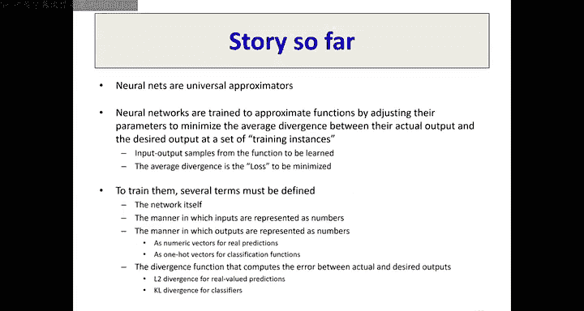

# 5：神经网络优化与梯度下降 🧠

在本节课中，我们将学习如何训练神经网络，这本质上是一个函数优化问题。我们将从基础的导数概念出发，逐步理解梯度下降算法，并了解如何将其应用于最小化神经网络的损失函数。

---

## 1. 函数最小化与导数回顾

上一节我们介绍了神经网络训练的核心是经验风险最小化。本节中，我们来看看如何通过优化方法找到使损失函数最小的参数。

### 1.1 导数的本质

给定一个函数 `y = f(x)`，在任意点 `x` 处，如果我们对 `x` 施加一个微小的扰动 `Δx`，会导致 `y` 产生一个微小的变化 `Δy`。导数 `f'(x)` 被定义为连接 `Δx` 和 `Δy` 的乘性因子。

**公式**：
`Δy ≈ f'(x) * Δx`

当 `x` 和 `y` 都是标量时，我们常写作 `dy/dx`。导数 `f'(x)` 的符号表明了函数的变化趋势：
*   如果 `f'(x) > 0`，函数在 `x` 处递增。
*   如果 `f'(x) < 0`，函数在 `x` 处递减。
*   在函数从递增转为递减（局部极大值）或从递减转为递增（局部极小值）的**转折点**，导数为零。

### 1.2 多变量函数的导数：梯度

当输入 `x` 是一个向量时，函数 `y = f(x)` 的导数定义依然不变：`Δy` 是 `Δx` 的线性函数。

**公式**：
`Δy = ∇f(x)^T * Δx`

其中，`∇f(x)` 称为函数在 `x` 处的**梯度**。它是一个向量，其每个分量是函数 `f` 对相应输入分量的偏导数。

**梯度的几何意义**：
梯度指向函数值**增长最快**的方向。其大小表示增长率。因此，负梯度 `-∇f(x)` 指向函数值**下降最快**的方向。

**梯度的另一个性质**：梯度始终垂直于函数的等高线（即函数值相同的点构成的集合）。

### 1.3 海森矩阵与二阶信息

对于多变量函数，海森矩阵 `H` 描述了函数的曲率。其第 `(i, j)` 个元素是二阶偏导数 `∂²f / (∂x_i ∂x_j)`。

**海森矩阵的特征值与优化**：
*   在局部极小值点，海森矩阵的所有特征值均为**正**。
*   在局部极大值点，所有特征值均为**负**。
*   如果特征值有正有负，则该点是一个**鞍点**。

---

## 2. 梯度下降算法 📉

对于复杂的函数，我们无法直接求解 `∇f(x) = 0` 来找到最小值。梯度下降提供了一种迭代逼近的方法。

### 2.1 算法核心思想

我们从参数的初始猜测 `x₀` 开始，反复沿**负梯度方向**（即函数下降最快的方向）移动一小步，直到函数值不再显著变化。

**更新公式**：
`x_{k+1} = x_k - η * ∇f(x_k)`

其中：
*   `x_k` 是第 `k` 次迭代的参数值。
*   `η` 是**学习率**，控制步长大小。
*   `∇f(x_k)` 是函数在 `x_k` 处的梯度。

### 2.2 算法行为与挑战

梯度下降的行为取决于函数形状：
*   对于**凸函数**（如碗状），梯度下降能稳定收敛到全局最小值。
*   对于**非凸函数**，算法可能陷入局部最小值、鞍点或平坦区域。

**停止准则**：通常不直接检查梯度是否为零，而是监控函数值 `f(x)` 的变化。当连续迭代中函数值下降非常微小时，即可停止。

---

## 3. 应用于神经网络训练 🔧

现在，我们将梯度下降的思想应用于神经网络的训练。

### 3.1 问题重述

给定训练集 `{(x_i, d_i)}`，我们定义损失函数 `L(W)`，它是网络输出 `f(x_i; W)` 与期望输出 `d_i` 之间差异的平均值。目标是找到参数 `W` 以最小化 `L(W)`。

**训练过程**：
1.  初始化网络参数 `W`。
2.  重复以下步骤直至收敛：
    a. 计算当前参数下，损失函数关于所有参数的梯度 `∇L(W)`。
    b. 沿负梯度方向更新参数：`W := W - η * ∇L(W)`。

**直观理解**：梯度下降检查每个参数 `w_i`，判断“增加这个参数会使损失增大还是减小”。根据结果，相应地增加或减少该参数。

### 3.2 网络组件与数据表示

为了具体计算损失和梯度，我们需要定义网络的各个部分。

**神经元结构**：典型的神经元先计算输入的线性加权和（仿射变换），再通过一个非线性**激活函数**。
`z = w^T * a + b`
`y = g(z)`
常见激活函数包括 Sigmoid、Tanh、ReLU 及其平滑版本 Softplus。

**向量激活函数**：有些激活函数同时处理整个层的神经元输出。最典型的是 **Softmax**，它将一组实数 `z_i` 转换为一个概率分布 `y_i`：
`y_i = e^{z_i} / Σ_j e^{z_j}`
Softmax 的输出所有分量和为1，且每个分量非负，常用于多分类网络的输出层。

**输入与输出表示**：
*   **输入 `x`**：必须是数值向量（如图像像素、语音特征、文本嵌入）。
*   **输出 `y` 与目标 `d`**：
    *   **回归任务**：`d` 和 `y` 是实值标量或向量。损失函数常使用均方误差。
    *   **二分类任务**：网络输出一个标量 `y`（如使用 Sigmoid 表示正类概率），目标 `d` 为 0 或 1。
    *   **多分类任务**：网络输出一个向量 `y`（使用 Softmax 表示各类概率），目标 `d` 使用 **独热编码**（一个分量是1，其余为0）。

### 3.3 损失函数的选择

损失函数必须是可微的，这样才能计算梯度。不同任务对应不同的损失函数。

**回归任务（L2损失）**：
`L = 1/2 * ||y - d||²`
引入 `1/2` 是为了使损失对 `y` 的导数形式更简洁：`∂L/∂y = y - d`。

**分类任务（交叉熵损失）**：
*   **二分类**：`L = -[d * log(y) + (1-d) * log(1-y)]`
*   **多分类**：`L = -log(y_c)`，其中 `c` 是目标类别索引。

**为什么使用交叉熵而非均方误差？**
交叉熵损失在概率预测中具有更好的性质。例如，当网络对错误类别给出100%置信度时，交叉熵损失会趋于无穷大，迫使网络快速修正错误。而均方误差对此惩罚不足。

**一个重要性质**：对于使用 Softmax 输出层和交叉熵损失的多分类网络，损失 `L` 关于 Softmax 层输入 `z` 的梯度恰好是 `y - d`。这与回归问题中 L2 损失的梯度形式一致，极大地简化了反向传播的计算。

---

## 总结

本节课中我们一起学习了：
1.  **优化基础**：回顾了导数、梯度、海森矩阵的概念及其在寻找函数极值点中的作用。
2.  **梯度下降**：掌握了这一核心迭代优化算法，它通过沿负梯度方向更新参数来最小化函数。
3.  **神经网络训练框架**：将梯度下降应用于神经网络，明确了训练即最小化损失函数的过程。
4.  **关键组件**：了解了神经元结构、激活函数（特别是 Softmax）、数据表示（独热编码）以及针对回归和分类任务的不同损失函数（L2损失和交叉熵损失）。

下一节课，我们将深入探讨如何高效地计算神经网络中复杂的梯度——即**反向传播算法**。