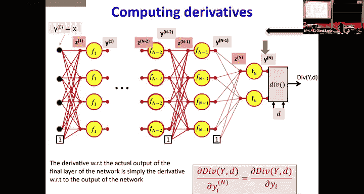
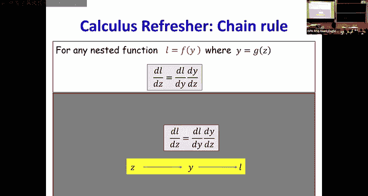
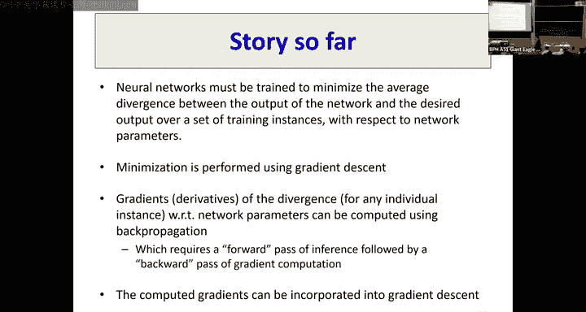

# 6：神经网络训练与反向传播 🧠

在本节课中，我们将学习如何训练神经网络。核心是通过**经验风险最小化**来最小化损失函数，并使用**梯度下降**算法来更新网络参数。为了实现梯度下降，我们需要计算损失函数相对于每个网络参数的梯度，而**反向传播**正是高效计算这些梯度的关键算法。

---

## 概述：训练神经网络的框架

训练神经网络的目标是找到一组参数（权重和偏置），使得网络在训练数据上的预测误差最小。我们通过最小化一个称为**损失函数**的量来实现这一点。损失函数衡量了网络输出与期望输出之间的差异。

具体来说，给定一个包含输入-输出对 `(X, Y)` 的训练集，我们定义损失函数 `L(W)` 为所有训练实例上**差异**的平均值。这里的差异 `D` 衡量了网络实际输出与期望输出之间的距离。损失 `L` 是网络参数 `W` 的函数。

我们的目标是找到使 `L(W)` 最小的 `W`。这通过**梯度下降**完成：我们初始化参数，然后反复沿损失函数梯度的反方向更新参数。

**梯度下降更新公式：**
`W_new = W_old - η * ∇L(W_old)`

其中 `η` 是学习率，`∇L(W)` 是损失函数关于参数 `W` 的梯度。

为了执行梯度下降，我们必须计算梯度 `∇L(W)`。由于损失是单个训练实例差异的平均值，因此梯度也是这些单个差异梯度的平均值。所以，核心问题归结为：**如何计算单个训练实例的差异相对于任意网络参数 `W_ij` 的梯度？** 这就是本节课和下一节课的重点。

---

## 预备知识：微积分与链式法则回顾

在深入反向传播之前，我们先回顾一些基本的微分规则，并用一种直观的“影响图”来表示。

### 基本导数与影响图

对于一个函数 `y = f(x)`，导数 `dy/dx` 描述了 `x` 的微小变化 `Δx` 会导致 `y` 产生多大的变化 `Δy`。对于足够小的 `Δx`，有：
`Δy ≈ (dy/dx) * Δx`

我们可以用“影响图”来表示：变量 `x` 通过一条边影响变量 `y`，这条边的“权重”就是导数 `dy/dx`。

**标量函数图示：**
`x --(dy/dx)--> y`

### 多变量函数与偏导数

对于多变量函数 `y = f(x1, x2, ..., xn)`，每个输入变量 `xi` 都通过一条边影响 `y`，边的权重是偏导数 `∂y/∂xi`。`y` 的总变化是所有输入变化的加权和：
`Δy ≈ Σ_i (∂y/∂xi) * Δxi`

**多变量影响图：**
`x1 --(∂y/∂x1)--> y`
`x2 --(∂y/∂x2)--> y`
`...`
`xn --(∂y/∂xn)--> y`

### 链式法则

对于复合函数 `y = f(g(x))`，存在中间变量 `g`。影响图变为：
`x --(dg/dx)--> g --(dy/dg)--> y`

根据图示，`x` 对 `y` 的总体影响是沿着路径权重的乘积：
`Δy ≈ (dy/dg) * (dg/dx) * Δx`
因此，导数 `dy/dx = (dy/dg) * (dg/dx)`。这就是**链式法则**。

### 分布式链式法则

当多个中间变量都依赖于同一个变量，并共同影响最终输出时，需要使用分布式链式法则。例如，`y = f(g1(x), g2(x), ..., gn(x))`。

影响图如下：
`x --(dg1/dx)--> g1 --(∂y/∂g1)--> y`
`x --(dg2/dx)--> g2 --(∂y/∂g2)--> y`
`...`
`x --(dgn/dx)--> gn --(∂y/∂gn)--> y`

`x` 对 `y` 的总体影响是所有可能路径贡献的总和：
`dy/dx = Σ_i (∂y/∂gi) * (dgi/dx)`

---

## 前向传播：计算网络所有中间值

为了计算梯度，我们首先需要知道网络在给定输入和当前参数下的所有中间激活值。这个过程称为**前向传播**。

考虑一个具有 `L` 层的神经网络。我们使用以下符号：
*   `y^(0)`：网络输入 `x`。
*   对于第 `l` 层 (`l=1...L`)：
    *   `z^(l)`：该层神经元的仿射（加权和）值向量。`z_j^(l)` 表示第 `l` 层第 `j` 个神经元的仿射值。
    *   `W^(l)`：连接第 `l-1` 层到第 `l` 层的权重矩阵。
    *   `b^(l)`：第 `l` 层的偏置向量。
    *   `y^(l)`：第 `l` 层的输出（激活值）向量。`y_j^(l) = f(z_j^(l))`，其中 `f` 是激活函数。

**前向传播的伪代码如下：**
1.  设置输入：`y^(0) = x`
2.  对于每一层 `l = 1` 到 `L`：
    a. 计算仿射值：`z^(l) = W^(l) * y^(l-1) + b^(l)`
    b. 应用激活函数：`y^(l) = f^(l)(z^(l))`
3.  网络最终输出为 `y^(L)`。

通过前向传播，我们得到了网络中每一个 `z` 和 `y` 的值，这些值在后续计算梯度时是必需的。

---

## 反向传播：计算梯度

现在我们有了所有中间值，可以计算损失相对于每个参数的梯度了。我们从网络的输出层开始，逆向计算到输入层，因此这个过程被称为**反向传播**。

我们的目标是计算对于单个训练实例的差异 `D` 相对于任意参数 `W_ij^(l)` 或 `b_j^(l)` 的梯度。

### 核心思想：逆向链式法则

我们从输出层开始。首先计算差异 `D` 相对于网络最终输出 `y^(L)` 的梯度 `∂D/∂y^(L)`。这个梯度取决于我们具体使用的差异函数（如均方误差、交叉熵等），是已知的。

然后，我们一步步向后（反向）计算：
1.  计算 `∂D/∂z^(L)`：利用链式法则，`∂D/∂z^(L) = (∂D/∂y^(L)) * (∂y^(L)/∂z^(L))`。其中 `∂y^(L)/∂z^(L)` 就是激活函数 `f` 在点 `z^(L)` 处的导数 `f'(z^(L))`。
2.  计算参数梯度：
    *   对于输出层权重：`∂D/∂W^(L) = (∂D/∂z^(L)) * (∂z^(L)/∂W^(L))`。由于 `z^(L) = W^(L)*y^(L-1) + b^(L)`，所以 `∂z^(L)/∂W^(L)` 就是前一层的输出 `y^(L-1)`。因此，`∂D/∂W^(L) = (∂D/∂z^(L)) * (y^(L-1))^T`（注意维度匹配）。
    *   对于输出层偏置：`∂D/∂b^(L) = ∂D/∂z^(L)`，因为 `∂z^(L)/∂b^(L)` 是单位矩阵。
3.  计算对前一层的“误差信号”：为了继续反向传播，我们需要知道 `D` 对前一层的输出 `y^(L-1)` 的梯度。`∂D/∂y^(L-1) = (W^(L))^T * (∂D/∂z^(L))`。这可以理解为当前层的梯度 `∂D/∂z^(L)` 通过权重矩阵 `W^(L)` 反向传播到了前一层的输出。
4.  重复步骤：现在我们将 `y^(L-1)` 视为新的“输出”，重复步骤1-3，计算 `∂D/∂z^(L-1)`、`∂D/∂W^(L-1)`、`∂D/∂b^(L-1)` 以及 `∂D/∂y^(L-2)`，依此类推，直到传播到第一层。

### 向量化形式的反向传播

在实际实现中，我们使用向量和矩阵运算，效率更高。对于第 `l` 层，反向传播的向量化计算如下：

假设我们已经计算出了 `∂D/∂z^(l)`（记作 `δ^(l)`）。
1.  计算权重梯度：`∂D/∂W^(l) = δ^(l) * (y^(l-1))^T`
2.  计算偏置梯度：`∂D/∂b^(l) = δ^(l)`
3.  计算对前一层的误差：`∂D/∂y^(l-1) = (W^(l))^T * δ^(l)`
4.  计算前一层的 `δ`：`δ^(l-1) = (∂D/∂y^(l-1)) ⊙ f'(z^(l-1))`，其中 `⊙` 表示逐元素乘法。

**反向传播的伪代码如下（向量形式）：**
1.  前向传播，保存所有 `z^(l)` 和 `y^(l)`。
2.  计算输出层误差：`δ^(L) = (∂D/∂y^(L)) ⊙ f'(z^(L))`
3.  对于层 `l = L` 到 `2`（反向）：
    a. 计算权重梯度：`∇W^(l) = δ^(l) * (y^(l-1))^T`
    b. 计算偏置梯度：`∇b^(l) = δ^(l)`
    c. 向上一层传播误差：`δ^(l-1) = (W^(l))^T * δ^(l) ⊙ f'(z^(l-1))`
4.  最终也可以计算第一层的参数梯度。

注意，对于整个训练集的损失 `L`，其梯度是每个训练实例计算出的梯度 `∇D` 的平均值。因此，在实际训练中，我们通常在一个批次（batch）的数据上计算平均梯度，然后用它来更新参数。

---

## 特殊情况与注意事项

反向传播算法依赖于一些假设，当这些假设不成立时，需要特殊处理。

### 1. 向量激活函数（如Softmax）

对于标准的逐元素标量激活函数（如Sigmoid、ReLU），`∂y/∂z` 是一个对角矩阵。但对于像Softmax这样的向量激活函数，每个输出 `y_i` 都依赖于所有输入 `z_j`。因此，其雅可比矩阵 `∂y/∂z` 是一个满矩阵，而不是对角阵。

在反向传播中，计算 `δ = (∂D/∂y) * (∂y/∂z)` 时，就需要进行矩阵乘法，而不是简单的逐元素乘法。对于Softmax与交叉熵损失结合这种常见情况，可以推导出简洁的梯度形式。

### 2. 不可微的激活函数（如ReLU, Max）

*   **ReLU**：在 `z=0` 处不可微，因为左导数为0，右导数为1。在实践中，我们通常约定在 `z=0` 处的导数（次梯度）为一个值，例如0或1。常用约定是：`f'(z) = 1 if z > 0 else 0`。
*   **Max函数**：例如 `y = max(z1, z2, ..., zn)`。其导数对于最大值对应的输入为1，对于其他输入为0。如果最大值不唯一（平局），则需要定义次梯度。

对于这些情况，只要函数是连续的（或分段连续），我们仍然可以使用一个定义的（次）梯度来进行反向传播，这在实践中通常是有效的。

---

## 总结

本节课我们一起学习了神经网络训练的核心机制：

1.  **训练目标**：通过最小化损失函数（训练集上的平均差异）来优化网络参数。
2.  **优化方法**：使用梯度下降法迭代更新参数。
3.  **梯度计算**：通过**反向传播**算法高效计算损失函数相对于所有参数的梯度。反向传播本质上是微积分中**链式法则**在计算图上的高效应用。
4.  **计算过程**：
    *   **前向传播**：计算网络在给定输入下的所有中间输出。
    *   **反向传播**：从输出层开始，逆向计算梯度，并利用这些梯度更新每一层的权重和偏置。
5.  **实现形式**：使用向量和矩阵运算可以极大地简化并加速前向和反向传播的过程。

反向传播是训练深度神经网络的基石，理解其原理对于掌握深度学习至关重要。在接下来的课程中，我们将探讨与训练相关的其他重要主题，如优化器、初始化策略和正则化。