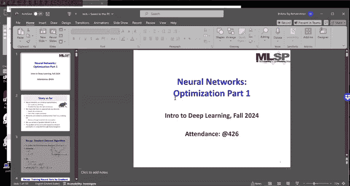
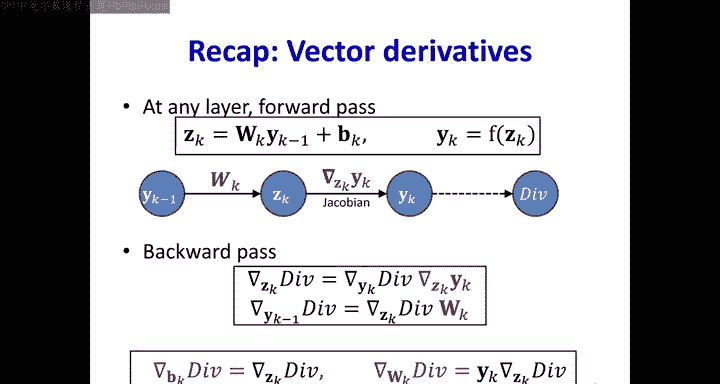
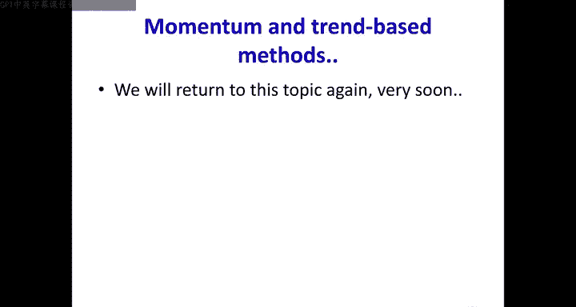

# 7：神经网络训练与优化 🧠

在本节课中，我们将要学习神经网络训练的核心过程——梯度下降法，并深入探讨其在实际应用中的收敛性、挑战以及一些高效的优化算法。我们将从回顾反向传播开始，分析梯度下降可能遇到的问题，并介绍如何通过调整学习率和使用更先进的优化器来改善训练效果。

---

## 神经网络训练回顾

上一节我们介绍了如何使用反向传播计算梯度。本节中，我们来看看梯度下降法如何利用这些梯度来更新网络权重，并开始探讨其有效性。

神经网络是通用函数逼近器，只要架构合适，它们可以模拟任何复杂函数。我们必须通过训练来学习权重，使网络能够逼近目标函数。训练的目标是最小化在训练集上定义的损失函数。

然而，最小化训练集上的损失，是否保证网络学到了正确的函数？我们真正希望最小化的是模型在整个数据分布上的期望误差，而我们实际做的只是在一小部分训练样本上最小化经验风险。我们使用梯度下降法进行这种最小化，而梯度则通过反向传播计算。

以下是训练的基本步骤：
1.  给定一组训练点，定义在所有训练点上的损失函数，即训练集上的平均误差。
2.  初始化所有网络参数。
3.  迭代计算损失函数相对于所有网络参数的梯度。
4.  沿着梯度的反方向更新所有网络参数。

反向传播用于计算关键的梯度项：损失相对于网络参数的导数。

---

## 反向传播规则与向量化更新

在上一节中，我们推导了反向传播的规则。本节中，我们通过向量化的形式来回顾这些更新规则，以便更清晰地理解信息在网络中的流动。

在网络中，每一层的计算如下：
*   **线性变换**：`Z_k = W_k * Y_{k-1} + b_k`
    *   其中 `Y_{k-1}` 是前一层的输出向量，`W_k` 是权重矩阵，`b_k` 是偏置向量，`Z_k` 是当前层的净输入。
*   **激活函数**：`Y_k = f(Z_k)`
    *   其中 `f` 是非线性激活函数。

通过这两个规则，我们可以从输入层逐步前向传播到输出层。最终，网络的输出会与期望输出进行比较，计算损失。每一个 `Y_k` 最终都会影响损失值。

在反向传播中，我们计算损失相对于各层参数的梯度。核心是利用链式法则：
*   损失 `L` 相对于 `Z_k` 的梯度：`∂L/∂Z_k = (∂L/∂Y_k) * (∂Y_k/∂Z_k)`
    *   这里 `∂Y_k/∂Z_k` 是激活函数的导数构成的雅可比矩阵。
*   损失 `L` 相对于 `Y_{k-1}` 的梯度：`∂L/∂Y_{k-1} = (∂L/∂Z_k) * W_k^T`
*   损失 `L` 相对于参数 `W_k` 和 `b_k` 的梯度：
    *   `∂L/∂W_k = Y_{k-1}^T * (∂L/∂Z_k)`
    *   `∂L/∂b_k = ∂L/∂Z_k`

通过这种方式，我们可以从输出层开始，逐层反向迭代，计算出所有参数的梯度。

---

## 梯度下降的局限性与挑战

我们已经知道如何使用反向传播计算梯度并进行参数更新。本节中，我们来看看梯度下降法本身是否存在局限，以及它是否总能找到最优解。

首先，反向传播这个术语有时被滥用来指代整个梯度下降算法，但它严格来说只是用于计算梯度的一部分。真正的问题是：梯度下降总能找到损失函数的正确最小值吗？

在分类问题中，我们最小化的损失函数（如交叉熵）只是分类错误率的一个可微代理。最小化这个代理损失，并不保证最小化真正的分类错误率。

考虑一个简单的线性可分二分类例子。如果使用感知机学习规则，它能找到一个完美的决策边界。但如果使用梯度下降最小化一个可微损失函数（如逻辑损失），当我们在正确类别一侧很远的地方加入一个“干扰”样本时，梯度下降可能不会为了完美分类这一个样本而大幅改变决策边界，从而容忍一个错误。

*   **感知机规则**：具有低偏差（如果解存在，它就能找到），但高方差（对单个数据点非常敏感，解可能剧烈变化）。
*   **梯度下降**：具有较高的偏差（可能无法找到完美解），但低方差（对噪声和异常值不敏感，解更稳定）。

因此，使用反向传播梯度训练的神经网络分类器，通常比训练数据上的最优分类器具有更低的方差。我们更偏好这种一致性而非对训练集的完美拟合。

另一个挑战是损失函数的形态。损失曲面可能非常复杂，存在许多局部最小值和鞍点。梯度下降可能会陷入某个局部最小值或鞍点而无法到达全局最小。
*   **鞍点**：在某些方向上是极小值，在另一些方向上是极大值，梯度为零。
*   **对于大型网络**：理论表明，许多局部最小值在损失值上彼此接近，并且与全局最小值相差不大，陷入一个局部最小值可能并非灾难。

---

## 收敛性分析：从凸函数到神经网络

梯度下降法一定会收敛吗？如果收敛，速度如何？由于神经网络是复杂的非线性函数，直接分析其训练动态非常困难。因此，我们通常先分析更简单的凸函数，以期获得一些洞见。

一个凸函数的定义是：连接函数图像上任意两点的线段都位于函数图像上方。凸函数具有良好的性质，例如只有一个全局最小值。

我们首先分析最简单的凸函数：二次函数。一个标量二次函数 `f(x) = 1/2 * a * x^2 + b * x + c`（`a > 0`）是一个开口向上的抛物线，有唯一最小值。

梯度下降的更新规则是：`x_{k+1} = x_k - η * f'(x_k)`，其中 `η` 是学习率。
*   **最优学习率**：当 `η = 1 / f''(x_k) = 1/a` 时，梯度下降一步就能到达最小值。
*   **学习率过小**：`η < 1/a`，会收敛，但需要更多步数。
*   **学习率过大**：`η > 2/a`，可能导致迭代发散。
*   **学习率在临界值**：`η = 2/a`，会在最小值两侧无限振荡。

对于非二次函数，我们可以在当前点 `x_k` 处用泰勒级数进行二次近似：`f(x) ≈ f(x_k) + f'(x_k)(x - x_k) + 1/2 f''(x_k)(x - x_k)^2`。此时，局部最优步长就是 `1 / f''(x_k)`。因此，选择合适的学习率至关重要。

---

## 多维情况与条件数问题

上一节我们分析了标量函数的收敛性。本节中，我们将其推广到多维情况，这会引入新的挑战——不同方向可能具有不同的最优学习率。

考虑一个轴对齐的二元二次函数：`f(x1, x2) = 1/2 * a11 * x1^2 + 1/2 * a22 * x2^2`。它的等高线是椭圆。
*   沿 `x1` 方向的最优步长是 `1 / a11`。
*   沿 `x2` 方向的最优步长是 `1 / a22`。

在标准梯度下降中，我们对所有参数使用**统一的学习率** `η`。这会导致问题：
*   如果 `η` 接近 `1/a11`（`x1`方向最优），但对 `x2` 方向来说可能太大（如果 `a22` 很小）或太小（如果 `a22` 很大）。
*   结果可能是：一个方向收敛很快，另一个方向收敛极慢甚至发散。

为了保证所有方向都收敛，学习率 `η` 必须小于**最陡峭方向**（对应最大 `a`，即最小最优步长）最优步长的两倍。但这意味着在平坦方向上的学习会非常缓慢。

**条件数**（最大特征值与最小特征值之比）衡量了曲率在不同方向上的差异程度。条件数越大（椭圆越扁），标准梯度下降的收敛就越慢。为了快速收敛，我们希望条件数接近1（等高线接近圆形）。

对于非二次函数，海森矩阵（二阶导数矩阵）的特征值决定了不同方向的曲率。同样，统一学习率会受到条件数的制约。

---

## 学习率调度与进阶优化算法

面对收敛速度慢或可能陷入不良局部最小值的问题，我们有哪些策略？本节介绍两种核心思路：动态调整学习率，以及为不同参数维度使用不同的学习率。

**1. 学习率衰减**
与其使用固定学习率，不如在训练过程中动态减小它。
*   **思路**：初期使用较大的学习率，有助于快速前进并可能跳出尖锐的局部最小值或鞍点；后期减小学习率，有助于稳定地收敛到宽阔的谷底。
*   **方式**：可以线性衰减、指数衰减、按步衰减等。

**2. 为不同维度适配不同学习率**
这是解决条件数问题的根本方法。目标是让每个参数都有自己的“学习步调”。以下是两个经典算法：

*   **RProp（弹性反向传播）**
    RProp 完全摒弃了梯度的大小，只利用其符号，并为每个权重维护一个独立的步长值。
    *   **核心规则**：
        1.  如果本次梯度的符号与上一次相同，说明方向正确，则增大该权重的步长（乘以一个因子 `α > 1`）。
        2.  如果本次梯度的符号与上一次相反，说明可能越过了极值点，则减小该权重的步长（乘以一个因子 `0 < β < 1`），并反转更新方向（或退回上一步）。
    *   **优点**：非常简单高效，对损失函数形状假设少，常能收敛到宽阔的极小值点。

*   **QuickProp（快速传播）**
    QuickProp 尝试近似每个参数的二阶导数（海森矩阵的对角线），从而使用类牛顿法的更新。
    *   **思路**：通过比较连续两次迭代的梯度和参数变化，来估计该维度上的曲率，并据此计算一个自适应的步长。
    *   **优点**：收敛速度通常快于标准梯度下降。

这些方法的核心思想是**解耦不同维度的更新**，根据每个参数自身的梯度行为来调整其步长。

---

## 动量法及其变体

除了RProp和QuickProp，另一类非常重要的优化算法是动量法。它通过引入“速度”的概念，来平滑梯度更新并加速收敛。

**动量法（Momentum）**
动量法模拟了物理中的动量概念。它维护一个速度向量 `v`，该向量是过去梯度的指数加权移动平均。
*   **更新规则**：
    `v_t = γ * v_{t-1} + η * ∇J(θ_t)`
    `θ_{t+1} = θ_t - v_t`
    *   `γ` 是动量系数（通常设为0.9），控制历史梯度的影响。
*   **作用**：
    *   在梯度方向持续一致的维度上，速度会累积，更新加快。
    *   在梯度方向频繁改变的维度上，梯度会相互抵消，速度减小，更新变慢。
    *   这相当于在各个维度上产生了自适应的学习率，有助于缓解条件数问题，并帮助穿过狭窄的鞍点区域。

**Nesterov 加速梯度（NAG）**
NAG 是动量法的一个改进版本，它具有“前瞻性”。
*   **更新规则**：
    `v_t = γ * v_{t-1} + η * ∇J(θ_t - γ * v_{t-1})`
    `θ_{t+1} = θ_t - v_t`
*   **区别**：NAG 在计算当前梯度时，不是基于当前位置 `θ_t`，而是基于“如果按照现有动量再前进一步”的预估位置 `θ_t - γ * v_{t-1}`。这使得更新更具前瞻性，能对梯度变化做出更灵敏的响应，通常比标准动量法收敛更快。

动量法和NAG是深度学习中最常用且有效的优化器之一，我们将在讨论随机梯度下降时进一步探讨。

---

## 总结

本节课中，我们一起深入探讨了神经网络训练的核心——梯度下降优化法。

我们首先回顾了反向传播如何计算梯度。然后分析了梯度下降的局限性：它最小化的是真实目标的一个可微代理，因此可能错过某些理论上的最优解，但这往往能带来更稳定、方差更低的模型，这有时是有益的。

接着，我们研究了收敛性问题。从简单的凸二次函数分析中，我们发现学习率的选择至关重要，存在一个最优值。在多维情况下，不同参数方向可能有不同的最优学习率，而标准梯度下降的统一学习率会受制于最坏方向的条件数，导致收敛缓慢。

为了克服这些挑战，我们介绍了多种策略：
1.  **学习率衰减**：在训练中动态降低学习率，以平衡探索与收敛。
2.  **维度解耦的优化器**：
    *   **RProp**：仅使用梯度符号，为每个权重独立调整步长，简单而强大。
    *   **QuickProp**：近似二阶信息，实现更快的收敛。
3.  **动量法**：通过累积历史梯度来平滑更新，在一致方向上加速，在振荡方向上减速，有效缓解条件数问题。其变体 **Nesterov 加速梯度** 通过前瞻性计算进一步提升了性能。

理解这些优化算法的原理和权衡，对于有效训练深度神经网络至关重要。在接下来的课程中，我们将把这些知识应用到更实际的**随机梯度下降**环境中。