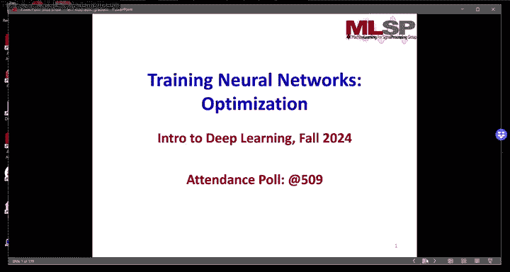
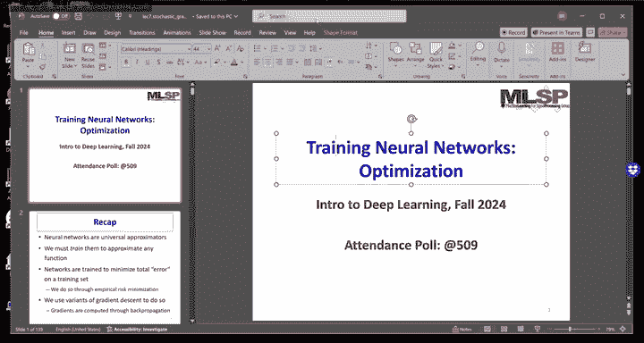
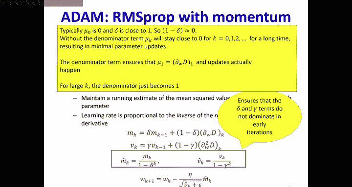
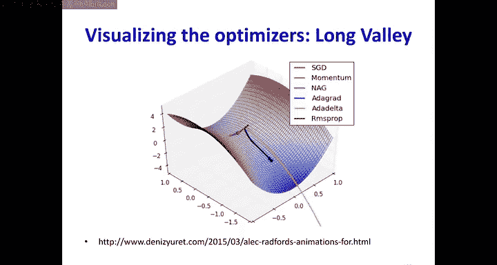

# 8：训练神经网络（续）📚

在本节课中，我们将继续学习如何训练神经网络。我们将深入探讨增量更新、随机梯度下降、小批量训练以及更高级的优化算法，如动量法和Adam。这些技术对于高效、稳定地训练深度神经网络至关重要。

---

## 从批量更新到增量更新 🔄

上一节我们介绍了通过梯度下降最小化损失函数来训练神经网络。这种方法通常需要处理整个训练集来计算平均梯度，然后才更新一次参数，这被称为**批量更新**。

然而，当训练集非常庞大（例如数十亿个样本）时，每次迭代都处理所有数据在计算上是不可行的。此外，批量更新可能收敛缓慢。

本节中我们来看看一种更实用的方法：**增量更新**。其核心思想是，我们不等待处理完所有数据，而是每看到一个训练样本（或一小批样本）就立即更新一次网络参数。

以下是增量更新的基本步骤：
1.  随机打乱训练数据的顺序。
2.  依次遍历每个训练样本（或小批量）。
3.  对于每个样本，计算其损失相对于网络参数的梯度。
4.  立即使用这个梯度（乘以学习率）来更新网络参数。
5.  重复此过程多次（多个轮次）。

这种方法计算效率更高，并且通常能更快地减少训练初期的损失。

---

## 随机梯度下降（SGD）🎲

当增量更新的批量大小为1时，我们称之为**随机梯度下降**。之所以称为“随机”，是因为我们以随机顺序呈现训练样本。

SGD的更新公式可以表示为：
`θ = θ - η * ∇J(θ; x_i, y_i)`
其中：
*   `θ` 代表网络参数。
*   `η` 是学习率。
*   `∇J(θ; x_i, y_i)` 是单个训练样本 `(x_i, y_i)` 的损失梯度。

**关键点**：
*   **随机性**：必须随机化样本顺序，否则可能导致循环振荡，无法收敛。
*   **学习率衰减**：为了确保最终收敛，学习率必须随着迭代进行而衰减。一个常见的要求是学习率序列 `{η_t}` 满足：`∑ η_t = ∞` 且 `∑ η_t^2 < ∞`。例如，`η_t = 1/t` 就满足这个条件。
*   **方差大**：由于每次更新只基于一个样本，梯度估计的**方差很大**。这导致损失曲线波动剧烈，但有时能帮助模型跳出局部最优解。

---

## 小批量梯度下降 ⚖️

SGD虽然计算快，但梯度估计的高方差可能导致收敛不稳定，甚至收敛到较差的解。一个自然的折中方案是使用**小批量梯度下降**。

在小批量梯度下降中，我们不是处理单个样本，也不是处理整个数据集，而是每次处理一小批（例如32、64、128个）随机样本。

其更新公式为：
`θ = θ - η * (1/B) * ∑ ∇J(θ; x_i, y_i)`， 其中求和针对当前小批量中的B个样本。

**优点**：
1.  **降低方差**：相对于SGD，基于一批样本的梯度估计方差更小，更新方向更稳定。
2.  **硬件友好**：现代GPU等硬件可以高效并行处理小批量数据，计算速度远快于逐个处理样本。
3.  **收敛更优**：通常能比SGD收敛到更好的解，同时比批量更新更快。

在实践中，**小批量大小通常设置为你的硬件（如GPU内存）所能支持的最大值**，以在降低方差和利用并行计算之间取得最佳平衡。

---

## 高级优化算法：动量法与Adam 🚀

无论是SGD还是小批量梯度下降，在复杂损失曲面上都可能遇到问题，例如在峡谷状区域振荡或在平坦区域缓慢前进。高级优化算法旨在解决这些问题。

### 动量法（Momentum）

动量法的灵感来自于物理学中的动量。它引入了一个速度变量 `v`，用于累积过去的梯度信息。更新规则如下：
`v_t = β * v_{t-1} + (1 - β) * ∇J(θ_t)`
`θ_{t+1} = θ_t - η * v_t`
其中 `β` 是动量系数（通常为0.9），控制着历史梯度的影响程度。

**作用**：
*   在梯度方向持续一致的维度上，更新速度会加快。
*   在梯度方向频繁改变的维度上，更新会因正负抵消而减缓。
*   这有助于加速收敛并减少振荡。

### RMSProp

RMSProp 自适应地调整每个参数的学习率。它为每个参数维护一个梯度平方的指数移动平均值，并以此调整该参数的学习步长。
`E[g^2]_t = γ * E[g^2]_{t-1} + (1 - γ) * (∇J(θ_t))^2`
`θ_{t+1} = θ_t - η / (√(E[g^2]_t + ε)) * ∇J(θ_t)`
其中 `γ` 是衰减率，`ε` 是一个很小的数（如1e-8）防止除零。

**作用**：
*   在梯度大的参数方向，降低学习率，避免震荡。
*   在梯度小的参数方向，提高学习率，加速更新。
*   解决了不同参数尺度差异大的问题。

### Adam（自适应矩估计）

Adam 结合了动量法和RMSProp的思想，可以说是当前最流行、默认的优化器之一。它同时计算梯度的一阶矩（均值，类似动量）和二阶矩（未中心化的方差，类似RMSProp）。
`m_t = β1 * m_{t-1} + (1 - β1) * g_t`
`v_t = β2 * v_{t-1} + (1 - β2) * g_t^2`
`m̂_t = m_t / (1 - β1^t)`
`v̂_t = v_t / (1 - β2^t)`
`θ_{t+1} = θ_t - η * m̂_t / (√(v̂_t) + ε)`

**作用**：
*   **兼具两者优点**：像动量法一样加速在稳定方向的前进，像RMSProp一样自适应调整每个参数的学习率。
*   **偏差校正**：公式中的 `m̂_t` 和 `v̂_t` 是对初始零值估计的偏差进行校正，使得初期更新更准确。
*   **通常表现优异**：在多种任务上都能实现快速且稳定的收敛。

---

## 总结 📝

本节课中我们一起学习了如何更高效地训练神经网络。

1.  **从批量到增量**：我们了解到，为了处理大数据集，需要从批量更新转向增量更新。
2.  **SGD与小批量**：**随机梯度下降**是增量更新的极端形式（批量大小为1），它计算快但方差高。**小批量梯度下降**是更实用的选择，在计算效率和稳定性之间取得了平衡。
3.  **优化算法的演进**：基础的梯度下降存在收敛问题。**动量法**通过累积历史梯度来加速收敛并抑制振荡。**RMSProp**通过自适应调整每个参数的学习率来应对不同尺度的梯度。**Adam**综合了动量法和RMSProp的优点，成为目前广泛使用的强大优化器。

理解这些优化算法的原理，将帮助你在实际项目中根据具体问题选择合适的训练策略，从而更有效地训练你的深度学习模型。