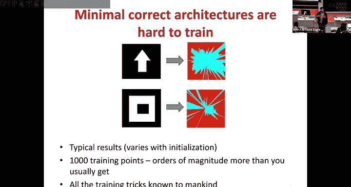
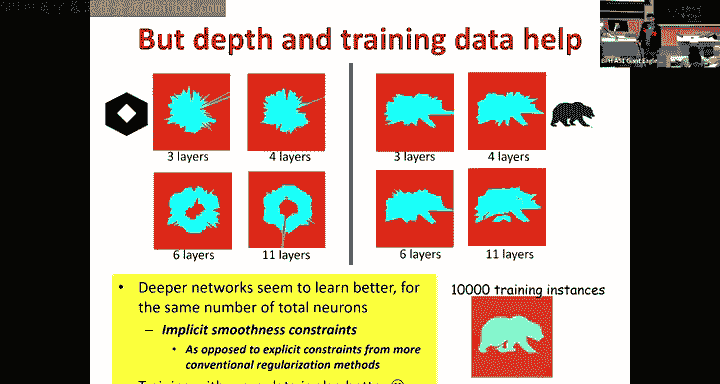
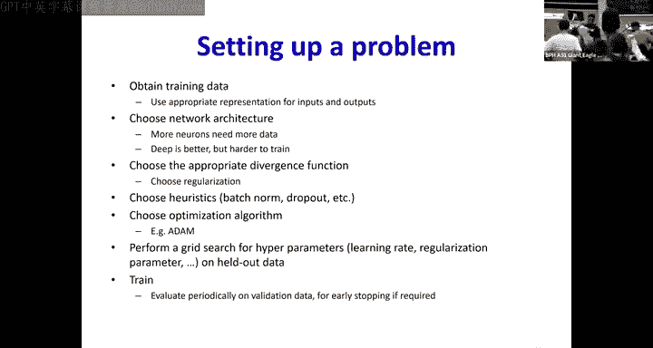

# 9：神经网络训练技巧 🧠

在本节课中，我们将学习神经网络训练的最后一部分内容，包括损失函数的选择、批归一化、正则化以及Dropout等关键技术。这些技巧对于提升模型性能、加速收敛和防止过拟合至关重要。

---

## 损失函数与收敛性 🔍

上一节我们讨论了梯度下降和优化算法。本节中，我们来看看损失函数的选择如何影响网络的收敛。

我们通过最小化损失函数来训练网络。损失函数是网络参数的函数，它计算一批训练样本上的平均差异。我们真正希望最小化的是在整个数据分布上的期望差异。

我们通过梯度下降进行最小化，即沿着梯度的反方向迭代更新参数。理想情况下，损失函数的形状应能引导算法找到最优解。

以下是几种损失函数形状的对比：
*   **左侧函数**：形状崎岖不平，不利于优化。
*   **中间函数**：在远离最小值时梯度平缓，接近最小值时梯度陡峭，容易在最优解附近震荡。
*   **右侧函数**：远离最小值时梯度大，更新步长大；接近最小值时梯度变小，更新步长变谨慎。这是我们期望的二次型（碗状）形状。

我们主要使用两种损失函数：
*   **L2损失（均方误差）**：用于回归任务，预测实数值输出。公式为：`L = (y_pred - y_true)^2`
*   **KL散度（交叉熵损失）**：用于分类任务，输出是概率。公式涉及对数概率。

一个关键问题是：在分类任务中，为什么使用KL散度而不是形状更好的L2损失？

虽然从网络最终输出（概率）的角度看，L2损失形状更优，但从网络倒数第二层线性输出 `Z` 的角度看，情况正好相反。KL散度作为 `Z` 的函数呈现出良好的凸性（碗状），而L2损失作为 `Z` 的函数则形状不佳。由于 `Z` 是权重和上一层输出的线性组合（`Z = W * y_prev`），损失函数关于 `Z` 的凸性意味着关于权重 `W` 也是凸的，这更有利于优化。因此，在分类任务中我们使用KL散度。

此外，无论使用L2还是KL损失，损失关于最终线性项 `Z` 的导数都是预测误差 `(y_pred - y_true)`，这也是误差反向传播名称的由来。

---

## 批归一化（Batch Normalization）⚖️

我们使用小批量随机梯度下降来加速训练，其基本假设是每个小批量都能代表整体数据分布。但由于神经网络的非线性特性，即使输入相似，经过几层网络后，不同批次的激活值分布也可能产生很大差异（协变量偏移）。这导致在一个小批量上的优化不能很好地反映整体情况。

批归一化的核心思想是：在每一层的激活函数之前，对小批量数据的分布进行标准化，使其具有零均值和单位方差，然后通过可学习的参数进行缩放和偏移，将其调整到网络该层应有的分布。

具体操作如下：
1.  计算小批量数据的均值 `μ` 和方差 `σ^2`。
2.  对数据进行标准化：`u = (z - μ) / sqrt(σ^2 + ε)`，其中 `ε` 是为防止除零的小常数。
3.  对标准化后的数据进行缩放和偏移：`z_hat = γ * u + β`。其中 `γ` 和 `β` 是可学习的参数。

由于均值 `μ` 和方差 `σ^2` 依赖于整个小批量的数据，反向传播的计算会变得复杂。我们需要计算损失关于每个原始输入 `z_i` 的梯度，这涉及到 `z_i` 通过 `μ` 和 `σ^2` 对所有标准化输出 `u_j` 的影响。

批归一化能带来诸多好处：
*   允许使用更大的学习率。
*   减少对参数初始化的依赖。
*   在一定程度上起到正则化的效果。

**重要注意事项**：
*   批归一化依赖于小批量内的数据多样性。如果一个小批量内所有实例相同或极其相似，梯度可能会消失，阻碍训练。
*   在推理阶段，我们不再有小批量。通常使用训练阶段所有小批量统计的移动平均值作为推理时的 `μ` 和 `σ^2`。

---

## 正则化与权重衰减 🛡️

神经网络是通用函数逼近器，有能力完美拟合训练数据，导致过拟合。例如，一个复杂的网络可能学会一个在训练点上完全正确，但在其他区域极不合理的函数。

过拟合通常由具有过大权重的神经元导致，它们会产生非常陡峭的激活。为了防止过拟合，我们希望对模型的复杂度进行约束。

一种常见的方法是在损失函数中添加一个正则化项，惩罚大的权重。这被称为 **L2正则化** 或 **权重衰减**。

修改后的损失函数为：`L_total = L_data + (λ/2) * ||W||^2`
其中 `L_data` 是原始数据损失，`λ` 是控制正则化强度的超参数。

这轻微地改变了权重更新规则。新的梯度包含两部分：原始的反向传播梯度加上 `λ * W`。因此，权重更新公式变为：
`W_new = W - η * (∇L_data + λW) = (1 - ηλ)W - η * ∇L_data`
可以看到，在每次更新前，权重会先乘以一个小于1的因子 `(1 - ηλ)`，从而实现“衰减”，然后再用梯度进行修正。

此外，网络深度本身也是一种隐式的正则化。对于相同数量的参数，更深的网络往往比更宽的网络学习到更平滑、泛化更好的函数。

---

## Dropout：随机失活 🎲

在深度学习流行之前，集成学习（如Bagging）被证明能提升模型性能。其思想是：从训练数据中随机抽取多个子集，分别训练不同的模型，然后对它们的预测进行投票。

Dropout可以看作是在单个神经网络中实现Bagging的一种高效近似。在训练过程中，对于每个输入样本，我们以概率 `p`（例如0.5）随机“丢弃”（即暂时移除）网络中的每个神经元。这意味着：
*   每个输入样本看到的是不同的、更薄的子网络。
*   每次迭代时，被丢弃的神经元集合都可能不同。

**Dropout为何有效？**
1.  **集成学习的视角**：一个具有 `N` 个神经元的网络，通过Dropout可以产生 `2^N` 个可能的子网络。训练过程相当于同时在训练所有这些共享参数的子网络，并在推理时对它们的输出进行平均。
2.  **防止协同适应**：没有Dropout时，某些神经元可能变得冗余，或者层与层之间可能形成固定的依赖路径。Dropout迫使每个神经元不能过分依赖于少数其他神经元，必须学习更鲁棒的特征。

**实现细节**：
*   训练时，对每个神经元应用一个伯努利掩码（0或1）。
*   反向传播时，只通过未被丢弃的神经元传递梯度。
*   推理时，我们需要近似所有可能子网络的平均输出。一个简单而有效的做法是：在训练时，将每个神经元的输出乘以 `(1-p)`（即保留概率）；在推理时，则直接使用完整的网络。另一种等价做法是：训练时不做调整，推理时将每一层的权重乘以 `(1-p)`。

Dropout是一种非常强大的正则化技术，但它可能与批归一化产生冲突，因此在实际中需要谨慎搭配使用。

---

## 其他训练技巧与总结 📝

除了上述主要技术，还有一些其他有用的训练启发式方法：

*   **早停（Early Stopping）**：在训练过程中，定期在验证集上评估模型性能。当验证集性能不再提升甚至开始下降时，停止训练，以防止过拟合。
*   **梯度裁剪（Gradient Clipping）**：当损失函数的梯度变得非常大时，单个批次或样本可能导致参数更新剧烈，破坏训练稳定性。梯度裁剪通过限制梯度向量的范数来解决这个问题。
*   **数据增强（Data Augmentation）**：通过对训练数据应用随机变换（如旋转、裁剪、颜色抖动等）来人工增加数据量和多样性，这是提升模型泛化能力的有效手段。

---

**本节课总结**：
在本节课中，我们一起学习了神经网络训练的最后一系列关键技巧。我们探讨了损失函数（特别是KL散度）对优化过程凸性的影响；深入分析了批归一化如何通过标准化层间输出来稳定和加速训练；介绍了通过权重衰减进行正则化来防止过拟合；并详细解释了Dropout这一强大的随机正则化方法及其集成学习的本质。掌握这些技巧对于成功训练深度神经网络至关重要。下一节课，我们将开始学习卷积神经网络。