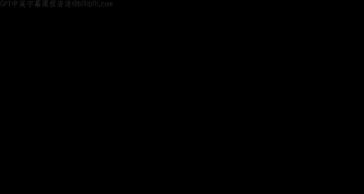
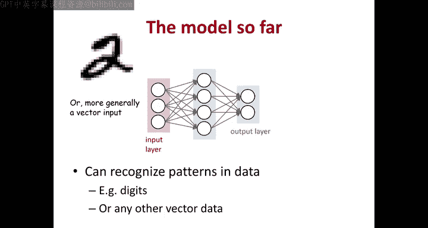
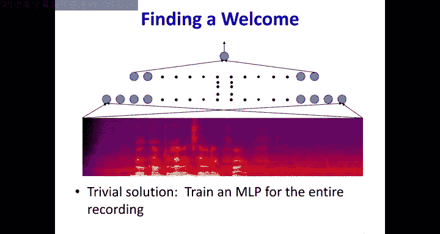
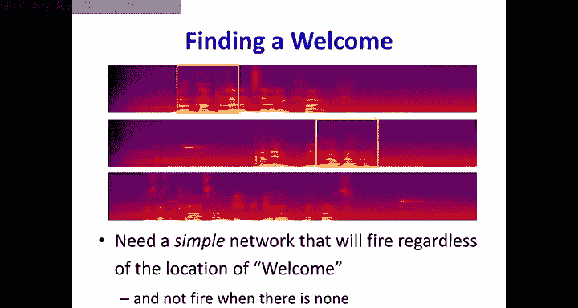
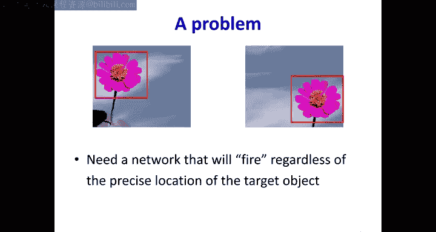
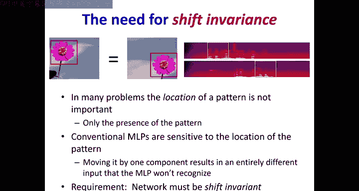
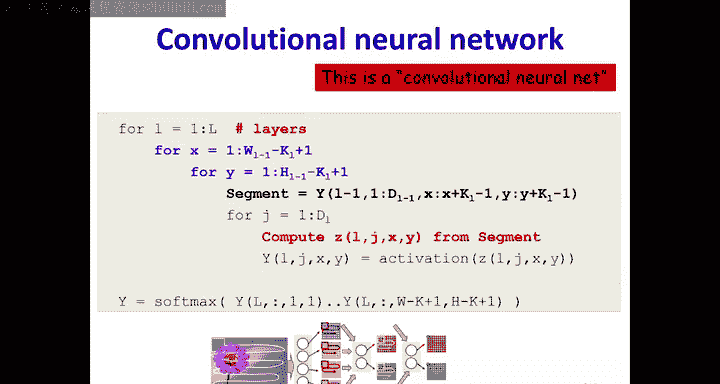
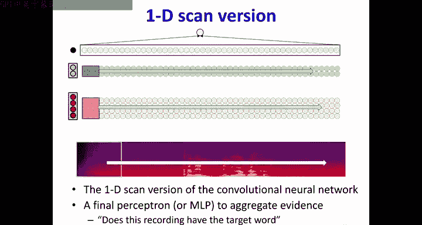
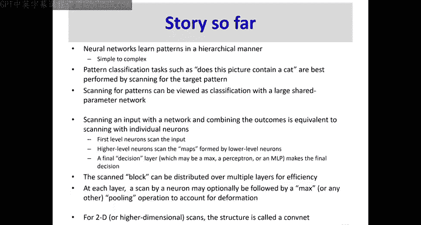

# 10：卷积神经网络（CNN）基础 🧠







在本节课中，我们将要学习如何构建一种能够识别模式（如唤醒词或图像中的花朵）的神经网络，并且这种识别不受模式在输入中具体位置的影响。我们将从简单的多层感知机（MLP）扫描方法开始，逐步推导出卷积神经网络（CNN）的核心思想。



---





## 概述：从位置敏感到位置不变

我们之前看到，多层感知机（MLP）是通用的函数逼近器，可以建模分类器和回归器。然而，传统的MLP对输入模式的位置非常敏感。例如，一个训练用于识别位于录音开头的单词“welcome”的MLP，可能无法识别位于录音中部的同一个单词，因为输入向量中激活的组件完全不同。

本节中，我们将探讨如何通过“扫描”输入并共享参数，来构建对模式位置不敏感的网络，这正是卷积神经网络的基础。

---

## 1. 问题：为什么需要位置不变性？

考虑两个任务：
1.  **语音唤醒词检测**：判断一段录音中是否包含“welcome”这个词。
2.  **图像花朵检测**：判断一张图片中是否包含一朵花。

如果使用一个大的MLP来处理整个输入（整段录音或整张图片），网络会学习到模式出现的**精确位置**。如果模式出现在训练时未见过的位置，网络很可能无法识别它，因为新的输入位于一个完全不同的子空间。

**核心需求**：我们需要的网络应该只关心模式**是否存在**，而不关心它具体出现在哪里。

---

## 2. 解决方案：扫描与共享参数

一个直观的解决方案是：我们不再用一个大网络处理整个输入，而是用一个较小的、能识别目标模式（如单词或花朵）的MLP去**扫描**输入。

以下是具体步骤：
1.  定义一个能覆盖目标模式大小（例如，单词长度或花朵尺寸）的MLP。
2.  将这个MLP像滑动窗口一样，在输入（时间轴或图像空间）上逐步移动。
3.  在每个窗口位置，MLP都会输出一个值（例如，该位置存在目标的概率）。
4.  最后，我们收集所有窗口位置的输出，并通过一个**聚合操作**（如取最大值 `max` 或使用一个小的MLP）来得到最终判断。

**关键洞察**：
*   这个“扫描”过程等价于构建一个**巨大的、共享参数的MLP**。
*   所有扫描窗口使用的子MLP都是**完全相同**的，即它们共享同一套权重参数。
*   这种参数共享强制网络学习**位置不变的特征**。

**公式/代码描述**：
假设扫描窗口函数为 `MLP_window`，输入为 `X`，步长为 `stride`，则扫描过程可表示为：
```python
outputs = []
for i in range(0, len(X) - window_size + 1, stride):
    window = X[i:i+window_size]
    outputs.append(MLP_window(window))
final_output = aggregate(outputs) # 例如 max(outputs)
```

---

## 3. 计算重排：从扫描MLP到特征图

上一节我们介绍了通过扫描MLP实现位置不变性的概念。本节中我们来看看如何重新组织计算流程，这能更清晰地揭示CNN的结构。

我们可以改变计算顺序，而不影响最终结果：
*   **原始顺序**：在每个位置，取出一个输入窗口，然后让这个窗口数据**逐层**通过整个MLP。
*   **等价顺序**：让**第一层的所有神经元**先独立工作，各自扫描整个输入，生成一张“特征图”（feature map）。这张图上的每个点对应输入中某个位置，该神经元对该位置的响应。

然后，第二层的神经元不再直接看原始输入，而是**联合扫描**第一层所有神经元生成的特征图。以此类推。

**优势**：
*   **计算可视化**：每一层都在生成对输入的一种新“解读”或特征图。
*   **为参数分布奠定基础**：这种视角让我们可以更容易地将识别大模式的责任**分布**到多个网络层中。

---

## 4. 参数分布：构建层次化特征

让第一层神经元直接识别整个花朵（或单词）可能负担过重且不灵活。更好的方法是构建一个层次化的特征检测系统。

**分布式检测流程**：
1.  **第一层**：神经元只检测非常小的、基础的局部模式（例如，图像中的边角、纹理；语音中的音素片段）。它们扫描输入，生成多个基础特征图。
2.  **第二层**：神经元接收来自第一层特征图的**一个小窗口**（例如2x2区域）。通过组合这些基础特征（如几个边角），它可以检测更复杂的模式（如一个花瓣的轮廓）。
3.  **更高层**：重复此过程。每一层都通过组合下一层的特征，来检测更大、更复杂的模式（例如，由花瓣组成的花朵）。

**核心概念**：
*   **感受野**：一个神经元“看到”的原始输入区域的大小。随着层数加深，神经元的感受野会变得越来越大。
*   **权重共享**：在每一层内，用于扫描的神经元（滤波器）在不同位置使用的是**相同的权重**。这极大地减少了参数量。

**公式/代码描述**：
对于第 `l` 层的卷积操作（简化）：
`output_map[l][x] = activation( sum( weight[l] * output_map[l-1][x:x+k] ) + bias[l] )`
其中 `k` 是滤波器大小，`weight[l]` 在该层所有位置共享。

---

## 5. 优势：为何使用这种分布式结构？

分布参数不仅是一种不同的组织方式，它带来了实实在在的好处：



1.  **层次化与泛化性**：强制网络学习从简单到复杂的层次化特征表示，这与许多自然信号（如图像、语音）的结构相符，通常能带来更好的模型泛化能力。
2.  **参数效率**：通过权重共享，参数量大幅减少。例如，一个直接处理8维输入窗口的层需要约 `8*D*N1` 个参数（D为输入维度，N1为神经元数）。而将其分布到两个各看2维输入的层，仅需约 `2*D*N1 + 2*N1*N2` 个参数，当输入维度D较大时，节省非常显著。
3.  **计算效率**：由于参数共享和滑动窗口的重叠，中间计算结果可以被大量重用，减少了总体计算量。
4.  **训练便利性**：我们仍然只需要图像级别的标签（“有花”/“无花”），而不需要标注花朵的精确位置。通过反向传播和共享权重的梯度聚合，网络能自动学习在特征图中定位模式。



---

## 6. 术语与扩展概念

最后，我们来统一一下术语，并介绍两个关键概念：

*   **滤波器**：每一层中用于扫描的共享权重组，负责检测一种特定的模式。
*   **特征图**：一个滤波器在整个输入上扫描后产生的输出矩阵。
*   **展平**：在卷积层堆叠结束后，将最终的特征图拉平成一个长向量，以便输入给传统的全连接层或Softmax层进行分类。

**过渡到下一步**：上述结构已经具备了CNN的雏形。但为了获得更强的鲁棒性，我们还需要引入以下操作：

*   **步长**：滑动窗口移动的间隔。步长大于1可以降采样，减少计算量和特征图尺寸。
*   **池化**：通常跟在卷积层之后。在一个小区域（如2x2）内进行**下采样**，常用最大池化（`Max Pooling`），即取该区域内的最大值。这能提供一定程度的**平移不变性**（即使目标轻微移动，仍能被捕获），并进一步减少数据维度。

**公式/代码描述**：
最大池化（2x2，步长2）：
`pooled_output[x, y] = max(input[2x:2x+2, 2y:2y+2])`

---

## 总结

本节课中我们一起学习了卷积神经网络的核心思想及其演变过程：
1.  我们从**位置敏感性问题**出发，提出了用MLP**扫描**输入并聚合结果的解决方案。
2.  我们发现这等价于一个**共享参数**的大型网络。
3.  通过**重排计算顺序**，我们得到了“特征图”的概念，每一层都在生成输入的一种新表示。
4.  将识别大模式的任务**分布**到多个网络层，形成了层次化的特征检测结构，这大大提升了**参数和计算效率**，并鼓励学习更**泛化**的特征。
5.  我们介绍了**感受野**、**滤波器**、**步长**和**池化**等关键术语与概念。



本质上，卷积神经网络是一个精心设计的、参数共享的MLP，它通过扫描和层次化处理，高效地实现了对平移不变模式的学习。在接下来的课程中，我们将深入探讨CNN的具体架构和训练细节。