# 11：卷积神经网络（CNN）📚

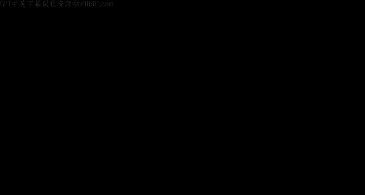

在本节课中，我们将学习卷积神经网络（CNN）的起源、核心概念和基本结构。我们将从生物视觉系统的工作原理出发，了解CNN如何受此启发而构建，并最终掌握其核心组件——卷积层和池化层的工作原理。

---

## 概述：从猫的视觉到人工神经网络 🐱➡️🧠

卷积神经网络并非凭空产生，其设计灵感源于对哺乳动物（特别是猫）视觉系统的科学研究。本节我们将回顾这段历史，理解视觉信息是如何在大脑中被分层处理的。

1959年，Hubel和Wiesel通过研究猫的视皮层（相当于人类的V1皮层），首次揭示了视觉处理的神经基础。他们发现，视皮层中的单个神经元并不响应视网膜上的所有光点，而只对特定小区域内的特定方向的光线模式（如竖线、横线）产生反应。每个神经元都有一个“感受野”。

他们进一步发现，视皮层中存在两级处理：**简单细胞（S细胞）** 负责检测特定方向的线性光模式；**复杂细胞（C细胞）** 则接收多个S细胞的输入，通过类似“最大响应”的机制来清理S细胞的输出，使其对噪声和微小位置变化更加鲁棒。这种S-C细胞层级结构，为后续的复杂模式识别奠定了基础。

---

## 从生物模型到计算模型：认知机与神经认知机 🧩

上一节我们介绍了生物视觉的基础。本节中我们来看看研究人员如何将这些原理转化为计算模型。

1980年，福岛邦彦（Kunihiko Fukushima）提出了**神经认知机（Neocognitron）**，这是第一个受Hubel和Wiesel模型启发的计算视觉模型。该模型由多个**块（Block）** 堆叠而成，每个块内部包含两层：
*   **S层**：模拟简单细胞，使用可学习的参数来检测特定模式。
*   **C层**：模拟复杂细胞，执行固定的最大池化操作，对S层的输出进行下采样和鲁棒化处理。

神经认知机的关键创新在于**权重共享**：在同一个S层平面内，所有神经元使用相同的参数。这意味着无论模式出现在图像的哪个位置，只要该平面负责检测该模式，总会有某个神经元被激活，从而实现了**位置不变性**。这个模型通过无监督的赫布学习进行训练，能够自动从图像中学习到有意义的语义概念（如数字）。

---

## 引入监督学习：LeNet与CNN的诞生 🖼️➡️🔢

神经认知机展示了无监督学习视觉概念的潜力。然而，对于许多实际任务（如分类），我们需要明确的监督信号。本节我们来看看如何将监督学习引入这个框架。

答案很简单：在神经认知机的末端添加一个全连接层（如Softmax分类器），并使用带标签的数据进行训练。通过反向传播算法，整个网络（包括前面的S层参数）都可以被有监督地训练。这就是**卷积神经网络（CNN）** 的雏形。

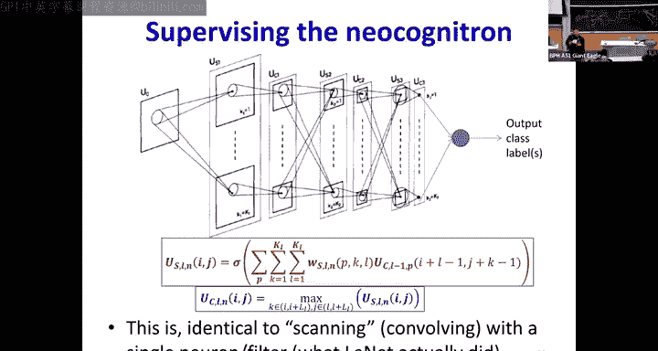

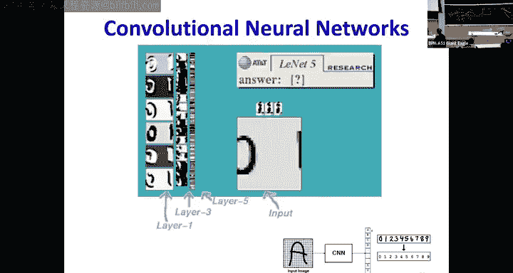


Yann LeCun在20世纪80年代末至90年代初的工作（尤其是LeNet网络）是这一方向的里程碑。他成功地将CNN应用于美国邮政服务的手写数字识别（MNIST数据集），取得了巨大成功。在他的模型中：
*   **S层**被实现为**卷积层**，通过可学习的滤波器扫描输入。
*   **C层**被实现为**池化层**（通常是最大池化），执行下采样。

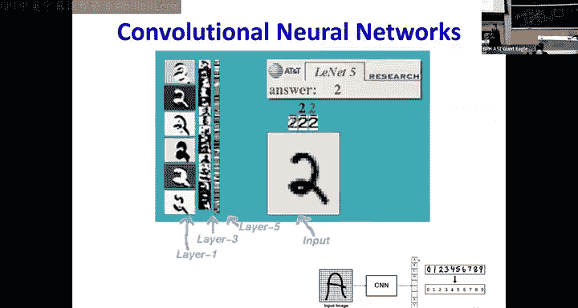

以下是卷积操作的核心公式。对于一个输入图像（或特征图）`X`和一个滤波器（核）`W`，在位置`(i, j)`的输出（在加偏置`b`和应用激活函数`σ`之前）为：

```
Z[i, j] = ∑_m ∑_n X[i+m, j+n] * W[m, n] + b
```
然后应用激活函数得到特征图：`A[i, j] = σ(Z[i, j])`。

在代码中，这通常通过高效的张量操作实现。一个简化的概念性伪代码如下：
```python
# 假设 input 形状为 (C_in, H_in, W_in), filter 形状为 (C_out, C_in, K, K)
output = zeros(C_out, H_out, W_out)
for c_out in range(C_out): # 对于每个输出通道（每个滤波器）
    for i in range(H_out):
        for j in range(W_out):
            # 提取输入的感受野区域
            receptive_field = input[:, i:i+K, j:j+K] # 形状 (C_in, K, K)
            # 计算点积并求和（加上偏置）
            output[c_out, i, j] = sum(receptive_field * filter[c_out, :, :, :]) + bias[c_out]
# 随后对 output 应用激活函数，如 ReLU
```

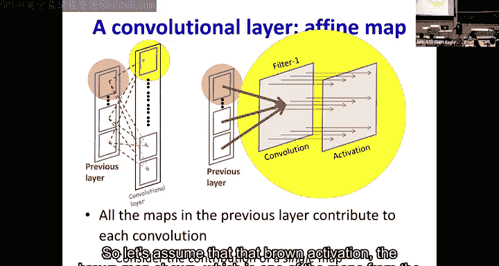

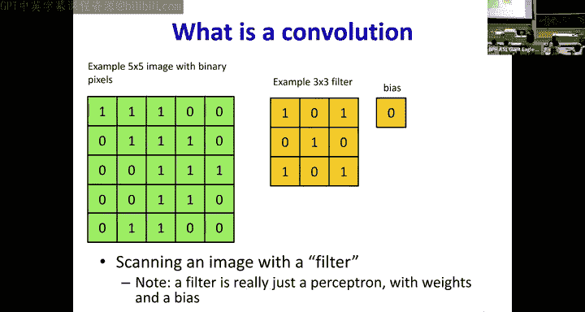

---

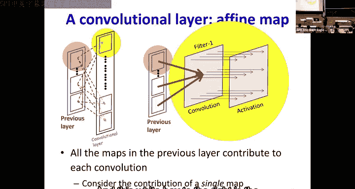


## CNN的核心组件详解 ⚙️

我们已经了解了CNN的历史和整体框架。现在，让我们深入探讨其两个核心组件的细节：卷积层和池化层。

### 卷积层（Convolutional Layer）

卷积层是CNN中可学习的部分，负责提取特征。

以下是卷积层的关键特性：
*   **滤波器（核）**：每个滤波器是一个小的权重矩阵（如3x3, 5x5），用于检测一种特定的局部模式（如边缘、纹理）。
*   **通道**：输入可以有多个通道（如RGB图像的3个通道）。每个滤波器也会具有相应的深度，同时处理所有输入通道的信息。
*   **输出特征图**：每个滤波器扫描整个输入，生成一张**输出特征图**。输出特征图的数量等于滤波器的数量。
*   **步长（Stride）**：滤波器每次移动的像素数。步长为1是常见选择，步长大于1会减少输出尺寸。
*   **填充（Padding）**：在输入周围添加零值像素，通常用于控制输出特征图的大小（例如，保持与输入尺寸相同）。

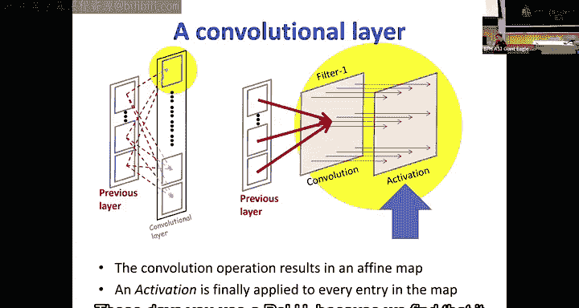

### 池化层（Pooling Layer）

池化层通常跟在卷积层之后，用于降低特征图的空间尺寸，增强特征的鲁棒性。

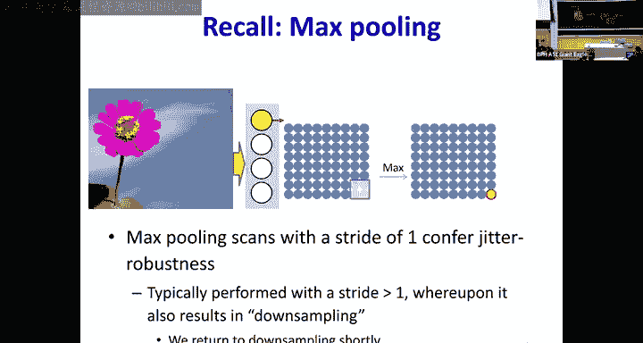

以下是池化层的关键特性：
*   **操作**：最常见的是**最大池化（Max Pooling）**，它在一个小窗口（如2x2）内取最大值。也有平均池化等其他形式。
*   **作用**：
    1.  **下采样**：减少数据量和计算复杂度。
    2.  **平移不变性**：使特征对微小的位置变化不敏感。
    3.  **扩大感受野**：使后续层能够基于更广阔的区域进行判断。
*   **实现细节**：在反向传播时，需要记录最大值所在的位置，以便将梯度正确地传回。

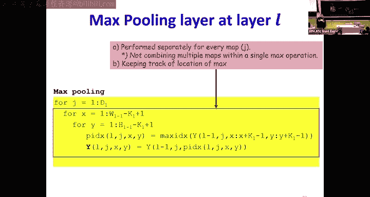

---

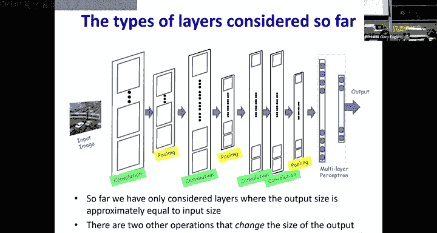

## 特征图尺寸变换：下采样与上采样 🔽🔼

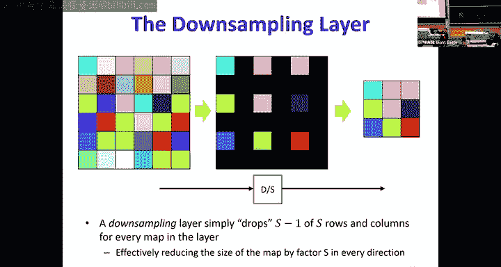

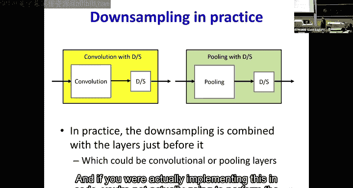

在网络的前向传播过程中，特征图的尺寸会发生变化。理解这些操作对设计网络结构至关重要。

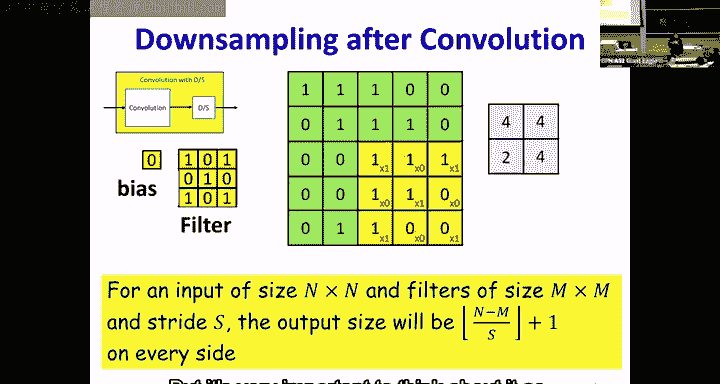

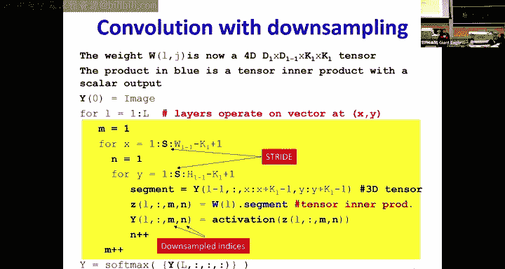

### 下采样（Downsampling）

下采样用于减少特征图的空间尺寸。

以下是实现下采样的主要方式：
*   **池化操作**：最大池化或平均池化在操作时，如果步长大于1，会直接实现下采样。
*   **带步长的卷积**：卷积层也可以设置步长大于1，在提取特征的同时进行下采样。
*   **简单丢弃**：理论上可以直接每隔S个像素保留一个，但实践中通常与卷积或池化合并。

### 上采样（Upsampling）

上采样用于增加特征图的空间尺寸，常见于图像分割、生成等任务。

以下是上采样的常见方法：
*   **最近邻插值**：复制相邻像素的值。
*   **双线性/双三次插值**：基于周围像素进行加权平均。
*   **转置卷积（Transposed Convolution）**：一种可学习的上采样方法，通过学习的滤波器来“填充”扩大的区域。
*   **反池化（Unpooling）**：与最大池化对应，将值放回池化前记录的最大值位置，其他位置填零。

一个典型的上采样（如最近邻插值，因子为2）的简单伪代码示例如下：
```python
def upsample_nearest(input, scale_factor=2):
    H, W = input.shape
    new_H, new_W = H * scale_factor, W * scale_factor
    output = np.zeros((new_H, new_W))
    for i in range(new_H):
        for j in range(new_W):
            # 找到在原始输入中对应的位置
            src_i = i // scale_factor
            src_j = j // scale_factor
            output[i, j] = input[src_i, src_j]
    return output
```

**重要关系**：为了在多次下采样后不丢失过多信息，网络通常会**增加通道数**。这样，尽管空间尺寸（高度、宽度）减小，但信息容量（通过更多的特征图）得以保持。当需要上采样恢复细节时，这些丰富的通道信息可以提供必要的上下文。

---

## 构建一个典型的CNN分类网络 🏗️

现在，让我们把所有这些组件组合起来，看一个用于图像分类的典型CNN结构示例。

一个经典的顺序可能是：
1.  **输入**：RGB图像（3通道）。
2.  **卷积块1**：
    *   卷积层（如：32个3x3滤波器，填充1，步长1） + ReLU激活。
    *   池化层（如：2x2最大池化，步长2）。
3.  **卷积块2**：
    *   卷积层（如：64个3x3滤波器，填充1，步长1） + ReLU激活。
    *   池化层（如：2x2最大池化，步长2）。
4.  **卷积块N**：可以重复更多次，每次通常增加滤波器数量。
5.  **展平层**：将最后的二维特征图转换为一维向量。
6.  **全连接层**：一个或多个传统的神经网络层，用于最终分类。
7.  **输出层**：Softmax层，输出每个类别的概率。

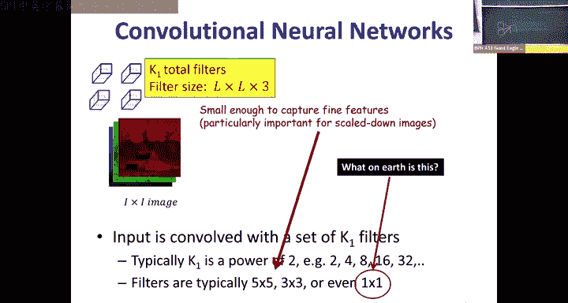

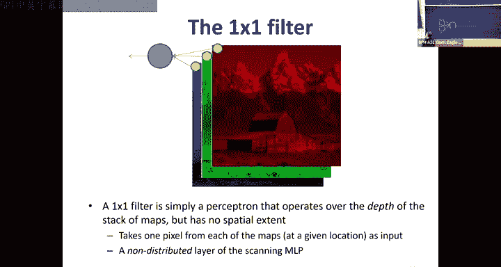

在这个结构中，随着网络加深，特征图的空间尺寸逐渐减小（由于池化），但通道数逐渐增加。最后的全连接层整合所有高级特征，做出决策。

---

## 总结 📝

本节课中我们一起学习了卷积神经网络（CNN）的完整故事：
1.  **生物起源**：CNN的设计灵感来源于Hubel和Wiesel对猫视觉皮层的研究，特别是简单细胞（S细胞）和复杂细胞（C细胞）的分层处理机制。
2.  **模型演化**：福岛邦彦的神经认知机首次将这些原理计算化，通过无监督学习实现模式识别。LeCun等人通过引入监督学习（在末端添加分类器），创造了现代CNN的雏形。
3.  **核心组件**：
    *   **卷积层**：使用可学习的滤波器扫描输入，提取局部特征，通过权重共享实现平移不变性。
    *   **池化层**（尤其是最大池化）：对特征图进行下采样，增强鲁棒性，扩大感受野。
4.  **尺寸管理**：通过**下采样**（池化、带步长卷积）减少计算量，通过增加**通道数**来补偿信息损失；**上采样**操作则用于需要恢复空间分辨率的任务。
5.  **网络结构**：典型的CNN由交替的卷积层和池化层堆叠而成，最后连接全连接层进行分类。

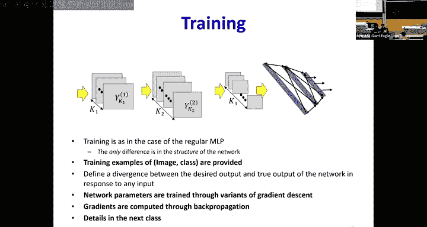

CNN成功地将空间结构的理解引入了神经网络，使其成为处理图像、视频甚至某些序列数据的强大工具。在接下来的课程中，我们将深入探讨如何训练这些网络，即CNN中的反向传播算法。