# 12：卷积神经网络（CNN）的训练与反向传播 🧠


在本节课中，我们将学习如何训练卷积神经网络（CNN），重点在于理解其独特的反向传播过程。我们将回顾CNN的基本结构，并详细探讨如何计算卷积层和池化层的梯度。

---

## 概述

卷积神经网络通过扫描输入并组合结果来执行模式分类任务，这等效于使用共享参数的神经元进行分层扫描。网络结构包含卷积层、池化层以及最终的多层感知机（MLP）。训练CNN的目标是学习这些层的参数（即滤波器权重和MLP参数），以最小化预测输出与真实标签之间的损失。

---

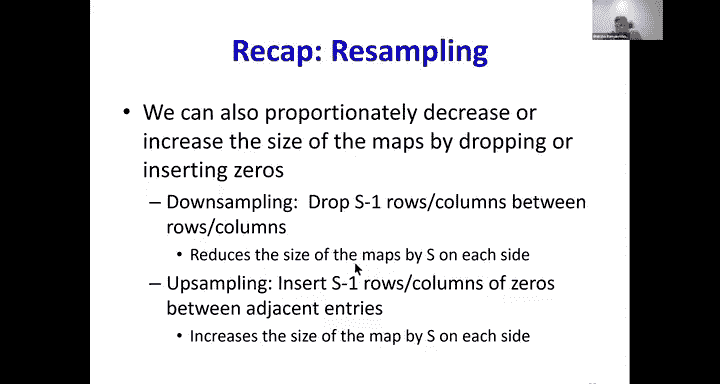

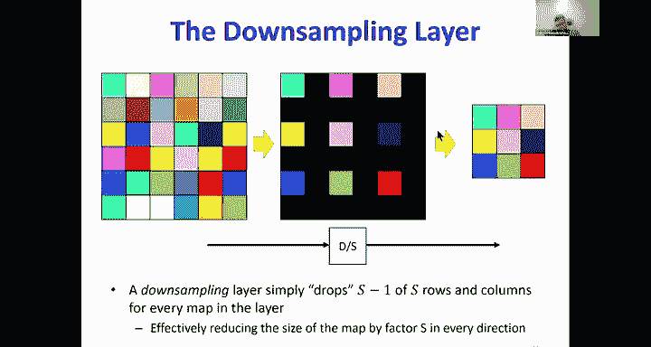

## CNN结构回顾

上一节我们介绍了CNN的基本组件。本节中，我们来看看其具体结构。

一个典型的CNN由以下部分组成：
*   **卷积层**：包含两个阶段。首先，使用滤波器在所有输入通道上进行卷积，生成仿射图。然后，对仿射图逐点应用激活函数，生成激活图。
*   **池化层**：间歇性地跟随卷积层，通过对局部区域（如最大值或平均值）进行下采样来减少特征图尺寸并增加一定程度的平移不变性。
*   **重采样层**：用于按比例增大或减小特征图尺寸。下采样通过删除行和列实现，上采样通过插入零行和零列实现。
*   **MLP分类器**：将最后一个卷积/池化层输出的扁平化向量作为输入，进行最终分类。

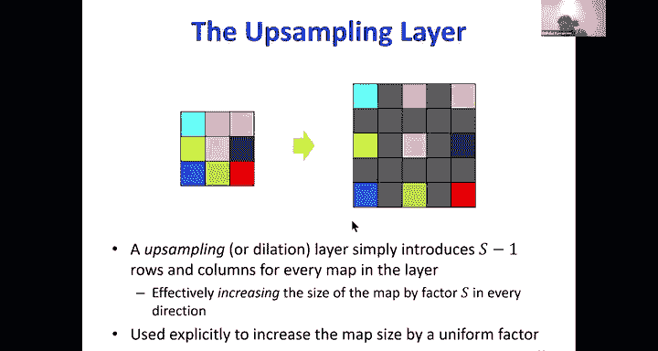

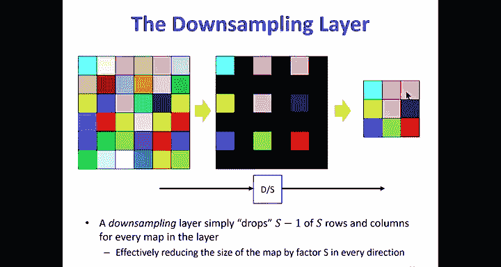

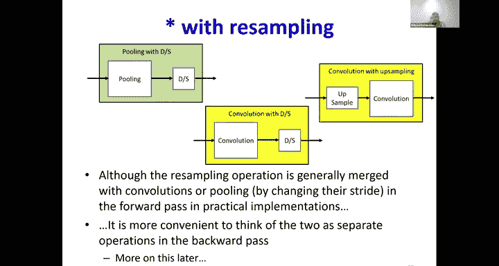

在训练时，所有卷积层的滤波器和MLP的权重都需要通过反向传播和梯度下降来学习。

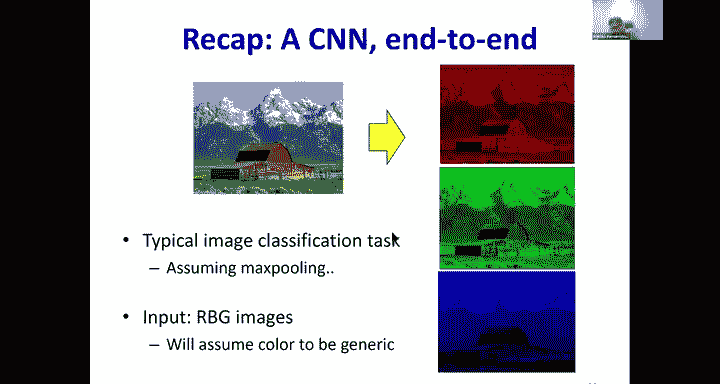

---

## 反向传播原理

训练神经网络，包括CNN，核心在于通过反向传播计算损失函数相对于所有网络参数的梯度。

对于单个训练样本，其流程如下：
1.  **前向传播**：输入通过网络，计算得到输出。
2.  **计算损失**：计算网络输出与真实标签之间的差异（损失）。
3.  **反向传播**：从输出层开始，向后逐层计算损失相对于每一层输入和参数的梯度。

总体损失是训练集上所有样本损失的平均值。因此，任何参数的梯度也是所有样本对该参数梯度的平均值。

对于CNN，反向传播在MLP部分是常规操作。挑战在于如何通过卷积层和池化层进行反向传播。

---

## 卷积层的反向传播

现在我们已经理解了反向传播的整体目标，本节中我们来看看卷积层具体的梯度计算规则。

假设我们已经通过反向传播得到了损失 `L` 相对于第 `l` 层输出激活图 `Y^l` 的梯度 `dL/dY^l`。我们需要计算：
1.  损失相对于第 `l` 层仿射图 `Z^l` 的梯度 `dL/dZ^l`。
2.  损失相对于第 `l` 层滤波器权重 `W^l` 的梯度 `dL/dW^l`。
3.  损失相对于前一层（第 `l-1` 层）输出 `Y^{l-1}` 的梯度 `dL/dY^{l-1}`。

### 1. 从激活梯度到仿射图梯度

由于 `Y^l = f(Z^l)`，其中 `f` 是逐点应用的激活函数（如ReLU），因此梯度计算很简单：

**公式**：
`dL/dZ^l = dL/dY^l * f'(Z^l)`

这里 `*` 表示逐元素相乘。

### 2. 计算对前一层输入的梯度

这是卷积层反向传播的核心。在前向传播中，每个输出仿射图元素 `Z^l(x, y)` 都是由前一层的一片区域与滤波器进行卷积（点积）得到的。因此，在反向传播时，损失相对于前一层某个输入 `Y^{l-1}(a, b)` 的梯度，需要累加所有受到该输入影响的输出元素 `Z^l` 的贡献。

计算规则可以表述为一次卷积操作：
*   将第 `l` 层的滤波器在空间维度上进行**翻转**（上下翻转，左右翻转）。
*   用这个翻转后的滤波器，对第 `l` 层的梯度图 `dL/dZ^l` 进行**卷积**（需进行适当的零填充，以使输出尺寸与 `Y^{l-1}` 匹配）。
*   由于每个输入通道被所有输出通道的滤波器使用，因此需要对所有输出通道的上述卷积结果进行求和，才能得到对单个输入通道的最终梯度。

**核心概念**：对输入 `Y^{l-1}` 的梯度计算，等价于用翻转后的滤波器对 `dL/dZ^l` 进行卷积。

### 3. 计算对滤波器权重的梯度

类似地，损失相对于滤波器某个权重 `W^l(i, j)` 的梯度，需要累加所有使用该权重的输出位置 `Z^l(x, y)` 的贡献。

计算规则也可以表述为一次卷积操作：
*   将第 `l-1` 层的输入激活图 `Y^{l-1}` 作为“输入”。
*   将第 `l` 层的梯度图 `dL/dZ^l` 作为“滤波器”。
*   对这两者进行**卷积**（无需翻转），得到的结果就是损失相对于整个滤波器 `W^l` 的梯度。

**核心概念**：对滤波器权重 `W^l` 的梯度计算，等价于用 `Y^{l-1}` 对 `dL/dZ^l` 进行卷积。

---

## 池化层的反向传播

理解了卷积层的反向传播后，本节中我们来看看池化层的梯度如何计算。池化层没有可学习的参数，其作用是将梯度从输出分配回输入。

### 最大池化（Max Pooling）

在前向传播中，最大池化从每个局部窗口中选择最大值作为输出。在反向传播时：
*   梯度只会传递给前向传播中被选为最大值的那一个输入位置。
*   其他位置的梯度为零。
*   如果一个输入元素在多个重叠的池化窗口中都曾是最大值，那么它会接收到来自所有这些窗口的梯度之和。

**伪代码逻辑**：
```python
# 前向传播时记录每个输出位置对应的最大值的索引 (max_index)
# backward_pass:
dY_prev[...] = 0 # 初始化输入梯度为0
for each output position (x, y):
    dY_prev[max_index[x, y]] += dL/dY_pool[x, y] # 将梯度累加到原最大值位置
```

### 平均池化（Average Pooling）

在前向传播中，平均池化计算每个局部窗口的平均值作为输出。在反向传播时：
*   梯度被**均匀地**分配回该窗口内的所有输入位置。
*   每个输入位置接收到的梯度是输出梯度除以窗口大小（例如，2x2窗口则除以4）。

**伪代码逻辑**：
```python
# backward_pass:
dY_prev[...] = 0 # 初始化输入梯度为0
pool_size = k * k # 例如 k=2
for each output position (x, y):
    for each element in the corresponding input window (i, j):
        dY_prev[i, j] += (1 / pool_size) * dL/dY_pool[x, y] # 均匀分配梯度
```

---

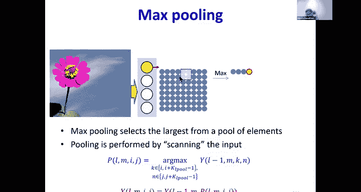

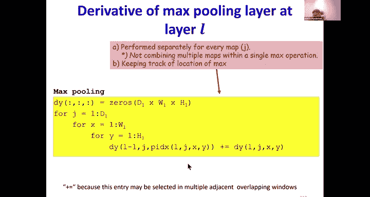

## 总结

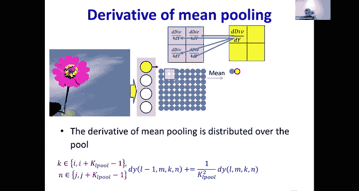

本节课中我们一起学习了卷积神经网络（CNN）训练的核心——反向传播。我们回顾了CNN的组成结构，并深入探讨了如何计算卷积层和池化层的梯度。

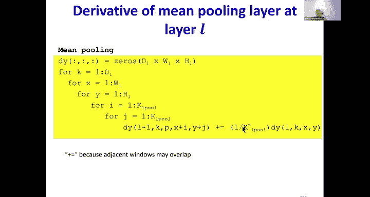

关键要点如下：
*   **卷积层反向传播**：可以巧妙地用卷积运算来实现。对输入的梯度计算涉及与**翻转滤波器**的卷积，而对滤波器权重的梯度计算则涉及与**输入图**的卷积。
*   **池化层反向传播**：根据池化类型分配梯度。**最大池化**将梯度路由回最大值所在位置；**平均池化**将梯度均匀分配回池化窗口内的所有位置。
*   **训练流程**：通过前向传播计算输出和损失，然后通过上述规则反向传播梯度，最终使用梯度下降法更新所有参数（卷积滤波器和MLP权重）。

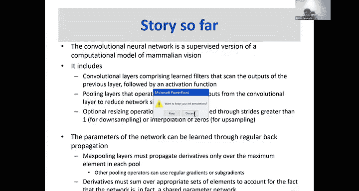


通过掌握这些规则，我们便能够从零开始理解并实现CNN的训练过程。下一节课我们将继续探讨重采样（上/下采样）操作的反向传播。