# 13：卷积神经网络（CNN）进阶与架构演变 🧠


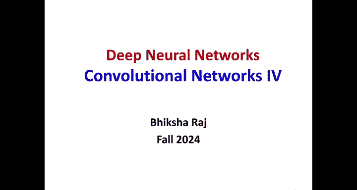


在本节课中，我们将深入学习卷积神经网络（CNN）的剩余核心概念，包括完整的反向传播规则、处理上/下采样的方法、如何引入其他变换不变性，以及一些经典的CNN架构演变。我们将确保内容简单直白，让初学者能够跟上。

---

## 1. CNN反向传播快速回顾 🔄

上一节我们介绍了CNN的基本结构和前向传播。本节中，我们来看看如何通过反向传播来训练CNN。

对于每个训练数据：
1.  将数据实例通过模型前向传播，得到输出。
2.  计算模型输出与期望输出之间的差异（损失）。
3.  使用标准的反向传播规则，将梯度从输出层向后传播，直到CNN之后的第一层MLP。
4.  将该MLP输入处的梯度“折叠”回来，得到CNN最后一层所有通道的梯度。
5.  从此处开始，使用我们上一堂课见过的反向传播规则，将导数向后传播。这些规则必须考虑卷积层中的共享计算和池化层的特殊计算。

在每个层，我们需要计算两种导数：
*   **对于卷积层**：给定输出激活图 `y^L` 的导数，我们需要计算其对应的仿射图 `Z^L` 的导数，然后再计算对前一层输出 `y^(L-1)` 和滤波器权重 `W^L` 的导数。
*   **对于池化层**：给定输出 `y^L` 的导数，我们需要计算对输入 `y^(L-1)` 的导数。

---

## 2. 卷积层的反向传播规则 🧮

首先，我们来看如何从激活图的导数得到仿射图的导数。这很简单，因为激活是通过逐点应用激活函数 `f` 得到的。

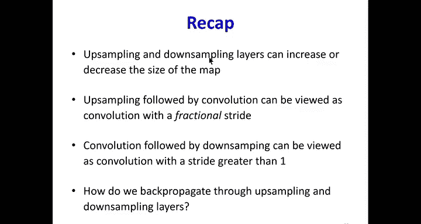

**公式**：
`y^L[m, x, y] = f(Z^L[m, x, y])`

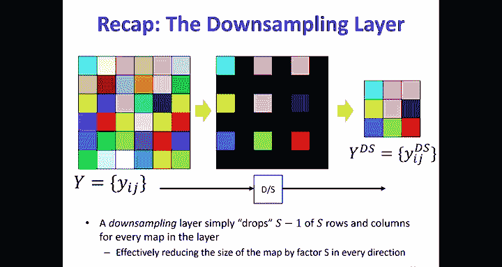

因此，根据链式法则，对仿射项 `Z^L[m, x, y]` 的导数就是对激活 `y^L[m, x, y]` 的导数乘以激活函数在该 `Z` 值处的导数。

**代码概念**：
```python
# dL_dZ 是损失L对仿射图Z的导数
# dL_dY 是损失L对激活图Y的导数
# f_prime 是激活函数的导数
dL_dZ = dL_dY * f_prime(Z)
```

接下来，我们需要计算对输入 `y^(L-1)` 和滤波器 `W^L` 的导数。

*   **对输入 `y^(L-1)` 的导数**：将第 `m` 个输入通道对应的所有滤波器的第 `m` 个通道进行**转置**（即左右、上下翻转），然后与零填充后的输出仿射图导数进行卷积。
*   **对滤波器 `W^L` 的导数**：为了计算第 `n` 个滤波器的导数，我们将第 `n` 个输出仿射通道的导数图与所有输入通道进行卷积。

---

## 3. 池化层的反向传播规则 📉

我们考虑两种池化：最大池化和平均池化。

*   **最大池化**：在前向传播中，我们取一个窗口内的最大值。在反向传播时，只有那个最大值元素对输出有贡献。因此，梯度只被复制回前向传播中被选中的那个最大值位置，窗口内其他位置的梯度为零。
*   **平均池化**：在前向传播中，我们取窗口内所有值的平均值。在反向传播时，梯度被均匀地分配回窗口内的所有元素。如果窗口大小为4，那么每个位置将得到输出梯度四分之一的贡献。需要注意的是，由于窗口可能重叠，同一个输入位置可能从多个窗口接收梯度，因此需要进行累加（`+=`）。

平均池化的反向传播操作可以看作是一种卷积操作。

---

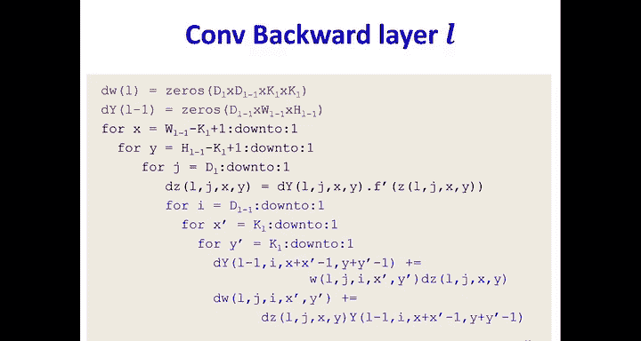


## 4. 处理上采样与下采样 🔼🔽

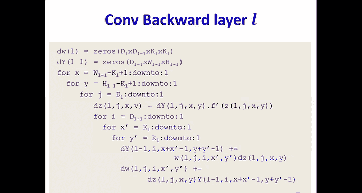

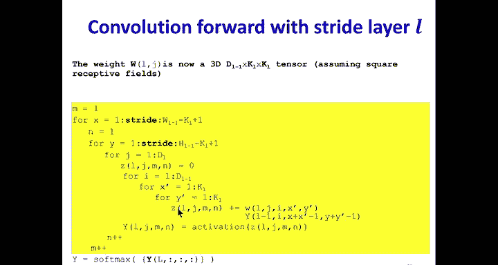

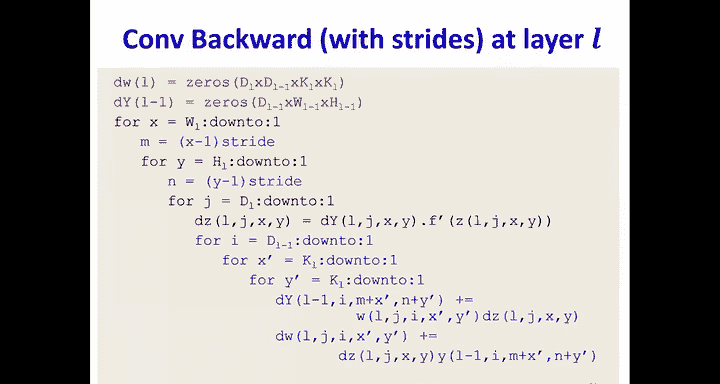

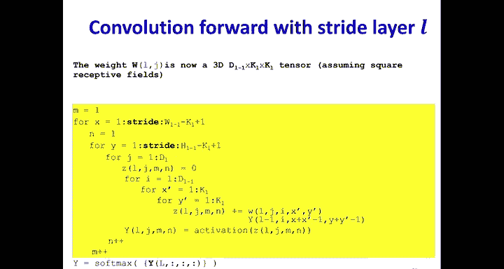

上采样和下采样层会改变特征图的大小。我们之前提到，上采样后通常要接一个卷积，下采样前通常有卷积或池化。

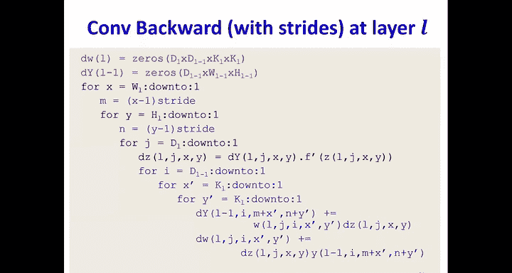

**下采样的反向传播**：
*   前向传播：从一个大图中，每隔一定步长（stride）取样，忽略其他位置（可视为置零）。
*   反向传播：我们需要一个与输入同样大小的导数图。首先将其全部置零，然后将输出导数图的值复制到输入图中对应被取样的位置。**这本质上是一个上采样操作**。

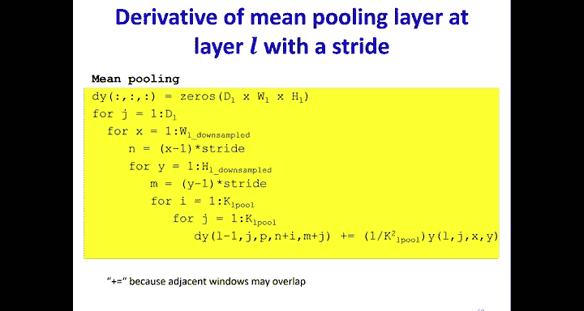

**上采样的反向传播**：
*   前向传播：通过在特征图中插入零值行和列来增大尺寸。
*   反向传播：只有那些来自原始输入的值（非插入的零）才有梯度。因此，我们丢弃那些对应于插入零位置的梯度，只保留原始位置的梯度。**这本质上是一个下采样操作**。

**重要提示**：虽然数学上互为逆操作，但由于边界处理方式不同，在代码实现中不能简单地用上采样代码去实现下采样的反向传播，反之亦然。

---

## 5. 处理步长大于1的卷积和池化 🏃‍♂️

直接为步长（stride）大于1的卷积推导反向传播规则会很复杂。一个更简单的方法是**将其分解**：

*   **卷积 stride > 1**：可以视为一个 **stride=1的卷积**，后面接一个 **下采样层**。然后分别对这两个简单操作进行反向传播。
*   **卷积 fractional stride (stride < 1)**：可以视为一个 **上采样层**，后面接一个 **stride=1的卷积**。
*   **池化 stride > 1**：同样可以分解为 **stride=1的池化**，后面接一个 **下采样层**。对于最大池化，由于其本身会记录最大值位置，实现起来仍然简单；对于平均池化，分解则使逻辑更清晰。

从代码角度思考通常更简单：只需反转前向传播循环中的操作顺序和步进逻辑即可。

---

## 6. 超越平移不变性：其他变换 ✨

CNN天然具有平移不变性。但我们可能还希望它对旋转、缩放等变换具有不变性。理论上，可以通过对每个滤波器枚举所有希望不变的变换（如旋转45度、翻转），生成相应的变换后滤波器，然后用它们一起扫描输入。

**问题**：
1.  这会导致输出通道数急剧增加（原始滤波器数 × 变换数）。
2.  反向传播时，所有变换后滤波器的梯度必须经过相应的逆变换后，再聚合到原始滤波器上。
3.  计算量巨大。

因此，在实践中，我们很少显式构建这种变换不变的CNN。更常用的方法是**数据增强**：在训练时，对输入数据随机进行旋转、缩放、裁剪等变换，从而让网络自己从数据中学习到这些不变性。

---

## 7. 目标定位与检测 📍

基础的CNN只能判断图像中是否有某类物体。如果我们还想知道物体的位置，该怎么做？

**方法**：在CNN的末端，除了用于分类的全连接层，我们**并行地添加一个回归层**。
*   输入：CNN提取的最终特征（展平后）。
*   输出：一个边界框的坐标，例如 `(x1, y1, x2, y2, x3, y3, x4, y4)` 代表框的四个角点。
*   训练：需要带有边界框标注的数据。总损失是分类损失和边界框回归损失的加权和。
*   应用：不仅可以定位物体，还可以用于姿态估计（预测人体关节位置）。

---

## 8. 经典架构：深度可分离卷积 🧩

标准的卷积操作计算成本高。为了提升效率，提出了**深度可分离卷积**，它分为两步：
1.  **深度卷积**：使用一个滤波器（其通道数与输入相同），分别与每个输入通道进行卷积，产生与输入通道数相等的输出通道。这一步是**通道分离**的。
2.  **逐点卷积**：使用多个 1x1 的卷积核，对上一步得到的多通道特征图进行组合，得到最终输出通道。这一步负责**通道混合**。

**优势**：
*   **大幅减少参数和计算量**。假设输入有 `C_in` 个通道，输出需要 `C_out` 个通道。
    *   标准卷积：需要 `C_out` 个 `C_in` 通道的滤波器，计算复杂度约为 `C_in * C_out * K^2`（K为核大小）。
    *   深度可分离卷积：计算复杂度约为 `C_in * K^2 + C_in * C_out`。
*   在移动端和资源受限场景中非常有用。

**权衡**：由于减少了参数和计算，在数据充足的情况下，其表示能力可能略低于标准卷积。

---

## 9. CNN学到了什么？ 🎨

通过可视化CNN的滤波器，我们可以洞察其工作原理：
*   **底层神经元**：学习到类似Gabor滤波器的简单边缘、纹理模式，与哺乳动物视觉皮层V1区的神经元响应惊人地相似。
*   **高层神经元**：响应越来越复杂的模式。当输入是人脸时，高层神经元可能对应眼睛、鼻子等部件；当输入是车辆时，则对应车轮、车灯等。最高层的神经元可能响应整个物体（如一张完整的脸、一辆完整的车）。
*   这证明了CNN确实在学习一种层次化的、由简到繁的特征表示。

---

## 10. 训练技巧与成功故事 🏆

训练深度CNN需要一些技巧：
*   **优化器**：使用Adam、带动量的SGD等高级优化算法。
*   **正则化**：使用批归一化、Dropout等防止过拟合。
*   **数据增强**：如前所述，通过对训练图像进行随机变换来扩充数据集，提升模型泛化能力。

**CNN发展史上的里程碑**：
1.  **LeNet-5 (1998)**：早期成功的CNN，用于手写数字识别。
2.  **AlexNet (2012)**：在ImageNet大赛上取得突破性成功，将Top-5错误率从25%以上降至16.4%，开启了深度学习新时代。它使用了ReLU激活函数和多GPU训练。
3.  **VGGNet (2014)**：通过堆叠多个3x3的小卷积核来构建深度网络，结构简洁有效。
4.  **GoogLeNet / Inception (2014)**：提出了Inception模块，在增加网络深度的同时巧妙控制计算量。
5.  **ResNet (2015)**：引入了**残差连接**，解决了极深网络中的梯度消失/爆炸问题，使得训练数百甚至上千层的网络成为可能，并将ImageNet错误率降至3.57%。
6.  **DenseNet等**：后续出现了更多高效架构。

如今，CNN及其变体已广泛应用于计算机视觉、语音识别、自然语言处理等诸多领域。

---

## 总结 📚

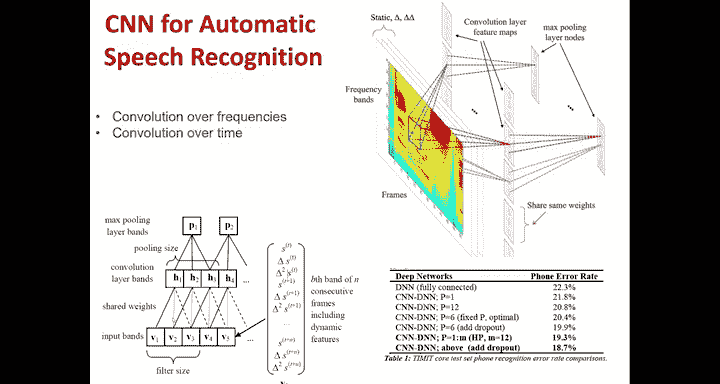

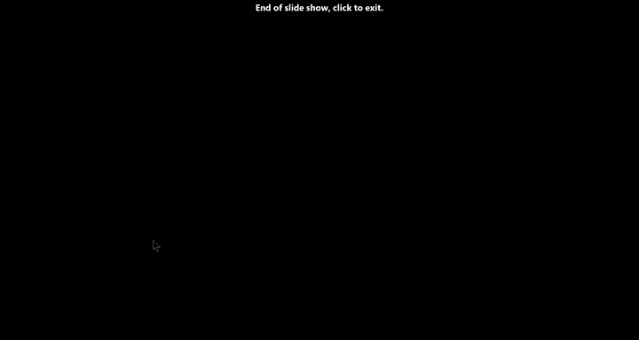

本节课中，我们一起深入学习了卷积神经网络（CNN）的多个进阶主题：

1.  我们回顾并完善了CNN中卷积层和池化层的反向传播规则。
2.  我们学习了如何处理上采样、下采样以及步长大于1的卷积，理解了将其分解为基本操作的思想。
3.  我们探讨了超越平移不变性的其他变换不变性，并理解了数据增强是更实用的方法。
4.  我们了解了如何使用CNN进行目标定位，即通过添加回归层来预测边界框。
5.  我们认识了深度可分离卷积这一高效架构，它通过分离空间滤波和通道组合来大幅降低计算成本。
6.  我们通过可视化看到了CNN从简单边缘到复杂物体的层次化学习过程。
7.  最后，我们回顾了CNN发展史上的关键架构和成功故事，从LeNet到ResNet，见证了其强大的能力和演变历程。

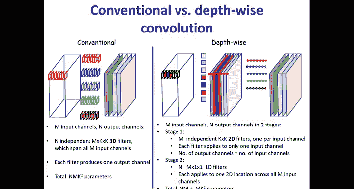

CNN作为深度学习的基础模型之一，其核心思想——共享权重的局部连接和层次化特征提取——将继续影响着众多人工智能应用的发展。