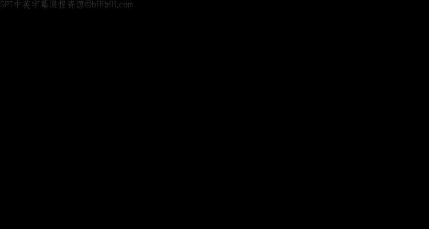
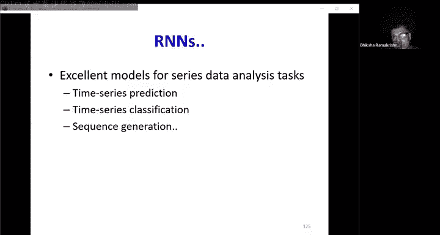

# 14：循环神经网络（RNN）📈

在本节课中，我们将学习如何利用神经网络来处理和分析序列数据。我们将从有限响应系统的问题出发，逐步引入能够记忆“无限过去”的循环神经网络（RNN），并探讨其基本结构、工作原理以及训练方法。

---

## 序列建模的必要性

在许多实际应用中，我们需要考虑一系列输入来产生一个或多个输出。例如：
*   **语音识别**：需要分析整段语音录音才能判断说话内容。
*   **情感分析**：需要理解整个句子的上下文才能判断其情感倾向。
*   **机器翻译**：需要读完整个英文句子才能输出对应的法语句子。
*   **股票市场预测**：需要分析过去一段时间内的股价序列，才能对未来做出投资决策。

这些都属于分类和预测问题，其共同点是**需要考虑一个输入向量序列来产生输出**。显然，我们可以用神经网络来完成这些任务。

---

## 从有限响应到无限响应

上一节我们介绍了卷积神经网络（CNN）在处理序列时的应用。本节我们来看看它的局限性。

### 卷积神经网络（CNN）的局限性

对于时间序列问题，一个直观的想法是使用一维卷积神经网络（1D-CNN）。网络会查看当前输入以及过去几天的输入（一个固定大小的窗口），然后做出预测。

然而，这种模型是一个**有限响应系统**。发生在时间 `t` 的事件只会影响未来 `n` 天内的输出（`n` 是网络查看的窗口大小）。一旦窗口滑过该事件，其影响就消失了。

**问题**：市场趋势往往包含更长的模式（如周模式、月模式、年模式）。为了考虑所有这些长期历史趋势，窗口大小必须不断增加。这会导致模型参数数量急剧增长，且难以捕捉真正长期的依赖关系。

我们真正需要的是一个**无限响应系统**，能够考虑“无限过去”的信息来做预测。

---

## 引入循环：从NARX网络到简单循环网络

为了构建无限响应系统，最直接的想法是将过去的输出反馈给输入。

### NARX网络（非线性自回归外生输入网络）

在这种模型中，任何时刻 `t` 的输出 `y(t)` 不仅是当前输入 `x(t)` 的函数，也是前一个时刻输出 `y(t-1)` 的函数。

**公式**：
`y(t) = f( x(t), y(t-1) )`

**特点**：
*   一个在时间 `0` 的输入会影响所有未来的输出，实现了无限响应。
*   然而，**记忆完全存储在外部的前一个输出值中**，而不是在网络内部。

### 乔丹网络（Jordan Network）

乔丹网络在NARX网络的基础上引入了明确的**记忆单元**。记忆单元 `m(t)` 维护一个过去输出的运行平均值，并将其作为额外输入馈送到网络中。

**公式**（记忆更新）：
`m(t) = μ * m(t-1) + y(t-1)`

**特点**：
*   记忆单元的结构是固定的（运行平均），**没有可学习的参数**。
*   在反向传播时，误差不会通过这个记忆单元传播回去。

### 埃尔曼网络（Elman Network / 简单循环网络）

埃尔曼网络提出了**上下文状态**的概念，直接将隐藏层的状态克隆并反馈到下一时间步的输入中。

**特点**：
*   **记忆被明确地置于网络内部的隐藏状态中**。
*   然而，在训练时，克隆操作阻止了梯度通过时间反向传播。这意味着当前时刻的误差不会用于更新更早时刻的参数，因此它被称为**部分循环网络**。

---

## 完全循环神经网络（RNN）

为了解决梯度无法穿越时间的问题，我们引入了**状态空间模型**，即现代意义上的完全循环神经网络（RNN）。

### RNN的核心思想

RNN将记忆直接嵌入到网络的**隐藏状态** `h(t)` 中。隐藏状态递归地基于当前输入和前一时刻的隐藏状态计算得出，它总结了关于整个过去的信息。

**前向计算公式**：
1.  计算当前隐藏状态：`h(t) = f( W_x * x(t) + W_h * h(t-1) + b_h )`
2.  计算当前输出：`y(t) = g( W_y * h(t) + b_y )`

其中：
*   `f` 和 `g` 是激活函数（如 `tanh`, `softmax`）。
*   `W_x`, `W_h`, `W_y` 是权重矩阵。
*   `b_h`, `b_y` 是偏置项。
*   初始隐藏状态 `h(-1)` 可以设置为零向量或作为可学习参数。

**特点**：
*   **完全循环**：前向传播时，信息通过隐藏状态在时间上流动；反向传播时，梯度也可以沿着时间反向传播，从而允许当前误差更新很久以前的参数。
*   隐藏状态 `h(t)` 是网络的“记忆”。

### RRN的展开视图

为了便于理解，我们可以将RNN在时间维度上“展开”，形成一个由多个相同副本组成的深层网络，每个副本对应一个时间步，并且**所有副本共享相同的参数**（`W_x`, `W_h`, `W_y`）。

---

## 训练RNN：通过时间反向传播（BPTT）

训练RNN的目标是：给定一个输入序列 `X = [x(0), x(1), ..., x(T)]` 和对应的目标输出序列 `Y_target = [y_target(0), y_target(1), ..., y_target(T)]`，调整网络参数以最小化损失函数 `L`，该损失衡量的是**整个输出序列** `Y` 与目标序列 `Y_target` 之间的差异。

### BPTT步骤
1.  **前向传播**：将整个输入序列按时间步输入网络，计算每个时间步的隐藏状态 `h(t)` 和输出 `y(t)`，并计算最终损失 `L`。
2.  **反向传播**：从最后一个时间步 `T` 开始，反向计算损失 `L` 对每个时间步输出 `y(t)`、隐藏状态 `h(t)` 以及所有参数（`W_y`, `W_h`, `W_x`）的梯度。
    *   关键点：由于参数在时间上共享，每个参数的梯度是其**在所有时间步上贡献的梯度之和**。例如，`W_h` 的梯度是损失对每个时间步的 `z_h(t)`（`h(t)` 的输入）的梯度，乘以 `h(t-1)`，然后对所有时间步 `t` 求和。
3.  **参数更新**：使用聚合后的梯度（如SGD）更新网络参数。

**核心挑战**：损失 `L` 必须是关于整个输出序列的可微函数。对于序列到序列的任务（如机器翻译），直接定义这样的损失可能比较复杂，我们将在后续课程中看到如何解决（例如使用连接主义时间分类（CTC）或注意力机制）。

---

## 双向循环神经网络（Bi-RNN）

在有些任务中，我们不仅能看到过去的信息，还能看到未来的信息。例如，在词性标注中，判断一个词是名词还是动词，既依赖于它前面的词，也依赖于它后面的词。

### Bi-RNN的结构
Bi-RNN在每一层包含两个独立的RNN：
*   **前向RNN**：按时间顺序（从开始到结束）处理序列。
*   **后向RNN**：按逆序时间（从结束到开始）处理序列。

在每一时间步 `t`，该层的输出是前向RNN的隐藏状态 `h_f(t)` 和后向RNN的隐藏状态 `h_b(t)` 的拼接（或求和等其他操作）。

**公式**（对于某一层）：
`h(t) = [ h_f(t); h_b(t) ]`
其中 `h_f(t) = RNN_forward(x(t), h_f(t-1))`
`h_b(t) = RNN_backward(x(t), h_b(t+1))`

### Bi-RNN的训练
训练Bi-RNN同样使用BPTT：
1.  前向传播：分别独立运行前向和后向RNN。
2.  反向传播：
    *   将损失对层输出 `h(t)` 的梯度拆分为对 `h_f(t)` 和 `h_b(t)` 的两部分。
    *   分别对前向RNN执行从后向前的BPTT。
    *   分别对后向RNN执行从前向后的BPTT（因为其前向计算是逆序的）。
    *   合并来自两个方向的梯度以更新共享的输入层参数。

**应用限制**：Bi-RNN要求**整个输入序列在预测时是可用的**，因此不适用于严格的在线流式预测（如实时股票交易），但非常适用于有完整上下文的任务（如文本翻译、文档分类）。

---

## 总结 🎯

本节课我们一起学习了循环神经网络（RNN）的核心知识：
1.  **动机**：为了对序列数据进行建模，需要能够记忆长期历史信息的无限响应系统。
2.  **演进**：从有限响应的CNN，到反馈输出的NARX网络，再到引入内部记忆的乔丹网络和埃尔曼网络，最终发展到完全循环的RNN。
3.  **RNN核心**：通过递归更新的隐藏状态 `h(t)` 来承载记忆，其计算公式为 `h(t) = f(W_x x(t) + W_h h(t-1) + b)`。
4.  **训练方法**：通过时间反向传播（BPTT），将循环网络在时间上展开，视为一个共享参数的深层网络进行梯度计算和更新。
5.  **双向扩展**：为了利用未来上下文信息，引入了双向RNN（Bi-RNN），它同时从前向后和从后向前处理序列，并将结果结合。

RNN为语音识别、机器翻译、时间序列预测等众多序列建模任务提供了强大的基础框架。在接下来的课程中，我们将探讨RNN在实际应用中面临的挑战（如梯度消失/爆炸）及其更先进的变体，如长短期记忆网络（LSTM）和门控循环单元（GRU）。