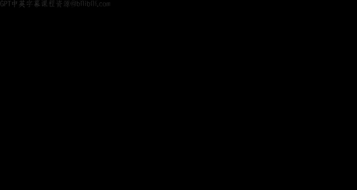
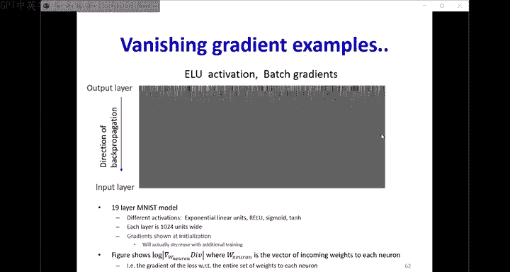
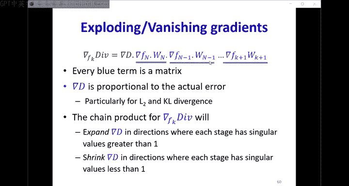
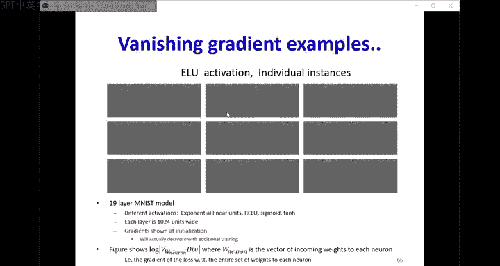
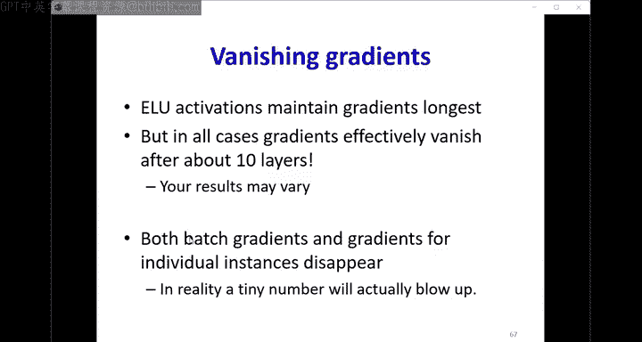
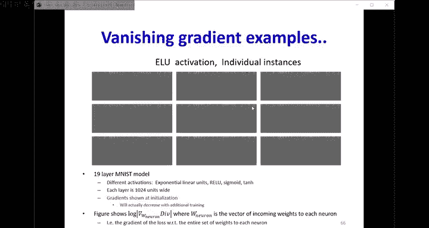
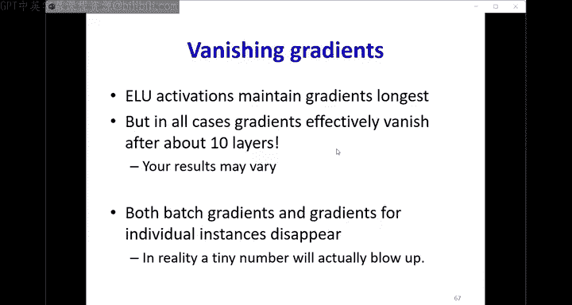
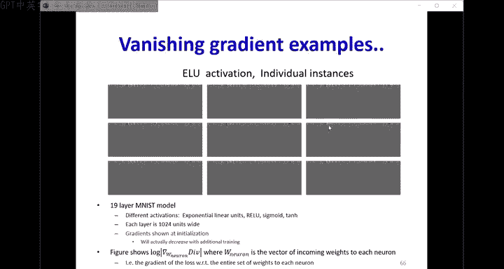
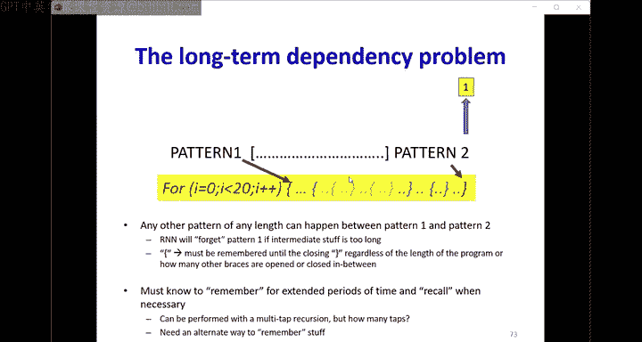
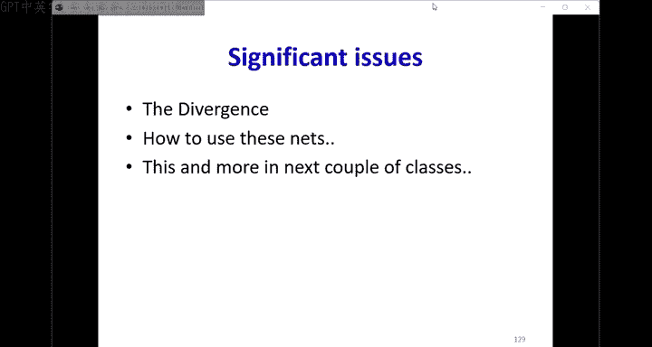

# 15：稳定性分析与LSTM 🧠

在本节课中，我们将学习循环神经网络（RNN）的稳定性问题，并探讨长短期记忆网络（LSTM）如何解决这些问题。我们将从分析RNN的长期记忆能力开始，理解其局限性，然后深入探讨LSTM的结构和工作原理。

---

## 概述：RNN的威力与挑战

上一节我们介绍了循环神经网络（RNN）的基本概念。本节中，我们来看看RNN在处理特定问题时的强大能力，以及其内在的稳定性挑战。

RNN在处理具有长期依赖关系的时间序列数据时非常有效。但更重要的是，它们甚至能简化一些对传统多层感知机（MLP）来说非常困难的问题。

**示例：二进制加法**
假设我们需要一个网络来对两个n位二进制数进行加法运算。
*   如果使用MLP，网络规模需要指数级增长（`O(2^(2n))`），并且需要看到所有可能的输入组合（`2^(2n)`个）才能学习。
*   如果使用RNN，我们可以逐位处理。网络只需要处理当前位的两个输入和一个进位，总共只有8种可能的输入组合。因此，网络规模很小，只需要8个训练实例，并且训练好的网络可以处理任意长度的数字。

**示例：奇偶校验问题**
判断一个n位二进制输入中1的个数是奇数还是偶数。
*   MLP方案：同样需要指数级规模和训练数据。
*   RNN方案：网络只需要记住前一步的输出和当前输入，只有4种组合。网络规模小，只需4个训练实例，并且能泛化到更长的序列。

由此可见，只要找到问题中的循环结构，RNN就能极大地减少所需的计算量和训练数据。

然而，RNN在记忆方面存在根本性问题。接下来，我们将分析其稳定性。

---

## RNN的稳定性分析 🔬

上一节我们看到了RNN的威力，本节中我们来看看其记忆行为的稳定性。我们将分析隐藏状态如何随时间演变。

### 线性系统的稳定性

为了简化分析，我们首先考虑一个使用恒等激活函数的线性RNN单元。其隐藏状态更新公式为：
`h_t = W_h * h_{t-1} + W_x * x_t`

假设在时间0有一个输入`x_0`，之后没有输入。那么时间t的响应为：
`h_t = (W_h)^t * c * x_0`

这里的关键是权重矩阵`W_h`的幂次`(W_h)^t`。通过对`W_h`进行特征值分解（`W_h = U * Λ * U^{-1}`），我们可以分析长期行为。对于大的t值，隐藏状态向量的长度将趋近于最大特征值的t次方：
`||h_t|| ≈ |λ_max|^t`

由此我们可以得出结论：
*   如果最大特征值 `|λ_max| > 1`：响应会**爆炸式增长**（Explode）。
*   如果最大特征值 `|λ_max| < 1`：响应会**迅速衰减到零**（Vanish）。
*   只有特征值恰好为1时，信息才能稳定保留。

复数特征值会导致振荡，但总体趋势（爆炸或消失）仍由模长决定。

### 非线性激活函数的影响

在实际的RNN中，我们使用非线性激活函数（如Sigmoid、Tanh、ReLU）。分析表明：
*   **Sigmoid**：隐藏状态会迅速**饱和**到一个固定值，该值仅取决于偏置项，而与初始输入无关。记忆很快丢失。
*   **Tanh**：比Sigmoid稍好，饱和速度较慢，但长期响应仍然主要取决于权重和偏置，而非输入本身。
*   **ReLU**：在RNN中效果很差，会导致输出要么爆炸要么消失。

**核心结论**：在标准RNN中，网络能记住输入信息的时间长短，以及记住什么内容，主要取决于循环权重矩阵的特征值和激活函数的类型，而不是输入数据本身。这对于需要根据输入内容决定记忆时长的任务来说是不理想的。

---

## 深度网络中的梯度问题 📉

上一节我们分析了前向传播中的记忆问题，本节中我们来看看反向传播中的梯度问题。这个问题不仅存在于RNN，也存在于任何深度神经网络中。

在反向传播过程中，损失函数相对于网络早期层参数的梯度，需要通过链式法则，连续乘以一系列雅可比矩阵（激活函数的导数）和权重矩阵的转置。

每个乘法步骤都可能改变梯度的大小：
*   **激活函数的雅可比矩阵**：通常是对角矩阵，其对角线元素是激活函数的导数（对于Sigmoid ≤0.25，Tanh ≤1，ReLU为0或1）。这通常会**缩小**梯度。
*   **权重矩阵**：具有不同的奇异值。梯度向量乘以权重矩阵转置后，在奇异值>1的方向上会**放大**，在奇异值<1的方向上会**缩小**。

随着反向传播的深入，梯度在大多数方向上会**指数级衰减（梯度消失）**，在极少数方向上可能**急剧增大（梯度爆炸）**。这导致：
1.  早期层的参数几乎得不到有效的梯度更新（梯度消失）。
2.  训练变得不稳定（梯度爆炸）。
3.  在RNN中，这意味着远处时间步发生的事件，其误差很难影响早期时间步的参数更新，从而无法学习长期依赖关系。

---

## 长短期记忆网络（LSTM） 🏗️

前面我们指出了RNN在记忆和梯度方面的核心问题。本节中，我们来看看如何通过改进网络结构来解决这些问题，这就是长短期记忆网络（LSTM）。

LSTM的核心思想是引入一个**记忆单元（Cell State）**，它像一条传送带，贯穿整个时间序列。信息在这条传送带上可以保持不变地流动，从而避免因权重连乘导致的梯度消失或爆炸。对记忆的修改（写入或擦除）由基于输入内容学习的“门”来控制。

### LSTM单元结构

一个LSTM单元在时间步t的运算涉及以下部分：

**1. 遗忘门（Forget Gate）**
决定要从记忆单元中丢弃哪些信息。它查看当前输入`x_t`和上一时刻隐藏状态`h_{t-1}`，并输出一个0到1之间的向量，作用于上一时刻的记忆`C_{t-1}`。
`f_t = σ(W_f · [h_{t-1}, x_t] + b_f)`

**2. 输入门（Input Gate）与候选记忆**
*   **输入门**：决定哪些新信息将被存入记忆单元。
    `i_t = σ(W_i · [h_{t-1}, x_t] + b_i)`
*   **候选记忆**：根据当前输入生成可能的新记忆内容。
    `\tilde{C}_t = tanh(W_C · [h_{t-1}, x_t] + b_C)`

**3. 更新记忆单元**
结合遗忘门的决定和输入门的决定，来更新记忆单元：
`C_t = f_t ⊙ C_{t-1} + i_t ⊙ \tilde{C}_t`
其中`⊙`表示逐元素相乘。这是一个**乘法遗忘**和**加法更新**的组合。

**4. 输出门（Output Gate）与隐藏状态**
*   **输出门**：决定记忆单元的哪些部分将输出为隐藏状态。
    `o_t = σ(W_o · [h_{t-1}, x_t] + b_o)`
*   **隐藏状态**：将记忆单元通过tanh激活函数缩放后，由输出门过滤得到。
    `h_t = o_t ⊙ tanh(C_t)`

### LSTM如何解决问题

*   **解决梯度消失**：记忆单元`C_t`的更新包含一条从`C_{t-1}`到`C_t`的**直接加法路径**（`f_t ⊙ C_{t-1}`项）。在反向传播时，梯度可以沿着这条路径无衰减地流动（当`f_t`接近1时），这构成了“常数误差传送带”。
*   **控制记忆时长**：记忆的保留（遗忘门`f_t`）和更新（输入门`i_t`）**依赖于当前输入`x_t`和上下文`h_{t-1}`**，而不是固定的网络参数。这意味着网络可以学习基于输入内容来决定记忆的时长。
*   **缓解梯度爆炸**：虽然LSTM改善了梯度消失，但梯度爆炸可能仍然存在，通常可以通过梯度裁剪等技术来处理。

### 简化变体：门控循环单元（GRU）

GRU是LSTM一种流行的简化变体。它将遗忘门和输入门合并为一个“更新门”，同时将记忆单元和隐藏状态合并。其参数更少，计算效率更高，且在许多任务上表现与LSTM相当。
`z_t = σ(W_z · [h_{t-1}, x_t] + b_z) # 更新门`
`r_t = σ(W_r · [h_{t-1}, x_t] + b_r) # 重置门`
`\tilde{h}_t = tanh(W · [r_t ⊙ h_{t-1}, x_t] + b)`
`h_t = (1 - z_t) ⊙ h_{t-1} + z_t ⊙ \tilde{h}_t`

---

## 总结 🎯

本节课中我们一起学习了：
1.  **RNN的威力与稳定性问题**：RNN能高效处理序列和结构化问题，但其隐藏状态容易因权重矩阵特征值而爆炸或消失，记忆能力受限于网络参数而非输入内容。
2.  **深度网络的梯度问题**：深度网络（包括深层RNN）在训练时普遍面临梯度消失或爆炸问题，这使得学习长期依赖关系变得困难。
3.  **LSTM的解决方案**：LSTM通过引入由输入控制的“门”机制和一个“记忆单元”来解决问题。记忆单元提供了稳定的梯度流路径，而门机制让网络能基于输入决定信息的保留与遗忘，从而实现了可控的长短期记忆。
4.  **GRU简介**：作为LSTM的简化版本，GRU合并了部分结构，在保持性能的同时提高了计算效率。

LSTM及其变体是处理长序列依赖任务（如机器翻译、语音识别、文档生成）的基石性技术。在接下来的课程中，我们将探讨如何利用这些网络进行序列生成等更高级的任务。