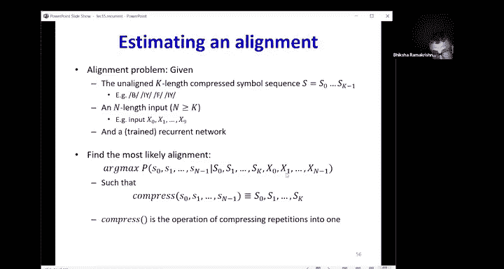
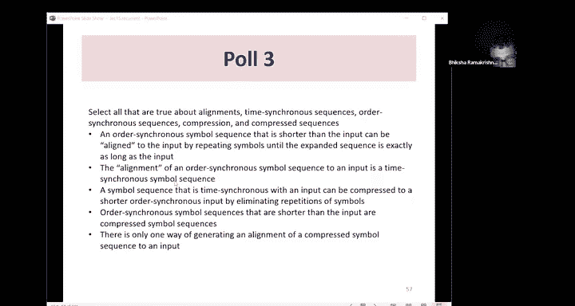
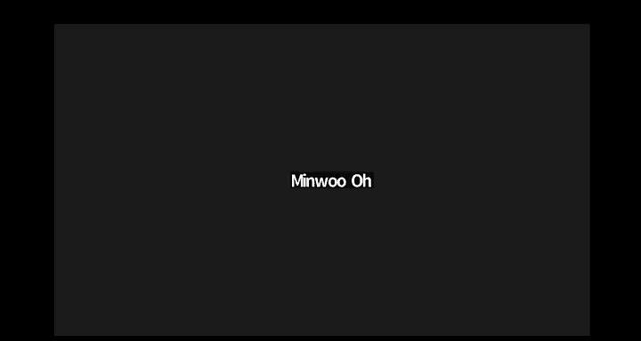
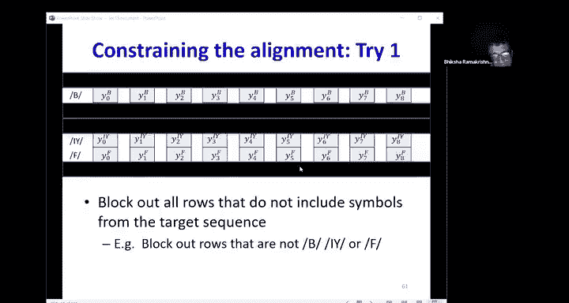
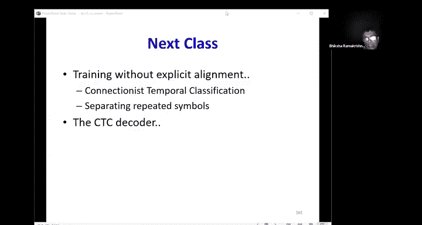

# 16：循环神经网络（二）与序列对齐 🧠

在本节课中，我们将继续学习循环神经网络，重点探讨如何处理输入与输出序列不同步的任务，例如语音识别。我们将学习如何定义序列间的差异（损失），以及如何在没有明确对齐信息的情况下训练模型。

---

## 概述：序列建模的挑战

上一节我们介绍了循环神经网络的基本结构及其在时间序列分析中的应用。本节中，我们来看看一个更复杂的场景：输入与输出序列在时间上并不同步，但顺序相关。例如，在语音识别中，一段音频（长序列）对应一个音素序列（短序列），我们需要将两者对齐。

处理这类任务的核心挑战在于如何定义模型输出序列与目标序列之间的可微损失函数，以便进行梯度下降训练。

---

## 不同类型的序列任务

以下是使用循环神经网络可以处理的不同类型的序列任务图示：

*   **一对一（传统MLP）**：单个输入产生单个输出。也可独立处理时间序列中的每个点，但忽略了时间依赖性。
*   **多对多（同步）**：每个输入时间步都对应一个输出。适用于词性标注或每日股价预测。
*   **多对一**：分析整个输入序列后，产生单个输出。适用于情感分析或句子分类。
*   **多对多（异步）**：输入序列与输出序列顺序相关但不同步。输出序列更短，且输出时刻不确定。这是本节课的重点，常见于语音识别。
*   **一对多**：单个输入产生整个输出序列。适用于图像描述生成。
*   **多对多（编码器-解码器）**：分析整个输入序列后，生成整个输出序列。适用于机器翻译。

---

## 使用传统MLP建模序列

即使使用传统的前馈神经网络（MLP），也可以处理时间序列任务。

**方法**：将序列中的每个输入向量独立地输入MLP，产生对应的输出。这意味着时间步 `t` 的分析与其他时间步无关。

**训练**：损失函数定义为整个输出序列与目标序列之间的差异。通常假设输出与目标在时间上**一一对应**，并且总序列损失可以分解为各个时间步损失之和。

**公式**：
总损失 `L` 定义为各时间步损失 `L_t` 的和：
`L = Σ_t L_t(y_t, target_t)`
其中，`y_t` 是模型在时间 `t` 的输出，`target_t` 是对应的目标。

这种方法的缺点是忽略了时间序列中的上下文依赖关系。

---

## 同步多对多循环网络

这是标准的循环神经网络，每个输入时间步都产生一个输出，且输出与输入同步。

**训练**：给定输入序列和对应的目标输出序列，计算序列间的损失。同样，通常假设一一对应，并将序列损失分解为各时间步损失之和。

**公式**：
`L = Σ_t L_t(h_t, target_t)`
其中，`h_t` 是RNN在时间 `t` 的隐藏状态（用于计算输出）。

这使得梯度计算变得直接，可以通过时间反向传播（BPTT）来训练网络。

---

## 多对一循环网络

在这种模型中，我们分析整个输入序列，只在序列末尾产生一个输出（例如，情感分析中的正面/负面标签）。

**训练**：在训练时，网络在每个时间步实际上都会产生一个输出，但我们只关心最后一个时间步的输出。损失函数基于最终输出与目标之间的差异计算。

然而，我们也可以利用中间时间步的输出。例如，在语音识别中，如果当前帧代表音素“A”，那么之前的几帧很可能也代表“A”。因此，一个通用的方法是计算所有时间步输出的**加权损失和**。

**公式**：
`L = Σ_t w_t * L_t(h_t, target_extension_t)`
权重 `w_t` 取决于具体任务。对于情感分析，`w_t` 在最终时间步之前可能为0；对于某些语音任务，权重可能均匀分布。

这实际上将多对一任务转换成了加权同步多对多任务。

---

## 异步多对多循环网络：问题定义

现在，我们进入本节课的核心：处理输入与输出顺序相关但不同步的任务（如图中第四种类型）。以语音识别为例：
*   **输入**：长度为 `N` 的音频帧序列（例如，100帧）。
*   **输出**：长度为 `K` 的音素序列（例如，音素 `[B, E, T]`，`K=3`）。
*   **挑战**：我们不知道每个音素对应输入序列中的哪一段（即**对齐**信息未知）。此外，`N` 通常大于 `K`。

**目标**：在给定输入序列 `X` 的情况下，找到最可能的输出符号序列 `S`。
`S* = argmax_S P(S | X)`
其中，`S` 的长度未知，但小于或等于 `N`。

---

## 一种简单的解码方法及其缺陷

一个朴素的方法是：在测试时，让网络在每个时间步都输出一个音素概率分布，然后简单地选取每个时间步最可能的音素，形成序列。

**缺陷**：
1.  生成的序列是时间同步的（长度为 `N`），而我们想要的是更短的、压缩后的序列。
2.  无法处理重复音素。例如，输出 `[A, A, B]` 压缩后会变成 `[A, B]`，丢失了“AA”和“A”的区别。
3.  生成的序列可能不符合语言约束（如构成有效的单词）。

因此，我们需要更智能的方法来从时间同步的网络输出中，解码出正确的、压缩后的符号序列。

---

## 对齐：连接压缩序列与输入

**对齐**是指将较短的输出符号序列映射到较长的输入序列上的过程。

**关键概念**：
*   **压缩序列**：目标输出序列，如 `[B, E, T]`。
*   **扩展序列**：通过对压缩序列中的符号进行**重复**，生成一个与输入等长（`N`）的序列。例如，`[B, B, E, E, E, T, T]` 是 `[B, E, T]` 的一种可能扩展。
*   **对齐即扩展**：一个对齐方案本质上就是一个特定的扩展序列，它指定了每个输入时间步“应该”对应哪个输出符号（或空白）。

同一个压缩序列可以对应**许多种**可能的扩展/对齐方式。

---

## 基于对齐的训练（已知对齐）

如果我们在训练数据中**已知**每个目标符号在输入序列中的确切位置（即对齐信息），那么训练将变得简单。

**方法**：
1.  根据对齐信息，将压缩序列 `[B, E, T]` 扩展为与输入等长的目标序列（例如，在对应位置填上B、E、T，其余位置可视为空白或重复前一符号）。
2.  现在，问题转化为了**同步多对多**任务。我们可以使用标准的序列损失，即各时间步损失之和。
3.  如果使用交叉熵损失，那么总损失就是网络在各个时间步对目标符号赋予概率的**负对数之和**。

**公式**：
`L_aligned = - Σ_t log( P(y_t = target_t | X) )`
其中 `target_t` 是扩展后的目标序列在第 `t` 步的符号。

---

## 训练中的核心难题：对齐未知

然而，在现实任务（如语音识别）中，我们通常只有**输入音频**和**对应的音素转录文本**，而**没有**音素与音频帧之间的精确对齐信息。

**问题**：如何在没有对齐信息的情况下计算损失并训练网络？

**解决方案思路**：
1.  **猜测对齐并迭代优化**：先初始化一个对齐（例如随机或启发式），训练模型，然后用训练好的模型重新估计更优的对齐，反复迭代。
2.  **考虑所有可能对齐**：不只选择“最好”的对齐，而是在训练时考虑所有可能对齐的加权贡献。这就是下一节课要讲的**CTC损失**。

本节课我们重点讲解第一种方法。

---

## 动态规划寻找最优对齐

假设我们有一个训练好的模型，对于输入 `X`，它能输出每个时间步 `t` 上所有可能符号 `s` 的概率 `P(s | X, t)`。现在我们有一个压缩目标序列 `[B, E, T]`，如何找到最可能与之对应的扩展序列（即最优对齐）？

**步骤**：
1.  **构建概率表格**：创建一个表格，行是目标序列的符号（每个符号重复其出现的次数，例如 `[B, E, T]` 就是三行），列是输入时间步 `(0...N-1)`。单元格 `(i, t)` 的值是模型在时间 `t` 对应该行符号的概率。
    
2.  **定义路径约束**：一条合法的对齐路径必须从表格左上角开始，右下角结束。在每一步，路径只能**向右**或**向右下**移动一格。这保证了路径访问的符号顺序与目标序列 `[B, E, T]` 一致。
3.  **路径概率**：一条路径的概率是其经过的所有单元格概率的乘积。
4.  **目标**：找到所有合法路径中概率最大的那条。

由于路径数量是指数级的，我们使用**动态规划**（类似Viterbi算法）来高效求解。

**动态规划算法**：
*   `score(i, t)`：表示到达表格第 `i` 行、第 `t` 列单元格的最大路径概率。
*   **递推关系**：`score(i, t) = P(s_i | X, t) * max( score(i, t-1), score(i-1, t-1) )`
    即，当前单元格的最佳路径，要么来自同一行的左边单元格（重复当前符号），要么来自上一行的左上单元格（切换到下一个符号）。
*   **初始化**：`score(0, 0) = P(s_0 | X, 0)`，其他边界条件设为0或极小值。
*   **回溯**：从终点 `(K-1, N-1)` 开始，根据存储的父节点指针回溯，即可得到最优对齐路径。

该算法的时间复杂度约为 `O(K^2 * N)`，非常高效。

---

## 迭代训练流程

结合以上内容，我们可以形成一个完整的迭代训练方案：

1.  **初始化**：为训练数据中的每个（输入，压缩目标序列）对，随机或简单启发式地初始化一个对齐。
2.  **训练模型**：使用当前对齐（将压缩序列扩展为同步目标序列），以同步多对多方式训练RNN模型。
3.  **重新对齐**：使用当前训练好的模型，对每个训练样本，运行动态规划算法，找到当前模型下最可能的对齐。
4.  **判断收敛**：如果对齐不再变化或模型性能满足要求，则停止；否则，返回第2步。

**性质**：每一步（固定模型优化对齐，或固定对齐优化模型）都会增加训练数据在当前模型下的对数似然概率（或降低损失），因此整个迭代过程是收敛的。

**注意**：该方法严重依赖于初始对齐的猜测，可能陷入局部最优。

---

## 总结

本节课中，我们一起学习了如何处理输入输出序列异步的循环神经网络任务：

1.  我们明确了序列建模的不同类型及其对应架构。
2.  我们深入探讨了**异步多对多**任务的核心挑战：**序列对齐**问题。
3.  我们学习了如何在**已知对齐**的情况下进行训练（转化为同步问题）。
4.  针对**对齐未知**这一现实难题，我们介绍了一种**迭代优化**的方法：
    *   核心是利用**动态规划**（Viterbi算法）在给定模型和目标序列下寻找**最优对齐**。
    *   通过交替进行**模型训练**和**对齐更新**，逐步提升模型性能。
5.  我们指出了这种方法的局限性（依赖初始值，可能局部最优），并预告了下节课更强大的解决方案——**CTC损失函数**，它将考虑所有可能对齐的贡献。

通过本课的学习，你应该对序列对齐的概念、重要性以及一种基础的解决方案有了清晰的理解，为后续学习更高级的序列模型训练技术打下了基础。