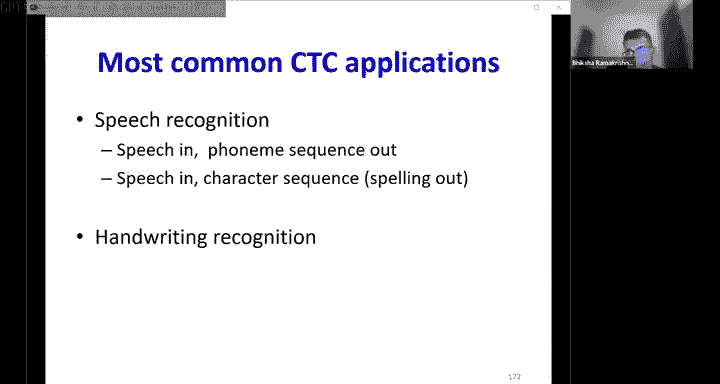

# 17：连接主义时序分类（CTC）🚀

在本节课中，我们将学习一种重要的序列到序列建模方法——连接主义时序分类。我们将探讨如何在没有输入与输出对齐信息的情况下训练模型，并理解其核心算法：前向-后向算法。

---

## 概述

序列到序列模型接收一个输入序列（如语音信号），并输出一个长度可能不同的序列（如文本）。在语音识别等任务中，输入与输出之间存在顺序同步性，但没有严格的时间同步性。本节课的核心问题是：**当训练数据只提供输入和输出序列，而没有它们之间的对齐关系时，我们如何训练模型？**

我们将介绍两种方法：迭代对齐估计法，以及更优雅、更常用的**CTC方法**——它通过考虑所有可能的对齐来计算期望损失。

---

## 序列到序列建模回顾

上一节我们介绍了循环神经网络。本节中，我们来看看一种特殊的序列到序列模型。

在序列到序列建模中，输入序列 `X1, X2, ..., XN` 经过模型，输出另一个序列 `Y1, Y2, ..., YM`。例如：
*   **语音识别**：语音信号输入，单词序列输出。
*   **机器翻译**：一种语言的单词序列输入，另一种语言的单词序列输出。
*   **对话系统**：用户语句输入，系统回复输出。

在这些任务中，输入和输出序列的长度通常不同，且输入与输出之间可能没有严格的时间对应关系。

我们之前见过一个具有**顺序同步性**但非时间同步性的例子：语音识别。输入的每一段大致对应输出的一个符号，顺序一致，但时间点并不精确对应。

---

## 训练中的对齐问题

如果我们有训练数据，并且知道输入序列中每个时间点对应输出序列中的哪个符号（即**对齐**信息），那么训练就很简单。我们可以计算每个时间点的输出概率与目标符号的交叉熵损失，然后求和。

**损失函数公式**：
`总损失 = Σ_t ( -log( P(目标符号_t | 输入) ) )`

其导数计算也很直接：对于每个时间点t，损失对网络输出概率向量的导数，仅在目标符号对应的维度上为 `-1 / P(目标符号)`，其他维度为0。

**核心问题**：在大多数情况下，训练数据**不提供**这种精确的对齐信息。我们只有输入序列和对应的输出符号序列（例如，音频和文本“BEE”），但不知道“B”何时开始，“E”何时结束。

---

## 解决方案一：迭代对齐估计

一种直观的解决方法是猜测对齐，然后迭代优化。

以下是具体步骤：
1.  **初始化对齐**：为训练数据假设一个初始对齐（例如，均匀分布）。
2.  **训练模型**：使用当前对齐信息，像有对齐数据一样训练模型。
3.  **重新对齐**：使用训练好的模型，为输入数据找出新的、更可能的最优对齐路径。
4.  **迭代**：用新的对齐替换旧的对齐，回到步骤2，重复此过程。

然而，这种方法有一个明显缺点：**结果严重依赖于初始对齐的猜测**，容易陷入局部最优解。

---

## 解决方案二：CTC——考虑所有可能对齐

为了克服对初始值的依赖，CTC方法采用了一种更全局的视角：**不固定单一对齐，而是考虑所有可能的对齐，并计算期望损失**。

### 构建对齐图

首先，给定输入和输出序列（如“BEE”），我们可以根据网络在每个时间点输出的概率，构建一个**对齐图**（或称为篱笆网络）。图的每一行代表输出序列的一个符号（包括一个特殊的“空白”符号，稍后解释），每一列代表一个输入时间步。

图中的每条从左到右的路径（每次向右或向右下移动）都代表一种可能的对齐方式。每条路径的概率是路径上各节点概率的乘积。

### 计算期望损失

我们不只使用概率最高的那条路径，而是考虑所有路径。我们希望最小化的损失函数是**所有可能对齐路径的期望损失**。

**期望损失公式**：
`L = Σ_{所有路径A} [ P(A) * (-Σ_t log( P(符号_t | A, 输入) ) ) ]`

根据期望的线性性质，这可以转化为：
`L = -Σ_t Σ_{所有符号s} [ γ_t(s) * log( y_t(s) ) ]`

其中：
*   `y_t(s)` 是网络在时间t预测符号s的概率。
*   **`γ_t(s)` 是关键**：它表示在给定输入和整个输出序列的条件下，**所有对齐路径在时间t经过符号s节点的概率之和**，即该节点的后验概率。

---

## 前向-后向算法计算 γ

那么，如何高效计算每个节点（时间t，符号s）的 `γ_t(s)` 呢？这正是CTC的核心——**前向-后向算法**。

我们将节点的概率分解为两部分：
1.  **前向概率 α_t(s)**：从开始到时间t、符号s节点的所有路径的概率之和。
2.  **后向概率 β_t(s)**：从时间t、符号s节点到结束的所有路径的概率之和。

那么，经过该节点的总概率就是 `α_t(s) * β_t(s)`。对所有节点进行归一化（除以所有节点的αβ乘积之和），就得到了我们需要的后验概率 `γ_t(s)`。

**前向算法（动态规划）**：
*   **初始化**：α_0(起始节点) = 该节点概率。
*   **递推**：α_t(s) = Σ_{父节点p} [ α_{t-1}(p) * y_t(s) ]
*   从左上计算到右下，最终得到结束节点的α，即整个输出序列的概率。

**后向算法（动态规划）**：
*   **初始化**：β_T(结束节点) = 该节点概率。
*   **递推**：β_t(s) = y_t(s) * Σ_{子节点c} [ β_{t+1}(c) ]
*   从右下计算到左上。

有了α和β，`γ_t(s) = (α_t(s) * β_t(s)) / (Σ_{所有节点} α * β)`。

---

## 损失梯度计算

我们的损失是 `L = -Σ_t Σ_s γ_t(s) log( y_t(s) )`。我们需要计算损失L对网络输出 `y_t(s)` 的梯度，以便反向传播。

对 `y_t(s)` 求导，公式包含两项。但可以证明，在最大似然估计的框架下，可以忽略其中复杂的一项，得到一个非常简洁的梯度公式：

**梯度公式**：
`∂L / ∂y_t(k) = - (γ_t(k) / y_t(k))`

其中，`γ_t(k)` 是符号k在时间t的后验概率之和（如果k在输出序列中出现多次，则需累加多个节点的γ）。

这意味着，对于每个时间步t，我们只需将计算得到的γ_t向量除以对应的网络输出概率向量y_t，取负号，就得到了损失对网络输出的梯度。这个梯度可以轻松地反向传播回去训练网络。

---

## 处理重复字符：引入空白符（Blank）

上述讨论隐含了一个问题：如果输出序列有重复字符（如“BEETLE”中的‘E’），如何区分一个长音“E”和两个连续的短音“E”？

CTC的巧妙设计是引入一个特殊的**空白符**（通常用“-”表示）。它被视为一个“无声”的符号。
*   在最终输出中，所有空白符会被移除。
*   连续相同的字符之间**必须**有空白符隔开，否则它们会被合并成一个。
*   不同字符之间可以有或没有空白符。

例如，对齐路径 “B - E E - T - L E” 在移除空白符和合并连续相同字符后，会变成 “B E T L E”。

引入空白符后，对齐图的构建规则需要调整，但前向-后向算法的核心思想不变，只是每个节点的父节点/子节点数量可能变为2个或3个。

---

## 解码：寻找最优输出序列

训练完成后，在推理（解码）阶段，我们的目标不再是找最优对齐路径，而是找**最优的输出符号序列**。

**贪婪解码**：每个时间步选择概率最高的符号，然后移除空白符、合并重复字符。这种方法简单快速，但可能是次优的，因为它没有考虑不同对齐路径可以对应同一个输出序列。

**改进解码**：我们需要找到那个**所有可能对齐路径概率之和最大**的输出序列。这可以通过**束搜索**来近似实现：
1.  在每一步，保留概率最高的若干条候选序列（beam）。
2.  对这些候选序列进行扩展（添加新符号或空白符）。
3.  重复直到序列结束，选择最终概率最高的序列。

束搜索在计算复杂度和效果之间取得了良好平衡。

---

## 总结

本节课我们一起学习了连接主义时序分类（CTC），这是一种用于训练输入输出有序但非严格时间对齐的序列到序列模型的强大方法。

**核心要点**：
1.  **问题**：训练序列模型时缺乏输入与输出的对齐信息。
2.  **思路**：不猜测单一对齐，而是计算所有可能对齐的期望损失。
3.  **核心算法**：**前向-后向算法**，用于高效计算每个时间步、每个符号的后验概率 `γ_t(s)`。
4.  **梯度计算**：损失梯度有一个简洁形式：`-γ_t(s) / y_t(s)`。
5.  **关键技巧**：引入**空白符**来处理输出序列中的重复字符。
6.  **解码**：使用**束搜索**来寻找整体概率最高的输出序列，而非单步最优。

CTC是语音识别、手写识别等任务中的基石性技术，它优雅地解决了序列学习中一个根本性的对齐难题。