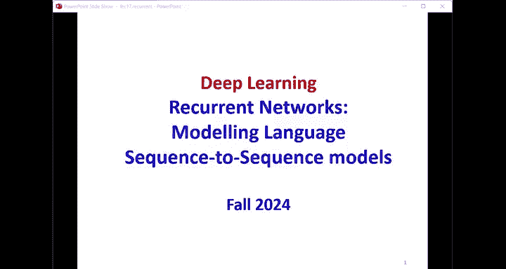
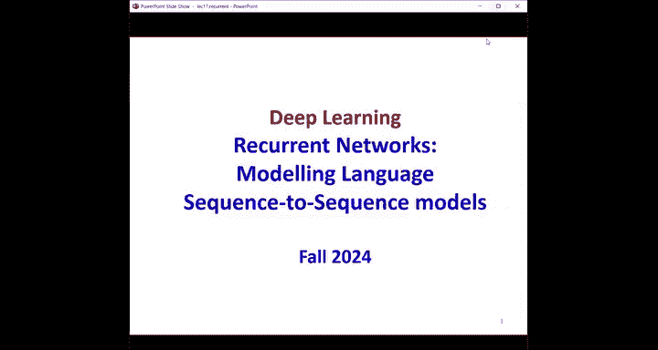
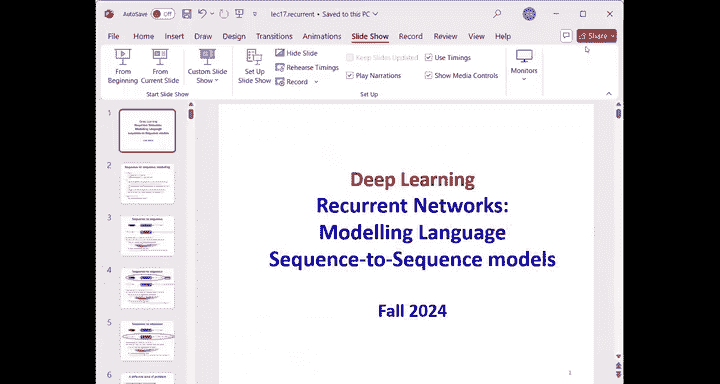
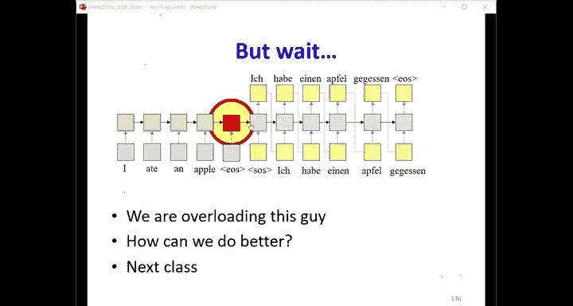

# 18：序列到序列网络与语言模型 🧠

在本节课中，我们将学习序列到序列网络，特别是处理输入与输出序列之间没有顺序对应关系的问题。我们还将深入了解语言模型，以及如何使用循环神经网络来建模和生成语言。

---

## 概述

我们将从语言模型的基础概念开始，探讨如何将单词表示为向量，并介绍词嵌入的概念。接着，我们会深入讲解序列到序列模型的结构，包括编码器和解码器，并解释如何使用束搜索来生成最优的输出序列。最后，我们会讨论模型的训练方法及其在机器翻译、图像描述等任务中的应用。

---

## 语言模型基础

上一节我们介绍了序列到序列问题的两种类型。本节中，我们来看看什么是语言模型。语言模型的核心是建模语言中符号序列的概率分布。换句话说，它告诉我们哪些单词序列更可能出现，哪些不太可能出现。

一个语言模型通常通过预测给定历史单词后的下一个单词来工作。如果我们能完美地预测下一个单词的概率，那么我们也就掌握了整个句子序列的概率分布。

### 单词的数学表示

为了将单词输入模型，我们需要将其转换为数学形式。最直接的方法是使用独热编码。

*   **独热向量**：对于一个包含N个单词的词汇表，每个单词被表示为一个N维向量。该向量中，仅在对应单词在词汇表中索引的位置为1，其余位置均为0。
    *   公式：如果词汇表为 `[“artwork”, “Erin”, ...]`，则 “artwork” 可表示为 `[0, 1, 0, 0, ...]`。

然而，独热编码存在维度高且稀疏的问题。为了解决这个问题，我们引入词嵌入。

*   **词嵌入**：通过一个投影矩阵 **P** 将高维的独热向量映射到一个低维的稠密向量空间。这个稠密向量就是词嵌入。
    *   公式：`embedding = P * one_hot_vector`
    *   这个投影矩阵 **P** 可以通过模型学习得到，使得语义相近的单词在嵌入空间中的距离也更近。

---

## 循环神经网络语言模型

了解了词嵌入后，我们来看看如何使用循环神经网络构建语言模型。与仅基于固定窗口历史预测的模型不同，RNN能够利用整个历史序列的信息。

在RNN语言模型中，在任意时刻 `t`，模型计算的是给定之前所有单词 `(w0, w1, ..., w_{t-1})` 后，下一个单词 `w_t` 的概率分布。

我们可以用训练好的语言模型来生成文本。生成过程是自回归的：给定一个起始标记（如`<SOS>`），模型预测第一个单词的概率分布，从中采样一个单词，然后将这个单词作为输入反馈给模型，用于预测下一个单词，如此循环，直到生成结束标记（如`<EOS>`）。

以下是生成文本的关键步骤：
1.  初始化输入为起始标记 `<SOS>`。
2.  将当前输入和隐藏状态输入RNN，得到下一个单词的概率分布和新的隐藏状态。
3.  从概率分布中采样一个单词作为输出。
4.  将采样的单词作为下一步的输入。
5.  重复步骤2-4，直到输出结束标记 `<EOS>`。

---

## 序列到序列模型

现在，我们回到核心主题：处理没有顺序对应关系的序列到序列任务，例如机器翻译。解决这类问题的标准架构是编码器-解码器模型。

### 模型结构

该模型分为两部分：
1.  **编码器**：一个RNN，用于处理整个输入序列 `(x1, x2, ..., xM)`。在读取完所有输入后，编码器最终隐藏状态 `h_M` 旨在捕获输入序列的全部语义信息。
2.  **解码器**：另一个RNN，作为一个**条件语言模型**，负责生成输出序列 `(y1, y2, ..., yT)`。解码器的初始隐藏状态被设置为编码器的最终隐藏状态 `h_M`，其第一个输入是起始标记 `<SOS>`。

解码器在每一步 `t` 的工作是：基于编码器信息（通过初始隐藏状态传递）以及已生成的前 `t-1` 个输出单词 `(y1, ..., y_{t-1})`，来预测第 `t` 个输出单词 `y_t` 的概率分布。

### 序列概率

对于一个给定的输出序列 `Y = (y1, y2, ..., yT)`，其条件概率可以分解为：
`P(Y | X) = P(y1 | X) * P(y2 | X, y1) * ... * P(yT | X, y1, y2, ..., y_{T-1})`
这正是解码器每一步计算的条件概率的乘积。

---

## 解码与束搜索

在生成输出时，我们的目标是找到使 `P(Y | X)` 最大的序列 `Y`。贪婪解码（每一步只选择概率最高的单词）通常不是最优解，因为当前最优选择可能导致后续整体概率降低。

理论上，我们需要搜索所有可能的输出序列，但这在计算上是不可行的。因此，我们采用**束搜索**作为一种高效的近似方法。

以下是束搜索（束宽 `k=2`）的基本步骤：
1.  在解码第一步，保留概率最高的 `k` 个候选单词。
2.  对于这 `k` 个候选，分别展开下一步，得到 `k * V` 个可能的二元序列（V是词汇表大小）。
3.  计算这些二元序列的累积概率（第一步概率 * 第二步条件概率），并从中保留总体概率最高的 `k` 个序列。
4.  重复此过程，每一步都基于累积概率保留 top `k` 个候选序列。
5.  当一个候选序列生成了 `<EOS>` 标记时，它被视为一个完整的假设，不再继续扩展。
6.  当达到最大生成长度或足够数量的完整假设时，选择累积概率最高的完整序列作为最终输出。

束搜索在探索更多可能性和计算效率之间取得了平衡。

---

## 模型训练：教师强制

训练编码器-解码器模型面临一个挑战：在训练初期，解码器自身生成的质量很差，如果将其输出反馈回去，会导致错误累积，难以与真实目标序列计算有效的损失。

为了解决这个问题，我们使用**教师强制**技术。在训练时，我们不将解码器上一步的**预测输出**作为下一步的输入，而是将真实的**目标序列**中的单词作为输入。这样，无论模型当前预测能力如何，每一步的输入都是正确的，从而可以稳定地计算预测分布与真实下一个单词之间的损失（如交叉熵），并进行反向传播。

虽然这是一种“作弊”，但它对于模型的稳定训练至关重要。

---

## 应用与总结

本节课我们一起学习了序列到序列模型的核心框架。编码器-解码器结构非常灵活，其编码器可以处理各种输入，解码器可以生成各种序列，因此应用广泛：

*   **机器翻译**：将一种语言的句子（输入序列）翻译成另一种语言的句子（输出序列）。
*   **语音识别**：将语音信号（输入序列）转换为文字（输出序列）。
*   **文本摘要**：将长文章（输入序列）压缩为简短摘要（输出序列）。
*   **图像描述**：将图像（通过CNN编码为特征向量作为输入）用文字描述出来（输出序列）。

然而，基本的编码器-解码器模型有一个局限性：编码器需要将整个输入序列的信息压缩到一个固定维度的最终隐藏状态中，这在处理长序列时会造成信息瓶颈，导致信息丢失或稀释。在下一节课中，我们将探讨如何通过注意力机制来解决这个问题。