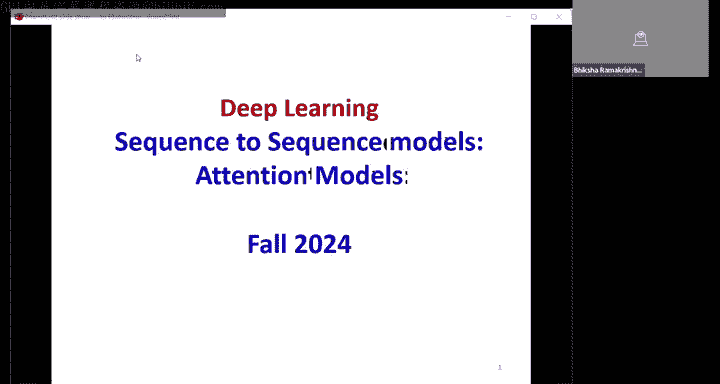
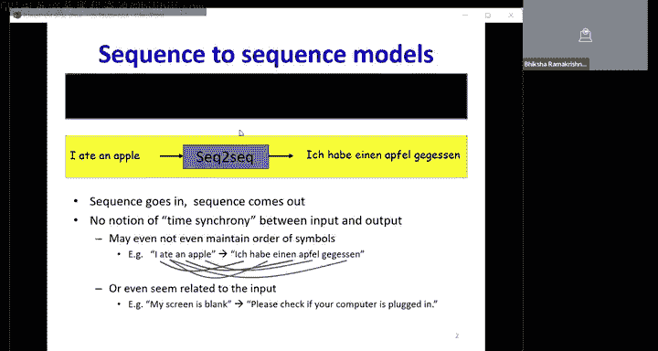
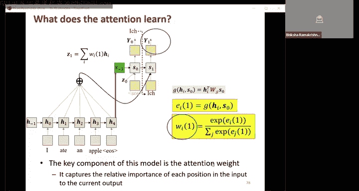
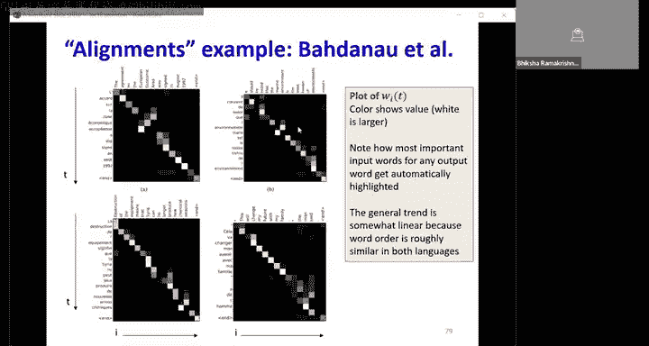
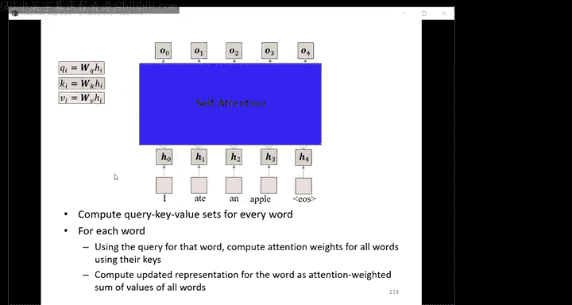
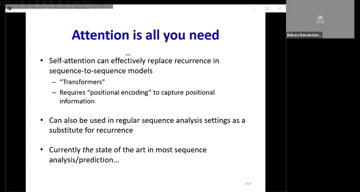

# 19：序列到序列模型进阶 🧠

## 概述
在本节课中，我们将学习序列到序列模型的进阶内容，特别是注意力机制及其核心变体。我们将探讨简单编码器-解码器模型的局限性，并深入理解如何通过注意力机制来解决信息稀释和上下文依赖问题，最终引出“自注意力”和Transformer架构的基本思想。

---

## 简单序列到序列模型的局限性

上一节我们介绍了基础的序列到序列模型。本节中，我们来看看该模型存在的主要问题。

该模型包含一个编码器和一个解码器。编码器处理输入序列并生成一个最终的隐藏状态向量，该向量被传递给解码器作为其初始状态，以生成输出序列。

这个简单框架存在两个核心问题：
1.  **解码器侧的信息稀释**：解码器的隐藏状态会随时间推移而递归更新。当生成长序列输出时，初始的编码器隐藏状态信息会逐渐被“稀释”或遗忘，导致后续生成的词与原始输入的相关性减弱。
2.  **编码器侧的信息过载**：整个输入序列的信息被压缩到**一个单一的向量**中。对于长序列，较早的输入信息可能会在递归过程中被遗忘，导致该向量存在“近期偏置”，难以有效保留所有细节。

---

## 注意力机制的引入

为了解决上述问题，我们引入注意力机制。其核心思想是：解码器在生成**每一个**输出词时，都应能够直接“查看”编码器处理输入序列时产生的**所有**隐藏状态，而非仅仅依赖最后一个状态。

以下是注意力机制的工作流程：

1.  **计算注意力权重**：在解码器的每个时间步 `t`，我们计算一个权重向量。权重 `α_ti` 表示在生成第 `t` 个输出词时，应给予第 `i` 个输入隐藏状态 `h_i` 的关注程度。
2.  **生成上下文向量**：使用这些权重，计算编码器所有隐藏状态的加权和，得到一个**上下文向量** `c_t`。公式如下：
    `c_t = Σ_i (α_ti * h_i)`
3.  **结合上下文生成输出**：将当前时间步的上下文向量 `c_t` 与解码器上一时间步的输出（或目标词）一起，输入到解码器网络中，以生成当前时间步的输出概率分布。

**关键点**：注意力权重是动态计算的，是解码器上一时间步的隐藏状态 `s_{t-1}` 和编码器各个隐藏状态 `h_i` 的函数。一个常见的计算方式是使用加性注意力或点积注意力：
`e_{ti} = a(s_{t-1}, h_i)`
然后通过softmax函数将 `e_{ti}` 归一化为概率分布，得到 `α_ti`：
`α_ti = softmax(e_{ti})`

这使得模型能够学会在生成不同输出词时，灵活地将注意力聚焦于输入序列的不同部分。

---

## 键值对注意力与多头注意力

基础的注意力机制可以进一步优化。

**键值对注意力**：将编码器的每个隐藏状态 `h_i` 拆分为一个**键**和一个**值**。
*   **键**：用于计算注意力权重，可以理解为内容的“粗糙”索引或类别信息。
*   **值**：用于生成上下文向量，包含需要传递给解码器的“精细”内容信息。
*   **查询**：解码器状态 `s_{t-1}` 经过变换后称为查询，用于与所有键进行比较以计算权重。

其工作流程更新为：
1.  使用**查询**和所有**键**计算原始注意力分数 `e_{ti}`。
2.  将 `e_{ti}` 归一化为权重 `α_ti`。
3.  使用权重 `α_{ti}` 对**值**进行加权求和，得到上下文向量 `c_t`。

**多头注意力**：单一的注意力机制可能只关注一种类型的关系（例如语法或语义）。多头注意力并行运行多个独立的键值对注意力“头”。每个头学习在不同的表示子空间中关注输入的不同方面。最后，将所有头的输出拼接或组合起来，形成最终的上下文表示。这极大地增强了模型的表示能力。

---

## 训练与解码策略

**训练（教师强制）**：在训练时，我们已知目标输出序列。为了避免在模型训练初期因输出质量差而无法对齐，我们采用“教师强制”策略：在解码器的每个时间步，我们将**真实的目标词**（而非模型上一时间步的预测词）作为输入喂给解码器。这确保了训练过程的稳定性，并允许我们计算每个时间步预测分布与真实词之间的交叉熵损失，从而进行有效的反向传播。

**解码（束搜索）**：在推理（生成）时，我们的目标是找到整体概率最高的输出序列。由于输出是自回归的（每个词影响后续词），穷举所有序列不可行。因此，我们使用**束搜索**：
1.  在第一个时间步，保留概率最高的 `K` 个候选词（`K` 为束宽）。
2.  在后续每个时间步，对每个候选序列进行扩展，考虑所有可能的下一词，但只保留所有扩展路径中总概率最高的 `K` 个序列。
3.  重复此过程，直到生成结束符或达到最大长度，最终选择概率最高的序列作为输出。

---

## 从注意力到自注意力与Transformer

注意力机制的成功引出了一个更深层的问题：既然解码器可以通过注意力直接访问编码器的所有状态，那么编码器本身是否还需要递归结构来聚合信息？

**自注意力**：答案是可以移除递归。我们可以在编码器内部使用**自注意力**机制。对于输入序列中的每个位置，我们将其表示（如词嵌入）转换为查询、键、值。然后，该位置的查询会与序列中**所有位置**（包括自身）的键进行计算，得到注意力权重，再对值进行加权求和，从而更新该位置的表示。这样，每个词的表示都融入了整个序列的上下文信息。

**位置编码**：自注意力本身不考虑词序。为了注入顺序信息，我们在输入词嵌入上添加**位置编码**。位置编码是一个与词嵌入维度相同的向量，其值根据位置通过特定函数（如正弦和余弦函数）生成，使得模型能够感知词与词之间的相对或绝对位置关系。

**掩码自注意力**：在解码器中，生成过程是顺序的，当前词不应“看到”未来的词。因此，在解码器的自注意力层中，我们会使用**掩码**，确保在计算位置 `i` 的注意力时，只允许其关注位置 `1` 到 `i` 的输入，而将未来位置屏蔽。

**Transformer架构**：结合了多头自注意力、位置编码、前馈神经网络和残差连接等组件，完全摒弃了递归，构建了强大的编码器-解码器架构，即著名的Transformer模型。其编码器由多层多头自注意力和前馈网络堆叠而成，解码器则由掩码多头自注意力和编码器-解码器注意力层堆叠而成。

---

## 总结

本节课中我们一起学习了序列到序列模型的进阶知识。我们从简单编码器-解码器模型的局限性出发，深入探讨了注意力机制如何通过动态计算权重、聚焦相关输入部分来解决信息瓶颈问题。我们进一步了解了键值对注意力、多头注意力等增强机制。接着，我们探讨了使用教师强制进行训练和使用束搜索进行解码的策略。最后，我们看到了如何将注意力机制应用于编码器自身，形成自注意力，并由此引出了完全基于注意力、摒弃递归的Transformer架构的核心思想，这为后续学习大语言模型奠定了重要基础。