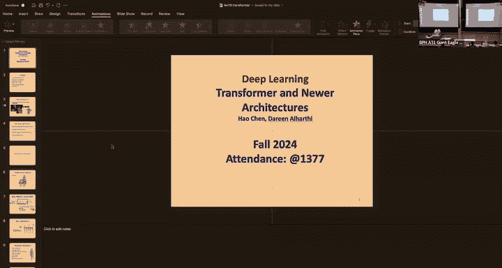
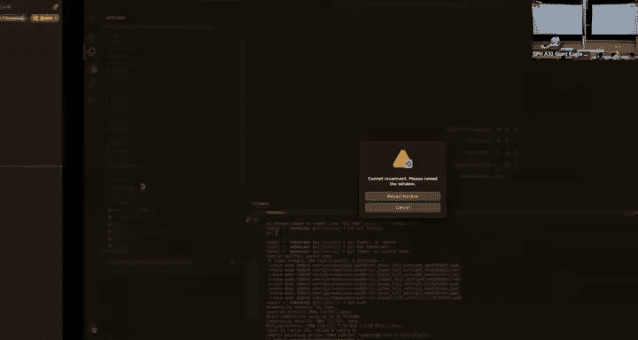
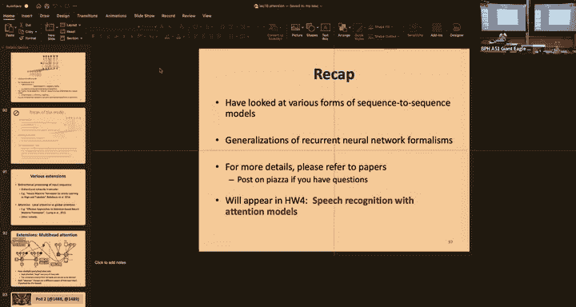
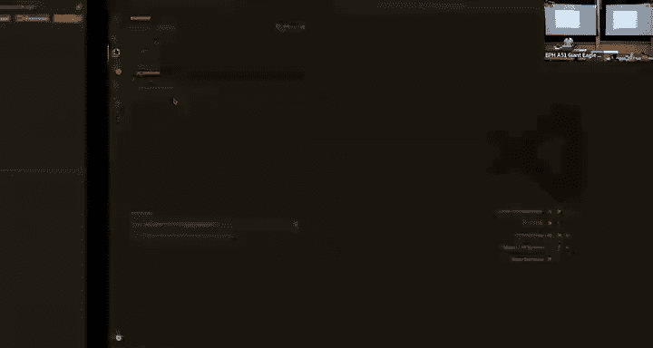
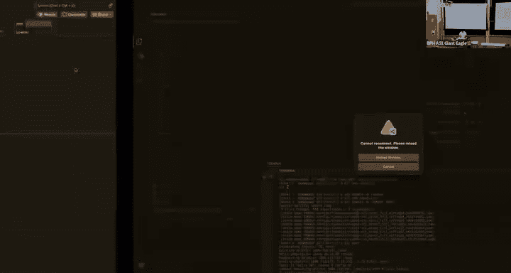
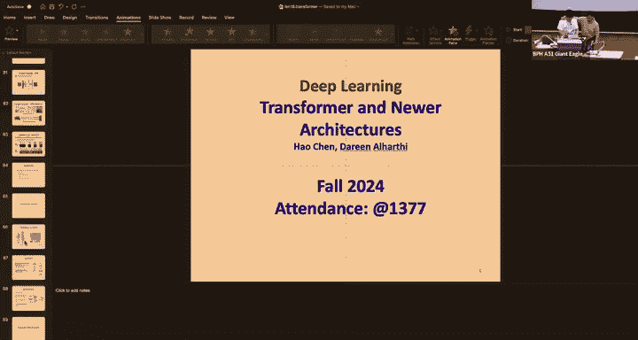
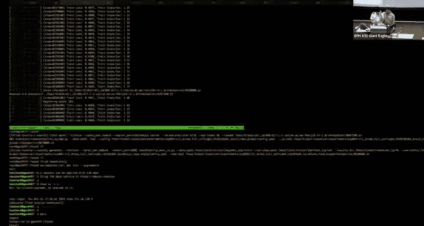
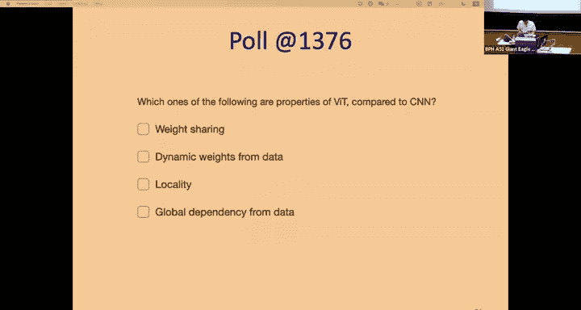
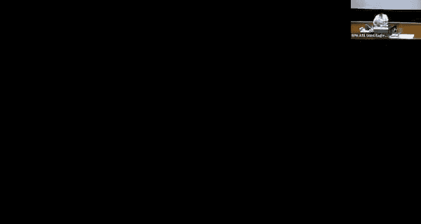

# 20：Transformer与神经架构 🧠

在本节课中，我们将学习Transformer架构的基本原理及其在自然语言处理、计算机视觉等领域的应用。Transformer是现代深度学习中最核心的架构之一，理解其设计思想对于掌握当前最先进的模型至关重要。

---

## 1. 为什么需要学习Transformer？🤔

几乎所有当今深度学习的顶尖系统都基于Transformer架构。例如，GPT和GPT-4等大型语言模型、文本到图像或文本到视频生成模型，以及蛋白质结构预测模型AlphaFold都使用了Transformer。Transformer具有几个关键优势：
*   **灵活性与通用性**：能够处理文本、图像、音频等多种模态的数据。
*   **良好的扩展性**：随着模型参数和数据量的增加，会展现出**涌现能力**和**上下文学习**能力。
*   **参数高效训练**：可以通过仅微调预训练模型的一小部分参数来适应下游任务，在训练和推理上都非常高效。

---

## 2. Transformer基础架构 🏗️

上一讲我们介绍了注意力机制，本节中我们来看看如何将其构建成完整的Transformer模型。Transformer的核心是多头注意力机制。

### 2.1 架构概览

一个标准的Transformer块通常包含以下组件：
*   **词元化与嵌入层**：将原始输入（如文本）转换为连续的向量表示。
*   **位置编码**：为输入序列注入位置信息，因为自注意力本身是排列不变的。
*   **多头自注意力层**：模型的核心，用于捕捉序列内部的依赖关系。
*   **前馈网络层**：一个简单的多层感知机，用于处理注意力层的输出。
*   **残差连接与层归一化**：用于稳定深度网络的训练。
*   **输出投影层**：根据任务（如分类、生成）产生最终输出。

### 2.2 词元化与嵌入

Transformer无法直接处理原始文本字符串。首先需要进行**词元化**，将句子分割成子词或词元，并为每个词元分配一个索引。

接着，通过**嵌入层**将这些离散的索引转换为连续的向量。嵌入层本质上是一个查找表或一个线性层。假设词元索引为 `i`，词汇表大小为 `V`，嵌入维度为 `D`，那么嵌入操作可以表示为：

`嵌入向量 = 嵌入矩阵[i, :]`

其中，`嵌入矩阵` 是一个可学习的参数矩阵，形状为 `(V, D)`。

### 2.3 多头自注意力

这是Transformer最核心的部分。自注意力机制允许序列中的每个位置关注序列中的所有其他位置。

**计算过程如下：**
1.  对输入 `X`（形状 `L×D`，L为序列长度）进行三次不同的线性变换，得到查询`Q`、键`K`、值`V`矩阵：
    `Q = XW_Q`, `K = XW_K`, `V = XW_V`
2.  计算注意力权重：`注意力权重 = softmax(QK^T / sqrt(d_k))`，其中 `d_k` 是 `K` 的维度，缩放是为了稳定梯度。
3.  计算加权和输出：`输出 = 注意力权重 * V`

**多头注意力**是将 `D` 维的输入特征分割成 `h` 个头，在每个头上独立进行上述的自注意力计算，最后将结果拼接起来。这样可以让模型同时关注来自不同表示子空间的信息。

**注意力掩码**：在训练解码器或进行因果预测时，需要防止当前位置关注到未来的位置。这时会使用**因果掩码**。而编码器通常使用**双向掩码**，允许每个位置关注序列中的所有位置。

### 2.4 位置编码

自注意力机制本身不考虑输入的顺序。为了引入序列的顺序信息，需要添加位置编码。

**绝对位置编码**：最原始的方法是使用正弦和余弦函数生成固定的位置向量，然后加到输入嵌入上。公式如下：
`PE(pos, 2i) = sin(pos / 10000^(2i/D))`
`PE(pos, 2i+1) = cos(pos / 10000^(2i/D))`
其中 `pos` 是位置，`i` 是维度索引。

**相对位置编码与旋转位置编码**：为了更好泛化到更长的序列，现代模型（如LLaMA）常使用相对位置编码或旋转位置编码。它们不是将位置信息加到输入上，而是直接修改注意力权重计算过程，使其能感知词元间的相对距离。

### 2.5 前馈网络、残差连接与归一化

*   **前馈网络**：通常是一个简单的两层MLP，中间有一个激活函数（如ReLU或GELU）。公式为：`FFN(x) = max(0, xW_1 + b_1)W_2 + b_2`。研究表明，前馈网络存储了大量的世界知识。
*   **残差连接与层归一化**：每个子层（自注意力、前馈网络）周围都应用了残差连接，然后是层归一化。这极大地促进了深度网络的训练。有两种主要配置：
    *   **后归一化**：`输出 = LayerNorm(x + 子层(x))`。更难训练，但性能可能更好。
    *   **前归一化**：`输出 = x + 子层(LayerNorm(x))`。训练更稳定，是现代架构的默认选择。

---

## 3. Transformer在自然语言处理中的应用 📚

在NLP中，Transformer主要有三种架构变体，适用于不同任务。

### 3.1 三种主要架构

以下是三种主要的Transformer架构及其典型应用：
*   **编码器-解码器架构**：如T5模型。编码器处理输入序列，解码器基于编码器的输出和已生成的部分自回归地生成目标序列。适用于机器翻译、摘要等序列到序列任务。
*   **仅编码器架构**：如BERT模型。仅使用编码器部分，具有双向注意力，能充分理解整个输入上下文。适用于文本分类、命名实体识别等理解类任务。通常使用**掩码语言建模**进行预训练。
*   **仅解码器架构**：如GPT系列模型。仅使用解码器部分，采用因果注意力掩码，用于自回归生成。预训练目标是简单的**下一个词元预测**。当模型规模足够大时，会展现出强大的零样本和上下文学习能力。

### 3.2 高效的注意力机制

标准自注意力的计算复杂度是序列长度的平方级 `O(L²)`，这对于长序列是个瓶颈。研究者提出了多种**高效注意力**方法，如线性注意力，它通过将softmax操作近似为核函数，并利用矩阵乘法的结合律，将复杂度降低到 `O(L)`。

---

## 4. Transformer在计算机视觉中的应用 👁️

Transformer同样革新了计算机视觉领域。

### 4.1 视觉Transformer

ViT是将Transformer直接应用于图像分类的开创性工作。其关键是将图像分割成固定大小的图像块，并将每个图像块线性投影为一个向量（称为“词元”）。然后，这些图像块词元像NLP中的词元一样输入到标准的Transformer编码器中。

**与CNN的对比**：CNN具有**归纳偏置**（局部性、平移等变性），使其在数据较少时也能有效学习。而ViT缺乏这种偏置，必须从海量数据中学习这些关系。因此，ViT在超大规模数据集（如JFT-300M）上预训练后，才能超越CNN的性能。

### 4.2 高效的视觉Transformer变体

为了引入局部性偏置并提升效率，出现了许多ViT变体：
*   **Swin Transformer**：引入**窗口注意力**和**移位窗口**机制，在非重叠的局部窗口内计算自注意力，并通过移位操作实现窗口间信息交互。
*   **ConvNeXt**：采用类似Transformer的宏观架构，但用大核深度卷积代替自注意力层。
*   **MetaFormer**：研究发现，Transformer的成功很大程度上归功于其通用的“池化器+令牌混合器”的元架构，而具体的注意力机制可以被更简单的操作（如恒等映射、随机混合）替代，并在某些任务上取得相近效果。

### 4.3 连接：自注意力与卷积

自注意力与卷积并非完全无关。研究表明，ViT的浅层确实会学习到类似卷积的局部注意力模式。理论上，一个具有动态权重（权重由输入决定）和全局感受野的卷积层可以近似自注意力。反之，通过限制自注意力的感受野，也可以使其表现得像卷积。

### 4.4 CV中的不同架构范式

与NLP类似，CV中也存在不同的架构范式：
*   **掩码自编码器**：使用编码器-解码器架构，随机掩码图像块并训练模型重建，用于视觉表征学习。
*   **编码器-解码器**：用于图像分割（如Segment Anything）或目标检测，编码器提取特征，解码器生成掩码或边界框。
*   **仅解码器**：用于图像生成，如MaskGIT，以掩码图像块预测的方式进行训练，并以迭代去掩码的方式进行图像生成。

---

## 5. 总结 🎯

本节课我们一起深入学习了Transformer架构。我们从其核心组件——多头自注意力机制出发，详细探讨了位置编码、前馈网络、残差连接等关键部分。我们看到了Transformer在自然语言处理中的三种主要架构（编码器-解码器、仅编码器、仅解码器）及其对应的任务，并了解了高效的注意力变体。接着，我们将视野扩展到计算机视觉，学习了视觉Transformer如何将图像处理为词元序列，以及各种为了引入局部性和提升效率而设计的变体模型。最后，我们探讨了自注意力与卷积之间的联系，以及Transformer在CV中不同的架构范式。Transformer以其灵活性和强大的扩展性，已成为连接多模态人工智能的通用骨干网络。