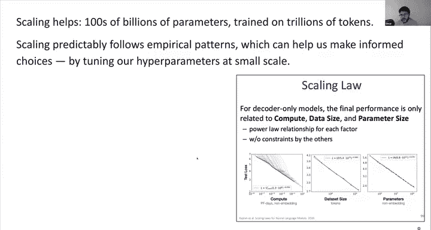
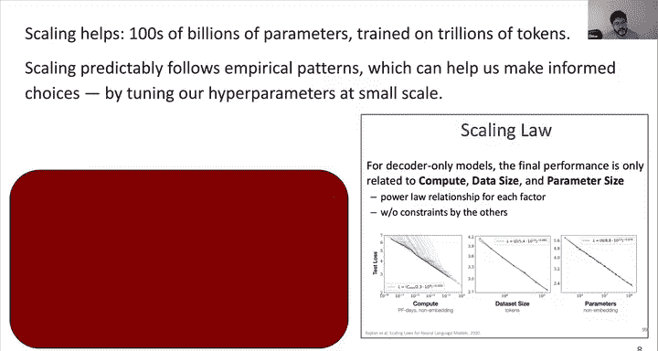
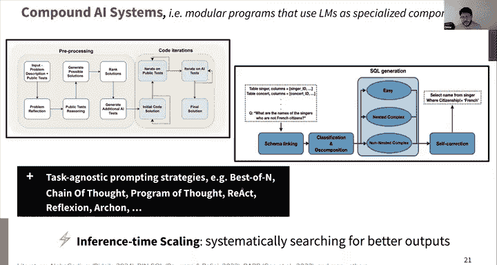
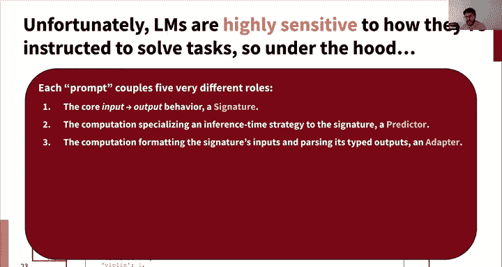
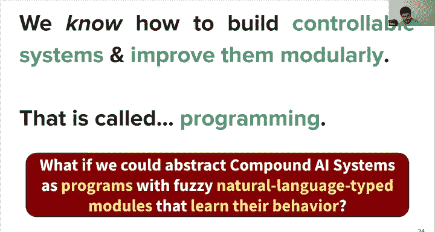
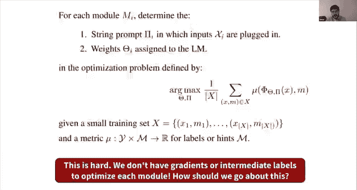
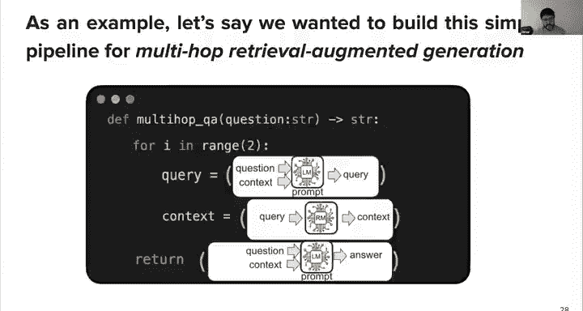
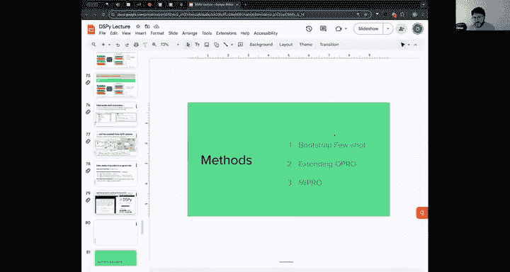
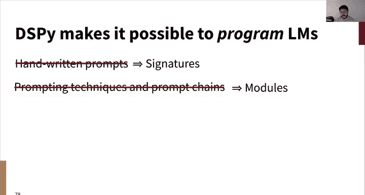
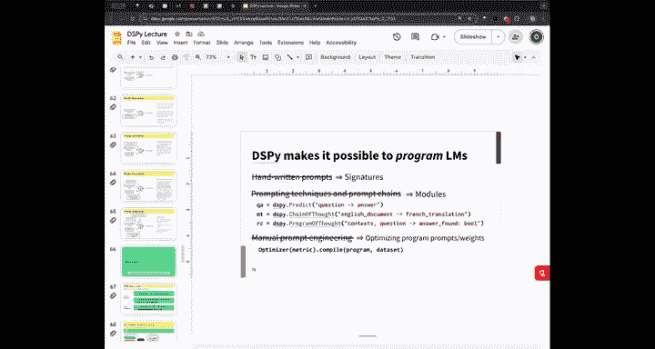

# 21：大语言模型与复合AI系统 🧠


在本节课中，我们将学习大语言模型如何从深度学习基础发展而来，以及如何利用它们构建更复杂、更可靠的复合AI系统。我们将从预训练和微调的基础概念开始，逐步深入到如何将这些模型作为模块化组件来构建可控制、可调试的应用程序。

***

## 📚 概述：从深度学习到大语言模型

大语言模型是一类深度神经网络，它们彻底改变了我们构建AI助手和原型的方式。这一切主要归功于Transformer架构和自回归解码。然而，仅仅拥有这些强大的基础模型还不够。为了构建真正有用且安全的用户界面系统，我们需要进行预训练、后训练（如指令微调和人类反馈强化学习），并将这些模型作为模块化组件整合到更大的复合AI系统中。

***

## 🔄 自回归解码：文本生成的基础

上一节我们介绍了Transformer作为强大的架构基础。本节中，我们来看看如何利用它进行文本生成，其核心是**自回归解码**。

其思想非常简单：我们有一个能够编码文本并将其投影到词汇空间的架构。我们可以以一种贪婪的方式进行自回归解码。

以下是其核心流程的伪代码描述：

```python
while not sequence_finished:
    # 1. 将当前输入文本分词
    tokens = tokenize(input_text)
    # 2. 输入Transformer，进行前向传播，得到输出概率
    output_probs = transformer.forward(tokens)
    # 3. 根据输出概率采样下一个词元（例如，选择最高概率的词元或加入随机性）
    next_token = sample(output_probs)
    # 4. 将新采样的词元追加到输入中，重复此过程
    input_text.append(next_token)
```

通过这个过程，我们能够生成长文本序列。这个简单的机制已经非常强大，可以捕捉许多任务，因为用自然语言描述输入输出本身就是一种非常通用的函数。

***

## 🏗️ 编码器与解码器：架构选择

我将在本讲座中主要关注**仅解码器架构**，因为这是过去几年用于生成的模型的主流。但编码器仍然存在，并且在某些意义上，如果按部署数量计算，它们可能应用更广泛，因为它们是搜索、信息检索等需要实际编码的任务的支柱。

编码器可以用来表示文档，为每个词赋予重要性权重，并构建支持神经搜索的表示。你可以直接使用它们提供的上下文化嵌入在高维空间中进行操作，或者将它们用作评分函数。

以下是使用编码器进行检索的几种方式权衡：
*   **双编码器**：分别编码查询和文档，可预先计算文档表示，扩展性好。
*   **交叉编码器**：联合编码查询和文档对，能利用注意力机制，精度更高，但计算成本也高。

这只是为了确保编码器没有被遗忘，本讲座的其余部分将完全专注于解码器。

***





## 🌐 预训练：赋予模型广泛的知识

上一节我们了解了如何生成文本。本节中，我们来看看如何训练一个Transformer，使其真正擅长此道。目标是**通过在海量网络数据上训练，赋予语言模型广泛的知识**。

我们基本上会尽可能爬取整个网络，过滤掉不想要的内容，然后进行积极的清洗。覆盖更多样化的数据源通常效果更好。

例如，早期开源数据集`The Pile`就包含了学术论文、通用网络爬取数据、问答社区、代码、维基百科等多种来源。

### 预训练任务：下一个词预测

拥有了所有这些数据后，我们能做什么呢？有趣的是，非常传统的**语言建模任务**，或者说简单的**下一个词预测**，就能带我们走得很远。

我们将使用标准的交叉熵分类损失，教导Transformer根据前文预测下一个词。这就是我们在过去大约八年深度学习中所遵循的范式：对于许多任务，你并非从头开始，而是先在一些广泛、可扩展的数据上预训练一个**基础模型**，然后再通过**微调**来适应你的特定任务。

### 为什么预训练有效？

一个有趣的问题是：为什么在广泛数据上进行预训练会有帮助？有两种可能的假设：
1.  它可能有助于在微调时梯度流动得更好。
2.  梯度下降可能倾向于停留在初始化点附近。因此，当我们花费很长时间得到一个很好的初始化后，即使少量的微调也能学习任务，并且由于接近这个通用的预训练参数，泛化能力也很好。

### 数据过滤与清洗

数据过滤和清洗是工程中的关键因素，但具体方法通常是保密的。一些启发式方法包括：
*   **基于困惑度过滤**：如果模型对某个页面的困惑度过高（难以预测其中的词元），则可能只是随机噪声，应丢弃。
*   **上采样高质量数据**：例如，人为提升维基百科等高质量数据在训练批次中的比例。
*   **自动加权方法**：这是一个新兴的研究领域，旨在通过学习来确定数据子集的权重。

这主要是大量的工程和试错，理论正在努力追赶和推进。

***

## 🧩 预训练学到了什么？

我们进行了所有这些预训练，但它在试图做什么？实际上又实现了什么？在进入后训练等步骤之前，我们需要了解这一点。

预训练主要带来两方面的收获：
1.  **强大的语言表示**：帮助模型理解词语关联、基本语法，并生成类似人类语言的序列。
2.  **适应下游任务的基础**：为情感分析、毒性检测、报告生成、翻译、信息检索等下游任务提供了良好的起点，这些任务都受益于良好的语言表示。

仅仅通过大规模的下一个词预测，模型就能学习到事实（如斯坦福大学的位置）、句法、共指消解，甚至一些看似需要推理的任务模式。这表明预训练编码的知识远不止简单的词语预测。

***

## 📈 缩放定律与涌现能力

在上一讲中，你们已经了解了缩放定律。对于仅解码器模型，研究发现性能提升是高度可预测的：通常，模型参数量越多、训练数据越多，效果越好。

这可以描述为一个经验性的缩放定律，帮助我们在大规模训练模型时做出明智的决策，例如，可以在小规模上调整超参数，然后可预测地扩展到更大规模。

一个关键的启示是：在训练大语言模型时，你有一个固定的预训练计算预算。你需要在**增加模型参数量**和**增加训练数据量**之间做出权衡。模型越小，长期推理效率越高，但为了达到特定质量水平所需的数据量增长是非线性的。近年来，趋势是训练参数量不一定更大、但在**多得多数据**上训练的模型。

有趣的是，缩放不仅平滑地降低测试损失，还会带来一些**涌现能力**：

### 上下文学习
对于足够大的模型，你可以通过提供几个任务示例（即“上下文”），让模型在不进行梯度更新的情况下学习并遵循新模式。这曾是一个惊人的观察，虽然它本身并未直接带来任务性能的飞跃，但模型识别和生成这类序列的能力是后续赋予其更多能力的关键。

### 思维链推理
对于许多组合性问题，直接生成答案可能很困难。**思维链**提示要求模型在生成最终答案前，先输出推理步骤。研究表明，当模型规模足够大时，这种技巧可以显著提高复杂任务（如数学问题）的解答质量。


关于这些现象何时开始出现，并没有绝对的规则。早期认为需要超过1000亿参数，但现在，即使在参数量小得多的模型上（如果它们在更多数据上训练并经过后训练），也能观察到这些增益。

***

## 🎯 后训练：从知识模型到助手

预训练给了我们一个知识渊博但“原始”的模型。它擅长生成类似其训练数据的文本，但并不一定知道它应该回答问题或遵循指令。这引出了**后训练**（也称为对齐或人类反馈强化学习）的目标。

后训练的目标是：利用模型已掌握的大量知识，教导它成为一个面向用户的助手，其职责是以简洁、准确、有用、安全的方式回答问题。

### 指令微调
最简单的方法是**指令微调**，本质上是**大规模多任务学习**。我们收集来自各种任务（事实问答、数学、代码、情感分析、报告撰写等）的大量问答对数据集，然后在预训练模型上使用相同的交叉熵损失进行微调，让模型学会根据输入问题生成答案。

这是一个巨大的进步，使得模型从“酷炫的玩具”变成了半可靠的工具。但其局限性也很明显：它依赖于我们能收集到多少样化的高质量数据，可扩展性远不如预训练，并且可能鼓励模型在不知道答案时也显得知识渊博（即**幻觉**）。

### 人类反馈强化学习
要进一步提升，我们需要模型能够试错并从反馈中学习，这就是**人类反馈强化学习**的范式。OpenAI等公司广泛使用此方法。

其流程通常包括以下步骤：
1.  **收集示范数据**：让人类标注员根据用户问题撰写高质量答案。
2.  **监督微调**：用这些数据对预训练模型进行微调，得到初始模型。
3.  **训练奖励模型**：让初始模型生成多个答案，由人类标注员进行排序或比较。用这些数据训练一个**奖励模型**，使其能够评估答案的好坏。
4.  **强化学习优化**：使用PPO等强化学习算法，以奖励模型为指导，优化初始模型，使其生成能获得高奖励的答案。

这个过程是使模型行为更符合人类期望的关键，但也非常复杂，并且奖励模型的质量至关重要。

***

## 🤖 复合AI系统：超越单一模型

尽管后训练大大提升了模型能力，但大语言模型作为**单一、整体的系统**，仍难以达到在生产环境中部署可靠AI系统的标准。它们可能产生流畅但错误的答案（幻觉），且难以控制和调试。

为了解决这个问题，AI研究者越来越多地构建**复合AI系统**。这意味着构建模块化的程序，将预训练和后训练的语言模型作为**专用组件**整合到更大的架构中。

### 检索增强生成
一个典型的例子是**检索增强生成**。其架构不是让语言模型直接“猜测”答案，而是将其分解为步骤：
1.  用户问题首先由**检索器**（通常也是一个Transformer编码器）处理，从知识库中检索相关文档。
2.  检索到的文档与原始问题一起输入给**生成器**（大语言模型）。
3.  生成器被指示基于这些文档来回答问题。



这样做的好处包括：
*   **可解释性**：可以追溯答案所依据的文档。
*   **效率**：可以将事实记忆卸载到检索系统，从而可能使用更小的、专注于推理的生成模型。
*   **可控性**：可以检查和改进检索、生成等各个模块。

### 多跳推理系统
对于更复杂的问题（例如，“大卫·格雷戈里在17世纪继承的城堡有多少层？”），可能需要多步推理。**多跳RAG系统**通过引入循环来模拟这一过程：
1.  生成一个用于查找初始实体（如“大卫·格雷戈里”）的查询。
2.  根据检索结果，生成新的查询以查找更多信息（如“他继承的城堡名称”）。
3.  再次检索，最终基于所有信息生成答案。


通过将语言模型用作查询生成器、摘要器、答案生成器等不同角色，我们可以构建出能处理复杂组合性问题的系统，并且可以独立改进每个模块。


### 基于代码执行的系统
另一个方向是让系统生成代码并执行，以获得精确的反馈。例如，在代码生成任务中，系统可以：
1.  生成多个代码解决方案。
2.  在公共测试用例上运行这些代码。
3.  根据测试结果对解决方案进行排名或改进。
4.  循环此过程以获得更好的解决方案。


这为系统提供了基于实际执行的 grounding（ grounding）。

***



## ⚙️ 挑战与未来方向：可编程的AI系统

复合AI系统在原理上是模块化的，这很有吸引力。但当前的实现方式存在一个重大问题：它们通常通过冗长、手工编写的提示词来连接各个模块。这导致了**强耦合**，将系统架构与特定模型、提示词格式等偶然选择绑定在一起，使得系统难以移植、维护和泛化。



其根本原因在于，当我们编写提示词时，我们同时编码了：
1.  **函数签名**：输入输出行为。
2.  **计算逻辑**：推理步骤、示例。
3.  **输出适配器**：如何从模型输出的文本中解析出结构化的结果。
4.  **目标约束**：如“不要幻觉”、“使用计算器”。
5.  **优化过程**：如何通过试错来改进提示词本身。

为了解决这个问题，一个前沿方向是让**复合AI系统像真正的计算机程序一样可编程**。这涉及到创建新的编程抽象，允许我们声明式地定义处理自然语言输入输出的模块，并自动优化这些模块的提示词或内部参数，以最大化整个系统的目标。

例如，像**DSPy**这样的框架允许开发者用高级语法定义模块（如“ChainOfThought”），并声明其输入输出类型。然后，系统可以自动搜索最佳提示词或进行微调，使所有模块协同工作以优化最终指标。这种方法将我们从繁琐的手工提示工程中解放出来，转向更通用、可移植的系统构建和优化算法。





***



## 🎓 总结

本节课中，我们一起学习了构建现代大语言模型应用的全景：
1.  **基础**：Transformer和自回归解码提供了强大的文本生成能力。
2.  **预训练**：在海量网络数据上进行下一个词预测，赋予模型广泛的语言知识和世界知识，缩放定律指导我们有效利用计算资源。
3.  **后训练**：通过指令微调和人类反馈强化学习，将知识模型转化为能遵循指令、安全有用的助手。
4.  **复合AI系统**：将大语言模型作为模块化组件，构建检索增强生成、多跳推理等更可靠、可解释、可控制的系统。
5.  **未来方向**：通过可编程的抽象和自动优化，解决当前系统脆弱、难以移植的问题，实现更稳健、通用的AI系统构建。






大语言模型是深度学习力量的杰出体现，但将它们转化为可靠的现实世界应用，需要我们以系统化的思维，将其作为更宏大工程中的一部分来设计和优化。