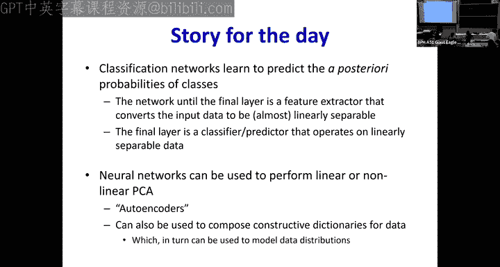

# 22：神经网络内部机制解析 🧠

在本节课中，我们将深入探讨神经网络的内部工作原理。我们将了解网络如何学习、数据在网络中如何流动，以及网络的不同部分（如特征提取层和分类层）各自扮演什么角色。通过分析线性分类器、逻辑回归和自编码器等概念，我们将揭示神经网络作为统计估计器的本质，以及它如何学习数据的底层流形结构。

---

## 神经网络概览：功能与训练

上一节我们回顾了神经网络作为通用逼近器的强大能力。本节中，我们来看看网络在训练过程中究竟在做什么。

一个标准的神经网络接收输入，经过一系列变换，最终产生输出（如分类结果）。整个网络可以看作由两部分组成：
1.  **特征提取部分**：输入层到倒数第二层之间的所有层。它们将原始输入数据转换为新的特征表示。
2.  **分类部分**：通常是最后一层（如 `softmax` 层）。它基于提取出的特征进行最终决策。

网络的目标是学习一个函数，能够根据输入数据 `X` 预测输出 `Y`。在分类任务中，这通常意味着学习能够区分不同类别的决策边界。

---

## 从线性分类到概率建模

当数据可以被一个清晰的线性边界完美分开时，事情很简单。但现实中的数据往往是混杂的，同一个输入值 `X` 可能对应不同的类别 `Y`。

例如，在某个特征值 `x` 处，90% 的样本属于类别1（红色），10%属于类别0（蓝色）。一个理想的分类器不应该武断地输出“红色”，而应该输出一个能反映这种不确定性的值，即类别1的概率 `P(Y=1 | X=x) = 0.9`。

这引出了我们的核心观点：**神经网络的输出层（如使用 `sigmoid` 或 `softmax` 激活函数）实际上是在建模给定输入 `X` 后，输出类别 `Y` 的后验概率 `P(Y | X)`**。

对于二分类问题，`sigmoid` 函数完美地扮演了这个角色：
`P(Y=1 | X) = 1 / (1 + exp(-(w0 + w1*X)))`
这个函数是平滑、可微的，其输出值在0到1之间，可以解释为概率。

---

## 最大似然估计与交叉熵损失

那么，网络是如何学习到这个概率模型的呢？答案是通过**最大似然估计**。

给定一组训练数据 `(X_i, Y_i)`，我们希望找到网络参数 `θ`，使得观察到这组数据的概率（即似然）最大。这等价于最大化所有训练样本的似然乘积，或更常见地，最大化其对数似然和。

当我们推导用于二分类的 `sigmoid` 输出层的对数似然时，会发现一个熟悉的形式：
`最大化 ∑ log(P(Y_i | X_i))` 等价于 `最小化 -∑ [Y_i * log(Ŷ_i) + (1-Y_i) * log(1-Ŷ_i)]`
这正是**二元交叉熵损失函数**！

因此，**使用交叉熵损失训练一个分类神经网络，本质上就是在执行最大似然估计，以学习后验概率 `P(Y | X)`**。这为神经网络的训练提供了一个坚实的统计学基础。

---

## 特征提取：创造线性可分空间

现在，我们来看看特征提取部分的作用。如果最后一层是一个线性分类器（`sigmoid` 本质上也是线性决策边界），那么它要能有效工作，前提是**输入给它的特征必须是（近似）线性可分的**。

这正是网络中下层网络的神奇之处。它们学习一种变换，将原始输入空间中复杂交织、非线性可分的数据，**映射到一个新的特征空间**。在这个新空间中，不同类别的数据变得尽可能线性可分。

以下是这一过程的直观理解：
*   **目标**：将原始数据“挪动”到一个易于用线性平面分开的布局。
*   **方式**：通过每一层的线性变换（权重矩阵）和非线性激活函数，逐步扭曲和变换数据流形。
*   **结果**：到达倒数第二层时，数据点在新特征空间中的分布变得几乎线性可分，以便最后的线性分类器能够轻松处理。

如果网络容量（宽度、深度）足够，它可以学习到使数据完美线性可分的变换。如果容量不足，它也会尽力使数据达到“最可能”线性可分的状态。

---

## 窥视第一层：作为相关滤波器的神经元

为了理解特征是如何被提取的，让我们聚焦于网络的第一层。每个神经元计算输入 `X` 和其权重向量 `W` 的点积，然后通过一个激活函数（如 `ReLU`, `sigmoid`）。

在高维空间中，如果我们将输入向量和权重向量都归一化到相近的长度，那么它们的点积主要取决于两者之间的夹角余弦值：
`W·X ≈ ||W|| * ||X|| * cos(θ)`
当 `cos(θ)` 超过某个阈值时，神经元被激活（“放电”）。

这意味着什么？**第一层的每个神经元，其权重向量 `W` 就像一个“模板”或“特征探测器”**。它会在输入数据 `X` 与这个模板足够相似（即夹角足够小）时被激活。

例如，一个用于数字识别的网络，其第一层的某些神经元可能学会对应“垂直线段”、“左上圆弧”或“右下角点”等基本图案。后续的层则将这些基本特征组合成更复杂的模式（如完整的数字“8”或“2”）。

---

## 自编码器：学习数据的内在流形

如果我们改变网络的目标，不是预测类别，而是**重建输入本身**，我们就得到了**自编码器**。

一个基本的自编码器由两部分组成：
1.  **编码器**：将高维输入 `X` 压缩成一个低维的“编码” `Z`（瓶颈层）。
2.  **解码器**：根据编码 `Z` 试图重建出原始输入 `X̂`。

以下是自编码器的关键见解：

**情况一：线性激活函数**
如果编码器和解码器都使用线性激活函数，并且我们使用均方误差（MSE）作为重建损失，那么训练好的自编码器实际上是在执行**主成分分析**。
*   编码器 `W_enc` 将数据投影到主成分子空间。
*   解码器 `W_dec` 从该子空间重建数据。
*   无论输入是什么，输出都必然位于由主成分张成的**线性子空间**上。

**情况二：非线性激活函数**
当引入非线性激活函数（如 `ReLU`, `tanh`）后，自编码器能够学习**非线性主成分分析**。
*   解码器学会将一个低维的编码空间 `Z` **扭曲**成一个复杂的、高维的**数据流形**。
*   这个流形捕捉了训练数据分布的本质结构。例如，对于螺旋形分布的数据，解码器可能学会将一条直线（编码 `Z`）映射回一个螺旋。

自编码器的一个重要特性是：**训练好的解码器，无论你输入什么编码 `Z`，其输出都必然位于它所学到的数据流形之上**。这使得它成为一个强大的**生成模型**，可以产生与训练数据类似的新样本（例如，生成像训练集中乐器声音的音频，或像训练集中数字的手写图像）。

---

## 应用示例：基于字典的音频分离

自编码器学习数据流形的能力可以用于解决像**音频源分离**这样的问题。

假设我们想从混合音频中分离出吉他和鼓的声音：
1.  分别用纯吉他音频和纯鼓音频训练两个自编码器。
2.  训练完成后，它们的解码器部分就分别成为了“吉他声音字典”和“鼓声音字典”。每个解码器只能生成各自乐器特有的声音。
3.  当面对一个混合音频（吉他+鼓）时，我们将其输入这两个**冻结的**解码器网络，并通过反向传播**只优化输入给这两个解码器的编码向量 `Z_guitar` 和 `Z_drum`**。
4.  优化的目标是使两个解码器的输出之和尽可能接近混合音频。
5.  优化完成后，`解码器_吉他(Z_guitar)` 的输出就是分离出的吉他音轨，`解码器_鼓(Z_drum)` 的输出就是分离出的鼓音轨。

这种方法利用了每个解码器只能生成特定流形上数据这一约束，从而迫使模型在解释混合信号时找到正确的成分组合。

---

## 总结

本节课中我们一起深入探索了神经网络的内部机制：

1.  **本质是概率模型**：分类神经网络的输出层旨在建模后验概率 `P(Y | X)`，使用交叉熵损失训练等价于进行最大似然估计。
2.  **特征提取即空间变换**：网络中层的作用是将原始数据非线性地变换到一个新的特征空间，使得不同类别在该空间中变得（近似）线性可分，从而方便最后一层的线性分类器工作。
3.  **底层神经元是特征探测器**：第一层的神经元充当相关滤波器，其权重向量代表了它要检测的输入中的基本模式或特征。
4.  **自编码器揭示数据流形**：通过以重建为目标进行训练，自编码器能够学习数据分布的底层流形结构。线性版本对应PCA，非线性版本能发现复杂的流形，其解码器可作为特定数据类型的生成器。
5.  **流形学习具有实用价值**：学习到的数据流形可以用于各种任务，如数据生成、去噪、以及我们演示的基于字典的音频源分离。

通过理解这些内部原理，我们不仅能更好地理解神经网络的行为，还能更有目的地设计和使用它们来解决复杂问题。