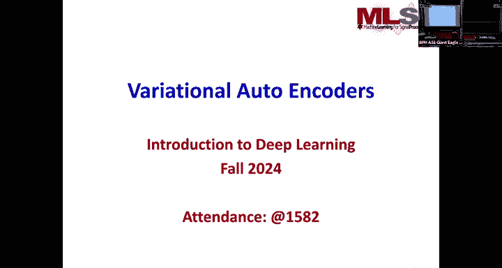
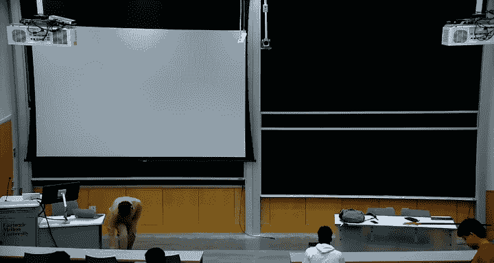
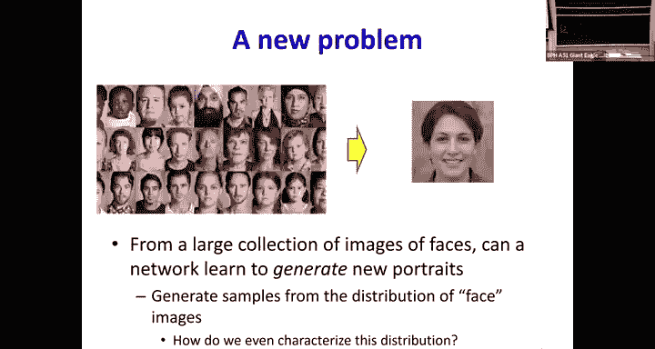
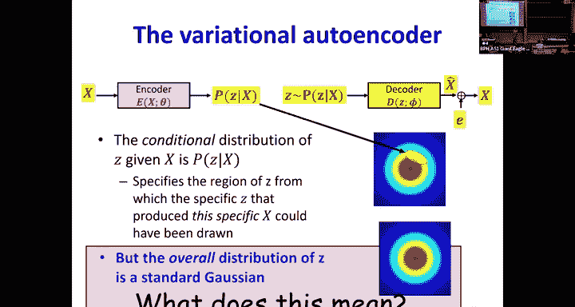
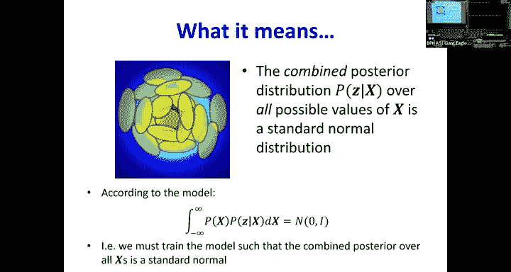
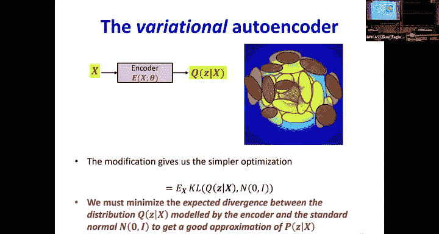
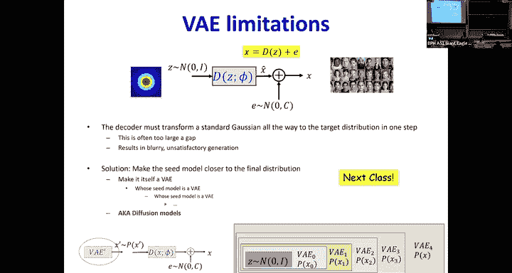
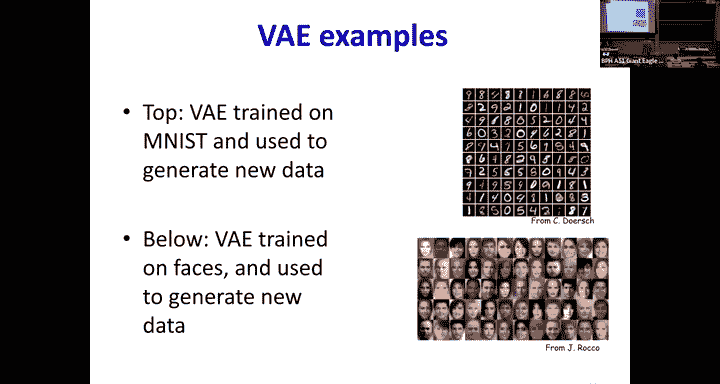

# 23：生成模型与变分自编码器（VAE）📊

在本节课中，我们将要学习一个全新的问题类别：生成模型。我们将探讨如何让神经网络从一组数据（如人脸图片）中学习，并生成新的、类似的数据。我们将从简单的自编码器开始，逐步引入约束和概率模型，最终构建出强大的变分自编码器（VAE）。

---

## 概述：从分类到生成

到目前为止，我们看到的神经网络主要用于执行分类和回归任务。给定一堆数据，网络学习如何预测数据的类别或某个连续值。

现在，我们面临一个全新的问题类别：给定一个大型图像集合（例如人脸），你必须学会如何从中生成新的肖像。这是一个生成问题。其核心思想是，所有可能的图像都存在于一个高维空间中（例如，百万像素的图像是百万维空间中的一个点）。所有可能的人脸在这个空间中有一个分布。我们的目标是：如何从这个分布中抽取一个样本，使其看起来像一张人脸。

同样，如果给你一个大型风景图像集合，你如何训练一个网络来生成新的风景？这也是同一个问题。

---

## 挑战：高维空间中的未知分布

这是一个非常具有挑战性的问题。在百万维空间中，我们完全不知道人脸分布的具体数学形式。即使在三维或二维空间中，除了高斯分布、均匀分布等少数几种，我们也很难描述一个复杂的分布。

问题的关键在于，并非百万维空间中的每一个点都是一张有意义的图像。有意义的图像（如人脸、风景）具有**结构**。结构意味着限制——数据点不能取所有可能的值，只能取某个子集的值。这相当于消除了自由度，或者说降低了维度。

因此，我们的假设是：数据（如所有人脸实例）分布在一个高维空间中的**非线性流形**上或附近。如果我们想从这个类别中生成一个新实例，首先需要描述这个流形，然后从中选取一个点。

---

## 自编码器的初步尝试

我们之前学过的**自编码器**可以帮助我们学习数据的底层流形结构。它通过非线性主成分分析来捕获这个流形。自编码器的解码器部分可以从流形上生成数据。

例如，我们可以训练一个关于人脸的自编码器。在瓶颈处，我们希望捕获人脸所在子空间（流形）的维度。之后，任何时候向解码器输入任何内容，它都会在这个“人脸流形”上生成数据，希望这看起来像一张脸。

但这里存在几个问题：
1.  我们不知道流形的真实维度。
2.  即使知道了维度，我们也无法控制潜在变量 `Z` 如何映射到流形上。解码器可能以任意方式扭曲这个映射。
3.  自编码器只能生成位于其学习到的流形上的数据，无法生成流形之外的数据，而真实数据可能存在流形之外的微小变化。

---

## 引入约束：对潜在变量施加分布

为了解决控制问题，我们希望**对潜在变量 `Z` 施加一个分布约束**。最简单的选择是标准高斯分布（均值为0，方差为1的单位高斯分布）。选择高斯分布是因为在给定方差的情况下，它是做出最少假设的分布（最大熵分布）。

如果我们能训练自编码器，使得 `Z` 始终服从标准高斯分布 `N(0, I)`，那么要生成新数据时，我们只需从标准高斯分布中采样一个点，然后通过解码器，它就有很高的可能性生成正确范围内的数据（如一张人脸）。

**核心问题**：如何训练一个自编码器，使其隐藏表示 `Z` 服从特定的分布？

我们将使用**最大似然原则**。对于任何编码器，我们希望设置其参数，使得编码器输出的 `Z` 值用标准高斯分布计算得到的概率最大化（或负对数概率最小化）。这等价于最小化编码器生成的 `Z` 的分布与标准高斯分布之间的 KL 散度。

对于标准高斯分布，一个向量 `Z` 的负对数概率简单地正比于其平方范数 `||z||²`。

因此，我们训练的整体模型将同时做两件事：
1.  最小化输入 `x` 与重构输出 `x̂` 之间的误差。
2.  最小化从编码器出来的 `Z` 向量的平方范数。

**公式表示**：
`总损失 = 重构损失 + λ * ||z||²`
其中 λ 是一个权衡参数。

---

## 处理流形外的变化：加入噪声

简单的模型仍然不能充分捕获数据中的所有变化。真实数据并不完全位于流形上，而是在其附近。因此，我们假设实际数据是通过在解码器输出上**添加噪声**得到的。

我们假设噪声是零均值、各分量独立且无结构的。给定方差，信息量最少的分布就是高斯分布。因此，我们假设噪声是协方差矩阵为对角阵的高斯分布（各维度独立）。

这意味着，给定一个 `Z`，它生成一个 `x̂`，然后加上一些噪声 `ε` 来产生最终的 `x`。因此，`x` 不再是 `Z` 的确定性结果，而是一个分布。给定 `Z`，`x` 的概率分布是以解码器输出 `D(z)` 为均值、以某个协方差矩阵 `C` 为方差的高斯分布。

**生成过程**：
1.  从标准高斯分布中采样一个 K 维向量 `z`。
2.  将 `z` 通过解码器 `D`，得到 `x̂`。
3.  从高斯分布 `N(0, C)` 中采样噪声 `ε`。
4.  将噪声加到解码器输出上：`x = x̂ + ε`。

这就构成了数据的**生成模型**。

---

## 变分自编码器（VAE）的完整框架

为了训练这个生成模型，我们需要知道每个训练数据点 `x` 对应的 `z`。但我们没有。这就是编码器的作用：**编码器的任务是估计产生每个 `x` 的 `z`**。

然而，由于噪声的存在，对于同一个观测到的 `x`，可能有多个不同的 `z`（通过添加不同的噪声）都能生成它。因此，`z` 并不是唯一的，它有一个分布。

所以，编码器的工作不再是输出一个确定的 `z`，而是**估计 `z` 的后验概率分布 `P(z|x)`**。我们称编码器计算出的分布为 `Q(z|x)`。

我们希望 `Q(z|x)` 尽可能接近真实的 `P(z|x)`。同时，我们有一个全局约束：所有 `x` 对应的 `P(z|x)` 的平均（混合）应该是一个标准高斯分布。因此，我们也要让 `Q(z|x)` 的平均接近标准高斯。

通过一番推导（使用变分推断），我们可以得到 VAE 的优化目标（损失函数），它包含两部分：
1.  **重构损失**：使解码器输出尽可能接近原始输入 `x`。
2.  **KL 散度损失**：使编码器输出的分布 `Q(z|x)` 尽可能接近标准高斯分布 `N(0, I)`。

**VAE 损失函数（简化形式）**：
`L(θ, φ) = 重构损失(x, D(z)) + β * KL( Q(z|x; θ) || N(0, I) )`
其中 `z` 是从 `Q(z|x; θ)` 中采样得到的，`θ` 是编码器参数，`φ` 是解码器参数，`β` 是超参数。

为了使采样过程可反向传播（允许梯度通过），我们使用**重参数化技巧**：
`z = μ + σ ⊙ ε`
其中 `ε` 采样自标准高斯分布 `N(0, I)`，`μ` 和 `σ` 是编码器根据输入 `x` 输出的均值和标准差。这样，`z` 的随机性来自于 `ε`，而 `μ` 和 `σ` 是确定性的，可以进行求导。

---

## VAE 的训练与生成

**训练过程**：
1.  输入 `x`。
2.  编码器输出分布参数 `μ(x)` 和 `σ(x)`。
3.  使用重参数化技巧采样 `z`：`z = μ + σ ⊙ ε`, `ε ~ N(0, I)`。
4.  解码器将 `z` 映射为 `x̂`。
5.  计算损失（重构损失 + KL 损失）。
6.  通过反向传播更新编码器和解码器的参数。

**生成过程**（训练完成后）：
1.  丢弃编码器。
2.  从标准高斯分布 `N(0, I)` 中采样一个随机向量 `z`。
3.  将 `z` 输入解码器。
4.  解码器输出 `x̂`，这就是生成的新数据样本。

VAE 的编码器仅在训练时需要，用于帮助学习一个结构良好的潜在空间。一旦训练完成，解码器本身就是一个生成模型。

---

## VAE 的能力与局限

VAE 是一个强大的生成模型，它学习数据的压缩潜在表示，并可以从中生成新样本。潜在空间 `Z` 具有连续性，例如，对两个不同人脸对应的 `z` 进行插值，再通过解码器，可以得到两张人脸之间平滑过渡的图像。

然而，VAE 生成的图像有时看起来**模糊**。主要原因有两个：
1.  **近似误差**：由于解码器 `D` 是非线性的，我们无法精确计算真实后验 `P(z|x)`，只能用编码器 `Q(z|x)` 来近似，这引入了误差。
2.  **分布转换的难度**：模型试图一步将简单的标准高斯分布映射到复杂的数据分布（如人脸分布），这个转换可能过于困难。

这些局限性引出了更先进的模型，如**标准化流模型**（使用可逆解码器来精确计算概率）和**扩散模型**（通过多步微小转换来渐进地将噪声分布转化为数据分布）。

---

## 总结

在本节课中，我们一起学习了生成模型的核心思想以及变分自编码器的原理。我们从简单的自编码器出发，逐步引入了对潜在变量的分布约束、对数据流形外变化的噪声建模，最终通过变分推断得到了 VAE 的优化目标。

**关键点回顾**：
*   **生成问题**的目标是从数据分布中采样新样本。
*   **自编码器**可以学习数据流形，但缺乏对潜在空间的控制和生成能力。
*   **VAE** 通过强制潜在变量 `z` 服从先验分布（如标准高斯），并利用编码器近似后验分布 `Q(z|x)`，构建了一个概率生成模型。
*   **重参数化技巧**使得从分布中采样这一过程可以进行梯度下降训练。
*   VAE 的**损失函数**包含重构损失和潜在分布与先验分布之间的 KL 散度损失。
*   训练完成后，VAE 的**解码器**可作为生成器使用。
*   VAE 是连接自编码器与更复杂生成模型（如扩散模型）的重要桥梁。

VAE 为理解深度生成模型奠定了坚实的基础，并展示了如何将概率思想与神经网络相结合。