# 24：扩散模型 🧠

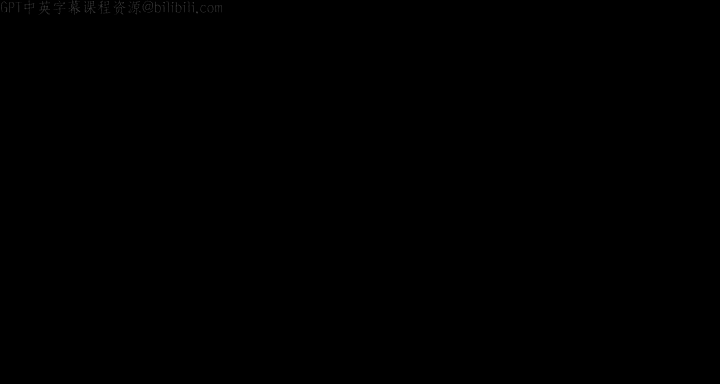

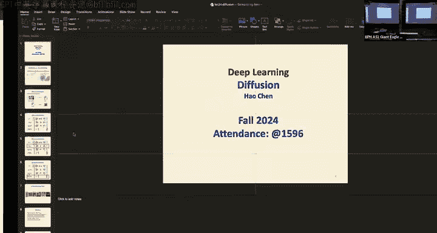

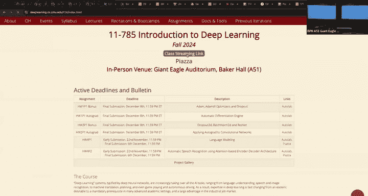

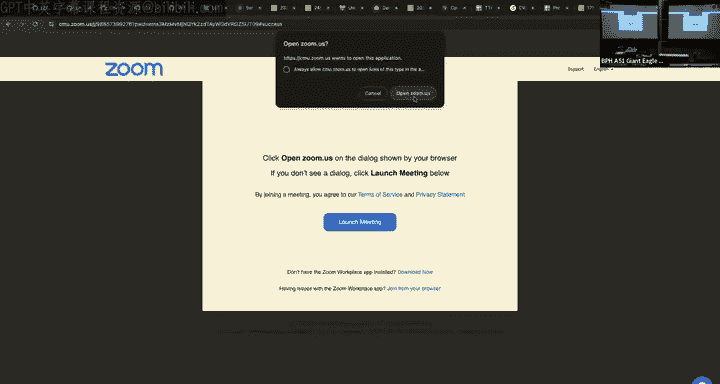

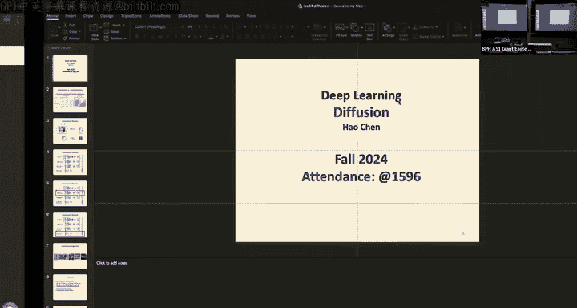

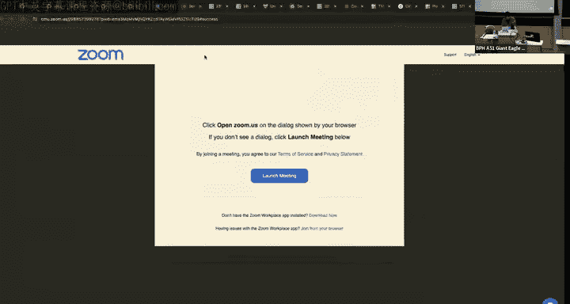

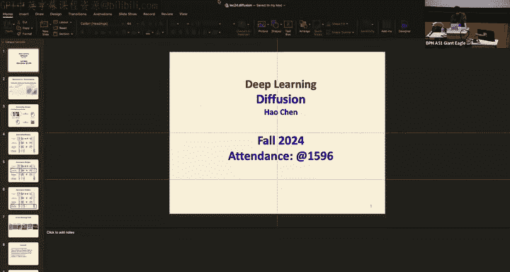

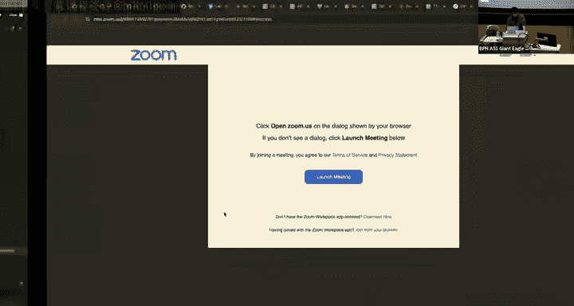

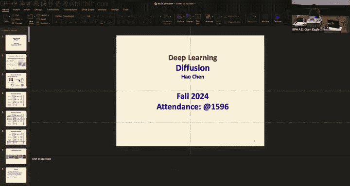

在本节课中，我们将要学习生成式模型的一个重要分支——扩散模型。我们将从变分自编码器的基础出发，理解扩散模型如何通过堆叠多个VAE来构建，并深入探讨其前向与反向过程、训练与采样的原理。课程还将从随机微分方程和分数匹配的视角解读扩散模型，并介绍加速采样技术DDIM以及条件扩散模型。最后，我们会概览扩散模型的一些重要应用。

---

## 概述：生成式模型 vs. 判别式模型

上一节我们回顾了机器学习中的基本概念，本节中我们来看看生成式模型与判别式模型的区别。

在判别式模型中，我们学习的是条件分布 **P(Y|X)**。这反映在数据分布上，是在不同数据簇之间学习一个决策边界。

在生成式模型中，我们学习的是后验分布 **P(X|Y)**。通过学习数据的概率分布（而不仅仅是决策边界），我们可以利用贝叶斯规则得到条件概率。生成式模型的核心是学习数据分布本身，而不仅仅是在数据之上进行分类。

生成式模型的一个显著优势是，在训练完成后，我们可以从学习到的数据分布中直接采样，生成新的数据样本（如图像、音频等）。

以下是几种常见的生成式模型：
*   **生成对抗网络**：包含一个生成器和一个判别器，二者在训练中相互对抗以隐式地学习数据分布。
*   **变分自编码器**：包含一个编码器和一个解码器。编码器负责将原始数据压缩为隐变量，解码器负责从隐变量生成新数据。
*   **扩散模型**：本讲的重点。我们将看到，扩散模型本质上是VAE的堆叠，并且与基于流的生成模型有联系。

生成式模型是一个快速发展的领域。从2013-2014年GAN和VAE刚出现时只能生成模糊图像，到2024年已经能用扩散模型生成高分辨率的长视频序列。

---

## 扩散模型基础：堆叠的VAE 🧱

上一节我们介绍了生成式模型的概览，本节中我们来看看扩散模型的核心思想——它本质上是堆叠的变分自编码器。

### 变分自编码器的回顾与局限

变分自编码器是**基于似然的生成模型**，它直接估计数据的似然函数来优化模型。VAE包含一个编码器（推断模型，近似后验分布）和一个解码器（生成模型，从隐变量生成数据）。它们通过最大化证据下界来联合训练，该目标包含重构损失和编码器后验与先验分布之间的KL散度。

然而，朴素VAE生成的图像通常比较模糊。一个主要原因是：解码器必须**一步之内**将一个标准高斯分布转换成一个非常复杂的目标分布（通常是多模态的）。这个巨大的转换差距导致模型倾向于捕捉数据的“平均模式”，从而产生模糊结果。

### 解决方案：分层VAE（堆叠VAE）

解决上述问题的一个直接思路是：将困难的一步转换分解为多个简单的步骤。这就是**分层VAE**或**堆叠VAE**的思想。

我们引入多个中间隐变量 **z₁, z₂, ..., z_T**。解码过程从最深的隐变量 **z_T**（一个简单的高斯噪声）开始，通过一系列解码器逐步将其转换为 **z_{T-1}**, **z_{T-2}**, ...，最终得到原始数据 **x**。每个解码器只负责移除一部分噪声，为下一步提供一个更好的起点。从分布角度看，这是一个从单峰高斯分布逐步向复杂多模态目标分布转变的过程。

### 连接扩散模型

这个过程已经非常类似于扩散模型中的**反向去噪过程**。事实上，扩散模型正是堆叠VAE的一个特例。

在扩散模型中：
*   **反向去噪过程**：对应堆叠VAE中的**解码器链**。每个步骤学习一个解码器，用于预测并移除当前步骤中添加的高斯噪声的均值（和方差）。
*   **前向扩散过程**：对应堆叠VAE中的**编码器链**。但为了避免VAE中可能出现的“后验坍塌”问题（即当解码器足够强时，编码器学不到有用信息），扩散模型使用了一个**固定的推理编码器**——一个固定的马尔可夫链，其高斯转移参数是预先设定的。

因此，扩散模型可以看作是一个具有固定编码器链和可训练解码器链的分层VAE。

---

## 去噪扩散概率模型详解 🔄

上一节我们建立了扩散模型与VAE的联系，本节中我们来详细看看其前向和反向过程的具体数学形式。

### 前向扩散过程

前向过程是一个固定的过程，逐步向数据 **x₀** 添加高斯噪声。这是一个马尔可夫链，每一步的转移由噪声调度表 **β_t** 控制：
**q(x_t | x_{t-1}) = N(x_t; √(1-β_t) x_{t-1}, β_t I)**

由于每一步都是高斯分布，我们可以直接计算在给定 **x₀** 时，任意时刻 **t** 的 **x_t** 的分布：
**q(x_t | x_0) = N(x_t; √(ᾱ_t) x_0, (1-ᾱ_t) I)**
其中 **α_t = 1 - β_t**, **ᾱ_t = Π_{s=1}^{t} α_s**。

这意味着我们可以直接从 **x₀** 采样得到 **x_t**：
**x_t = √(ᾱ_t) x_0 + √(1-ᾱ_t) ε**, 其中 **ε ~ N(0, I)**

### 反向去噪过程

反向过程的目标是从高斯噪声 **x_T ~ N(0, I)** 开始，逐步去噪以生成数据。我们需要学习反向转移分布 **p_θ(x_{t-1} | x_t)**。

当 **β_t** 足够小时，这个反向转移也可以用一个高斯分布来近似。因此，我们用一个可训练的网络（如U-Net）来预测该高斯分布的参数：
**p_θ(x_{t-1} | x_t) = N(x_{t-1}; μ_θ(x_t, t), Σ_θ(x_t, t))**

### 训练目标

训练扩散模型类似于优化VAE的证据下界。经过推导，核心的优化项是每一步反向预测分布与真实后验分布之间的KL散度。真实后验 **q(x_{t-1} | x_t, x_0)** 可以根据前向过程公式计算出来。

最终，训练目标可以简化为一个非常直观的形式：最小化实际添加到数据中的噪声 **ε** 与神经网络预测的噪声 **ε_θ** 之间的均方误差。
**L_simple = E_{t, x_0, ε} [ || ε - ε_θ(√(ᾱ_t) x_0 + √(1-ᾱ_t) ε, t) ||^2 ]**

### 训练与采样流程总结

**训练**：
1.  从数据集中采样干净数据 **x₀**。
2.  随机采样时间步 **t ~ Uniform({1, ..., T})**。
3.  采样噪声 **ε ~ N(0, I)**。
4.  计算带噪数据 **x_t = √(ᾱ_t) x_0 + √(1-ᾱ_t) ε**。
5.  将 **x_t** 和 **t** 输入去噪网络，预测噪声 **ε_θ**。
6.  计算预测噪声与真实噪声 **ε** 的均方误差并反向传播。

**采样（生成）**：
1.  从标准高斯分布采样 **x_T**。
2.  对于 **t = T, T-1, ..., 1**：
    *   用网络预测 **x_t** 对应的噪声 **ε_θ**。
    *   根据公式计算 **x_{t-1} = (1/√(α_t)) (x_t - (β_t/√(1-ᾱ_t)) ε_θ) + σ_t z**，其中 **z ~ N(0, I)**。
3.  最终得到生成的干净数据 **x₀**。

---

## 随机微分方程与分数匹配视角 📈

上一节我们从VAE和ELBO的角度理解了扩散模型，本节中我们从连续时间的视角，通过随机微分方程来统一地看待它。

### 随机微分方程简介

*   **常微分方程**：描述状态 **x** 随时间 **t** 的确定性变化，**dx/dt = f(x, t)**。
*   **随机微分方程**：在ODE基础上加入一个随机噪声项，**dx = f(x, t)dt + g(x, t)dw**。其中 **f(x, t)** 称为漂移系数，**g(x, t)** 称为扩散系数，**dw** 是维纳过程（布朗运动）。SDE描述的是状态 **x** 随时间演变的概率分布。

### 分数匹配

对于任何概率密度函数 **p_θ(x)**，其对数梯度 **∇_x log p_θ(x)** 称为**分数函数**。直接建模似然函数需要处理难以计算的归一化常数，而分数匹配则通过匹配数据分布的分数函数来避免这个问题。

### 前向过程即SDE

扩散模型的前向过程可以看作是一个SDE：
**dx = - (β(t)/2) x dt + √(β(t)) dw**
*   **漂移项** **- (β(t)/2) x dt**：将数据拉向原点（0均值），相当于将多模态分布拉向单峰高斯。
*   **扩散项** **√(β(t)) dw**：注入随机高斯噪声，使路径变得随机。

### 反向过程即逆向SDE

每个前向SDE都有一个对应的逆向SDE，其形式为：
**dx = [- (β(t)/2) x - β(t) ∇_{x_t} log q(x_t)] dt + √(β(t)) dŵ**
其中多出了一项 **β(t) ∇_{x_t} log q(x_t)**，即分数函数。逆向SDE描述的是从噪声分布向数据分布演化的过程。

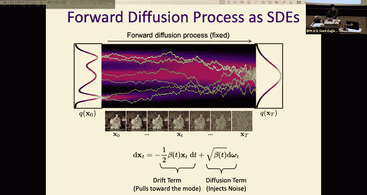

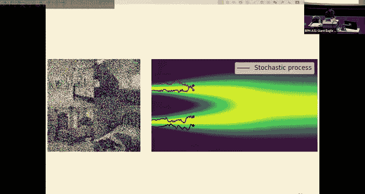

### 训练即分数匹配

我们的去噪网络 **ε_θ(x_t, t)** 实际上是在估计分数函数：
**∇_{x_t} log q(x_t) ≈ - ε_θ(x_t, t) / √(1-ᾱ_t)**
因此，之前简化的训练目标 **||ε - ε_θ||^2**，本质上是在进行（加权的）分数匹配。不同的加权方式对应了文献中扩散模型的不同变体，在生成样本的感知质量和最大似然之间进行权衡。

---

## 加速采样：去噪扩散隐式模型 ⚡

上一节我们介绍了扩散模型的基本采样流程，本节中我们来看看如何加速这个通常需要上千步的缓慢过程。

### 动机

标准扩散模型（DDPM）采样需要从 **T** 到 **1** 逐步迭代，当 **T=1000** 时非常缓慢。我们能否用更少的步数进行生成？

### DDIM：非马尔可夫前向过程

DDIM的核心思想是重新定义前向过程，使其成为一个**非马尔可夫**过程。即 **x_t** 不仅依赖于 **x_{t-1}**，还依赖于 **x_0**。这允许我们推导出一个确定性的反向过程。

在DDIM中，反向采样步骤为：
1.  用网络根据当前 **x_t** 预测噪声，并估计出 **x_0**。
2.  根据估计的 **x_0** 和当前 **x_t**，直接计算 **x_{t-1}**。

### 优势：子序列采样

由于DDIM的反向过程不依赖于严格的马尔可夫链，我们可以对时间步进行**子序列采样**。例如，我们可以只用 [T, T-s, T-2s, ..., 1] 这些时间步来进行生成，从而大幅减少采样步数（例如从1000步减少到50步或更少），同时生成质量下降不多。

DDIM开启了扩散模型加速采样研究的大门，目前已有许多技术可以实现用极少的步数（如10步）获得高质量的生成结果。

---

## 条件扩散模型 🎯

上一节我们学习了生成无条件样本的模型，本节中我们来看看如何控制生成过程，使其符合我们的预期。

### 为何需要条件生成？

无条件扩散模型学习的是 **p(x)**。条件扩散模型则学习 **p(x|y)**，其中 **y** 可以是类别标签、文本描述、语义掩码、边界框等任何条件信息。这使得生成过程变得可控。

### 基于分类器的引导

一种早期方法是在扩散过程中加入一个额外的分类器 **p(y|x_t)** 的梯度来引导生成。这需要预先训练一个分类器，其性能会限制条件生成的质量，并且增加了训练负担。

### 无分类器引导

目前最流行的方法是**无分类器引导**。其核心思想是在训练时，以一定概率 **p** 随机将条件 **y** 替换为一个空条件（如空字符串）。这样，同一个网络同时学会了条件生成和无条件生成。

在采样时，引导后的分数函数为：
**∇ log p(x|y) ≈ ∇ log p(x) + γ * (∇ log p(x|y) - ∇ log p(x))**
其中 **γ** 是引导尺度。当 **γ=0** 时为无条件生成，**γ>1** 时会增强条件的影响，通常能生成更符合条件且质量更高的样本，但多样性可能降低。这种方法无需额外分类器，简单有效。

---

## 扩散模型的应用实例 🚀

上一节我们学习了条件生成技术，本节中我们快速浏览一下扩散模型发展历程中的一些关键应用。

*   **DDPM**：扩散模型的开山之作之一，使用简单的U-Net结构和 `||ε - ε_θ||^2` 损失，在图像生成上取得了显著效果，证明了扩散模型的潜力。
*   **Latent Diffusion Models**：在预训练好的VAE的隐空间中进行扩散，而非原始高维像素空间。这大大降低了计算成本，是**Stable Diffusion**等成功模型的基础。它们通常结合强大的文本编码器（如CLIP、T5）来实现高质量的文生图。
*   **DiT**：用Transformer架构取代了传统的U-Net卷积架构，展示了扩散模型主干网络的另一种可能性。
*   **AR + Diffusion**：将自回归模型与扩散损失结合。例如，在图像生成中，不是按顺序预测离散token，而是以随机顺序预测token集合，并用扩散损失进行优化，取得了当前最好的生成效果之一。

---

## 总结 📚

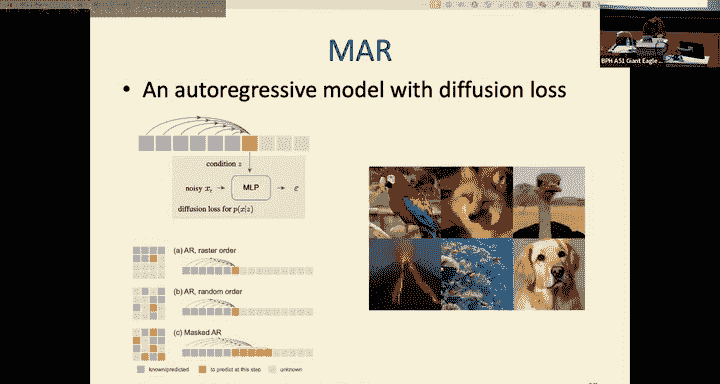

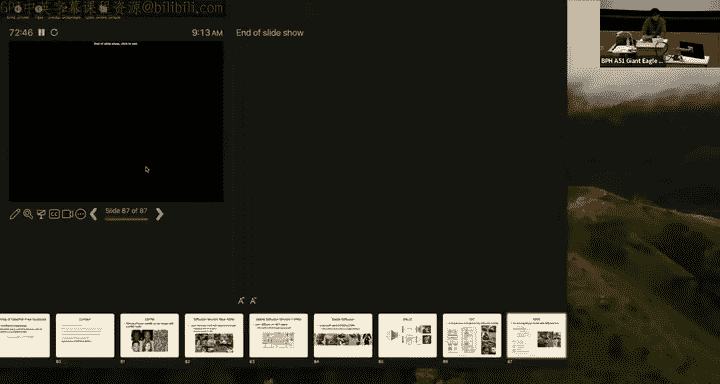

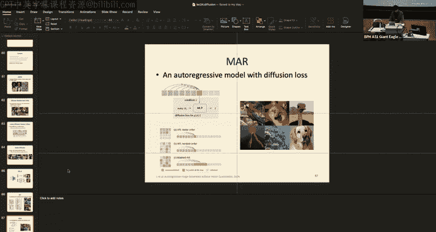

本节课中我们一起学习了扩散模型。我们从变分自编码器出发，理解了扩散模型作为堆叠VAE的本质。我们详细推导了其前向扩散和反向去噪过程，以及简化的训练目标。接着，我们从随机微分方程和分数匹配的视角，获得了对扩散模型更统一的理解。为了克服采样速度慢的缺点，我们介绍了加速技术DDIM。为了实现可控生成，我们探讨了条件扩散模型，特别是无分类器引导这一重要技术。最后，我们回顾了扩散模型从DDPM到Stable Diffusion等重要应用的发展脉络。扩散模型是当前生成式AI领域的核心支柱之一，理解其原理对于深入该领域至关重要。