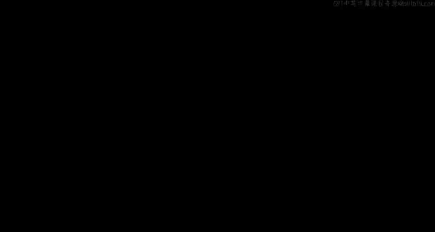
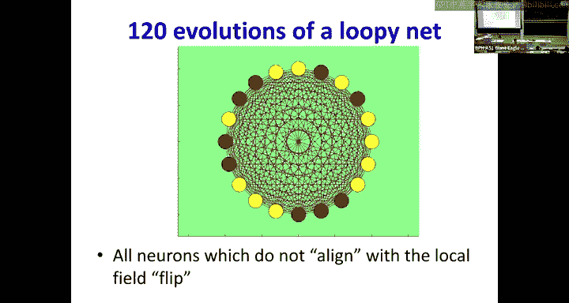
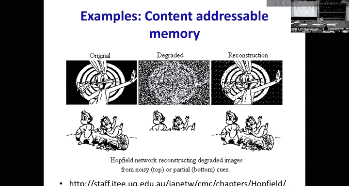
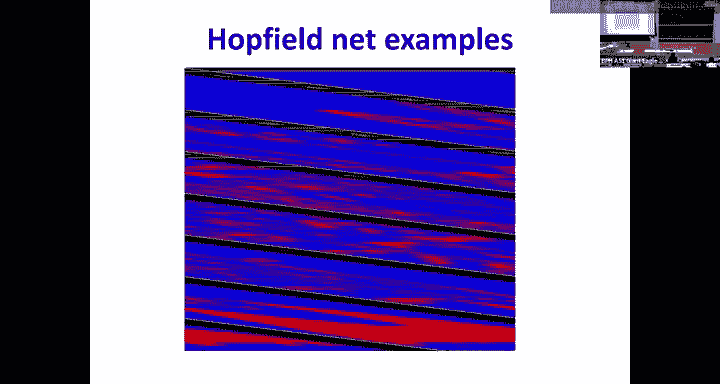
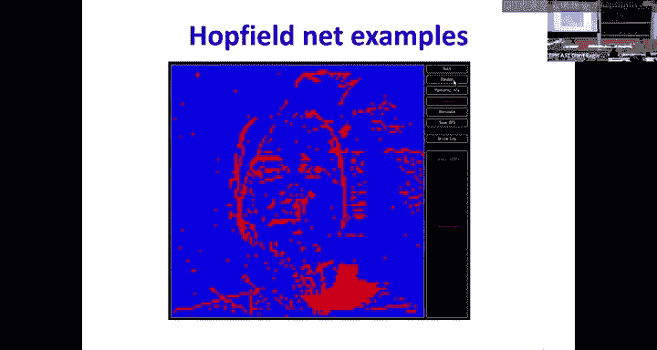
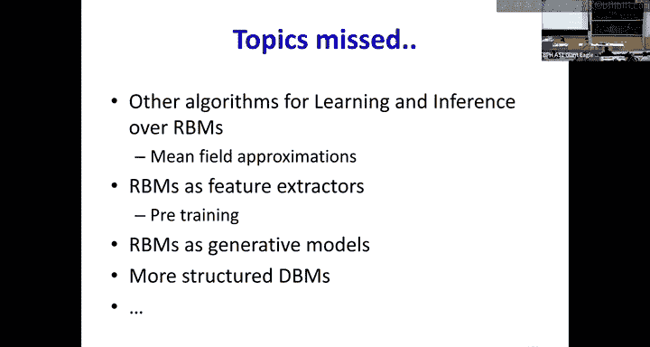

# 25：霍普菲尔德网络、自联想器与玻尔兹曼机 🧠

在本节课中，我们将学习一种特殊的神经网络结构——循环网络，特别是霍普菲尔德网络和玻尔兹曼机。这些模型是今年诺贝尔物理学奖获奖工作的基础，它们将物理学中的概念（如自旋玻璃和能量）引入机器学习，实现了内容寻址记忆和概率建模。

---

## 从循环网络到霍普菲尔德网络

上一节我们介绍了前馈网络，数据从一端流入，经过处理从另一端流出。本节中我们来看看如果我们将神经元的输出反馈给自身或前一层，会发生什么。

考虑一个简单的循环网络，其中每个神经元的输出都连接到所有其他神经元（包括自身）。这种结构可以展开成一个无限深的网络，其权重在每一层重复。网络的处理过程会持续进行，直到状态不再变化，即达到收敛。

以下是这种网络的一个关键特性分析：
*   每个神经元接收来自所有其他神经元输出的加权和，加上一个偏置项，我们称之为该神经元的“场”。
*   神经元通过一个阈值激活函数（输出+1或-1）来响应这个场。
*   神经元是否翻转（改变输出）取决于其当前输出与场的符号是否对齐。

具体规则如下：
*   如果神经元当前输出为 `y`，其场为 `F`。
*   当 `y * F < 0` 时，神经元翻转，输出变为 `-y`。
*   当 `y * F >= 0` 时，神经元保持当前状态。

当一个神经元翻转时，它会改变其他神经元的场，可能引发连锁反应。这引出了一个问题：这个过程会永远持续下去吗？

---

## 能量函数与收敛性

为了分析网络的动态，我们引入一个称为“能量”的量 `E`。对于具有对称连接权重（即 `W_ij = W_ji`）且无自连接（`W_ii = 0`）的网络，能量定义为：

`E = -1/2 * ∑_i ∑_j W_ij * y_i * y_j - ∑_i b_i * y_i`

其中 `y_i` 是神经元 `i` 的状态（+1或-1），`b_i` 是偏置。

关键结论是：**网络的每一次状态演化（神经元翻转）都会保证能量 `E` 降低或保持不变**。由于能量存在下界（权值和偏置是有限的），因此任何演化序列都必须在有限步内收敛到一个局部能量极小点。

这使得网络的行为类似于物理中的自旋玻璃系统，其“势能”会不断降低直至稳定。

---

## 霍普菲尔德网络作为内容寻址记忆

霍普菲尔德网络是一个具有对称连接的循环二值网络。其核心特性使其成为优秀的内容寻址记忆（或联想记忆）。

*   **内容寻址**：与传统计算机通过地址检索内存不同，内容寻址记忆通过提供部分或含噪声的内容来触发并恢复完整模式。
*   **模式恢复**：网络可以从一个受损、不完整或嘈杂的初始状态开始演化，最终稳定在之前存储的某个完整模式上。
*   **功能**：这实现了**去噪**和**模式补全**。

例如，存储了“米老鼠”和“兔八哥”图像的网络，即使输入是带噪声的或下半部分被擦除的图像，也能演化恢复出清晰的原始图像。

---

## 网络的训练与记忆容量

如何让网络记住我们想要的特定模式呢？

我们希望网络的能量在目标模式处较低，而在其他模式处较高。这可以通过修改权重 `W` 来实现。一种简单的赫布学习规则是，对于每个要存储的模式向量 `y`，按如下方式更新权重：

`W := W + η * (y * y^T)`

这里 `η` 是学习率，`y * y^T` 是模式向量的外积。这实质上是将目标模式“雕刻”为能量景观中的低谷。

然而，一个拥有 `N` 个神经元的经典霍普菲尔德网络，可靠存储的随机模式数量上限约为 `0.14N`。超过这个限度，会出现伪吸引子，导致记忆混淆。

---

## 玻尔兹曼机：概率化扩展

为了突破容量限制并引入概率解释，我们将霍普菲尔德网络扩展为玻尔兹曼机。

*   **概率化状态**：神经元的状态翻转不再是确定性的，而是概率性的。神经元 `i` 取值为+1的概率由Sigmoid函数给出：
    `P(y_i = +1) = σ(∑_j W_ij * y_j + b_i) = 1 / (1 + exp(- (∑_j W_ij * y_j + b_i)))`
*   **玻尔兹曼分布**：整个网络状态 `y` 的概率服从玻尔兹曼分布：
    `P(y) ∝ exp(-E(y))`
    其中 `E(y)` 就是之前定义的能量函数。低能量状态出现概率更高。
*   **隐神经元**：引入额外的“隐”神经元。它们不与外部直接相连，但可以大幅增加网络的表示能力和记忆容量。我们只关心“显”神经元的输出。

---

## 玻尔兹曼机的训练：对比散度

训练玻尔兹曼机的目标是最大化训练数据（显神经元状态）的似然概率。由于涉及难以计算的正则化项（所有可能状态的求和），直接计算梯度很困难。

对比散度是一种有效的近似训练算法，其核心步骤如下：
1.  **正相**：将训练数据的显神经元状态“钳制”住，让隐神经元根据概率规则自由演化若干步，采样得到一个“重建”的完整状态（包含显和隐神经元）。
2.  **负相**：释放所有钳制，让整个网络（显和隐神经元）自由演化若干步，采样得到一个“自由运行”状态。
3.  **权重更新**：根据正相和负相采样结果的外积差来更新权重。
    `ΔW_ij ∝ <y_i * y_j>_data - <y_i * y_j>_model`
    这相当于降低数据状态的能量，同时提高模型自由运行状态的能量。

---

## 应用与变体

玻尔兹曼机及其变体有广泛的应用：
*   **模式补全与去噪**：与霍普菲尔德网络类似。
*   **分类**：将类别标签也作为显神经元的一部分。训练时，输入特征和标签都被钳制。预测时，只钳制输入特征，让标签神经元自由演化，其稳定状态即为预测结果。
*   **受限玻尔兹曼机**：这是一种简化结构，显神经元与隐神经元之间有连接，但显神经元内部和隐神经元内部没有连接。这大大简化了训练，是构建深度信念网络的基础模块。
*   **深度玻尔兹曼机**：由多层受限玻尔兹曼机堆叠而成，具有更强的特征学习能力。

---

## 总结

本节课我们一起学习了霍普菲尔德网络和玻尔兹曼机。
*   我们从循环网络的基本概念出发，引入了能量函数来分析其动态收敛性。
*   霍普菲尔德网络利用能量最小化原理，实现了强大的内容寻址记忆功能。
*   玻尔兹曼机通过引入概率翻转和隐神经元，将确定性模型扩展为概率生成模型，极大地提高了容量和灵活性。
*   这些模型深刻地连接了物理学（统计力学）和机器学习，其思想至今仍在深度学习领域产生回响。

这些工作因其基础性贡献获得了诺贝尔物理学奖的认可，展示了跨学科研究的巨大威力。