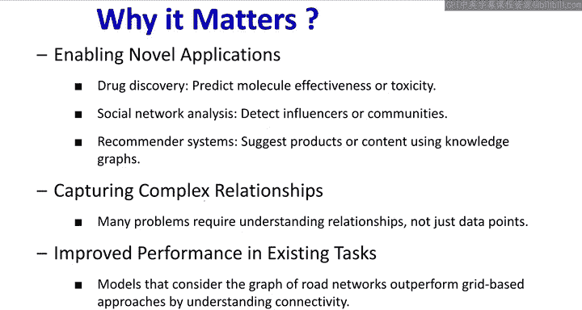
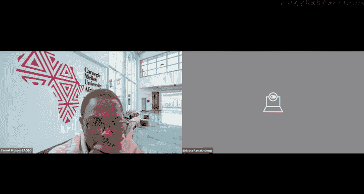
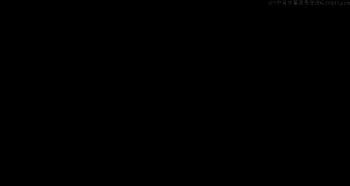
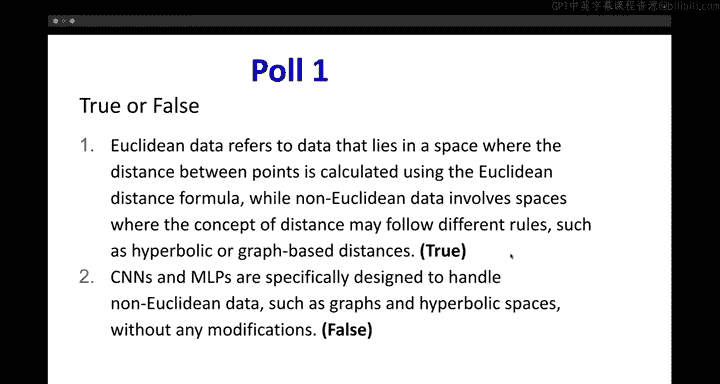
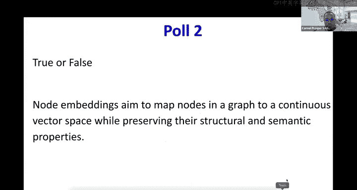
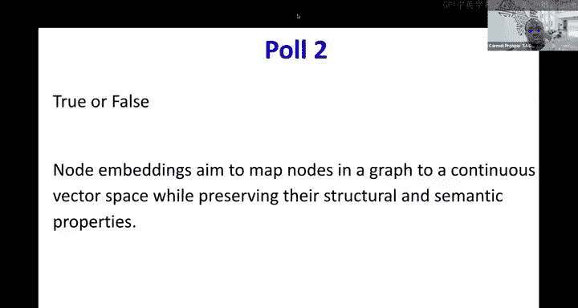
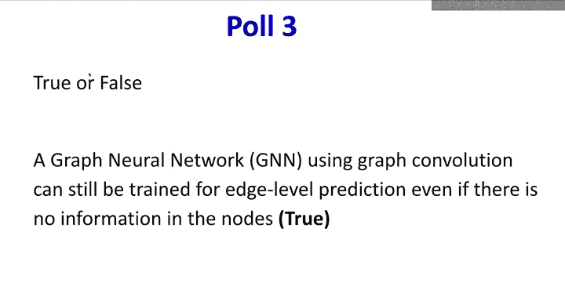
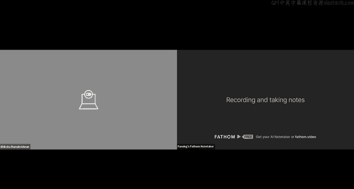
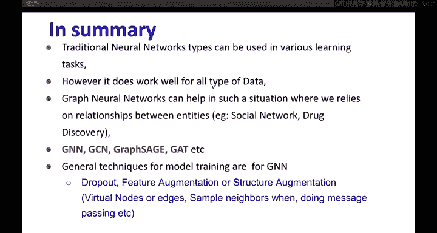
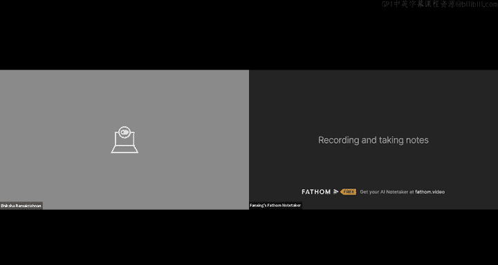

# 26：图神经网络 🕸️

在本节课中，我们将要学习图神经网络。图神经网络是一种专门用于处理非欧几里得数据（如图结构数据）的深度学习模型。我们将从图的基本概念开始，逐步深入到图卷积网络和图注意力网络的核心原理。

---

## 概述

到目前为止，我们学习了多种深度学习模型。多层感知机作为通用函数逼近器，可以通过反向传播和梯度下降的变体进行训练。卷积神经网络则专门处理图像和空间数据，利用卷积层捕捉空间模式并通过池化降低维度。序列到序列模型（如RNN、LSTM和Transformer）则擅长处理文本或时间序列等有序数据。

然而，现实世界中还存在大量非欧几里得数据，例如社交网络、分子结构、知识图谱、3D网格或点云。这些数据的特点是节点间的“距离”概念不直接，邻域结构不规则且节点连接数可变。传统的CNN和MLP模型难以直接处理这类数据，因此我们需要图神经网络。

---

## 什么是图？

图由两个基本元素组成：顶点（或节点）的集合 **V** 和边（或连接）的集合 **E**。图可以表示为 **G = (V, E)**。

以下是图的主要类型：
*   **无向图**：边没有方向，表示双向关系。
*   **有向图**：边有方向，表示单向关系。

为了进行计算，我们通常使用矩阵来表示图。最常用的是邻接矩阵 **A**，它是一个 **n x n** 的矩阵（n为节点数）。矩阵中的元素 **A_ij** 表示从节点 i 到节点 j 是否存在边（通常1表示存在，0表示不存在）。在使用前，需要明确约定矩阵的读取方式（例如，行代表源节点，列代表目标节点）。

---

## 图上的学习任务

在图数据上，我们可以执行三种主要类型的任务：

*   **节点级任务**：例如节点分类或回归。给定一个节点及其与其他节点的关系，预测该节点的属性（例如，在社交网络中预测用户是否吸烟）。
*   **边级任务**：例如链接预测。预测两个节点之间是否存在边，这在推荐系统中非常有用。
*   **图级任务**：例如图分类或图匹配。对整个图的属性进行预测（例如，判断一个分子图是否具有某种毒性）。

本节课我们将重点讨论节点级分类任务。

---

## 从多层感知机到图卷积

上一节我们介绍了图的基本概念和学习任务，本节中我们来看看如何将熟悉的模型应用于图数据。

最直接的想法是使用多层感知机。如果我们已经有了节点的特征向量，可以直接将其输入MLP进行分类。然而，这种方法完全忽略了节点之间的连接关系。

如果信息存储在边上，而非节点上呢？我们可以从目标节点的所有邻边中聚合信息（例如求和或取平均），将聚合后的边信息转化为一个新的“节点特征”，再输入MLP。

上述方法的核心思想是：**为了更新一个节点的信息，我们需要聚合其邻居的信息**。这引出了图卷积的概念。

在CNN中，卷积核在规则的网格上滑动，聚合局部像素信息。在图卷积中，我们进行一个类似但更通用的三阶段过程：
1.  **消息传递**：每个节点将其特征信息发送给它的邻居节点。
2.  **消息聚合**：目标节点收集来自所有邻居的消息。
3.  **节点更新**：目标节点结合自身上一轮的特征和聚合的邻居信息，更新自己的特征。

更形式化地，对于节点 **v** 在第 **k+1** 层的嵌入 **h_v^(k+1)**，我们可以用以下公式描述均值聚合策略：
`h_v^(k+1) = σ( W_k * CONCAT( h_v^(k), MEAN( {h_u^(k) for u in N(v)} ) ) )`
其中，**N(v)** 是节点 **v** 的邻居集合，**W_k** 是可训练权重矩阵，**σ** 是非线性激活函数。

通过堆叠多个这样的层，我们可以构建一个深度图卷积网络，最终得到可用于分类等任务的节点嵌入 **z_v**。

---

## 训练图神经网络

训练图神经网络与训练其他神经网络类似。我们定义一个损失函数，例如用于节点分类的交叉熵损失：
`L = - Σ [ y_v * log(ŷ_v) ]`
其中 **y_v** 是节点 **v** 的真实标签，**ŷ_v** 是将最终节点嵌入 **z_v** 通过一个分类器（如MLP）后得到的预测概率。

模型中的可训练参数（如图卷积层中的权重 **W_k** 和分类器权重）通过反向传播计算梯度，并使用随机梯度下降或其变体进行优化。

---

## 图注意力网络

上一节我们介绍了基础的图卷积网络，它平等地对待所有邻居。本节中我们来看看如何让模型学习邻居的重要性差异，即图注意力网络。

在基础的GCN或GraphSAGE中，聚合时对每个邻居赋予相同的权重（如1/|N(v)|）。但在现实中，不同邻居对目标节点的重要性可能不同。图注意力网络引入了注意力机制，为每个邻居分配一个可学习的权重 **α_vu**。

计算注意力权重的过程如下：
1.  计算节点对 **(v, u)** 的注意力系数 **e_vu**：`e_vu = a( W * h_v, W * h_u )`，其中 **a** 是一个可学习的函数（如一个单层神经网络），**W** 是共享的权重矩阵。
2.  使用softmax函数对节点 **v** 的所有邻居的注意力系数进行归一化，得到最终的注意力权重：`α_vu = softmax_u(e_vu) = exp(e_vu) / Σ_{k∈N(v)} exp(e_vk)`。
3.  使用加权和聚合邻居信息：`h_v‘ = σ( Σ_{u∈N(v)} α_vu * W * h_u )`。

为了稳定学习过程并捕捉不同类型的邻居重要性，我们可以使用多头注意力。即使用多个独立的注意力函数（“头”）并行计算，然后将它们的输出连接或求平均：
`h_v‘ = CONCAT( head_1, head_2, ..., head_h )` 或 `h_v‘ = MEAN( head_1, head_2, ..., head_h )`

注意力权重 **α_vu** 不是额外的独立参数，而是通过可学习的函数 **a** 和共享权重 **W** 从节点特征中计算得出的，因此可以在端到端的训练过程中与网络其他部分一同优化。

---

## 总结与展望

本节课中我们一起学习了图神经网络的基础知识。我们首先了解了为什么需要GNN来处理非欧几里得数据。然后，我们学习了图的基本表示和任务类型。接着，我们从MLP出发，逐步推导出图卷积网络的核心思想——通过聚合邻居信息来更新节点表示。我们还探讨了如何训练GNN。最后，我们介绍了更先进的图注意力网络，它通过可学习的注意力机制区分邻居的重要性。

图神经网络是处理社交网络、推荐系统、药物发现、知识图谱等复杂关系数据的强大工具。通过消息传递、聚合和更新的框架，GNN能够有效地利用图的结构信息。像Dropout、特征增强等标准深度学习技巧也可以应用于GNN的训练。此外，图数据本身也可以通过添加虚拟节点/边或子图采样等方式进行增强，以提升模型性能。

---

*本教程内容主要基于斯坦福大学、密歇根大学及卡内基梅隆大学的相关课程讲义，以及原始研究论文（如Graph Convolutional Networks, GraphSAGE, Graph Attention Networks）。*