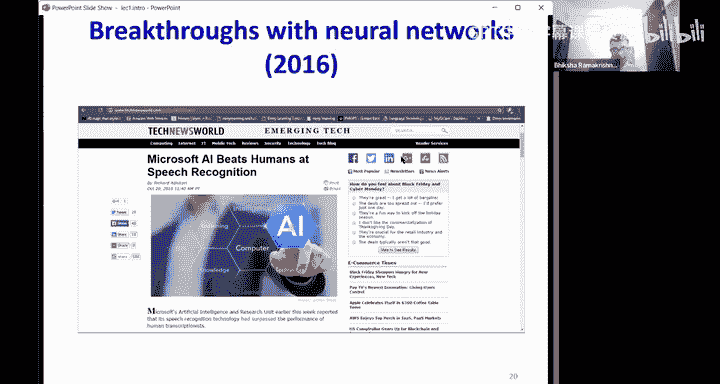
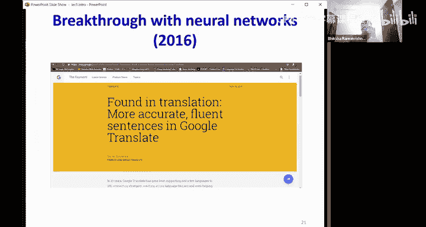
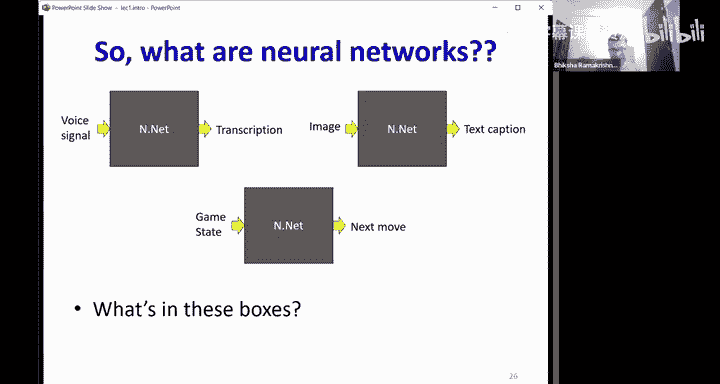
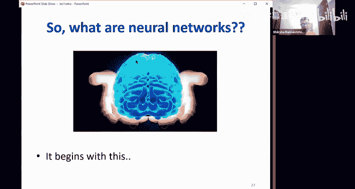
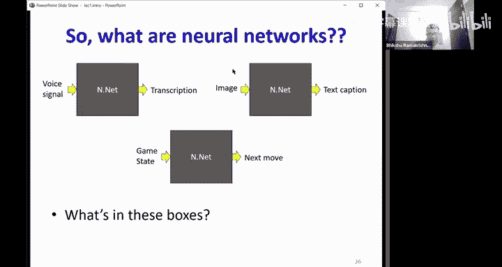
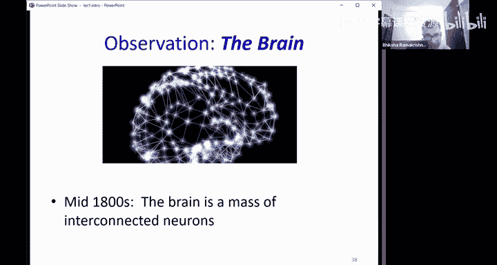
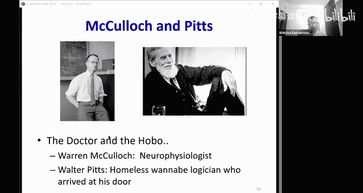
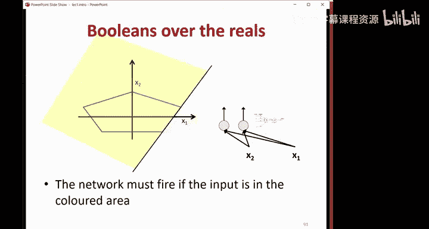

# 1：神经网络导论 🧠

在本节课中，我们将学习神经网络的基本概念、其历史渊源以及它们为何能成为现代人工智能的核心。我们将从认知科学和大脑模型出发，逐步理解人工神经网络的工作原理和强大能力。

## 概述：从大脑到机器

神经网络如今已主导了人工智能领域，成功应用于各种模式识别、预测和分析问题。它们最初是作为大脑或更广义的认知的计算模型而诞生的。最早的认知模型是联想主义，而更近期的模型则是连接主义，即神经元通过连接构成网络，大脑的工作机制就编码在这些连接之中。当前的神经网络模型正是连接主义机器。

## 1. 历史背景：连接主义与早期模型

上一节我们提到了神经网络的思想根源。本节中，我们来看看其具体的历史发展脉络。

### 1.1 联想主义与连接主义

人类大脑的运作机制一直是科学探索的焦点。柏拉图最早提出了“联想主义”模型，认为大脑通过形成关联来运作，就像巴甫洛夫的狗将铃声与食物关联起来一样。然而，联想主义并未解释这些关联存储于何处以及如何存储。

随着显微镜的发展，科学家发现大脑由大量相互连接的细胞（神经元）构成。哲学家亚历山大·贝恩在1873年首次提出，信息存储在大脑的连接之中，这标志着“连接主义”思想的诞生。他假设大脑是一个由简单处理单元（神经元）组成的网络，所有知识都存储在这些单元之间的连接里。

这与现代计算机的冯·诺依曼架构（处理器与内存分离）有根本区别。在连接主义机器中，程序就存在于连接之中，计算机本身就是程序。

### 1.2 第一个神经元数学模型

为了用数学描述大脑单元，神经生理学家沃伦·麦卡洛克和逻辑学家沃尔特·皮茨在1943年提出了第一个神经元数学模型。该模型将神经元视为一个布尔阈值单元：
- 神经元通过**兴奋性突触**和**抑制性突触**接收来自其他神经元的信号。
- 如果总的兴奋性信号超过某个阈值，且没有抑制性信号，则神经元“放电”（输出1），否则不放电（输出0）。

这个简单的模型可以组合实现基本的逻辑门（如AND、OR），从而执行命题逻辑，为将大脑视为计算设备提供了理论基础。

### 1.3 学习规则的出现

模型需要学习机制。唐纳德·赫布在1949年提出了著名的赫布学习规则，其核心思想是“一起放电的神经元会连接在一起”。用数学公式表示为：
`Δw = x * y`
其中，`x`和`y`是相连神经元的激活值，`w`是它们之间的连接权重。当两个神经元同时激活时，它们之间的连接会增强。

然而，赫布规则存在一个根本问题：权重只会增加，永不减少，这会导致网络最终变得不稳定。

## 2. 感知机：第一个可学习的神经网络模型

上一节我们看到了神经元模型和学习规则的雏形。本节中我们来看看第一个具有实用学习算法的神经网络模型——感知机。

### 2.1 罗森布拉特感知机

弗兰克·罗森布拉特在1958年提出了感知机模型，它是对麦卡洛克-皮茨神经元的扩展，并引入了有监督学习规则。
- **模型**：一个感知机单元接收多个实值输入 `x1, x2, ..., xn`，每个输入对应一个权重 `w1, w2, ..., wn`。它计算加权和，并加上一个偏置 `b`，然后通过一个阈值激活函数（如阶跃函数）产生输出。
`输出 = 阶跃函数( Σ(wi * xi) + b )`
- **学习规则**：与赫布规则不同，感知机学习规则引入了目标值。权重根据输出误差和输入值进行更新：
`Δwi = 学习率 * (目标输出 - 实际输出) * xi`
这个规则被证明可以完美分类线性可分的数据。

### 2.2 单层感知机的局限性

尽管感知机很强大，但单个感知机（单层网络）的能力有限。最著名的例子是它无法表示“异或”（XOR）这样的布尔函数。这是因为单个感知机在输入空间中只能画出一条直线（或超平面）作为决策边界，而XOR问题需要两条线才能分开。

## 3. 多层感知机：走向通用性

单层感知机的局限性曾使神经网络研究陷入低谷。解决之道在于将多个感知机连接成网络。

### 3.1 网络化带来强大能力

通过将感知机排列成层（输入层、隐藏层、输出层），就构成了**多层感知机**。隐藏层的输出不作为最终输出，但其计算对最终结果至关重要。
- **计算任意布尔函数**：通过组合多个感知机，MLP可以表示任何布尔函数。例如，用三个感知机可以构建一个实现XOR功能的网络。
- **通用分类器**：对于实值输入，单个感知机的决策边界是一个超平面。通过组合多个超平面，MLP可以逼近任意复杂的决策边界，从而对任何形状的数据区域进行分类。这意味着MLP是**通用分类器**。

以下是构建一个能识别“五边形”内区域的MLP的步骤：
1.  用五个感知机分别定义五边形的五条边，每个感知机输出“1”表示点在边的某一侧。
2.  将这五个感知机的输出连接到一个最终的感知机（执行AND操作），仅当所有五个输入都为1（即点在五边形内）时，最终输出才为1。

### 3.2 通用函数逼近器

MLP的能力不仅限于分类。通过使用合适的激活函数（如Sigmoid、ReLU）替代简单的阶跃函数，MLP还可以逼近任何连续函数。
- **思路**：可以将复杂的连续函数看作由许多窄矩形拼接而成。每个矩形可以由一个小的子网络（如两个感知机）来生成，该子网络在特定输入区间内输出一个常数值。通过将许多这样的子网络按不同高度缩放并相加，就可以以任意精度逼近原函数。

因此，MLP也是**通用函数逼近器**。理论上，给定足够多的神经元和层，它可以表示任何从输入到输出的映射关系。

## 总结

本节课我们一起学习了神经网络的基础知识：
1.  **历史与理念**：神经网络源于对大脑（连接主义）和认知（联想主义）的建模尝试。
2.  **核心单元**：从麦卡洛克-皮茨神经元模型到罗森布拉特感知机，我们有了可计算、可学习的基元。
3.  **关键突破**：单层感知机能力有限，但通过堆叠成**多层感知机**，网络获得了强大的表达能力。
4.  **通用性**：MLP可以作为通用分类器逼近任何决策边界，也可以作为通用函数逼近器模拟任何连续函数。这解释了为什么神经网络能够成为解决众多AI任务的强大工具。

在下一节课中，我们将更深入地探讨MLP的架构，理解“深度”的含义，并研究其表示能力与网络深度、宽度的关系。