# 2：课程介绍 🧠

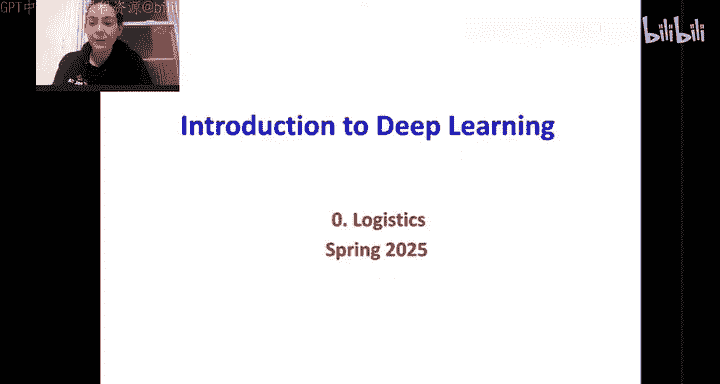

在本节课中，我们将对CMU 2025年春季的《深度学习导论》课程进行全面的介绍。我们将了解课程背景、教学团队、课程结构、评分方式以及学术诚信等重要信息。

---

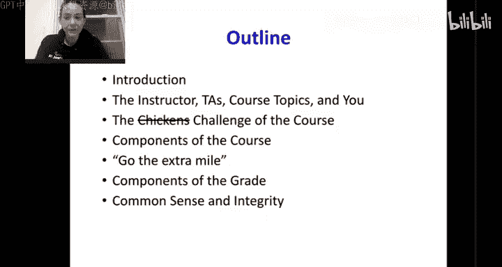

## 🌍 神经网络的崛起

神经网络已经从理论概念转变为实用工具，正在塑造我们生活和互动的众多领域。

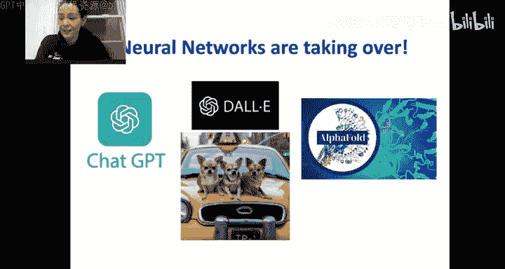

例如，像ChatGPT这样的模型正在为问题解决和上下文理解设定新的标准。

在视觉应用领域，DALL-E等模型正在突破机器生成照片级真实感或高度想象力视觉内容的边界。

科学领域也取得了突破，例如AlphaFold以前所未有的准确性预测蛋白质结构，对医学和生物化学等领域产生了积极影响。

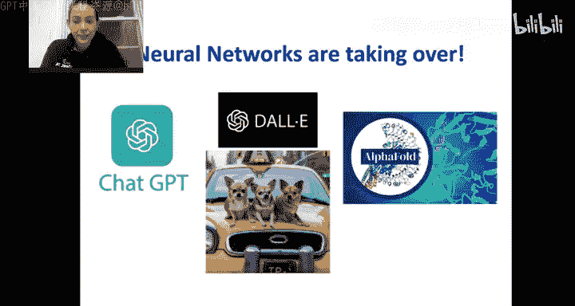

本课程将为你提供参与这些进步所需的技能和理解，无论是构建、应用还是批判性地分析它们。

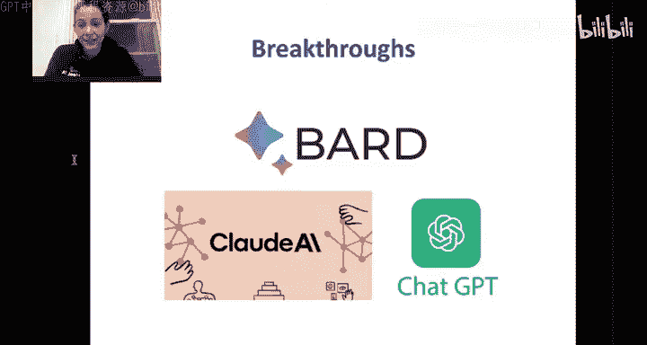

---

## 🗣️ 从语音助手到对话式AI

早期的系统如Siri和Alexa为道路铺平了基础，现在我们有了像ChatGPT-4、Bard和Claude AI这样的对话式AI。这些系统不仅仅是回应，它们正在与我们进行有意义、细致的互动，成为技术问题解决的合作者。

---

## 👁️ 计算机视觉的进步

在计算机视觉领域，我们现在有了Stable Diffusion，它使我们能够以几年前无法实现的方式创建和编辑图像。

我们还有NeRF（神经辐射场），它仅凭少量照片就能创建新的3D建模可能性，构建空间和物体。

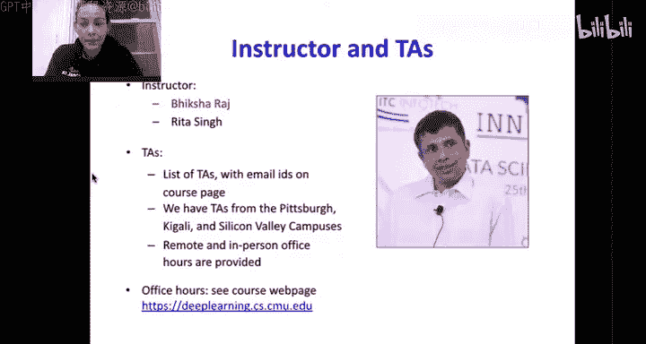

自动驾驶汽车也在持续展示神经网络的力量和局限性。Waymo在一些城市创建了自动驾驶出租车，而特斯拉的全自动驾驶汽车也代表了实现完全自主导航的潜力和持续挑战。

---

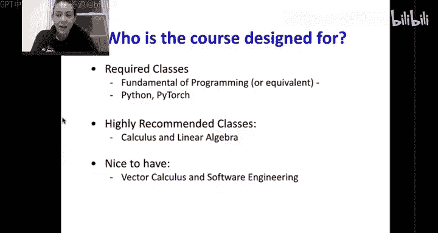

## 👨‍🏫 教学团队

本课程的主讲教师是Bhiksha Raj教授。教授设有开放的办公时间，欢迎你随时拜访。

本课程有大约20名助教。如果你想联系我们，我们的姓名和邮箱都列在课程网页上。助教来自匹兹堡、基加利和硅谷。我们提供远程和线下的办公时间，这些信息也都列在网页上。

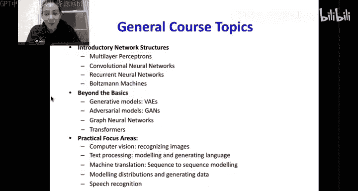

---

## 📚 课程先修要求

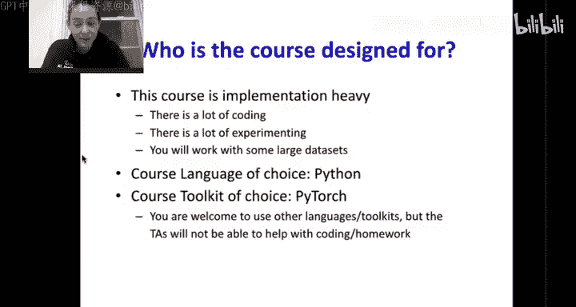

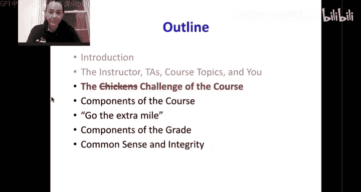

本课程是为已经掌握Python编程的人设计的。

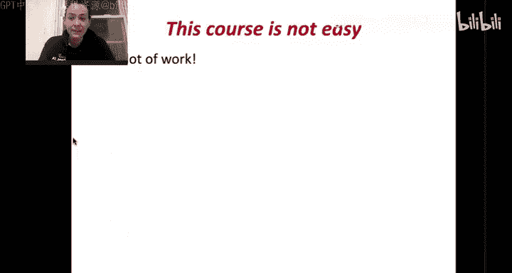

我们强烈建议你具备微积分和线性代数知识。我们也推荐向量微积分和软件工程知识，但这些不像Python那样是优先要求。

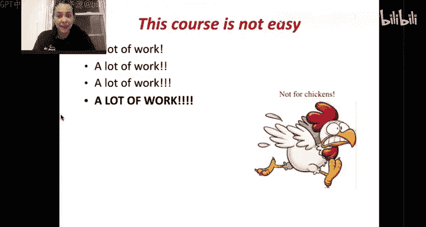

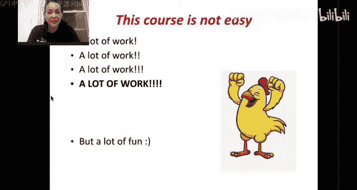

---

## 🧩 通用课程主题

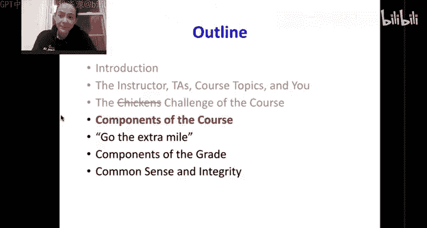

课程涵盖的入门级神经网络结构包括：
*   多层感知机
*   卷积神经网络
*   循环神经网络
*   玻尔兹曼机

除此之外，教授还将讲授以下主题：
*   生成模型
*   对抗模型
*   图神经网络
*   变换器

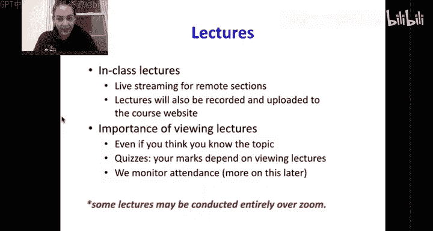

这些结构的实际应用重点领域包括：
*   计算机视觉
*   文本处理与机器翻译
*   分布建模与数据生成
*   语音识别

---

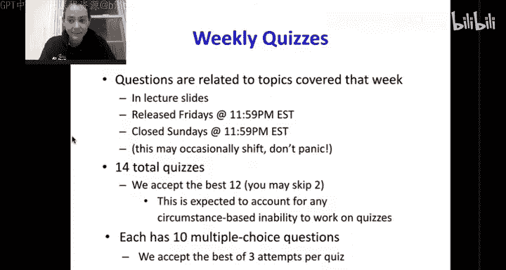

## 💻 课程实践重点

本课程非常注重实现，包含大量编码。我们使用Python和PyTorch。虽然你可以使用其他语言和工具包，但如果你需要向助教寻求帮助，则需要使用课程指定的语言和工具包。

---

## ⚠️ 课程的挑战

这是一门难度很高的课程，工作量很大。我们期望你投入大量时间学习和努力，以更好地理解课程材料。

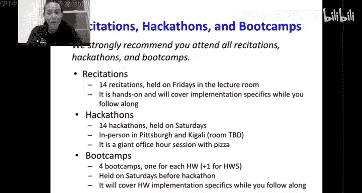

如果你以A的成绩完成这门课，你很可能已经准备好进入深度学习行业工作。

我们通过测验来检验你对讲座主题的理解，通过作业来教你如何实现和优化这些模型。如果你是研究生级别的学生，我们还有项目让你接触现实世界的问题。

---

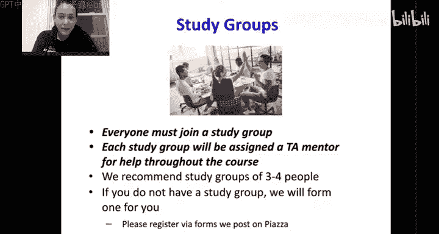

## 🎥 讲座

课程讲座在线下进行，同时通过Zoom直播。讲座会被录制并上传到YouTube和MediaTech平台。

观看讲座非常重要，因为除了讲解主题外，你的测验也基于这些幻灯片。我们还会监控你的出勤情况，稍后会详细说明。

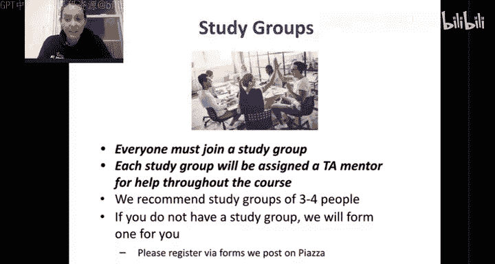

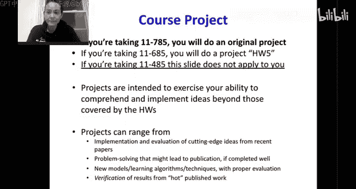

---

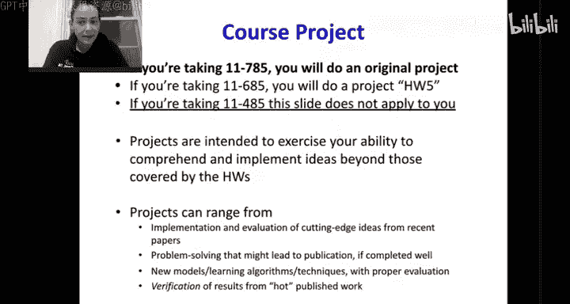

## 📝 测验

你总共会有14次测验。每周五发布一次，每周日截止。在14次测验中，我们会取你成绩最好的12次。每次测验有10个问题，我们会取你三次尝试中最好的一次成绩。

---

## 🧪 习题课、黑客松和训练营

我们还有由助教带领的习题课、黑客松和训练营。我们强烈建议你参加所有这些活动。

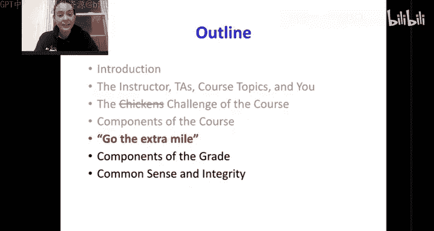

*   **习题课**：每周五在教室举行，共14次。它们是动手实验课，涵盖具体的实现细节，你可以跟着互动学习。
*   **黑客松**：每周六举行，地点待定，在匹兹堡和基加利线下进行。匹兹堡校区会提供披萨。
*   **训练营**：每次作业发布后都会有一个训练营，在作业发布后的那个周六举行。它们是对作业的手把手指导。针对11685课程的学生，还有一次针对作业5的训练营。

---

## 📄 作业

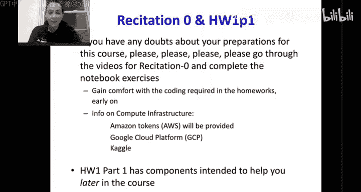

作业包括四个主要作业、加分作业以及一个自动微分加分作业。

主要作业分为两部分：
*   **第一部分**：自动评分，你需要将代码上传到AutoLab。
*   **第二部分**：Kaggle竞赛。

此外还有作业加分和自动微分加分。这些加分旨在给你机会弥补在其他部分丢失的分数，它们不会直接加到总成绩曲线上。

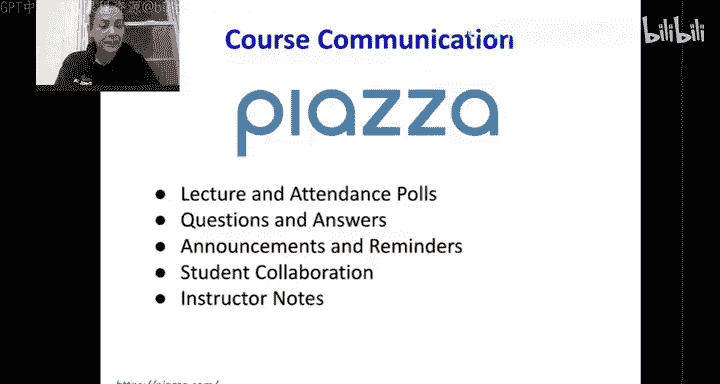

课程还提供学习小组。

---

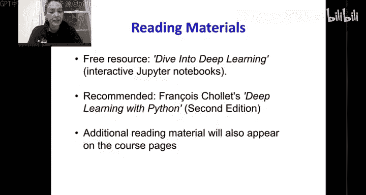

## 👥 学习小组

你必须加入一个学习小组，每个小组会被分配一名助教导师。

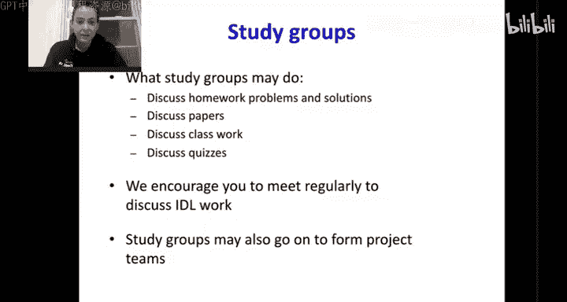

我们建议你的小组由3到4人组成。如果你愿意，也可以有更多人。

如果你没有学习小组或找不到小组，或者你的小组解散了，请告诉我们，我们会将你分配到一个新小组。

---

## 🎯 课程项目

如果你是11785课程的学生，你需要完成一个原创项目。

11685课程的学生将完成一个我们指定的项目，称为作业5。

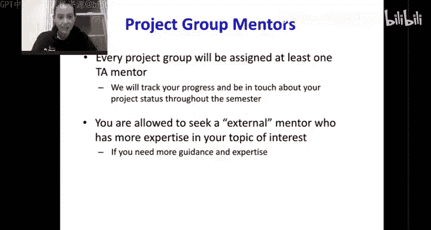

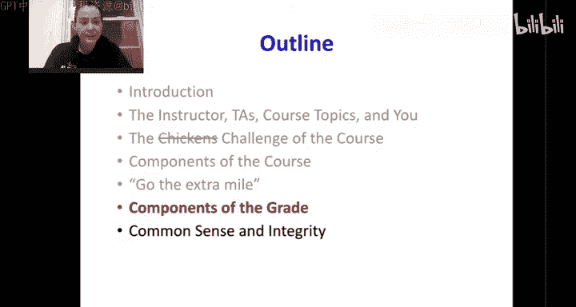

如果你是11485课程的学生，则无需担心这部分内容，请不要报名参加项目。

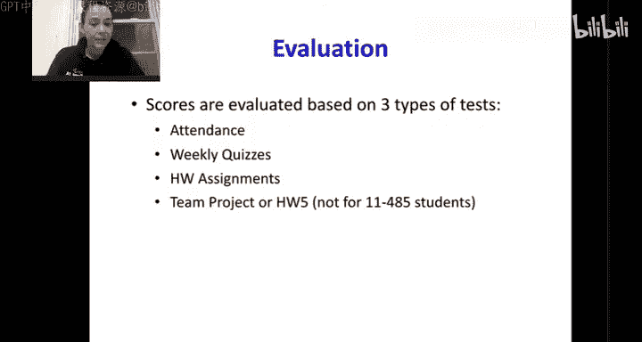

项目旨在锻炼你理解和实现超出作业范围内容的能力。范围很广，你可以做一个完全原创的想法和全新的模型设计，也可以实现一些已被验证的模型并尝试改进它。

---

## 🏃 如何取得优异成绩

为了在这门课上取得好成绩，我们建议你参加每一次讲座。出勤率会计入分数，这可能决定你是得A还是B。我们将通过每次讲座期间发布的投票来跟踪你的出勤情况。

我们还建议你观看我们在YouTube上发布的每一个“习题课0”视频。除了编码帮助，我们还提供了计算基础设施的信息。我们要求你在办公时间就这些主题提问之前，先参考这些视频。

作业1的第一部分也非常有价值，因为作业1第一部分的所有内容都将在后续课程中使用。因此，在这部分拿到100分至关重要。

---

## 💬 课程沟通

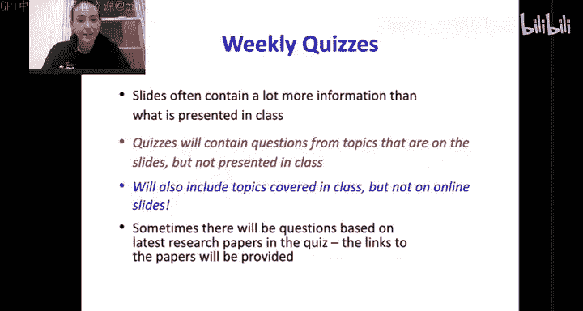

所有课程沟通都通过Piazza进行。请习惯使用Piazza，通过它接收通知并每天阅读，因为投票将通过它发布，教授和助教将通过它与你们沟通，公告也会在那里发布，你私下或公开提出的问题以及同学的回答也会在那里。

---

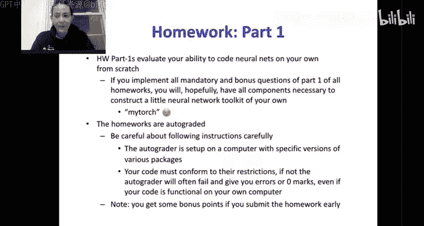

## 📖 额外阅读材料

如果你想在教授课堂讲授内容之外更深入地探讨主题，可以在课程网站上找到额外的阅读材料。

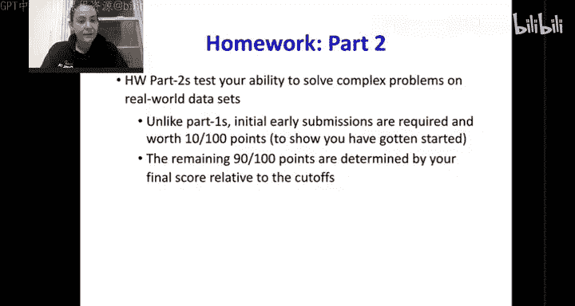

---

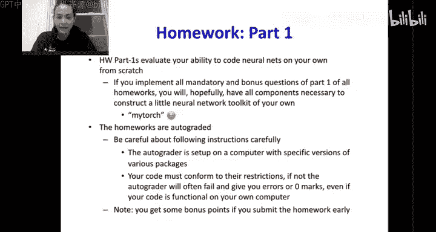

## 🤝 学习小组的价值

学习小组尤其有价值，因为你们可以一起讨论作业问题和解决方案、论文以及一般的课堂内容和测验。我们强烈鼓励你们每周聚一次，你甚至可以根据你的学习小组组建项目小组。

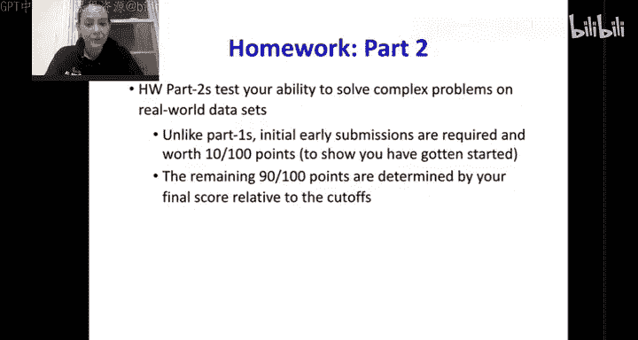

每个学习小组都有一名导师。导师的存在是为了在你落后或遇到困难时随时联系。如果你在课程之外遇到问题，或者需要找到联系教授的方式，你的助教导师都会以各种方式支持你。

我们致力于确保课程体验是积极的，通过让助教直接与你联系，我们希望这能帮助你在课程中找到立足点，取得好成绩。

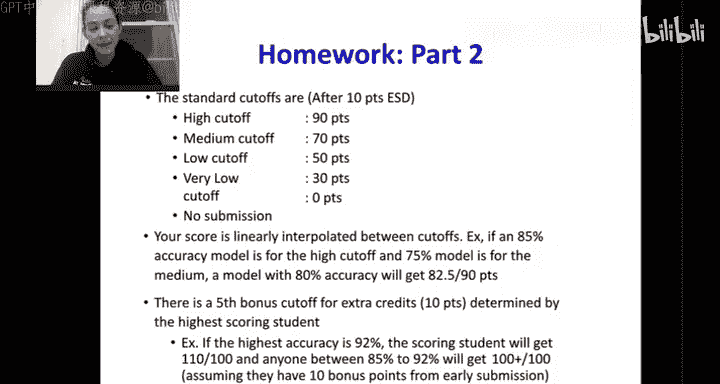

---

## 🧑‍🏫 项目小组导师

在11785课程部分，每个项目小组都会被分配一名项目导师。这不适用于11685或11485课程，只有785课程的学生会有项目小组导师。

这些导师会与小组保持联系。除了助教导师，你的小组还可以寻求一位外部导师，如果你希望为你的项目获得额外指导的话。

---

## 📊 成绩构成

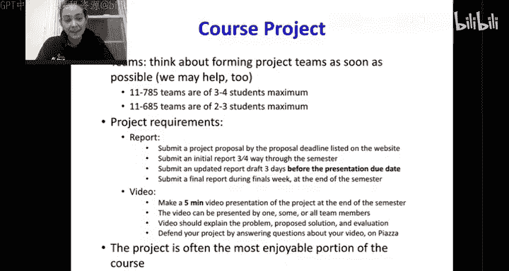

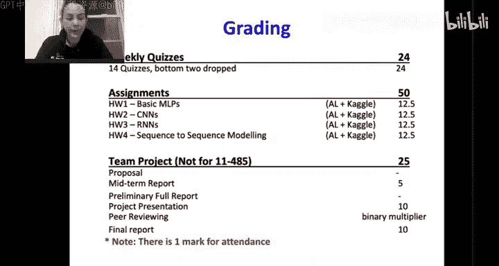

你的分数基于四种类型的考核进行评估：出勤、每周测验、作业和团队项目。

*   **出勤**：必须线下参加或通过Zoom参加。我们将通过课堂投票获取你的出勤数据。课程开始时会有一次初始出勤投票，然后教授每节课会有三到四次投票，你需要在一分钟内回答基于他刚刚讲授内容的问题。如果你在硅谷或时区导致你无法在合理时间参加讲座，我们理解。我们希望你能通过MediaTech观看讲座。MediaTech允许我们跟踪谁观看了讲座以及观看了多久，这样我们可以确定你以这种方式参加了。如果你在YouTube上观看，则不计入出勤。请在讲座发布后一周内观看。
*   **测验**：每周测验基于教授的幻灯片。通常，教授不会讲解幻灯片上的所有信息，因此你的任务是仔细阅读幻灯片来回答测验问题。偶尔，测验中也会包含基于需要你阅读的出版物的题目，但大多数情况下，测验都基于课堂幻灯片。
*   **作业**：每个作业的第一部分使用PyTorch，本课程为你提供了自己的工具包。第一部分作业是自动评分的，你需要将它们上传到AutoLab。如果你的成绩在AutoLab上显示为0，这意味着你得了零分，你需要重新提交，修复你遇到的错误，以获得你在本地可能看到的分数，否则我们不会知道你实际上应该得到更好的成绩。你必须在AutoLab上修复它。对于作业第二部分，如果你提前提交作业第一部分，你会获得加分。这个加分是在你第一部分成绩之上的额外加分。相比之下，第二部分的提前提交是第二部分成绩的一部分，价值10分。你不需要为这次提前提交获得任何类型的分数，你只需要提交即可。第二部分剩余的90%成绩由相对于截止分数的最终分数决定。你的截止分数是在截止点之间线性插值得出的。这只是高、中、低截止点的一个示例，每个作业会有所不同。如果你是Kaggle竞赛中得分最高的学生，你将获得额外的10分加分。因此，总的来说，如果你按时提交并获得最高分，你总共可以获得110分。

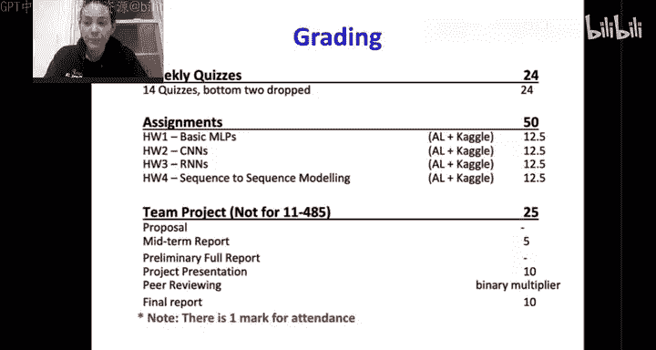

---

## 🗓️ 项目与截止日期

请尽快寻找你的项目团队成员。这是针对研究生级别课程的。对于11785项目，最多4人；对于11685的作业5项目，最多3人。

你需要提交一份提案、一份中期报告、一份最终报告以及一个5分钟长的视频演示。你的最终报告不仅会由助教和教授评审，还会由一组与CMU有关联且在业界工作的外部评审员评审。你的视频项目演示将由外部评审员、助教、教授以及班上所有其他学生观看。11485、685和785的学生都将观看你的视频演示来为你的最终报告演示评分。

评分构成如下：
*   每周测验：14次，其中2次不计入最终成绩。
*   四个作业：每个作业分为两部分，AutoLab第一部分和Kaggle第二部分。
*   团队项目：如果你不是11485的学生，你的中期报告和演示以及最终报告是你成绩的一部分。
*   出勤：占1分。

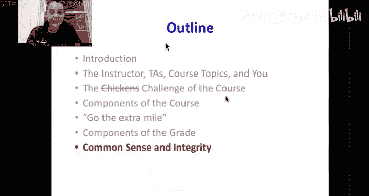

请注意，作业第一部分的截止日期与第二部分是分开的。作业第二部分有多个截止日期：提前提交截止日期、按时提交截止日期和延迟宽限截止日期。“宽限”指的是教授给所有学生的10个“宽限日”，你可以一次性用完，也可以在整个学期内分配使用。它旨在允许你延迟提交，但会有10%的罚分。对于每个延迟提交的作业，你都会受到10%的罚分。总共你有10个宽限日，我们会接受提交直到你用尽宽限日。你可以联系你的学习小组导师来提交延迟的作业。

---

## ⚖️ 常识与诚信问题

请随时在Piazza上发布任何问题，我们力求立即回复。话虽如此，我们希望你的代码相关问题有一定的结构，所以给你的帖子起一个好标题。重新阅读你的问题和描述，确保清晰明了。不要只是粘贴整个文件或添加一个笔记本，这是不可接受的。我们希望你能解释你尝试了什么，已经得到了什么结果。错误和扩展的堆栈跟踪应该被呈现出来，我们想知道你已经尝试修复了什么。否则，这只是额外的工作，也不是寻求帮助的有效方式。

最后，关于个人和学术诚信。你是CMU的学生，来这里是为了学习深度学习，而不是学习如何假装学习。因此，我们期望你不要侮辱自己，不要降低自己的诚信。请诚实地对待你的工作。如果有问题，随时联系。

在你的学习小组中，我们允许你们一起工作，并期望你们分担工作量，特别是在作业二的探索阶段。然而，你的最终提交必须是自己的。你们不能只是互相复制粘贴，你必须实际完成自己的工作，尽管你们可以互相帮助调试、讨论和一起解决问题。

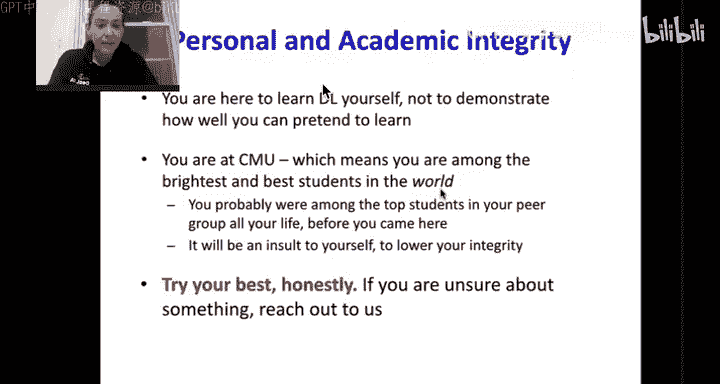

抄袭代码是违反学术诚信的行为。

---

## 🎉 总结

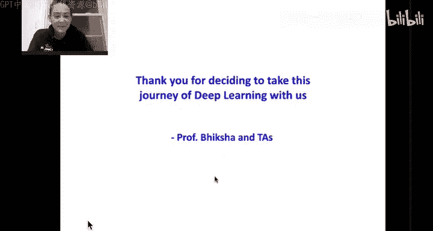

本节课中，我们一起学习了CMU《深度学习导论》课程的整体框架。我们了解了神经网络的重要性、课程的教学团队与先修要求、涵盖的核心主题与结构、以及取得好成绩的关键——包括积极参与讲座、完成作业和测验、利用学习小组和导师资源。我们还明确了课程的评分构成、项目要求以及至关重要的学术诚信准则。希望本介绍能帮助你为这门富有挑战性但又收获颇丰的课程做好准备。