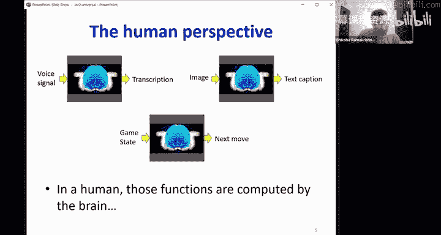
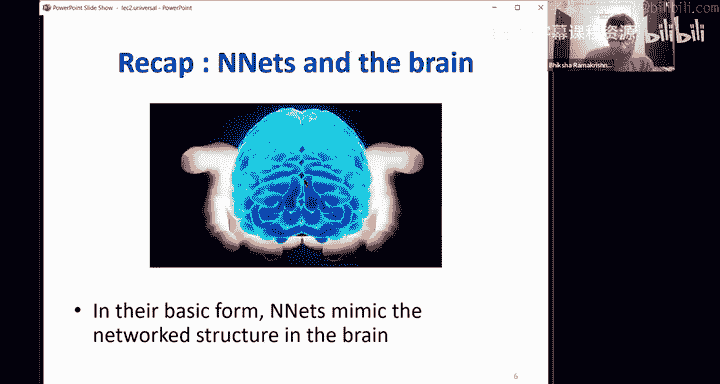
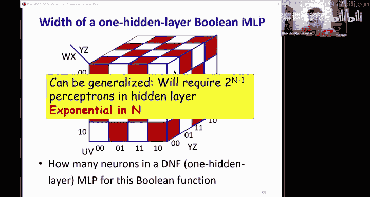
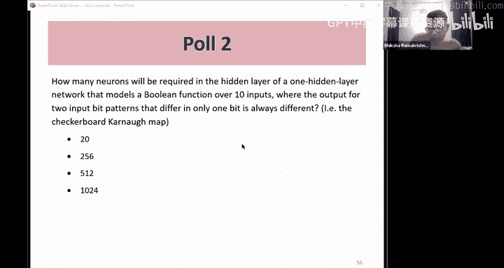
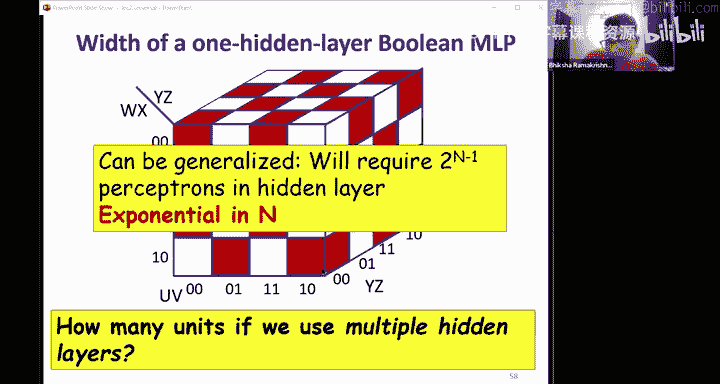
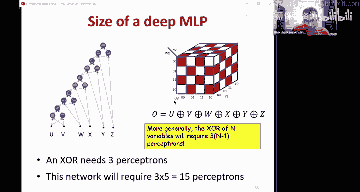
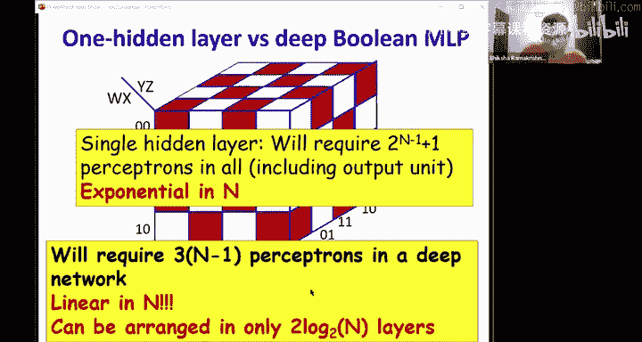
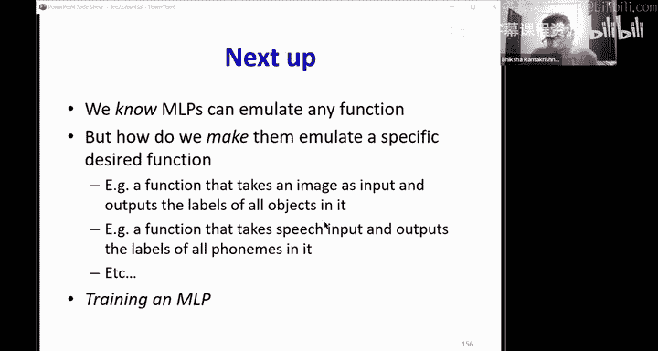

# 3：神经网络作为通用逼近器 🧠

在本节课中，我们将深入探讨神经网络能够表示什么，以及其表示能力在深度、宽度和激活函数方面的限制。我们将从布尔函数、分类器到实值函数，逐步理解神经网络的通用逼近能力。

---

## 🧩 神经网络基础回顾

上一节我们介绍了神经网络的基本概念。本节中，我们来看看其核心计算单元——感知机。

神经网络是能够接收输入并产生输出的函数。其基本形式模仿了人脑的网络结构，由称为神经元的简单计算单元组成。人工神经网络中的基本单元是感知机。

感知机的数学表示如下：它计算输入的加权和，如果该和超过阈值，则输出1；否则输出0。公式表示为：

**输出 = 1，如果 Σ(wi * xi) > 阈值；否则为 0**

另一种等效表示是计算输入的仿射组合（加权和加上偏置项），然后通过一个阈值激活函数。公式为：

**z = Σ(wi * xi) + b**
**输出 = 1，如果 z > 0；否则为 0**

我们可以用其他激活函数（如Sigmoid、Tanh、ReLU）替换这个阈值函数，但在本讲中，我们主要使用基本的阈值激活感知机。

---

## 🔗 多层感知机与深度定义

单个感知机能力有限，因此我们通常使用多层感知机。要理解“深度”，首先需要了解有向无环图。

在有向无环图中，深度定义为从源节点（输入）到汇节点（输出）的最长路径长度。在神经网络中，深度就是从任何输入到任何输出的最长路径上的神经元数量。

层是相对于输入具有相同深度的神经元集合。深度大于2的网络被称为深度网络。

---

## 🧮 作为通用布尔函数的多层感知机

上一节我们提到感知机可以构成布尔函数。本节中我们来看看其通用性及深度的重要性。

单个感知机非常强大，可以计算需要指数级数量布尔门才能完成的函数（例如“多数表决”门）。然而，单个感知机无法计算异或函数。

通过组合感知机（即构建多层感知机），我们可以构成任何布尔电路，这意味着多层感知机是通用布尔函数——对于任意布尔函数，都存在一个MLP可以计算它。

一个关键问题是：需要多少层？任何布尔函数都可以写成析取范式。基于此，仅含一个隐藏层的MLP就足以表示任何布尔函数，是通用布尔函数。

但是，对于最坏情况（如棋盘格函数），单隐藏层网络可能需要指数级数量的感知机（约 2^(n-1) 个）。

如果允许网络更深，例如将异或函数视为输入的级联，我们可以用线性数量（约 3(n-1) 或 2(n-1) 个）的感知机构建网络。深度可以将网络规模从输入规模的指数级降低到线性级。

**核心结论**：MLP是通用布尔函数。单隐藏层MLP即可实现，但可能需指数级宽度。更深的网络可以用少得多的神经元（线性级）表示相同函数。

---

## 🎯 作为通用分类器的多层感知机

接下来，我们看看神经网络如何处理实值输入并构成分类器。

单个感知机构成一个阶跃函数，其决策边界是一个超平面，因此它是一个线性分类器。但单个感知机无法表示异或所需的复杂边界。

通过组合多个感知机，我们可以构建复杂的决策边界，例如多边形区域。基本思想是为边界多边形的每条边设置一个感知机，然后对它们的输出求和并应用阈值，从而得到多边形内部的区域。

我们可以将这种方法推广到任意复杂的决策边界，方法是用许多小的多边形（多面体）来近似该区域，每个多边形对应一个子网络，然后对这些子网络的输出进行“或”运算。

即使是单隐藏层MLP，也可以通过使用无限多的神经元来近似任何分类边界，因此MLP是通用分类器。

然而，深度再次显示出优势。对于复杂的决策边界（如交叉网格），浅层网络可能需要数百个神经元，而深层网络通过将问题结构化为多层异或计算，可以用少得多的神经元实现。

**核心结论**：MLP是通用分类器。单隐藏层MLP即可实现，但可能需指数级宽度。更深的网络可以用指数级更少的神经元表示相同函数。

---

## 📈 作为通用逼近器的多层感知机

最后，我们探讨神经网络如何逼近实值函数。

对于标量输入，一个三单元的MLP可以配置为在两个阈值之间输出1，否则输出0，从而构成一个“窗函数”。通过组合许多这样的窗函数，可以逐步逼近任何连续标量函数。

对于多维输入，思路类似。一个具有许多感知机的单隐藏层网络，对其输出求和，可以产生类似“圆柱体”的函数（在某个圆形区域内输出较高，外部输出较低）。通过在不同位置放置许多这样的“圆柱体”，并缩放其高度以匹配目标函数在该区域的值，我们可以求和这些缩放后的输出来逼近任何连续多元函数。逼近误差可以任意小。

因此，具有单隐藏层的MLP是通用函数逼近器，但同样可能需要无限宽度。更深的网络可以用更少的神经元达到相同的逼近精度。

---

## ⚖️ 深度、宽度与激活函数的权衡

我们讨论了深度的重要性，但网络的每一层也必须足够“宽”，以将相关信息传递到后续层。

如果第一层太窄（例如，用8个阈值神经元试图捕获16条线构成的交叉网格边界），由于阈值激活函数只提供“在边界哪一侧”的二元信息，而不提供“距离边界多远”的信息，后续层将无法恢复丢失的几何细节，从而无法构成完整的边界。

解决方案是使用**具有梯度的激活函数**（如Sigmoid、ReLU、Leaky ReLU）。这些函数能提供关于输入距离边界远近的信息，使得后续层即使在前层较窄时，也有可能利用这些梯度信息恢复更复杂的模式。但这并非绝对保证。

**核心结论**：
1.  MLP是通用布尔函数、通用分类器和通用函数逼近器。
2.  单层MLP可以逼近任何函数，但可能需要指数级甚至无限宽度。
3.  更深的MLP可以用少得多的神经元达到相同的精度。
4.  具有梯度的激活函数能使网络更具表现力，有助于信息在层间传递。

---

## 🎓 本节课总结

本节课我们一起学习了：
*   神经网络作为通用布尔函数的表示能力及深度的重要性。
*   神经网络作为通用分类器，如何构成复杂决策边界。
*   神经网络作为通用函数逼近器，如何近似连续实值函数。
*   深度、宽度和激活函数梯度之间的权衡：深度可以大幅减少所需神经元数量，但每层仍需足够宽度或使用梯度激活函数来传递有效信息。

我们了解到MLP可以模拟任何函数，但如何让它们模拟某个特定的期望函数呢？这就是训练MLP的任务，我们将在下一节课开始学习。