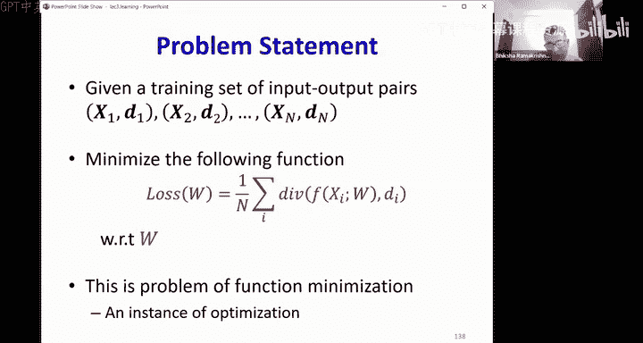

# 4：训练（第一部分） 🧠

在本节课中，我们将要学习如何训练神经网络。我们将从最简单的感知器学习规则开始，探讨其在多层感知器（MLP）中遇到的困难，并最终引出通过经验风险最小化来学习网络参数的核心思想。

---

## 神经网络作为函数

上一节我们介绍了神经网络是通用函数逼近器。这意味着，给定一个函数，总存在一个神经网络可以以任意精度逼近它。然而，这并不意味着我们知道如何构建这个网络。

神经网络本质上是数学对象。它们接收一组数字作为输入，经过内部一系列数字运算，最终输出另一组数字。因此，要让神经网络处理像语音、图像或游戏状态这样的任务，我们首先需要将这些输入和输出转换为数字形式。本节课我们暂不讨论这个表示问题，而是假设输入和输出已经是数字形式，并专注于如何构建能执行所需函数的网络。

---

## 学习网络参数

一个神经网络可以表示为：
`y = f(x; W)`
其中，`x` 是输入，`W` 代表网络中所有感知器的权重和偏置参数集合，`y` 是输出。学习神经网络，实质上就是确定参数 `W` 的值，使得网络能够计算我们想要的特定函数。

理想情况下，我们希望网络在所有可能的输入上都精确计算目标函数 `g(x)`。这需要最小化网络输出 `f(x; W)` 与目标 `g(x)` 之间的误差在整个输入空间上的积分。然而，在现实中，我们并不知道完整的函数 `g(x)`。

---

## 从样本中学习

我们无法获知完整的函数 `g(x)`，但获取其样本却相对容易。例如，我们可以收集一批带有标签的图像或带有转录文本的语音片段。这些输入-输出对构成了我们的**训练样本**。

因此，我们的策略转变为：利用这些训练样本来估计网络参数，使得网络在这些样本点上的输出尽可能接近目标值。我们计算所有训练样本上的平均误差（称为**经验误差**），并尝试最小化它。我们**希望**，通过这种方式学到的网络，在未见过的数据点上也能表现良好，但这并非绝对保证。

以下是关于学习网络的基本假设：
*   网络架构必须具有足够的容量（即足够的参数）来近似目标函数。
*   网络是一个参数化函数，其参数是所有权重和偏置。
*   参数必须通过学习来最佳地近似目标函数。
*   仅凭少量训练样本无法完美地学习到函数。

---

## 感知器学习规则

让我们从一个最简单的网络开始：单个感知器（带阈值激活函数）。这对应于一个线性分类器。给定一组线性可分的训练样本（红点和蓝点），学习感知器意味着找到一个超平面（由权重 `W` 定义），使得所有红点位于超平面的一侧（输出为1），所有蓝点位于另一侧（输出为0）。

罗森布拉特提出了一个简单的在线学习算法：
1.  随机初始化权重 `W`。
2.  遍历所有训练样本。
3.  对于每个样本 `x`：
    *   如果分类正确，则不更新权重。
    *   如果分类错误（例如，一个正类样本被分类为负类），则将 `W` 更新为 `W + x`（因为对于正类样本，最优的 `W` 方向就是 `x` 本身）。
    *   如果是一个负类样本被错误分类，则将 `W` 更新为 `W - x`。
4.  重复步骤2-3，直到所有样本被正确分类或达到最大迭代次数。

该算法在线性可分的数据上保证能在有限步内收敛到一个解。然而，如果数据不是线性可分的，算法将永远不会停止。

---

## 多层感知器（MLP）的学习困境

对于更复杂的非线性决策边界（例如“双五边形”边界），我们需要一个多层感知器网络。虽然我们知道存在一个具有特定架构的网络可以精确计算这个边界，但使用感知器学习规则来训练整个网络会面临巨大挑战。

问题在于，要训练网络中间层的某个感知器，我们需要知道对于每个训练样本，该感知器的“正确”输出应该是什么（即，它应该将样本标记为“正”还是“负”）。然而，我们只有整个网络最终输出的标签（例如，样本属于“双五边形内部”还是“外部”）。

为了确定中间层每个感知器对每个样本的“正确”输出，我们可能需要尝试所有可能的组合。对于一个有 `N` 个训练样本的网络，这相当于 `2^N` 种可能的标记方式，这是一个**组合优化问题**，计算复杂度是指数级的，在实践中不可行。

此外，阈值激活函数几乎处处导数为零，在边界点导数甚至不存在（无穷大）。这意味着，轻微调整权重可能完全不会改变分类误差，因此我们无法获得关于调整方向是否正确的信息。

---

## 解决方案：可微分的激活函数与损失函数

为了克服上述困难，我们需要做出两项关键改变：

1.  **使用可微分的激活函数**：用平滑的、几乎处处可导的函数（如Sigmoid、ReLU）替换阈值函数。这样，权重的微小变化会导致输出的连续变化，从而我们可以计算输出相对于权重的梯度。
2.  **定义可微分的损失函数**：不再直接最小化分类错误计数（它是离散的、不可导的），而是定义一个连续可导的**损失函数**（或**代价函数**），它衡量网络输出与目标输出之间的“差异”（称为**散度**）。常用的散度包括均方误差（用于回归）和交叉熵（用于分类）。

通过最小化在所有训练样本上平均的损失（即**经验风险**），我们利用梯度信息来指导参数更新，从而避开组合爆炸问题。这个过程称为**经验风险最小化**，它是一个标准的函数优化问题。

虽然最小化这个代理损失函数不一定能直接最小化我们最终关心的分类错误率，但它为我们提供了一个可操作的、基于梯度的优化路径。

---

## 总结

本节课中我们一起学习了：
*   学习神经网络就是确定其参数 `W`，以逼近目标函数。
*   我们通过拟合训练样本来学习，最小化**经验风险**（即平均损失）。
*   对于单层感知器，**感知器学习规则**可以在线性可分数据上有效工作。
*   对于多层感知器，使用阈值激活函数会导致**组合优化**的难题，因为需要确定中间层的标签。
*   解决方案是采用**可微分的激活函数**（如Sigmoid、ReLU）和**可微分的损失函数**。
*   这使我们能够通过**梯度下降**等优化方法，以**经验风险最小化**的框架来训练整个网络，从而避免了组合爆炸问题。

下一讲，我们将深入探讨如何具体计算这些梯度，即著名的**反向传播**算法。