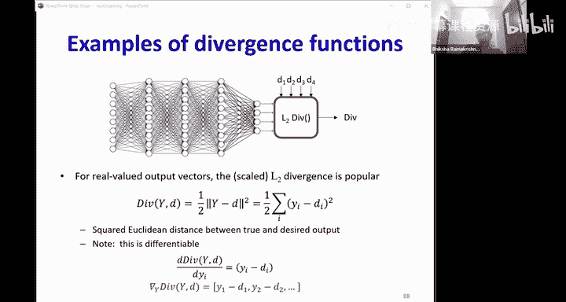

# 5：训练神经网络（第二部分）🚀

在本节课中，我们将学习如何训练神经网络来逼近目标函数。我们将深入探讨函数优化的核心概念，特别是梯度下降法，并定义训练神经网络所需的所有关键组成部分：网络结构、输入输出表示以及损失函数。

---

## 函数优化与导数回顾 🔍

上一节我们介绍了神经网络的训练目标是最小化损失函数。本节中我们来看看如何通过优化方法找到使损失最小的网络参数。

假设我们有一个函数 \( y = f(x) \)，我们想找到使 \( f(x) \) 最小的 \( x \) 值。在单变量情况下，我们知道在最小值点，函数的导数为零，且二阶导数为正。

导数的定义是：对于一个连续函数，在任意点 \( x \)，一个微小的增量 \( \Delta x \) 会导致函数值产生增量 \( \Delta y \)。导数 \( \alpha \) 是连接两者的乘数：
\[
\Delta y = \alpha \cdot \Delta x
\]
这表示函数在局部是线性的。

### 多变量情况下的导数

当 \( x \) 是一个向量 \( \mathbf{x} = [x_1, x_2, ..., x_n]^T \)，而 \( y \) 是一个标量时，情况变得复杂。此时，增量关系变为：
\[
\Delta y = \boldsymbol{\alpha} \cdot \Delta \mathbf{x}
\]
其中 \( \Delta \mathbf{x} \) 是一个向量增量，\( \boldsymbol{\alpha} \) 必须是一个行向量，其每个元素是 \( y \) 对 \( x \) 各分量的偏导数。这个行向量 \( \boldsymbol{\alpha} \) 被称为函数 \( y \) 对 \( \mathbf{x} \) 的**导数**。

我们通常更常用的是**梯度**（Gradient）。梯度 \( \mathbf{g} \) 是导数的转置，因此它是一个列向量，与 \( \mathbf{x} \) 生活在同一空间：
\[
\mathbf{g} = \nabla_{\mathbf{x}} y = \boldsymbol{\alpha}^T
\]
因此，增量关系也可以写成梯度的形式：
\[
\Delta y = \mathbf{g}^T \Delta \mathbf{x}
\]
这实际上是梯度向量 \( \mathbf{g} \) 与步进向量 \( \Delta \mathbf{x} \) 的内积。

### 梯度的几何意义

梯度方向是函数值**上升最快**的方向。反之，负梯度方向就是函数值**下降最快**的方向。这是因为内积 \( \mathbf{g}^T \Delta \mathbf{x} = \|\mathbf{g}\| \|\Delta \mathbf{x}\| \cos\theta \)，当 \( \Delta \mathbf{x} \) 与 \( \mathbf{g} \) 方向相同时（\( \theta=0 \)），内积最大，函数增加最多。

为了找到函数的最小值，我们应该沿着**负梯度方向**移动。

---

## 梯度下降算法 📉

基于以上原理，我们可以设计一个迭代算法来寻找函数最小值，这就是**梯度下降法**。

算法从参数的一个初始猜测值 \( \mathbf{x}_0 \) 开始。在每一步 \( k \)，我们计算当前点 \( \mathbf{x}_k \) 的梯度 \( \mathbf{g}_k \)，然后沿着负梯度方向更新参数：
\[
\mathbf{x}_{k+1} = \mathbf{x}_k - \eta \cdot \mathbf{g}_k
\]
其中 \( \eta \) 是一个正数，称为**学习率**（Learning Rate），它控制着每一步更新的幅度。

学习率的选择至关重要：
*   学习率太大：可能导致更新步伐过大，在最小值附近震荡甚至发散。
*   学习率太小：收敛速度会非常慢。

我们重复这个过程，直到梯度接近零（到达临界点），或者连续迭代中函数值的变化非常小。

---

## 定义神经网络的训练问题 🧠

现在，我们将梯度下降的思想应用到神经网络的训练中。我们的目标是：给定一组训练样本（输入-输出对），调整网络参数 \( \mathbf{W} \)，以最小化损失函数 \( L(\mathbf{W}) \)。

为了实现这一点，我们必须明确定义三个核心要素：

### 1. 网络函数 \( F \)

我们使用多层感知机（MLP）作为网络结构。它是一个前馈网络，由输入层、若干隐藏层和输出层组成。每一层的神经元接收前一层输出的加权和（加上偏置），然后通过一个**激活函数**产生输出。

单个感知机的计算如下：
\[
z = \mathbf{w}^T \mathbf{x} + b
\]
\[
y = f(z)
\]
其中 \( f(\cdot) \) 是激活函数。

常见的激活函数包括：
*   **Sigmoid**: \( f(z) = \frac{1}{1 + e^{-z}} \)，输出在 (0,1) 之间。
*   **Tanh**: \( f(z) = \tanh(z) \)，输出在 (-1,1) 之间。
*   **ReLU**: \( f(z) = \max(0, z) \)。
*   **Softmax** (用于多分类输出层): 这是一个向量激活函数。对于输入向量 \( \mathbf{z} \)，其第 \( i \) 个输出为：
    \[
    y_i = \frac{e^{z_i}}{\sum_{j} e^{z_j}}
    \]
    它保证所有输出之和为 1，可以解释为概率分布。

### 2. 输入与输出的表示

*   **输入 \( \mathbf{x} \)**: 必须是实数向量。例如，图像是像素值向量，语音是特征向量，文本需要被编码为词向量等。
*   **期望输出 \( \mathbf{d} \)**: 根据任务类型不同，表示方式也不同。
    *   **回归任务**: \( \mathbf{d} \) 是任意实数值向量。网络输出层通常不使用非线性激活函数。
    *   **二分类任务**: \( d \) 是 0 或 1。网络输出层使用一个 Sigmoid 神经元，其输出可以解释为属于正类的概率 \( P(class=1|\mathbf{x}) \)。
    *   **多分类任务（K类）**: \( \mathbf{d} \) 是一个 **one-hot 向量**，长度为 K。只有对应真实类别的那个位置是 1，其余全为 0。网络输出层使用 Softmax 激活函数，产生一个 K 维的概率分布。

### 3. 损失函数（散度）

损失函数衡量网络输出 \( \mathbf{y} \) 与期望输出 \( \mathbf{d} \) 之间的差异。它必须是可微的。

以下是不同任务对应的常见损失函数：

*   **回归任务（L2损失/均方误差）**:
    \[
    D(\mathbf{y}, \mathbf{d}) = \frac{1}{2} \|\mathbf{y} - \mathbf{d}\|^2
    \]
    其关于网络输出 \( \mathbf{y} \) 的导数为 \( \mathbf{y} - \mathbf{d} \)。

*   **二分类任务（交叉熵损失）**:
    \[
    D(y, d) = -[d \cdot \log(y) + (1-d) \cdot \log(1-y)]
    \]
    其中 \( y \) 是 Sigmoid 的输出。当网络完全预测错误（如 \( d=1, y\to 0 \)）时，损失会趋于无穷大，给予了严重惩罚。

*   **多分类任务（交叉熵损失）**:
    \[
    D(\mathbf{y}, \mathbf{d}) = -\sum_{i=1}^{K} d_i \log(y_i) = -\log(y_c)
    \]
    其中 \( c \) 是真实类别的索引。因为 \( \mathbf{d} \) 是 one-hot 向量，所以求和后只剩下真实类别对应的项 \( -\log(y_c) \)。这促使网络提高对真实类别的预测概率。

一个重要的性质是，对于使用 Softmax 输出层和交叉熵损失的多分类网络，以及对于使用线性输出层和 L2 损失的回归网络，损失函数关于最后一层**线性加权和 \( \mathbf{z} \)** 的导数都具有一个非常简洁的形式：\( \mathbf{y} - \mathbf{d} \)（即误差本身）。这大大简化了反向传播的计算。

---

## 总结 🎯

本节课中我们一起学习了神经网络训练的核心优化方法。

1.  我们回顾了导数和梯度的概念，理解了梯度方向是函数上升最快的方向。
2.  我们介绍了**梯度下降算法**，它通过不断沿负梯度方向更新参数来寻找函数最小值。
3.  我们将此算法应用于神经网络训练，并明确了训练所需的三个定义：
    *   **网络结构**: 多层感知机（MLP）及其激活函数。
    *   **数据表示**: 输入需为实数向量；输出根据任务（回归、二分类、多分类）采用不同的编码（实数值、0/1、one-hot向量）。
    *   **损失函数**: 根据任务选择（如L2损失、交叉熵损失），用于衡量预测与目标的差距。

至此，我们已经建立了训练神经网络的理论框架。接下来的课程将深入探讨如何高效地计算这些梯度（即**反向传播算法**），并处理训练中的实际挑战。