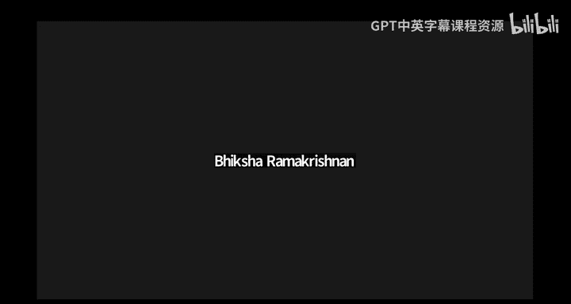
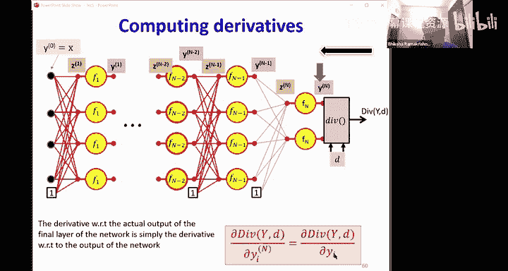
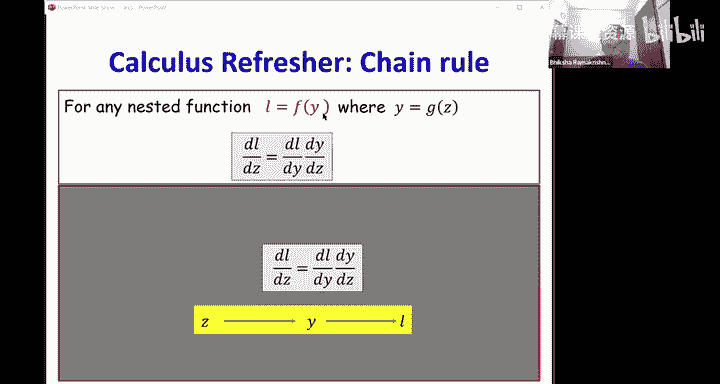
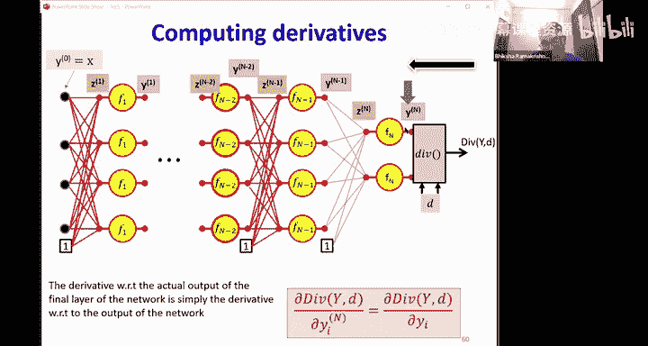
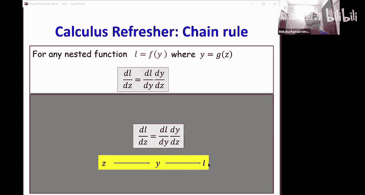
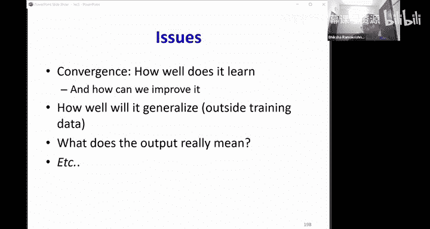

# 6：训练神经网络（第三部分） 🧠

在本节课中，我们将继续学习如何训练神经网络。我们将深入探讨如何计算损失函数相对于网络参数的梯度，这是梯度下降算法的核心。我们将学习一种名为**反向传播**的高效算法来完成这一计算。

---

## 概述

在之前的课程中，我们了解到，训练神经网络的目标是找到一组权重和偏置，使得网络在训练数据上的平均损失最小。我们使用梯度下降法来迭代更新这些参数。为了实现这一点，我们需要计算损失函数相对于每个参数的梯度。本节课，我们将学习如何通过**反向传播**算法来高效地计算这些梯度。

---

## 梯度下降回顾

首先，让我们回顾一下梯度下降的基本原理。给定一个由输入-输出对组成的训练集，我们为每个训练实例定义一个**损失**，它衡量了网络实际输出与期望输出之间的差异。整个训练集上的总损失是所有单个实例损失的平均值。

我们的目标是找到一组网络参数（权重 **W** 和偏置 **b**），使得总损失最小化。梯度下降的更新规则是：

**W ← W - η ∇L(W)**

其中，**η** 是学习率，**∇L(W)** 是损失函数相对于所有参数的梯度向量。

为了计算这个梯度，我们需要计算每个训练实例的损失相对于每个参数的偏导数，然后取平均值。

---

## 计算图与链式法则

为了理解反向传播，我们首先需要理解**计算图**和**链式法则**的概念。

### 标量情况

考虑一个简单的函数：`y = f(x)`。如果我们对 `x` 做一个小的改变 `Δx`，那么 `y` 的相应改变 `Δy` 近似为：

**Δy ≈ (dy/dx) Δx**

我们可以用一个图来表示这种关系：`x → y`，在边上标注导数 `dy/dx`。

现在，考虑一个嵌套函数：`y = f(g(x))`。我们可以将其表示为：`x → g → y`。根据链式法则，`y` 相对于 `x` 的导数是：

**dy/dx = (dy/dg) * (dg/dx)**

在计算图中，这相当于沿着从 `x` 到 `y` 的路径，将路径上所有边的导数相乘。

### 多路径情况

如果 `y` 依赖于多个中间变量 `z1, z2, ...`，而每个 `z` 又都依赖于 `x`（例如 `y = f(z1, z2), z1 = g1(x), z2 = g2(x)`），那么 `y` 相对于 `x` 的导数需要对所有从 `x` 到 `y` 的路径求和：

**dy/dx = Σ_i (∂y/∂z_i) * (dz_i/dx)**

这个“沿所有路径求和”的规则是反向传播的核心。

---

## 神经网络中的前向传播

在计算梯度之前，我们需要进行**前向传播**：将输入数据通过网络，计算所有神经元的中间值和最终输出。

考虑一个具有 `L` 层的网络。我们用上标 `(l)` 表示层索引，下标表示神经元索引。
*   `y_i^{(l)}`：第 `l` 层第 `i` 个神经元的输出。
*   `z_j^{(l)}`：第 `l` 层第 `j` 个神经元的加权输入（仿射值）。
*   `W_{ij}^{(l)}`：从第 `l-1` 层的第 `i` 个神经元到第 `l` 层的第 `j` 个神经元的连接权重。
*   `b_j^{(l)}`：第 `l` 层第 `j` 个神经元的偏置。

前向传播的步骤如下（为简化，我们将输入层记为第 0 层，`y^{(0)} = x`）：

1.  对于每一层 `l = 1 to L`：
    *   计算仿射值：**z^{(l)} = W^{(l)} y^{(l-1)} + b^{(l)}**
    *   应用激活函数：**y^{(l)} = f^{(l)}(z^{(l)})**

最终，`y^{(L)}` 就是网络的输出。在此过程中，我们需要保存所有中间值 `z^{(l)}` 和 `y^{(l)}`，因为它们在后向传播中会被用到。

---

## 反向传播：计算梯度

现在，假设我们已经完成了前向传播，并计算出了网络输出 `y^{(L)}` 和损失值 `L`。我们的目标是计算损失 `L` 相对于所有权重 `W^{(l)}` 和偏置 `b^{(l)}` 的梯度。

反向传播从网络的输出层开始，向后逐层计算梯度。其核心思想是**链式法则**。

### 关键步骤

我们定义一些有用的中间梯度：
*   `δ^{(l)} = ∂L / ∂z^{(l)}`：损失相对于第 `l` 层仿射值的梯度。

反向传播算法如下：

1.  **输出层梯度**：首先计算损失相对于网络输出的梯度 `∂L / ∂y^{(L)}`。这取决于我们选择的损失函数（如均方误差、交叉熵等）。
2.  **反向迭代每一层**：对于 `l = L down to 1`：
    a.  **计算 δ^{(l)}**：`δ^{(l)} = (∂L / ∂z^{(l)}) = (∂L / ∂y^{(l)}) ⊙ f'^{(l)}(z^{(l)})`
        *   这里 `⊙` 表示逐元素乘法。`f'^{(l)}` 是第 `l` 层激活函数的导数。
        *   对于输出层，`∂L / ∂y^{(L)}` 已在第一步计算。
        *   对于隐藏层，`∂L / ∂y^{(l)}` 需要从后一层传递过来。
    b.  **计算权重梯度**：`∂L / ∂W^{(l)} = δ^{(l)} (y^{(l-1)})^T`
        *   这给出了一个矩阵，其 `(i, j)` 元素是 `∂L / ∂W_{ij}^{(l)}`。
    c.  **计算偏置梯度**：`∂L / ∂b^{(l)} = δ^{(l)}`
        *   偏置的梯度就是 `δ^{(l)}` 本身。
    d.  **计算前一层输出梯度**（为下一层迭代做准备）：`∂L / ∂y^{(l-1)} = (W^{(l)})^T δ^{(l)}`

### 为什么是“反向”传播？

注意步骤 2d。为了计算第 `l-1` 层的梯度 `∂L / ∂y^{(l-1)}`，我们需要第 `l` 层的梯度 `δ^{(l)}`。这就是为什么我们必须从输出层开始，**向后**计算。每一层的梯度计算都依赖于其后一层的梯度结果。

---

## 向量化与矩阵表示

在实际实现中，我们使用矩阵和向量运算，这比逐元素操作要高效得多。这正是我们之前用矩阵形式书写前向传播的原因。反向传播的公式也完全可以用矩阵运算表示，如上节所示。

这种向量化表示不仅使代码更简洁，还能利用高度优化的线性代数库（如 BLAS、CUDA）来加速计算，这对于训练大型神经网络至关重要。

---

## 特殊激活函数的处理

反向传播需要计算激活函数的导数 `f'(z)`。对于常见的激活函数：

*   **Sigmoid**: `f'(z) = f(z)(1 - f(z))`
*   **Tanh**: `f'(z) = 1 - (f(z))^2`
*   **ReLU**: `f'(z) = 1 if z > 0 else 0` （在 `z=0` 处通常定义为 0 或 1，这是一个次梯度）
*   **Softmax**：这是一个向量激活函数。它的导数是一个雅可比矩阵（Jacobian），而不仅仅是一个对角矩阵。对于 Softmax 输出层配合交叉熵损失，会有一种简化的、非常高效的特殊梯度形式，我们将在后续课程中看到。

对于像 `Max` 这样的函数，其导数在最大值输入处为 1，在其他输入处为 0。

---

## 训练流程总结

将前向传播和反向传播结合起来，整个神经网络的训练流程如下：

1.  **初始化**：随机初始化所有权重和偏置。
2.  **循环**（对于多个迭代周期或直到收敛）：
    a.  **前向传播**：对于一个批次（Batch）的训练数据，计算网络输出和损失。
    b.  **反向传播**：计算损失相对于所有参数的梯度。
    c.  **参数更新**：使用梯度下降（或其变体，如 Adam）更新权重和偏置：`W ← W - η * ∂L/∂W`，`b ← b - η * ∂L/∂b`。

---

## 总结

在本节课中，我们一起学习了神经网络训练的核心算法——反向传播。

*   我们回顾了梯度下降法，它需要损失函数相对于参数的梯度。
*   我们引入了计算图和链式法则的概念，作为理解梯度流动的基础。
*   我们详细剖析了**前向传播**（计算网络输出和中间值）和**反向传播**（从输出层到输入层，利用链式法则高效计算梯度）的过程。
*   我们了解了如何用向量化和矩阵形式表示这些计算，以适应实际应用。
*   最后，我们勾勒出了将反向传播嵌入梯度下降框架的完整训练流程。

反向传播是深度学习得以成功的基石之一。理解它如何工作，将帮助你更好地调试模型、设计新的架构，并深入理解神经网络的内部机制。在接下来的课程中，我们将探讨训练中的其他重要主题，如泛化能力、过拟合和更先进的优化技术。