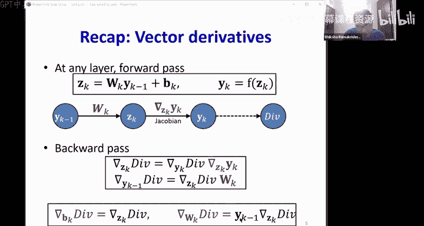
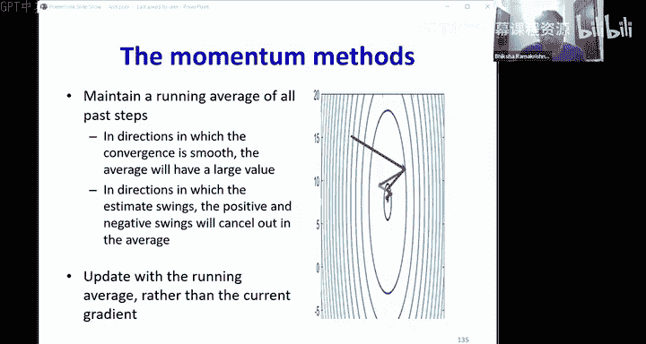

# 7：训练（第四部分）🚀

在本节课中，我们将继续探讨神经网络的训练。我们将分析梯度下降的收敛性，理解为何它可能无法找到最优解，并探讨一些改进训练过程的算法。

## 回顾：神经网络训练基础

上一节我们介绍了神经网络训练的核心概念。本节中，我们来看看训练过程中的收敛性问题。

神经网络是通用近似器，只要架构合适，它们可以模拟任何函数。我们通过指定架构、权重和偏置来训练网络，目标是**最小化训练集上的总损失**。

我们通过**经验风险最小化**来实现这一点。我们使用梯度下降的变体，并通过**反向传播**计算网络参数相对于误差的梯度。

以下是训练算法的核心步骤：
1.  初始化所有网络参数。
2.  在每次迭代中，遍历所有训练实例：
    *   在**前向传播**中，将训练实例通过网络。
    *   在**反向传播**中，计算梯度。
3.  计算所有训练实例的平均梯度。
4.  沿梯度的负方向调整所有参数。

## 梯度下降与分类误差

我们训练网络的最终目标通常是**最小化分类误差**。然而，分类误差是权重的一个**不可微函数**。因此，我们使用一个平滑、可微的**损失函数**（如交叉熵）作为代理。

**关键问题**：最小化这个可微的损失函数，是否总能最小化分类误差？

**答案**：不一定。以下是一个例子：
*   假设数据是线性可分的。
*   感知器学习规则（直接最小化分类误差）总能找到分离超平面。
*   基于梯度下降的方法（最小化代理损失函数）可能找不到分离解，特别是当存在少数“干扰”数据点时。

**为什么这可能是一件好事？**
*   感知器规则对异常值非常敏感，添加单个数据点可能导致解发生剧烈变化。它**过拟合**训练数据，具有**低偏差但高方差**。
*   基于反向传播的方法对少量数据点不那么敏感，它更倾向于一致性而非完美拟合。因此，它是一个**低方差估计器**，但可能以**引入一些偏差**为代价。

**结论**：反向传播训练出的神经网络分类器，通常比训练数据的最优分类器具有更低的方差。

## 损失函数的复杂性

之前的讨论假设损失函数具有单一的、可找到的全局最优解。但实际上，损失函数作为网络参数的函数可能非常复杂。

对于大型网络，损失函数可能包含：
*   **许多鞍点**：在某些方向是最小值，在其他方向是最大值。
*   **许多局部最小值**：梯度下降可能陷入这些小坑中。

梯度下降（通过反向传播计算梯度）可能会找到这些不理想的点，而非全局最小值。

## 分析收敛性：凸函数与二次函数

分析多层感知机的损失函数非常困难。因此，我们借助**凸优化**的理论来分析，这就像“在路灯下找钥匙”——我们分析我们能分析的部分。

**凸函数**是指，连接函数上任意两点的线段都位于函数图像上方或之上的函数。最简单的凸函数之一是**二次函数**。

我们选择分析二次函数，是因为在凸函数中，它们能以最清晰的方式引导我们到达最优点。

对于一个单变量二次损失函数：
`E(w) = (1/2) * a * w^2 + b * w + c` （其中 a > 0）

其最优解有闭式解：`w* = -b / a`。

使用梯度下降时，更新规则为：`w_{k+1} = w_k - η * E'(w_k)`。

通过泰勒级数展开分析可知，存在一个**最优步长（学习率）** `η_opt = 1 / a`（即二阶导数的倒数）。使用该步长，可以一步到达最优点。

**步长的影响**：
*   如果 `η < η_opt`：收敛缓慢。
*   如果 `η_opt < η < 2 * η_opt`：仍然收敛，但会在最优点附近振荡。
*   如果 `η > 2 * η_opt`：**发散**。

## 多变量情况与不同方向的步长问题

对于多变量二次函数（例如 `E(w1, w2) = (1/2)*a1*w1^2 + (1/2)*a2*w2^2 + ...`），其图像像一个椭圆碗。不同方向（参数）的曲率（二阶导数 `a1`, `a2`）不同。

每个方向都有自己的最优步长：`η_opt1 = 1/a1`, `η_opt2 = 1/a2`。

**问题**：在标准梯度下降中，我们对所有参数使用**相同的学习率** `η`。

**后果**：
*   如果 `η` 对于某个方向太大（`> 2 * η_opt_i`），该方向可能发散。
*   为了保证所有方向都不发散，`η` 必须小于 `2 * min(η_opt_i)`，即最小最优步长的两倍。
*   如果不同方向的最优步长差异很大（即条件数很大），那么为了稳定性，我们被迫使用一个非常小的 `η`，这会导致在其他方向上的收敛**极其缓慢**。

## 学习率调度与逃离局部最优

固定的、过小的学习率会导致收敛缓慢。但固定的、过大的学习率又会导致发散。然而，**发散并不总是坏事**。

在复杂的非凸损失函数中，我们可能**希望**初始时使用较大的学习率，以便有能量跳出较差的局部最小值或鞍点。随后，我们再逐渐减小学习率，以便最终稳定在一个（希望是更好的）局部最小值中。

因此，常见的实践是使用**学习率调度**：
*   **衰减策略**：学习率随迭代次数衰减（如按倒数、平方倒数或指数衰减）。
*   **分段常数衰减**：先以固定学习率训练直到损失平台期，然后将学习率乘以一个因子（如0.1）降低，继续训练，重复此过程。

## 改进算法：弹性传播 (RProp)

上述问题的根源在于对所有维度使用固定的学习率。**弹性传播 (RProp)** 算法通过为每个参数独立地自适应调整步长，释放了这一限制。

**RProp 核心思想**：
*   为每个权重维护一个独立的步长。
*   观察本次梯度与上次梯度的**符号**：
    *   如果符号相同（方向一致），说明可以加速，**增大**该权重的步长。
    *   如果符号相反（方向改变），说明可能 overshoot 了，**减小**该权重的步长并**回退**到上一步的值。
*   然后使用调整后的新步长继续更新。

以下是其简化流程：
1.  计算当前梯度。
2.  对于每个参数，比较当前梯度符号与上一次梯度符号。
3.  如果符号相同，则步长 `Δ = Δ * α` （α > 1，例如 1.2）。
4.  如果符号相反，则步长 `Δ = Δ * β` （0 < β < 1，例如 0.5），并且**取消**上一步的更新（回退）。
5.  无论符号如何，参数更新为：`w_{new} = w_{old} - sign(当前梯度) * Δ`。

RProp 是一个简单高效的一阶算法，对损失函数形状假设最少，在实践中通常比朴素梯度下降更快。

## 动量方法简介

另一种思路是**动量方法**。它通过维护一个过去梯度的**移动平均**（称为动量项）来更新参数。

**核心思想**：
*   在收敛顺利的方向，梯度符号一致，移动平均会累积增大，从而加速收敛。
*   在振荡的方向，正负梯度会相互抵消，移动平均变小，从而等效于减小了该方向的步长，稳定了更新。

参数更新规则类似于：`v_{k+1} = γ * v_k + η * ∇E(w_k)`， `w_{k+1} = w_k - v_{k+1}`。
其中 `v` 是动量项，`γ` 是动量系数（通常接近 0.9）。

动量方法能有效缓解振荡，加速训练，我们将在后续课程中详细讨论。

## 总结

本节课中我们一起学习了：
1.  **梯度下降的局限性**：最小化代理损失函数不一定最小化分类误差，但这能带来低方差的益处。
2.  **损失函数的复杂性**：存在鞍点和局部最小值，影响收敛。
3.  **收敛性分析**：通过二次函数模型，我们理解了学习率对收敛速度和稳定性的关键影响，以及不同方向需要不同步长的问题。
4.  **学习率调度**：使用衰减的学习率策略可以在早期逃离局部最优，后期稳定收敛。
5.  **改进算法**：介绍了 **RProp** 算法，它通过为每个参数自适应调整步长来加速训练。
6.  **动量方法**：简要介绍了通过梯度移动平均来稳定更新、加速收敛的思想。

这些知识为我们理解更高级的优化器（如 Adam）奠定了基础，并提供了调试和改善神经网络训练过程的实用见解。