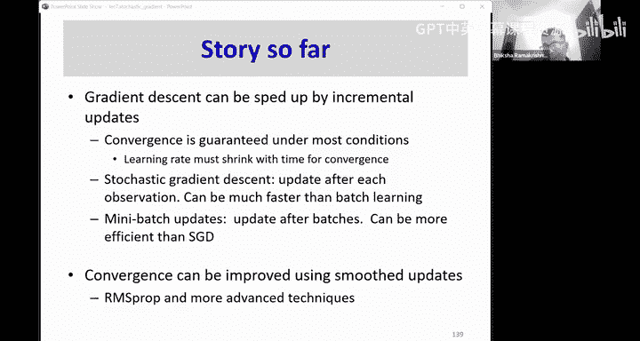

# 8：训练（第五部分）🚀

## 概述
在本节课中，我们将继续探讨深度神经网络的训练。我们将学习一种更高效的参数更新方法——增量更新，并深入了解其背后的原理和实现细节。接着，我们将重新审视优化算法，特别是动量方法及其改进版本，以理解它们如何帮助网络更快、更稳定地收敛。

---

## 增量更新

上一节我们介绍了使用梯度下降来最小化整个训练集上的总误差。本节中，我们来看看一种更高效的替代方案：增量更新。

在传统的批量更新中，我们需要处理完所有训练样本后才能进行一次参数调整。这就像试图用数千只手臂同时按压一块粘土，将其塑造成一个娃娃，这在计算上是低效的。

一个更实际的方法是像手工塑造粘土一样，一次只处理一个训练样本。以下是其工作原理：

*   **逐点调整**：我们选择一个训练点，根据该点的误差梯度对网络参数进行微小的调整。
*   **全局影响**：虽然每次调整只针对一个点，但由于网络参数是共享的，这个调整会轻微地影响整个函数在所有点的输出。
*   **多次遍历**：我们按随机顺序遍历所有训练样本，每个样本都触发一次参数更新。对整个数据集的一次完整遍历称为一个**周期**。在每个周期内，如果有 `T` 个样本，就会进行 `T` 次参数更新。
*   **防止循环**：为了避免参数更新在不同样本组之间来回振荡（例如，先调整左侧样本导致右侧出错，再调整右侧样本又导致左侧出错），**必须在每个周期随机打乱训练数据的顺序**。

这种每次只基于一个样本进行更新的方法，被称为**随机梯度下降**。

---

## 为什么SGD有效？数学视角

为了理解SGD为何有效以及其局限性，我们需要从数学上审视我们的目标。

我们真正想要最小化的目标是模型在整个输入空间上的**期望误差**。由于无法计算整个空间，我们使用训练集上的**平均误差**（经验风险）作为近似。这个经验风险是期望误差的一个**无偏估计**，这意味着从统计上看，最小化经验风险有助于最小化真实的期望误差。

然而，SGD每次只使用一个样本的误差梯度来更新参数。虽然单个样本的梯度也是真实梯度的无偏估计，但其**方差非常大**。方差大的原因是，不同的训练样本可能给出完全相反的方向建议（例如，一个样本说“函数值应该提高”，另一个样本说“函数值应该降低”）。这会导致参数更新路径非常不稳定，收敛到的解可能质量较差，且不同训练运行间的结果差异很大。

为了降低方差，一个自然的想法是：**为什么不使用一小批样本的平均梯度呢？**

---

## 小批量梯度下降

小批量梯度下降是批量更新和SGD之间的一个折中方案。它结合了两者的优点：

*   **工作原理**：每次更新时，随机选取一小批（例如32、64、128个）训练样本，计算这批样本上的平均损失梯度，并用这个平均梯度来更新参数。
*   **方差降低**：平均梯度 `g_batch` 的方差是单个样本梯度方差 `Var(g)` 的 `1/B` 倍（`B` 为批量大小）。公式表示为：
    `Var(g_batch) ≈ Var(g) / B`
    这意味着批量越大，更新方向越稳定，方差越小。
*   **效率与稳定性的平衡**：批量大小 `B` 存在一个“甜点”。`B` 太小（如SGD），方差大，不稳定；`B` 太大（接近全批量），每次更新计算成本高，且可能陷入尖锐的局部极小点。实践中，通常选择硬件内存能支持的最大批量大小。

小批量方法通常能获得接近批量更新的低方差和稳定性，同时保持SGD的更新速度和逃离不良局部极小点的能力。

---

## 优化算法进阶：平滑更新

在使用SGD或小批量方法时，损失曲面在不同方向上的曲率可能差异很大，导致优化路径像在峡谷中震荡前进，效率低下。上一节我们提到，可以通过考虑梯度的历史信息来平滑更新方向。本节我们将深入探讨这类方法。

### 动量法

动量法的核心思想是：**对历史梯度取指数加权移动平均，用这个平均方向来更新参数**。这有助于在梯度方向持续一致的维度上加速，而在梯度方向频繁变化的维度上阻尼振荡。

其更新规则如下：
`v_t = μ * v_{t-1} - η * g_t`
`θ_t = θ_{t-1} + v_t`
其中：
*   `v_t` 是当前的速度（动量）。
*   `μ` 是动量系数（通常设为0.9），控制历史梯度的影响。
*   `η` 是学习率。
*   `g_t` 是当前小批量的梯度。
*   `θ_t` 是模型参数。

这就像给优化过程增加了一个“惯性”，使其能够平滑地穿过梯度噪声较大或曲率不佳的区域。

### Nesterov 加速梯度

NAG是动量法的一个改进版本。它与普通动量法的区别在于**计算梯度的位置**：
1.  普通动量法：先计算当前参数 `θ_{t-1}` 处的梯度 `g_t`，然后结合动量进行更新。
2.  NAG：先根据历史动量“向前看”一步，得到一个临时参数 `θ_{temp} = θ_{t-1} + μ * v_{t-1}`，然后计算这个“未来”位置 `θ_{temp}` 处的梯度 `g_{temp}`，最后用这个梯度来修正更新方向。

其更新规则为：
`v_t = μ * v_{t-1} - η * ∇J(θ_{t-1} + μ * v_{t-1})`
`θ_t = θ_{t-1} + v_t`
直观上，NAG 能对梯度变化做出更灵敏的反应，从而在凸优化问题上具有更好的理论收敛性。

### RMSProp

动量法主要平滑了梯度（一阶矩）的方向。RMSProp 则关注于**自适应地调整每个参数的学习率**。其思想是：对于梯度幅度大的参数，降低其学习率；对于梯度幅度小的参数，提高其学习率。这通过维护一个梯度平方的指数加权移动平均来实现。

更新规则如下：
`E[g^2]_t = γ * E[g^2]_{t-1} + (1 - γ) * g_t^2`
`θ_t = θ_{t-1} - (η / √(E[g^2]_t + ε)) * g_t`
其中：
*   `E[g^2]_t` 是梯度平方的移动平均。
*   `γ` 是衰减率（通常为0.9）。
*   `ε` 是一个很小的数（如1e-8），防止除以零。
*   学习率 `η` 被每个参数的历史梯度幅度所缩放。

### Adam：动量 + RMSProp

Adam 算法结合了动量法和 RMSProp 的优点，它同时维护**梯度的一阶矩估计（均值）**和**二阶矩估计（未中心化的方差）**，并对其进行偏差校正，然后用于参数更新。

以下是 Adam 的核心步骤：
1.  计算梯度的一阶矩（均值）和二阶矩（平方）的指数移动平均：
    `m_t = β1 * m_{t-1} + (1 - β1) * g_t`
    `v_t = β2 * v_{t-1} + (1 - β2) * g_t^2`
2.  对一阶和二阶矩估计进行偏差校正（因为初始时刻它们被初始化为0）：
    `m̂_t = m_t / (1 - β1^t)`
    `v̂_t = v_t / (1 - β2^t)`
3.  使用校正后的矩估计更新参数：
    `θ_t = θ_{t-1} - η * m̂_t / (√(v̂_t) + ε)`

Adam 因其对超参数相对不敏感、通常能取得良好效果而成为深度学习中最流行的优化器之一。典型的超参数值为：`η=0.001`, `β1=0.9`, `β2=0.999`, `ε=1e-8`。

---

## 总结

本节课中我们一起学习了深度神经网络训练中的两个核心进阶主题：

1.  **增量更新策略**：我们从低效的批量更新，过渡到高效的随机梯度下降，并最终确立了**小批量梯度下降**作为实践中的标准。我们理解了其背后通过降低梯度估计方差来平衡效率与稳定性的原理。
2.  **自适应优化算法**：为了应对损失曲面的复杂地形和SGD的不稳定性，我们学习了一系列平滑和自适应更新技术：
    *   **动量法**：通过累积历史梯度来加速稳定方向并抑制振荡。
    *   **Nesterov 加速梯度**：动量法的改进，通过“向前看”来获得更精确的更新方向。
    *   **RMSProp**：自适应地调整每个参数的学习率，根据历史梯度幅度进行缩放。
    *   **Adam**：综合了动量法和 RMSProp 的优势，同时利用梯度的一阶和二阶矩信息进行自适应更新，是目前最广泛使用的优化器。

这些技术共同构成了现代深度学习训练工具箱的基础，使我们能够更快速、更稳定地训练出性能强大的神经网络模型。