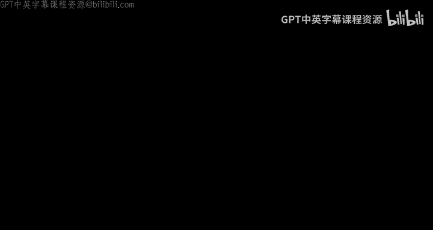
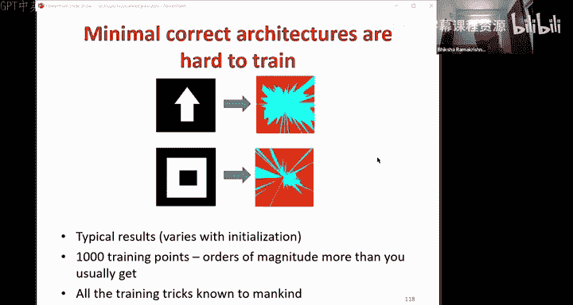
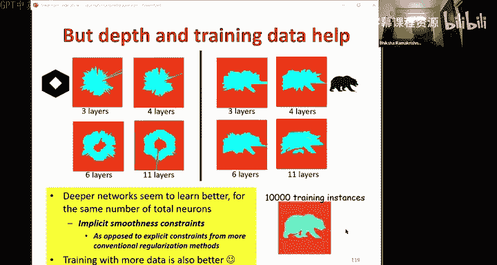
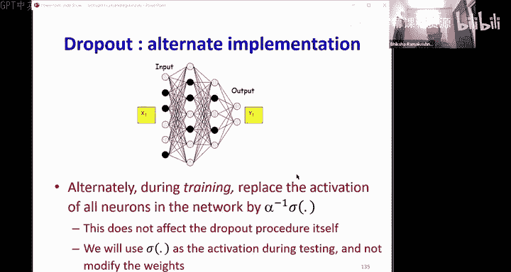
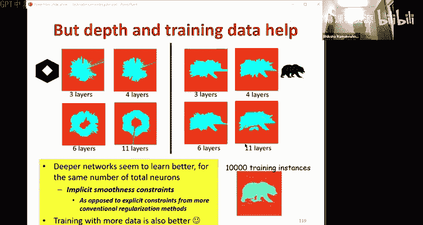
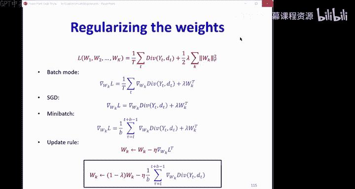

# 8：神经网络训练（第六部分）📚

在本节课中，我们将学习神经网络训练的最后一部分内容，涵盖泛化问题、训练技巧、损失函数、批归一化、正则化以及Dropout等核心概念。

---

## 概述 📋

到目前为止，我们已经学习了如何通过最小化损失函数来训练神经网络。损失函数是训练集上平均差异的近似值，我们使用梯度下降法来最小化它。我们可以使用批量更新或增量更新算法（如SGD或小批量梯度下降）来加速收敛。动量算法通过考虑梯度的长期趋势来平滑增量更新方法中的变化，从而实现更快更好的收敛。

接下来，我们将讨论一些泛化问题和训练技巧，包括损失函数、归一化、Dropout等。

---

## 损失函数的选择与影响 📉

上一节我们介绍了梯度下降和动量算法，本节中我们来看看损失函数的选择如何影响训练。

损失函数是整个训练点上平均差异的函数。梯度下降的收敛位置取决于损失函数，而损失函数又取决于差异函数。理想情况下，差异函数应具有能产生显著梯度的形状，并在正确方向上引导梯度下降。这意味着差异函数应该是平滑的，并且没有许多不良的局部最优解。

例如，如果一个差异函数在远离最优解时斜率很小，而在接近最优解时斜率很大，那么当远离最优解时收敛会很慢，而接近最优解时则会因为步长过大而反弹出去。最好的差异函数类型是在远离最优解时陡峭，在接近最优解时平缓（但不要太浅，最好是二次型）。

以下是几种流行的差异函数选择：

*   **L2差异（用于回归）**：如果你试图预测实数值，L2差异非常流行。对于标量预测，它是误差平方的一半；对于向量预测，它是各分量平方差之和的一半。公式为：`L2 = 0.5 * (y_pred - y_true)^2`（标量）或 `L2 = 0.5 * Σ(y_pred_i - y_true_i)^2`（向量）。
*   **KL差异（用于分类）**：如果你执行分类任务，通常使用KL差异。对于二分类（单个输出），公式为：`KL = -[d * log(y) + (1-d) * log(1-y)]`，其中 `d` 是期望输出（0或1），`y` 是实际输出。对于多类分类（输出为向量，期望是one-hot向量），公式为：`KL = Σ_i d_i * log(d_i / y_i)`。

即使在分类任务中，也有可能使用L2差异。那么为什么我们在执行分类时使用KL差异而不是L2差异呢？这是因为当我们观察损失作为网络权重（例如，逻辑回归前的线性项Z）的函数时，KL损失是一个漂亮的凸函数，而L2损失则呈现出非凸的“花朵”形状。L2差异相对于权重不是凸的，尽管两者都有唯一的全局最小值。因此，对于分类任务，KL差异是更好的选择。

另一个要点是，在回归网络（使用L2损失和最终的线性层）或分类网络（使用softmax和交叉熵）这两种最流行的网络中，损失相对于最终线性项（Z）的梯度都恰好是期望输出和网络输出之间的简单误差。这就是反向传播通常被称为误差反向传播的原因，因为我们反向传播的正是这个误差。

---

## 批归一化（Batch Normalization）⚙️

我们通常使用小批量进行训练。当我们使用小批量更新模型参数时，其背后的假设是每个小批量的总体分布与整体数据的分布相似。然而在现实中，特别是在神经网络内部数据发生偏移的某些奇怪位置，它们可能并不相似，甚至可能彼此相距甚远。

我们希望将所有小批量移动到空间的同一区域。实现方法之一是首先将每个小批量的数据移动到原点（通过减去该小批量的均值），然后进一步标准化（通过除以每个分量的标准差）。这样，每个小批量都被中心化并归一化了方差。这个将每个小批量归一化并移动到公共位置的过程称为**批归一化**（实际上是“小批量归一化”）。

我们通常将其应用于任何位置，特别是在进入激活函数之前的线性项（Z）上，并且对网络中的每个神经元独立进行。

### 批归一化的操作 🛠️

在一个典型的神经元中，我们首先计算线性项 `Z = sum(inputs) + bias`，然后将其通过一个激活函数。批归一化发生在线性项计算之后、进入激活函数之前。它将线性项 `Z` 转换为 `Z_hat`。

具体操作如下：
1.  计算整个小批量 `Z` 的均值 `μ_B` 和方差 `σ_B^2`。
2.  对每个 `Z` 进行归一化：`U = (Z - μ_B) / sqrt(σ_B^2 + ε)`，其中 `ε` 是一个防止除零的小常数。
3.  随后，对每个归一化的值进行缩放和移位：`Z_hat = γ * U + β`。其中 `γ`（缩放因子）和 `β`（移位项）是可学习的参数，它们将数据移动到新的标准位置。

这个过程可以写作：`Z -> (归一化) -> U -> (缩放和移位) -> Z_hat -> 激活函数`。

### 批归一化的反向传播 🔄

在常规训练中，小批量损失是各个训练实例差异的平均值，损失相对于任何参数的导数就是各个实例导数相对于该参数的平均值。

但在批归一化中，情况变得复杂。任何神经元的输出（正在进行批归一化的地方）不仅取决于该小批量的那个实例，还取决于整个小批量的均值和方差。因此，每个实例的差异不仅取决于单个输入 `x`，还取决于整个小批量。这意味着我们不能使用简单的规则来计算差异的导数。

为了计算损失相对于任何原始 `Z_i` 的导数，我们必须考虑所有归一化后的值 `U_j`，因为每个 `Z_i` 都通过影响均值和方差来影响每一个 `U_j`。因此，我们需要使用分布式链式法则：`∂Loss/∂Z_i = Σ_j (∂Loss/∂U_j) * (∂U_j/∂Z_i)`。

通过仔细推导依赖图（每个 `Z` 影响均值 `μ`，所有 `Z` 和 `μ` 影响方差 `σ^2`，每个 `U` 受其自身 `Z`、`μ` 和 `σ^2` 影响），我们可以得到 `∂U_j/∂Z_i` 的公式。当 `j = i` 时，有三项贡献（直接路径、通过 `μ` 的路径、通过 `σ^2` 的路径）。当 `j ≠ i` 时，有两项贡献（通过 `μ` 的路径、通过 `σ^2` 的路径）。将这些公式代入，就能得到损失相对于 `Z_i` 的导数，尽管公式看起来复杂，但借助依赖图很容易推导。

一个重要的启示是：**如果小批量中的所有实例几乎相同，那么损失相对于 `Z` 的导数将变为零，反向传播会在此停止**。因此，为了让批归一化有效工作，小批量中需要具有多样性。

### 推理阶段的批归一化 🤔

在训练时，我们使用每个小批量的统计量（均值和方差）。但在推理时，我们通常处理单个实例，没有小批量来计算 `μ` 和 `σ^2`。解决方法是在模型完全训练后，将训练数据全部通过模型，计算每个小批量的均值和方差，然后对它们取平均（更实际的做法是使用运行平均值）。在推理时，就使用这些全局平均统计量来进行归一化。

批归一化通常能提高收敛速度和网络性能。有经验证据表明，批归一化可以消除对Dropout的需求（我们稍后讨论）。为了从批归一化中获得最大收益，通常需要增加学习率，并且学习率衰减可以更快，因为数据通常保持在激活函数的高梯度区域。

---

## 正则化与泛化 🛡️

我们试图从少量训练实例中学习一个函数，并希望模型在拟合这些训练实例后，也能很好地拟合整个函数。但问题是，没有什么能阻止我们的模型仅仅过拟合训练数据，产生非常曲折、不光滑的决策边界。

为什么会发生这种情况？因为网络中的每个感知器（例如使用Sigmoid激活函数）都能够通过调整其权重参数 `w` 变得非常陡峭，类似于阶跃函数。当权重 `w` 的幅度很大时，Sigmoid函数会变得非常陡峭，从而允许网络学习到这种不期望的、不平滑的函数。

为了防止这种情况，我们需要约束权重 `w` 不要变得太大。这样，单个感知器就不会变得那么陡峭，最终会得到平滑的曲线。

### 权重衰减（L2正则化）⚖️

在常规训练中，我们有一个关于所有网络参数的损失函数，即整个训练数据的平均差异。我们最小化这个损失函数。

现在，除了常规损失，我们添加第二项：权重的平方范数的一半。这个增强的损失函数是：`L_total = L_data + λ * 0.5 * ||W||^2`，其中 `λ` 是一个超参数，控制我们对于保持权重较小的重视程度。

当我们最小化这个总损失时，自然也会最小化权重的平方范数，因为它现在是损失的一部分。

在批量训练、随机梯度下降或小批量更新的情况下，损失相对于权重的梯度都变成了原始差异梯度加上 `λ` 乘以权重矩阵本身。因此，更新规则变为：`W_new = W_old - η * (∇L_data + λ * W_old)`。这可以重新排列为：`W_new = (1 - ηλ) * W_old - η * ∇L_data`。

这被称为**权重衰减**。它所做的是在每次更新前，将当前权重乘以一个衰减因子 `(1 - ηλ)`，然后再进行梯度修正。这实质上是一种正则化，确保权重保持较小。

### 网络深度作为正则化 🏗️

平滑性也可以通过网络结构来施加。网络通常有很多层，每一层都在转换输入空间。如果从平坦的表面开始，每一层都会根据其权重矩阵重塑这个表面。事实证明，如果你从一个非常崎岖的表面开始，每经过一层，整体表面会变得不那么陡峭、不那么锯齿状。因此，对于给定数量的参数，更深的网络比浅层网络施加了更多的平滑性（正则化），因为每一层本身都会抑制网络中的一些锯齿状。

实验表明，在神经元总数相同的情况下，更深的网络（更多层，每层神经元更少）往往能学习到更平滑、更泛化的决策边界。另一种获得更好泛化的方法是使用更多的训练数据。

---

## Dropout：随机正则化 🎲

除了L2正则化，另一种非常有影响力的方法是**Dropout**。在介绍Dropout之前，需要了解**Bagging**的概念。Bagging是一种集成学习技术，它从训练数据中随机采样不同的子集，训练多个不同的分类器，然后对所有分类器的预测进行投票。理论表明，这种分类器集合比训练单个分类器能获得更好的泛化能力，因为它覆盖了更多的空间模式。

Dropout的思想类似于在神经网络内部进行Bagging。在训练期间，对于每个输入和每次迭代，以概率 `(1 - α)` 随机“关闭”（将输出置零）每个神经元。因此，对于任何特定的数据实例，实际使用的网络可能是原始网络的一个随机子集。每个训练实例都可能看到不同的网络子集。前向传播在这个子网络上进行，反向传播也在这个子网络上进行，并且只在该子网络中被激活的参数上累积梯度。

### Dropout的工作原理与解释 💡

Dropout效果很好的原因有两种解释：
1.  **集成学习视角**：一个具有 `n` 个神经元的网络，通过随机开关可以产生 `2^n` 个可能的子网络。Dropout相当于从这 `2^n` 个可能的网络中采样，并同时有效地训练所有这些网络。在推理时，你将对所有这些网络的输出进行集成平均。
2.  **防止协同适应视角**：在没有Dropout的情况下，网络可能学习到一种“偷懒”的路径，例如某一层只是简单地复制前一层的值，这相当于浪费了一层。使用Dropout后，由于神经元会随机被关闭，这种简单的复制路径无法一直工作，神经元被迫从侧边获取信息，从而学习到更稠密、更鲁棒的权重矩阵。

### Dropout的实现 🖥️

在训练阶段的前向传播中，对每个神经元运行一个伯努利随机数生成器（以概率 `α` 输出1，否则为0）来生成一个掩码（mask）。神经元的输出乘以这个掩码。在反向传播中，存储这个掩码，并将每个神经元的梯度乘以相同的掩码。

在推理阶段，理论上需要对所有 `2^n` 个子网络的输出取期望值，但这在计算上是不可行的。我们使用一个近似：整个网络的期望值近似等于每个神经元激活值的期望值所构成的网络。对于每个神经元，其输出是激活值乘以一个伯努利随机变量（以概率 `α` 为1）。因此，其期望值就是激活值乘以 `α`。

因此，在推理时，我们只需将每个神经元的激活值乘以 `α`。或者，我们可以将 `α` 因子乘入下一层的权重中，存储缩放后的权重，这样在推理时就可以直接使用常规的前向传播，而无需额外操作。另一种等效的工程实现是在训练时，只对那些未被丢弃的神经元的激活值乘以 `1/α`，然后在推理时直接使用常规激活值。

Dropout通常能显著提高模型的泛化性能，防止过拟合。已经出现了许多Dropout的变体，如Zoneout（随机选择的单元保持不变）、DropConnect（丢弃连接边而不是神经元）、Shakeout（随机缩放、添加噪声）等。

需要注意的是，将Dropout与批归一化结合使用通常效果不佳，因为Dropout会增加方差，而批归一化会减少方差，它们可能会相互抵消。

---

## 其他训练技巧与启发式方法 🧰

除了上述核心方法，还有一些其他常用的训练技巧：

*   **早停（Early Stopping）**：在训练集上持续训练时，训练损失可能会不断下降，但在一个单独保留的验证集上，损失或分类性能在某个点之后开始上升或饱和，这意味着模型开始过拟合。因此，我们会在训练过程中监控验证集性能，一旦性能开始恶化就停止训练，并使用此时的最佳模型。
*   **梯度裁剪（Gradient Clipping）**：尽管我们尽力避免，但损失函数的梯度有时会变得非常大（例如在非常陡峭的点）。如果使用这个巨大的梯度更新模型，会导致更新步长过大，训练不稳定。梯度裁剪是一种常见技术，当梯度的范数超过某个阈值（例如5）时，就将其裁剪到该阈值。
*   **数据增强（Data Augmentation）**：通过人工创建合成数据来扩充训练集。例如，在图像分类任务中，可以对原始图像进行旋转、翻转、缩放、添加噪声等变换，同时保持其标签不变。这能极大地帮助模型学习更鲁棒的特征。
*   **输入归一化（Input Normalization）**：在训练开始前，将整个训练数据归一化为零均值和单位方差。这相当于在输入层进行批归一化。
*   **参数初始化技巧**：如Xavier初始化、He初始化等，这些方法旨在使网络在训练初期保持稳定的梯度流。
*   **确保神经元多样性**：在训练开始时看起来相同的神经元，往往会保持相同。因此，我们需要确保在训练初期神经元是多样化的，以促进学习不同的特征。

---

## 总结 🎯

在本节课中，我们一起学习了神经网络训练的最后一系列主题：

1.  **损失函数**：L2损失适用于回归任务，KL（交叉熵）损失适用于分类任务。选择正确的损失函数对于获得凸的优化景观和有效的梯度传播至关重要。
2.  **批归一化**：通过归一化每个小批量的激活值来减少内部协变量偏移，加速训练并提高性能。它需要在训练和推理阶段进行不同的处理。
3.  **正则化**：为了防止过拟合，我们使用如L2正则化（权重衰减）等技术来约束模型复杂度，鼓励较小的权重，从而获得更平滑的决策函数。
4.  **网络深度**：更深层的网络架构本身可以提供一种隐式的正则化效果，促进更好的泛化。
5.  **Dropout**：一种随机正则化技术，通过在训练期间随机丢弃神经元，强制网络学习更鲁棒的特征，并可以解释为训练大量子网络的集成。
6.  **其他启发式方法**：包括早停、梯度裁剪、数据增强等，这些都是成功训练现代深度神经网络的重要组成部分。

训练神经网络既是一门科学，也是一门艺术。科学知识为我们提供了基础和工具，但真正的技能、直觉和实践经验才是达到完美效果的关键。希望本课程为你提供了坚实的理论基础，助你在实践中不断探索和精进。