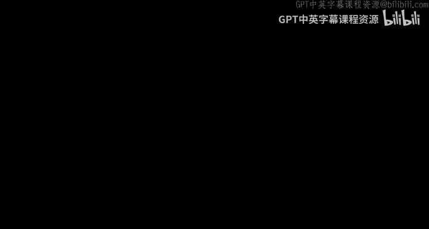
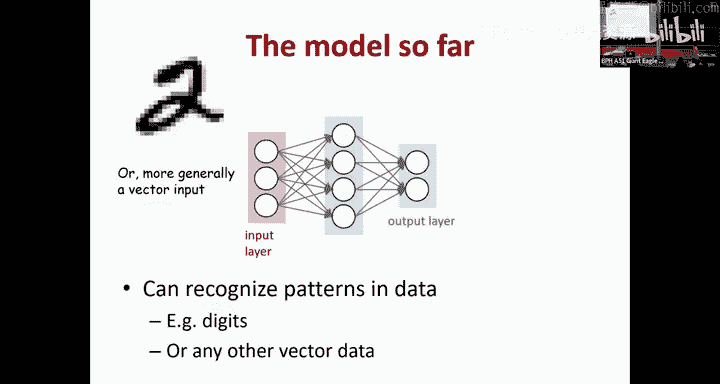
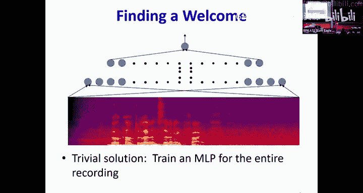
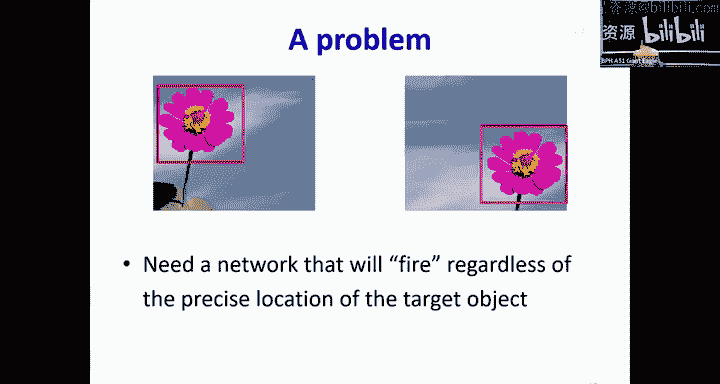
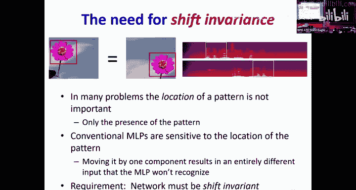
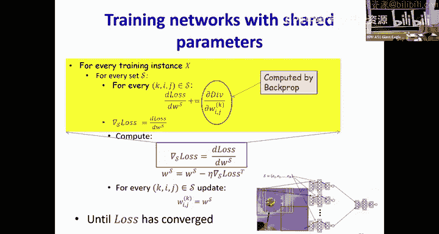
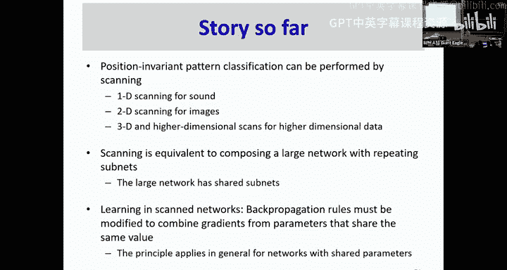
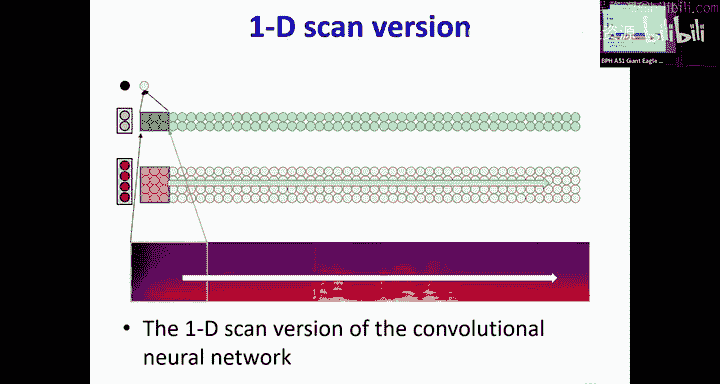
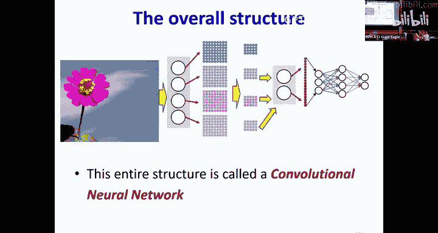

# 9：卷积神经网络（CNNs）第一部分 🧠

在本节课中，我们将要学习卷积神经网络（CNNs）的基本概念。我们将探讨为什么传统的多层感知机（MLPs）在处理图像或语音等数据时存在局限性，以及如何通过“扫描”和“参数共享”的思想来构建对位置变化不敏感、更高效的网络模型。我们将从直观的扫描概念入手，逐步推导出卷积操作，并理解其如何通过分层和参数共享来大幅减少模型参数和计算量。

---

## 从问题出发：位置不变的模式识别

到目前为止，我们已经看到多层感知机是通用的函数逼近器。它们可以建模布尔函数、分类器、回归器，并且可以通过梯度下降的变体进行训练。

然而，我们见过的所有模型都是这种类型：一层神经元连接到下一层神经元，再连接到更下一层。

现在有一个新问题。我给你一段语音录音，长度固定为半秒或一秒。我的问题是：这段信号中是否包含单词“welcome”？

一个显而易见的方法是将其转换为频谱图表示，就像你在作业一中做的那样。然后，直接在上面应用一个多层感知机。它可以读取整个频谱图，并应该能够告诉你单词“welcome”是否存在。

但是，假设我有两段录音。第一段录音中，单词“welcome”出现在前半部分。第二段录音中，同一个单词出现在后半部分。同一个网络会对这两个输入都产生“激活”吗？为什么不会？

答案是：不会。因为整个输入可以被看作一个向量。在第一种情况下，向量的一部分有数值（代表单词），其余部分是零。在第二种情况下，数值出现在向量的另一部分。这是两个完全不同的向量，它们位于不同的子空间中。在第一种情况下激活的网络，在第二种情况下不会激活。

我们希望有一个简单的网络，无论单词“welcome”出现在什么位置，只要它存在，网络就会激活；如果不存在，则不会激活。

图像检测也存在同样的问题。我们可以构建一个检测花朵的图像检测器。但是，一个训练用于在图片中检测花朵的MLP，如果它学会了在左上角检测花朵，那么当花朵出现在右下角时，它不一定能检测到，因为这两个数据点位于完全不同的子空间中。

我们需要一个网络，无论目标物体的精确位置在哪里，它都能激活。

在许多问题中，模式的位置并不重要，重要的是模式是否存在。而传统的MLPs对模式的位置是敏感的。即使将整个模式仅仅移动一个位置，也意味着它位于不同的子空间，网络就不会激活。我们想要一个对平移具有不变性的网络。

---

## 解决方案：扫描与参数共享

面对这个问题，你能想到的最简单的解决方案是什么？

一个简单的方案是：将数据增强到训练集中。我可以有花朵在左上角的图片，然后将其移动一个像素、两个像素……将花朵所有可能的位置变体都放入训练数据。但这个方法的问题是什么？数据量会急剧增加，并且能够学习所有这些变体的网络复杂度将非常巨大，你需要一个非常大的网络。

另一个解决方案是**扫描**。我可以构建一个网络，专门寻找大小与单词“welcome”大致匹配的模式。

然后，我在输入的初始位置运行它，接着进行扫描。在每个位置，它都会寻找单词“welcome”。这个网络会输出一个值，告诉你它是否在这些位置中的任何一个看到了“welcome”。

但我想要知道的是整个录音中是否有“welcome”。如何结合这些输出来判断呢？

一个简单的解决方案是使用一个 **`max`** 层。如果它在任何一个位置找到了“welcome”，那么至少有一个输出会很大，`max` 操作就会给出一个大的值。否则，`max` 值就会很小。或者，我可以用 `softmax` 替换 `max`，或者用一个MLP层。但基本思想是：我们实际上是在扫描输入。

这个过程的伪代码是什么样的？很简单：从左到右扫描，在每个位置，提取一个大致与“welcome”宽度匹配的输入片段，将其输入一个MLP。在每个位置得到一个输出，然后将所有这些输出传递给一个 `softmax`。

仔细观察，这看起来就像是一个巨大的网络。这个网络的特殊之处在于：它的下层是由许多**完全相同**的子网络构成的。最终层可以看作是一个大的MLP。

在二维图像中也是如此。我可以有一个花朵检测器，检测一个小矩形区域内的花朵。我扫描输入图像，最终，当我扫描完输入的每个位置后，我将所有输出集合通过一个 `max`、`softmax` 或一个完整的MLP。这仍然解决了同样的问题：告诉我图像中是否有花朵。

这里的关键组成部分是，在较低层有许多子网络，它们都是**相同的**。这是唯一的区别。因此，这个网络现在对平移具有不变性。

---

## 重新审视网络结构：垂直表示与计算重排

为了更清晰地表示，我将改变图示方式。传统的图示中，同一层内的神经元似乎存在时间顺序，这是不正确的。我将把它们垂直重画，以表明整个计算是同时发生的。

这是一个块，箭头表示一整组神经元完全连接到下一层的另一组神经元，所有计算都在一个“列”中同时发生。我将使用这种表示方式。

现在，让我们回到如何训练这个网络。这个网络正在解决一个问题：判断图片中是否有花朵，或录音中是否有“welcome”。之前的解决方案假设我们需要先训练一个花朵检测器（使用花朵大小框的正负样本数据），然后组合输出。但这真的必要吗？

**并不必要**。因为我们认识到，整个东西就是一个巨大的网络。既然它是一个巨大的网络，我就可以一次性训练它。我只需要提供包含花朵（或单词）的图片（或录音）和不包含的数据集。**我不会告诉模型花朵的确切位置**。它必须通过梯度下降自己学会底层的检测器。

关键区别在于，这是一个**参数共享网络**。所有下层子网络都有相同的参数集。同样，所有其他子网络也有相同的参数。因此，我们必须修改训练范式，以考虑参数相同这一事实。

这意味着，当我训练网络并执行反向传播时，如果我更新了某个子网络实例的参数，这个更新必须反映到所有其他副本上。每一个副本都必须复制对最低层子网络所做的任何更新。这样才能确保所有这些子网络是相同的。

---

### 参数共享的反向传播

为了理解参数共享如何工作，让我们考虑一个通用概念。你可以完全任意地决定，网络中的这个连接和那个连接将具有相同的值。这和我们刚才看到的特定结构无关。

假设你决定在这个网络中，这个连接和这个连接具有相同的值。这意味着存在一个公共值 **`W_s`**，它同时应用于 `W_ijk` 和 `W_lmn`。

那么，在训练时，任何时候我想要更新这个参数，另一个参数也必须被更新相同的量。更一般地说，这个公共值必须被更新，并且必须分配到所有复制该值的元素上。

现在，如果我画出影响图。这个公共值 `W_s` 影响 `W_ijk`，也影响 `W_lmn`，而两者都会影响损失函数。我们试图估计这个公共值 `W_s`，这意味着我们需要损失函数关于 `W_s` 的导数。

有两条路径到达 `W_s`。导数的公式是：沿着一条路径，损失函数关于 `W_ijk` 的导数，乘以 `W_ijk` 关于 `W_s` 的导数，再加上损失函数关于另一个权重的导数，乘以那个权重关于 `W_s` 的导数。

`W_ijk` 关于 `W_s` 的导数是什么？它就是1，因为 `W_ijk` 就是 `W_s` 的副本。同样，另一个权重关于 `W_s` 的导数也是1。

因此，损失函数关于这个公共共享值 `W_s` 的导数，**简单地等于损失函数关于各个共享该值的独立参数的导数之和**。

所以，在训练这个具有相同子网络的模型时，我真正需要做的就是向模型提供数据（正例和反例）。计算损失，然后，如果我想更新扫描网络中这个“红色”边的权重，意味着我也必须更新所有其他“红色”边（因为它们是同一个网络）。我会计算损失函数关于每一个“红色”边的导数，然后将它们**求和**。这个和就是我将用来更新这个红色边关联的权重值的导数。

对于任何一组共享参数，都是如此。

---

## 分布式扫描与卷积的引入

到目前为止，我们介绍了位置不变模式分类可以通过扫描输入来实现。一维扫描用于声音，二维扫描用于图像。扫描等价于构建一个具有相同子网络的大型网络。当在这些网络中学习时，必须修改反向传播规则，以聚合所有具有相同共享值的元素的导数。

现在，让我们更仔细地看看整个扫描是如何工作的。

这是我的网络，我使用垂直表示法来强调整个计算是同时完成的。如果这个网络分析图像的这一部分（记住，它是在扫描），第一层将生成输出（四个灰色圆圈），然后这四个输出被馈送到第二层，第二层的每个神经元生成其输出（两个绿色圆圈），接着第二层神经元馈送到第三层，生成最终输出。

这个计算在第一个位置完成，然后在第二个位置、第三个位置……依此类推。最终，所有最终层的输出被组合起来（通过 `max`、`softmax` 或 MLP），为整个输入做出决策。

现在，假设在计算时，第一层很着急，它不愿意等待第二层。它在后续层执行操作之前，就计算了整个输入的输出。然后，第二层才开始工作。第二层（以及网络的其余部分）接收第一层在第一个窗口的输出，并生成其输出。现在，顶部第一个位置的输出会与之前整个网络分析完该窗口再前进的情况不同吗？

**不会不同**。因为无论第一层是否等待，第二层操作的都是相同的四个值。输出不会因为计算顺序的改变而改变。

第二层也可以做同样的事情。第二层可以去扫描。它扫描的是什么？是输入还是第一层的输出？如果我将第二层的输出传递给第三层，那个输出会不同吗？仍然相同。

我们所做的只是重新排序了扫描，最终输出应该仍然相同。从代码的角度看更明显。

在伪代码中，我们最初是：从左到右扫描，提取一个片段，用MLP分析它，生成输出，当所有片段都被分析后，通过最终的 `softmax`。

但在每个片段内部，这个MLP片段做了什么？在那个蓝色补丁的位置，你经历了MLP的所有层，计算一个仿射项并通过激活函数。

如果我们观察所有有趣的事情发生的地方，会发现有一个 `if` 子句。这是因为只有第一层在查看一个窗口，而第二层只是查看前一层的单个输出列。但所有有趣的计算都发生在最内层的循环中。

因此，两个最外层循环（一个遍历时间/位置，一个遍历层）是可以互换的。如果我翻转这两个循环的顺序，不会改变最终输出，因为所有计算都在最内层循环中。

这基本上就是我们刚才所做的：我们只是改变了循环索引的顺序。

---

### 从整体扫描到逐层扫描

当我们以这种方式重新排序计算时，发生了什么？我们让第一层的每个神经元先去扫描整个输入，产生一个“映射图”（map）。这个映射图上的每个点，对应第一层神经元在输入的那个位置分析时产生的输出值。

如果整个网络想判断右下角是否有花朵，它需要查看第一层神经元在分析那个区域时产生的值。因为我将像素排列成与输入本身相同的形状，所以我只需要拾取该图像位置对应的激活值，并将它们传递给网络的其余部分。

然后，第二层神经元也可以继续以同样的方式扫描。第二层神经元现在查看所有第一层神经元产生的映射图。为了分析输入中的任何特定位置，第二层神经元从每个第一层神经元的映射图中读取一个值。然后，第二层神经元可以扫描整个输入，产生它们自己的映射图。

接下来，如果我想知道某个位置是否有花朵，下一层只需读取第二层神经元在分析该位置时产生的值。第三层神经元也可以做同样的事情：扫描第二层神经元的输出并产生自己的映射图，然后通过一个 `softmax`。

我们重新排序了计算，但最终输出仍然相同。

---

## 分布式模式检测与层次化表示

在非分布式扫描中，整个责任（寻找花朵大小的模式）都强加在第一层神经元上。第一层神经元检测的特征是整个花朵大小，这非常复杂。

当我们以分布式方式进行时，我们说：让第一层神经元寻找更小的东西，比如花瓣大小、萼片大小、花蕊大小。然后第二层神经元在位置上聚合这些信息，以做出决策，从而得到更大的模式。

这样，你将模式检测**分布到了多个层**。

现在，第二层神经元当然可以继续扫描。它们必须扫描所有第一层神经元产生的映射图，因为每个第一层神经元都在寻找不同的子特征。然后它生成输出。如果下一层神经元想判断左上角是否有花，它只需要查看第二层神经元在分析第一层映射图的这个区域时产生的元素。

这仍然是扫描，仍然是参数共享网络，只是有了更多的参数共享。

例如，第二层神经元查看第一层神经元映射图中的这9个元素。这9个元素中的每一个都是由第一层神经元扫描计算出来的。所以这就像有9个相同的神经元副本，每个都在查看图像的不同区域。因此，第二层神经元实际上读取了这27个值。

虽然第二层神经元有27个输入，但只有**三组**独特的参数集，因为所有“黑色”神经元（的权重）是相同的，所有“红色”神经元是相同的，所有“蓝色”神经元是相同的。所以整体网络仍然是一个参数共享网络，只是共享不仅发生在分析输入不同区域的子网络之间，而且在每个窗口内部也有额外的共享。

我可以将这个过程扩展到三层。第一层神经元查看输入中更小的区域并扫描。第二层神经元现在查看第一层神经元输出的小窗口。第三层神经元查看第二层神经元映射图的小窗口。这样，我将模式分布到了更多层。

分布式的一个关键点是：第一层神经元的输出必须排列成与输入相同的形状。只有这样，我才能查看一个“窗口”。同样，第二层神经元的输出也必须排列成相同的形状。因此，这种排列现在变得很重要。

从伪代码的角度看，分布式扫描实际上变得更简单。它只是说：在每一层的每个位置，从所有前一层神经元的映射图中提取一个小窗口，然后用这些值计算一个仿射项并通过激活函数。

这个扫描映射图、使用权重窗口的操作，就叫做**卷积**。因此，这整个网络被称为**卷积神经网络**。

在向量表示中，你提取一个来自每个映射图的小矩形段（形成一个二维立方体，即张量）。神经元计算的是这16个元素的加权和（即与一个2x2x4的权重集进行逐元素相乘，加上偏置，再通过激活函数）。

对于一维情况（如分析语音中的“welcome”词），原理相同。第一层神经元查看输入的一个小窗口。第二层神经元查看第一层神经元输出的一个窗口，这相当于查看了输入中一个更大的窗口。随着层数增加，每一层通过查看前一层输出的窗口，看到的原始输入区域越来越大。最终层将看到整个输入的一个很宽的区域。

这种结构在一维中通常被称为一维卷积网络，更传统的名称是**时延神经网络**。

---

## 为什么需要分布式？优势所在

为什么我们要费心进行分布式处理？有多个原因：
1.  **强制产生具有局部模式的层次化表示**，这更具泛化性。
2.  **需要更少的计算**。
3.  **需要少得多的参数**。

让我们逐一来看。

**层次化表示与局部模式**：回想之前我们想为“双五边形”构建分类器时，我们并没有让每个神经元都尝试计算一个双五边形。第一层神经元计算单个边，第二层神经元计算单个五边形，最终层组合五边形。我们将结构分布到许多层。为什么这样做？因为这给了你更强的表达能力。如果你想用更少的层来做，你将需要数量巨大的神经元。通过这种分布式方式，每一层查看来自前一层的简单模式，你实际上简化了整个问题，并使网络更简单。因此，分布式在学习和建模的网络参数效率方面是一件好事。

**更少的计算和参数**：让我们通过一个例子来看看。

假设我们有一个语音信号，变成了一系列频谱向量。每个黑色竖条代表一个D维向量。如果我想分析一个宽度为8个向量的输入窗口。

*   **非分布式扫描**：第一层查看8个输入，第二层查看第一层的输出，第三层查看第二层的输出。如果第一层有N1个神经元，第二层有N2个，第三层有N3个，参数数量为：第一层 `8 * D * N1`，第二层 `N1 * N2`，第三层 `N2 * N3`。总参数量大。
*   **分布式扫描**：不让一个神经元看8个输入，而是让第一层用大小为2的窗口扫描输入。然后第二层查看4个这样的输出。网络仍然一次查看8个输入，但这8个输入的窗口现在分布在了两层上。第一层参数：`2 * D * N1`。第二层参数：`4 * N1 * N2`（但注意，这里的4个“块”是相同的，所以是参数共享的）。第三层参数：`N2 * N3`。与非分布式相比，第一层的参数从 `8 * D * N1` 减少到了 `2 * D * N1`，有了显著的压缩。

此外，分布式还**节省计算**。当你在第一个窗口（8个输入）执行分析后，如果步进（stride）2个向量到下一个位置，你不需要重新计算整个网络。在非分布式扫描中，很多计算需要重做。而在分布式扫描中，由于较低层的块在相邻位置被重用，你可以复用之前位置已经计算过的许多值（例如，第一层的三个输出值在下一个位置是相同的，可以直接复用）。随着你分布到更多层，你可以在更深层也重用计算，从而大幅减少总计算量。

对于图像，节省更为显著。对于一个只有7个神经元的简单模型，如果不分布参数，会有1034个权重；分布后，只有194个权重，几乎减少了一个数量级。对于更大的模型，减少量可能达到几个数量级（例如从1亿减少到100万）。

---

## 卷积神经网络术语与结构

最后，我们来介绍一些术语和整体结构。

整个操作可以重新绘制为整个图像的映射图。每个神经元基本上是在扫描输入并绘制其检测图。第一层查看输入的小区域（例如检测花瓣、萼片）。第二层查看第一层输出的区域，将这些花瓣组合成花朵的更大子结构。第三层查看第二层的输出区域，获得花朵大小的模式。最后的感知器查看所有这些，以决定是否有花。

这种扫描在每个位置使用一组权重完成。这组