# 10：卷积神经网络（CNN）第二部分 🧠

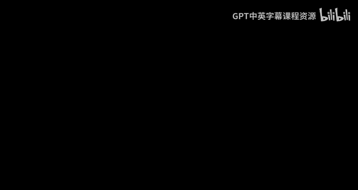

在本节课中，我们将学习卷积神经网络（CNN）的起源、其背后的生物学灵感，以及其核心组件的详细工作原理。我们将从哺乳动物视觉系统的研究开始，逐步理解CNN如何从这些生物学发现中演变而来，并最终成为一个强大的工程模型。

---

## 从猫的视觉到计算模型 🐱

上一节我们介绍了CNN作为“使用MLP进行扫描”的概念。然而，CNN并非起源于此，而是源于对人类和动物视觉感知机制的研究。

核心问题是：动物如何看见东西？从眼睛接收到的信号到最终识别物体，大脑经历了怎样的神经过程？长期以来，研究主要基于行为学，例如我们如何将不连续的片段组织成完整的物体（格式塔现象）。

1959年，Hubel和Wiesel进行了一项开创性研究。他们通过研究猫的初级视皮层（V1区）神经元的**感受野**，发现了视觉处理的关键机制。

*   **感受野**：指视网膜上能引起特定神经元反应的区域。
*   **研究发现**：他们发现神经元对**特定朝向的光缝**反应最强烈。不同神经元偏好不同的朝向（如水平、垂直、倾斜）。
*   **简单细胞与复杂细胞**：他们进一步区分了**简单细胞**和**复杂细胞**。
    *   **简单细胞**：直接响应视网膜上特定朝向的图案。
    *   **复杂细胞**：接收来自多个具有相似朝向的简单细胞的输入，其响应更具**位置不变性**，对噪声更鲁棒。

这项研究表明，视觉处理是分层的：从简单的边缘检测开始，通过层层组合，形成越来越复杂的图案感知。

---

## 从生物学到工程：认知机与Neocognitron 🧮

Hubel和Wiesel的模型存在局限性，例如难以解释**位置不变性**（例如著名的“詹妮弗·安妮斯顿神经元”或“祖母细胞”，它们无论目标出现在视野何处都会响应）。

1980年代，福岛邦彦提出了**Neocognitron**计算模型来模拟这一视觉层次结构。

*   **模块化结构**：模型由多个层级化的模块组成，每个模块包含**S细胞层**和**C细胞层**。
    *   **S细胞**：对应简单细胞，负责从上一层检测模式。**同一S平面内的所有神经元具有相同的权重（即相同的响应特性）**，但各自关注输入的不同区域。只有S细胞的权重是可学习的。
    *   **C细胞**：对应复杂细胞，负责“清理”S细胞的响应，通常通过对局部S细胞响应取最大值等操作来实现，从而引入一定的位置不变性。C细胞的操是固定的，无需学习。
*   **无监督学习**：福岛邦彦使用**赫布学习**规则来训练模型。当输入呈现大量模式（如手写数字）后，模型最深层的S细胞会自发地对不同的高级概念（如不同的数字）产生响应。

Neocognitron展示了如何通过无监督学习，从生物视觉机制中衍生出一个能识别语义概念的计算模型。

---

## 监督学习的引入：LeNet与CNN的诞生 🤖

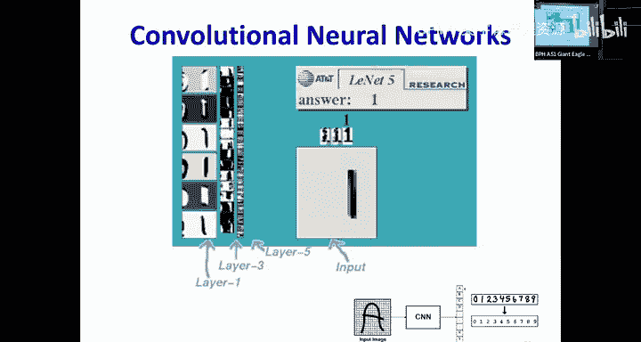

Neocognitron是无监督的。Yann LeCun等人为其引入了**监督学习**，从而诞生了现代卷积神经网络（CNN）。

LeCun对Neocognitron做了几项关键修改，使其更易于计算和训练：

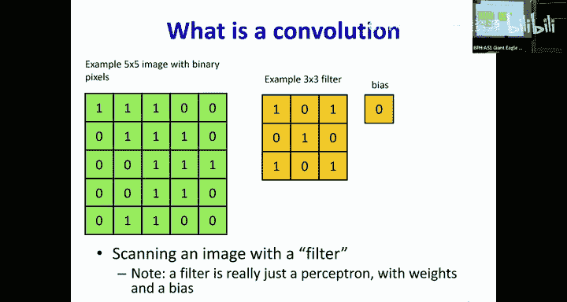

1.  **参数共享与扫描**：不再使用多个具有相同权重的S细胞副本，而是使用**一个神经元（滤波器）扫描整个输入**，这完全等价，但计算上更高效。
2.  **感受野形状**：将椭圆形的感受野改为更易处理的**正方形或矩形**。
3.  **下采样**：C细胞层的操作（如取最大值）通常会缩小特征图的尺寸，这被明确为**下采样**操作。
4.  **激活函数**：用更简单的**Sigmoid**等激活函数替换了复杂的响应函数。
5.  **监督信号**：在网络的最后添加了一个全连接层和Softmax分类器，并使用**反向传播算法**和带标签的数据来训练整个网络。

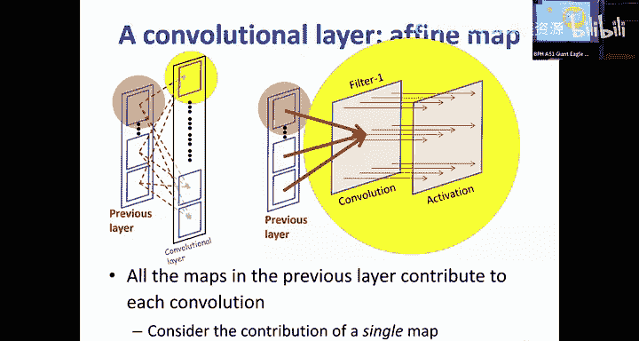

这就是著名的**LeNet**，最初用于邮政编码的手写数字识别（MNIST数据集），并取得了巨大成功。

---

## CNN核心组件详解 ⚙️

至此，我们得到了一个标准的CNN架构。它主要由两种类型的层交替堆叠而成：**卷积层**和**池化层**。

### 卷积层

卷积层对应Neocognitron中的S细胞层，是网络中进行特征提取的核心可学习部分。

*   **核心操作**：使用一组可学习的**滤波器**（或称为**核**）扫描输入。
*   **输入与输出**：输入通常是一个三维张量（高度 × 宽度 × 通道数）。每个滤波器也是一个三维张量（滤波器高度 × 滤波器宽度 × 输入通道数）。每个滤波器扫描整个输入后，会生成一个二维的**特征图**（或称**激活图**）。多个滤波器则产生多个特征图，堆叠起来成为新的三维输出。
*   **计算公式**：对于输出特征图 `(i, j)` 位置的值，其计算如下：
    `output[i, j] = activation( bias + ∑_m ∑_x ∑_y weight[m, x, y] * input[m, i+x, j+y] )`
    其中，`m` 遍历所有输入通道，`(x, y)` 遍历滤波器窗口，`activation` 是非线性激活函数（如ReLU）。
*   **参数共享**：同一个滤波器在扫描输入的不同位置时，使用的是**同一组权重**。这是CNN减少参数数量、引入平移等变性的关键。
*   **填充与步幅**：
    *   **填充**：在输入边缘添加零值，可以控制输出特征图的大小（通常用于保持尺寸不变）。
    *   **步幅**：滤波器每次移动的像素数。步幅为1是常见选择。**步幅大于1的卷积等价于步幅为1的卷积后接一个下采样操作**。

### 池化层

池化层对应Neocognitron中的C细胞层，其主要作用是引入一定程度的**平移不变性**并降低特征图的空间尺寸，从而减少计算量和参数。

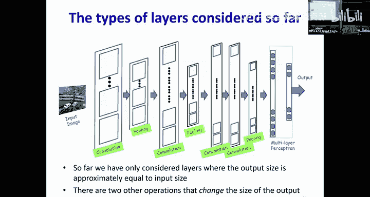

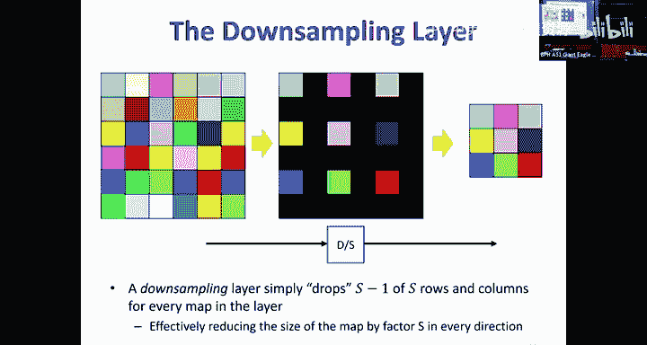

*   **核心操作**：对特征图上每个局部区域进行汇总统计。
*   **常见类型**：
    *   **最大池化**：取区域内的最大值。`output = max(window)`
    *   **平均池化**：取区域内的平均值。`output = mean(window)`
*   **操作细节**：池化操作通常分两步：1) 找到区域内最大值（或计算平均值）的**位置**；2) 传递该值。记录位置信息对于后续的**反向传播**至关重要。
*   **步幅**：池化层通常使用大于1的步幅，直接实现下采样。

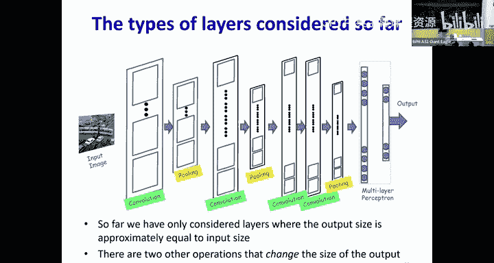

### 上采样与下采样

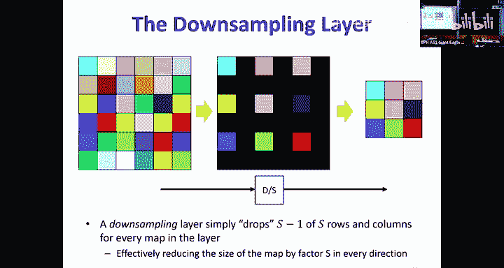

这是调整特征图空间尺寸的独立操作。

*   **下采样**：最简单的方法是**丢弃**每隔S-1行和列的数据。这通常与卷积或池化层合并，表现为其步幅大于1。
*   **上采样**：最常见的方法是**插入零值**。在行和列之间插入S-1行/列的零。**上采样通常后接卷积层**，让卷积操作来填充这些零值区域的信息。上采样后接池化层通常没有意义，因为零值会干扰池化操作。**分数步幅的卷积**等价于上采样后接标准卷积。

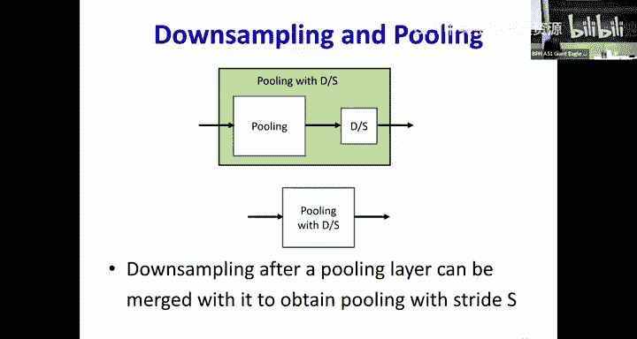

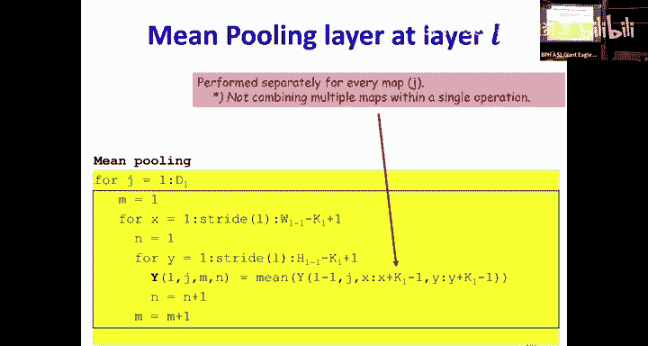

---

## 一个典型的CNN分类流程 🖼️➡️🔢

让我们看一个用于图像分类的典型CNN流程：

1.  **输入**：一张RGB图像（3个通道：红、绿、蓝）。
2.  **卷积块1**：
    *   使用 `K1` 个大小为 `L1 x L1` 的滤波器进行卷积。
    *   参数数量：`K1 * (3 * L1^2 + 1)` （每个滤波器有 `3*L1^2` 个权重和1个偏置）。
    *   经过激活函数（如ReLU），得到 `K1` 个特征图。
3.  **池化层1**：
    *   对每个特征图进行（例如）2x2最大池化，步幅为2。
    *   特征图尺寸减半，通道数仍为 `K1`。
4.  **卷积块2**：
    *   使用 `K2` 个大小为 `L2 x L2` 的滤波器进行卷积。注意，现在每个滤波器的深度必须与输入通道数 `K1` 匹配。
    *   参数数量：`K2 * (K1 * L2^2 + 1)`。
    *   激活后得到 `K2` 个特征图。
5.  **重复**：可以重复多个“卷积-池化”块。随着网络加深，特征图空间尺寸越来越小，但通道数（即滤波器数量）通常会增加，以保留信息。
6.  **展平与全连接**：将最后的特征图展平成一个长向量，输入到一个或多个全连接层中。
7.  **输出层**：最后一个全连接层输出每个类别的得分，通常通过Softmax函数转换为概率。

**关键设计考量**：为了避免信息丢失，当下采样（池化）减小空间尺寸时，通常需要增加通道数。例如，下采样使尺寸减半（面积变为1/4），那么将通道数增加4倍可以大致保持总信息容量。

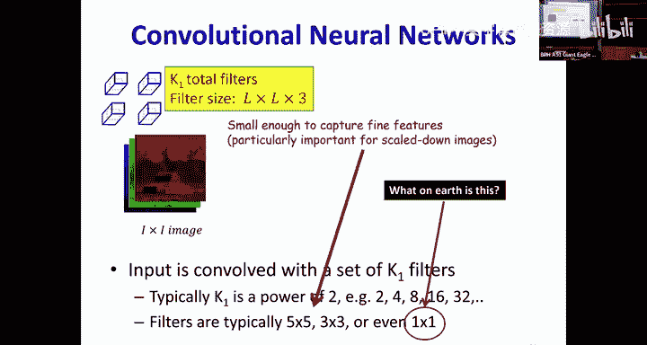

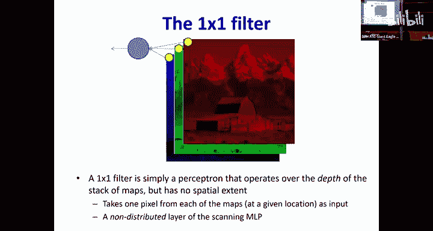

---

## 总结 📚

本节课中，我们一起学习了：

*   CNN的**生物学起源**，源于Hubel和Wiesel对猫视觉皮层的研究，以及简单细胞、复杂细胞的概念。
*   **Neocognitron**如何将生物模型转化为一个分层的、无监督的计算模型，并通过S细胞和C细胞的交替堆叠来学习复杂模式。
*   Yann LeCun如何通过引入**监督学习**、**参数共享扫描**和**反向传播**，将Neocognitron演进为现代**CNN**。
*   CNN的**核心组件**：**卷积层**（可学习的特征提取器）、**池化层**（引入不变性和下采样）以及**上/下采样**操作（显式控制特征图尺寸）。
*   一个典型的CNN图像分类**架构流程**，以及其中滤波器数量、尺寸、步幅等参数的设计思路。

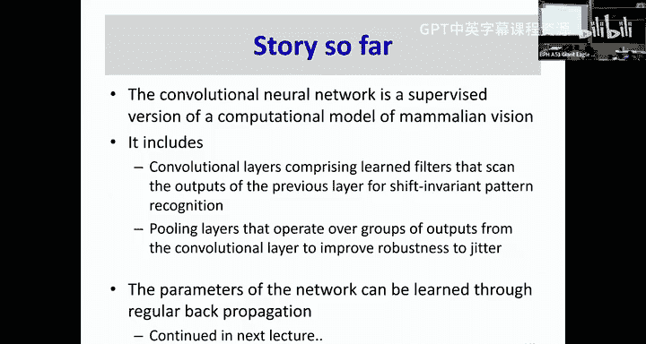

理解CNN的这些基础概念和设计原理，是后续深入学习其训练方法、现代变种（如ResNet, Transformer）以及在各种任务中应用的关键。下一节课，我们将探讨如何训练这些CNN网络。