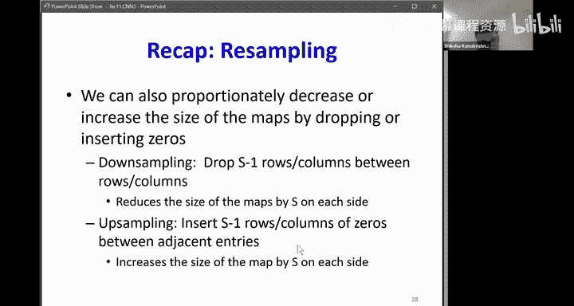
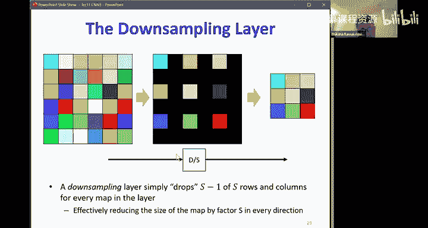
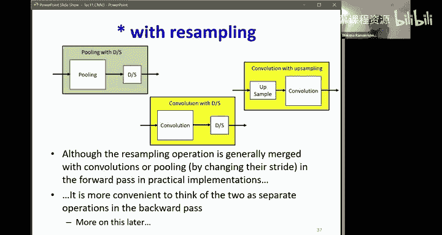
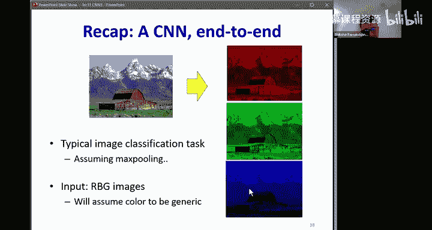
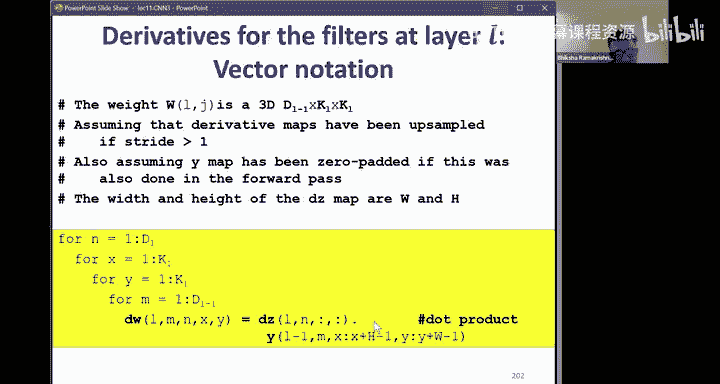
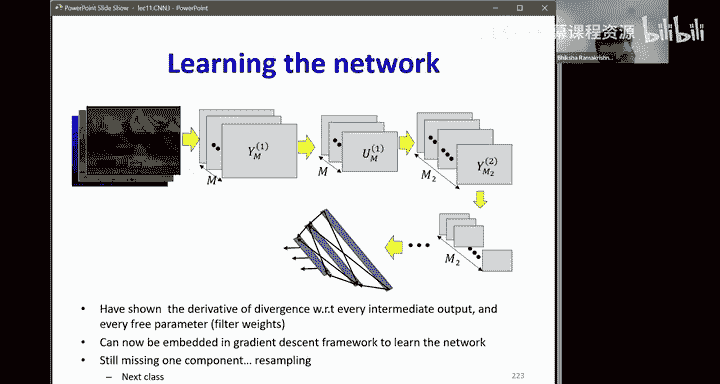

# 11：卷积神经网络（CNN）第三部分 🧠


在本节课中，我们将继续学习卷积神经网络，重点探讨如何通过反向传播算法来训练CNN。我们将学习如何计算卷积层和池化层中参数的梯度，这是优化网络权重、使其能够从数据中学习的关键步骤。

## 回顾：CNN架构

上一节我们介绍了CNN的基本架构。CNN由卷积层、可选的池化层以及一个或多个全连接层（MLP）组成。

在卷积层中，主要进行两个操作：
1.  **仿射图计算**：通过将前一层输出的特征图与一个滤波器进行卷积运算得到。
    *   公式：`Z[l][m] = Conv2D(Y[l-1], W[l][m]) + b[l][m]`
2.  **激活图计算**：对仿射图的每个元素应用非线性激活函数（如ReLU）。
    *   公式：`Y[l][m] = f(Z[l][m])`



每个滤波器会产生一个输出特征图。**滤波器的通道数等于输入特征图的通道数**，而**滤波器的数量等于输出特征图的数量**。



## 反向传播概述

训练CNN的目标是最小化损失函数，这通常通过梯度下降法实现。我们需要计算损失函数相对于网络中所有参数（主要是滤波器权重）的梯度。





反向传播的过程从网络的输出层开始，逐层向后计算梯度。对于CNN末端的全连接层，我们可以直接使用标准MLP的反向传播规则。因此，我们的核心任务是学会如何将梯度反向传播通过**卷积层**和**池化层**。

具体来说，我们需要解决以下问题：
*   对于卷积层：已知损失相对于**输出激活图** `Y[l]` 的梯度，如何计算损失相对于：
    1.  输入仿射图 `Z[l]` 的梯度？
    2.  前一层输入特征图 `Y[l-1]` 的梯度？
    3.  滤波器权重 `W[l]` 的梯度？
*   对于池化层：已知损失相对于**池化层输出**的梯度，如何计算损失相对于**池化层输入**的梯度？

接下来，我们将逐一解决这些问题。

## 卷积层的反向传播

### 步骤1：从激活图梯度到仿射图梯度

首先，我们已知损失 `L` 相对于第 `l` 层第 `m` 个通道激活图 `Y[l][m]` 的梯度 `∂L/∂Y[l][m]`。

根据前向传播公式 `Y[l][m] = f(Z[l][m])`，这是一个逐元素的非线性变换。因此，反向传播时，`Z[l][m]` 的梯度可以通过链式法则计算：

`∂L/∂Z[l][m] = (∂L/∂Y[l][m]) ⊙ f'(Z[l][m])`

其中 `⊙` 表示逐元素乘法，`f'` 是激活函数的导数。这是一个简单的逐元素操作。

### 步骤2：从仿射图梯度到输入特征图梯度

现在，我们有了损失相对于仿射图 `Z[l]` 的梯度 `∂L/∂Z[l]`。我们需要计算损失相对于前一层输入特征图 `Y[l-1]` 的梯度 `∂L/∂Y[l-1]`。

在前向传播中，每个输出特征图 `Z[l][n]` 都是由所有输入特征图 `Y[l-1][:]` 与对应的滤波器通道卷积后求和得到的。因此，每个输入特征图的元素会影响所有输出特征图的多个元素。

计算 `∂L/∂Y[l-1][m]`（第 `m` 个输入通道的梯度）需要**对所有输出通道 `n` 和所有空间位置进行求和**：

`∂L/∂Y[l-1][m] = Σ_n (∂L/∂Z[l][n] * ∂Z[l][n]/∂Y[l-1][m])`

其中，`∂Z[l][n]/∂Y[l-1][m]` 实际上就是第 `n` 个滤波器的第 `m` 个通道（记作 `W[l][n][m]`）。

**关键发现**：上述求和运算等价于一个卷积操作。具体来说，为了计算 `∂L/∂Y[l-1][m]`，我们需要：
1.  对于每个输出通道 `n`，取出对应的滤波器 `W[l][n][m]`。
2.  将该滤波器在水平和垂直方向上进行**翻转**（旋转180度）。
3.  将翻转后的滤波器与 `∂L/∂Z[l][n]` 进行**卷积**（通常需要对 `∂L/∂Z[l][n]` 进行零填充，以确保输出尺寸与 `Y[l-1][m]` 相同）。
4.  将所有输出通道 `n` 的卷积结果相加。

用公式简要表示为：
`∂L/∂Y[l-1] = Conv2D( zero_pad(∂L/∂Z[l]), flip(W[l]) )`

### 步骤3：计算滤波器权重的梯度

最后，我们需要计算损失相对于滤波器权重 `W[l][n][m]` 的梯度 `∂L/∂W[l][n][m]`。

在前向传播中，特定的滤波器权重 `W[l][n][m][i,j]`（位于第 `i` 行，第 `j` 列）会与输入特征图 `Y[l-1][m]` 中相应位置的窗口进行逐元素相乘，并贡献给输出特征图 `Z[l][n]` 的每一个元素。

因此，`∂L/∂W[l][n][m][i,j]` 需要对输出特征图 `Z[l][n]` 的所有空间位置 `(x,y)` 求和：

`∂L/∂W[l][n][m][i,j] = Σ_x Σ_y (∂L/∂Z[l][n][x,y] * ∂Z[l][n][x,y]/∂W[l][n][m][i,j])`

其中，`∂Z[l][n][x,y]/∂W[l][n][m][i,j] = Y[l-1][m][x+i, y+j]`。

**关键发现**：这个求和运算同样等价于一个卷积操作！为了计算整个滤波器 `W[l][n][m]` 的梯度，我们可以：

`∂L/∂W[l][n][m] = Conv2D( Y[l-1][m], ∂L/∂Z[l][n] )`

也就是说，直接将第 `m` 个输入特征图 `Y[l-1][m]` 与第 `n` 个输出仿射图的梯度 `∂L/∂Z[l][n]` 进行卷积，得到的结果就是滤波器 `W[l][n][m]` 的梯度。

## 池化层的反向传播

池化层（如最大池化或平均池化）没有需要学习的参数，但我们需要将梯度反向传播通过它。

### 最大池化 (Max Pooling)

在前向传播中，最大池化从每个局部窗口中选择最大值作为输出，并记录最大值的位置。

在反向传播中，梯度传递非常简单：
*   对于每个池化窗口，只有前向传播中被选为最大值的那个输入元素接收到了梯度。
*   因此，我们将输出位置的梯度 `∂L/∂Y_pool` 直接“分配”回前向传播中记录的那个最大值输入位置。
*   如果一个输入元素是多个不同池化窗口的最大值（例如，当步长小于池化核大小时），那么它接收到的梯度是来自所有相关窗口梯度的累加和。

伪代码示意：
```python
# 前向传播记录最大值位置
max_positions = argmax_over_windows(input)
# 反向传播
dinput = zeros_like(input)
for each output_position (x,y):
    dinput[ max_positions[x,y] ] += doutput[x,y]
```

### 平均池化 (Average Pooling)

在前向传播中，平均池化计算每个局部窗口内所有元素的平均值作为输出。

在反向传播中，梯度被均匀地分配回该窗口内的所有输入元素，因为每个元素对输出的贡献是相等的。

对于一个池化核大小为 `k x k` 的平均池化，每个输入元素接收到的梯度是输出梯度除以 `k^2`，然后累加到所有它贡献过的窗口位置上。

伪代码示意：
```python
# 反向传播
dinput = zeros_like(input)
for each output_position (x,y):
    window = get_input_window(x, y)
    dinput[window] += doutput[x,y] / (k*k)
```
这也可以看作是用一个元素值全为 `1/(k*k)` 的核与 `doutput` 进行卷积（并进行适当的填充和累加）。

## 实现技巧：利用前向传播代码



一个优雅的实现技巧是，反向传播的代码结构可以与前向传播镜像对称。核心规则只有两个：

1.  **对于非线性激活**：`dZ = dY * f'(Z)`
2.  **对于线性卷积（或全连接）**：若前向为 `Z = W * Y`，则反向时：
    *   `dY += W^T * dZ` （计算输入梯度）
    *   `dW += Y * dZ` （计算权重梯度）

在实现时，可以遍历与前向传播相同的循环，但顺序相反，并应用上述规则。这样，你甚至不需要显式地推导和记忆复杂的翻转卷积公式，代码会自动处理正确的索引映射。

## 总结

本节课中，我们一起学习了卷积神经网络（CNN）中核心的反向传播过程。

我们首先回顾了CNN的架构，明确了需要计算梯度的部分。然后，我们深入探讨了：
*   如何将梯度从卷积层的输出激活图反向传播到其输入仿射图。
*   如何进一步将梯度传播到前一层的输入特征图，这涉及到一个**与翻转滤波器卷积**的操作。
*   如何计算滤波器权重本身的梯度，这涉及到一个**输入特征图与输出梯度图卷积**的操作。
*   对于池化层，我们学习了最大池化和平均池化简单的梯度分配规则：最大池化将梯度传回最大值位置，而平均池化将梯度均匀传回窗口内所有位置。



理解这些梯度计算原理，是使用PyTorch、TensorFlow等深度学习框架有效构建和调试CNN模型的基础。这些框架的自动微分功能封装了所有这些复杂的计算，但了解其背后的机制能让我们成为更强大的实践者。

在下一节课中，我们将探讨CNN中的其他技术，如上/下采样（重采样）以及更现代的架构变体。