# 12：卷积神经网络（CNNs）第四部分 🧠

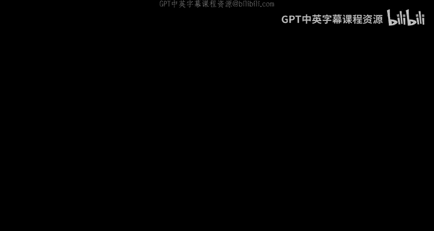

在本节课中，我们将完成关于卷积神经网络（CNNs）中反向传播的讨论，并探讨一些高级主题，如变换不变性、目标定位、深度可分离卷积以及CNN的历史与发展。我们将确保内容简单明了，适合初学者理解。

---

## 📚 概述

上一节我们介绍了如何通过卷积层和池化层进行反向传播。本节中，我们将首先快速回顾这些内容，然后深入探讨上采样和下采样层的反向传播规则。接着，我们将研究如何使CNN对旋转、缩放等变换具有不变性，以及如何利用CNN进行目标定位。最后，我们将了解深度可分离卷积等模型变体，并回顾CNN的发展历程。

---

## 🔙 反向传播回顾

在标准训练中，我们使用梯度下降法来优化模型参数，这需要计算损失函数对每个参数的梯度。对于每个训练样本，首先进行前向传播，计算网络输出与期望输出之间的差异（损失）。然后进行反向传播，将损失梯度从输出层逐层传回输入层。

对于卷积神经网络，我们需要处理两种特殊层：卷积层和池化层。

### 卷积层的反向传播

卷积层涉及参数共享。给定输出激活图的梯度，我们需要计算其对仿射项（卷积结果）的梯度，进而计算其对滤波器权重和上一层输入通道的梯度。

*   **从激活到仿射项**：激活图 `y` 是通过对仿射项 `z` 逐元素应用激活函数 `f` 得到的，即 `y = f(z)`。根据链式法则，损失 `L` 对 `z` 的梯度为：
    `dL/dz = dL/dy * f'(z)`
    这是一个逐元素的乘法操作。

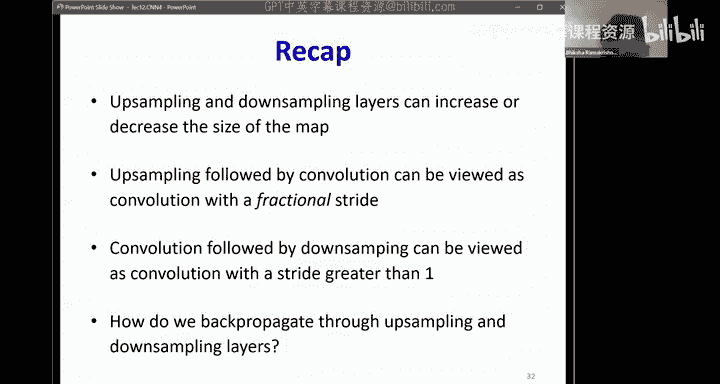

*   **从仿射项到滤波器和输入**：这是更复杂的部分。假设我们有第 `m` 个输入通道的梯度，我们需要计算损失对该通道的梯度。这涉及到使用第 `m` 个滤波器通道（因为只有它与第 `m` 个输入通道交互）与仿射项的梯度图进行卷积操作。具体来说，计算输入通道梯度时，需要将滤波器通道**翻转**（转置其所有维度），然后与零填充后的梯度图进行卷积。因此，这个操作常被称为**转置卷积**。

    计算第 `n` 个滤波器的梯度时，我们选取第 `n` 个输出通道的梯度图（因为该滤波器只计算这个输出），然后将其与所有输入通道进行卷积，从而得到该滤波器所有权重通道的梯度。

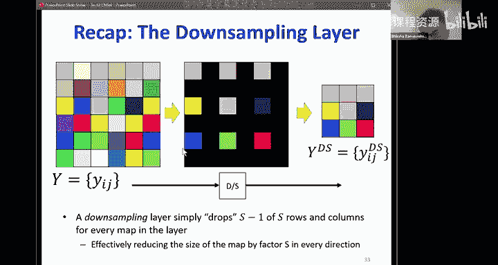

### 池化层的反向传播

池化层（如下采样）减少了特征图尺寸。

*   **最大池化**：在前向传播中，每个池化窗口只保留最大值。在反向传播时，梯度只传递给前向传播中被选为最大值的那个输入位置，其他位置的梯度为零。
*   **平均池化**：在前向传播中，输出是窗口内所有输入的平均值。在反向传播时，输出位置的梯度被均匀地分配回窗口内的所有输入位置。平均池化也可以看作是一种特殊的卷积操作（使用元素值均为 `1/k²` 的滤波器，其中 `k` 是窗口大小），因此其反向传播也遵循类似的卷积规则。

---

## ⬆️⬇️ 上采样与下采样层的反向传播

上采样和下采样层可以改变特征图的大小。理解它们的反向传播规则对于处理步长大于1的卷积或分数步长卷积至关重要。

### 下采样层的反向传播

下采样（如每隔一行一列取一个值）会丢弃一些输入元素。在前向传播中，被丢弃的元素对输出没有影响。

*   **梯度大小**：反向传播时，损失对层输入的梯度图大小必须与原始输入大小相同。
*   **梯度计算**：对于被保留下来的输入元素，其梯度直接等于输出对应位置的梯度（因为值是被直接复制的）。对于被丢弃（置零）的输入元素，其梯度为零，因为它们不影响输出。
*   **操作实质**：从操作上看，下采样层的反向传播就像是**上采样**——在输出梯度元素之间插入零行和零列，以恢复到输入大小。

### 上采样层的反向传播

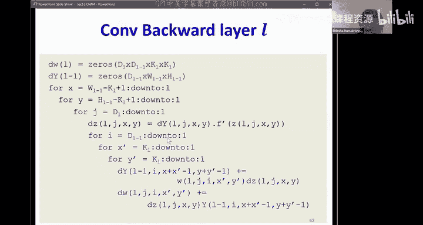

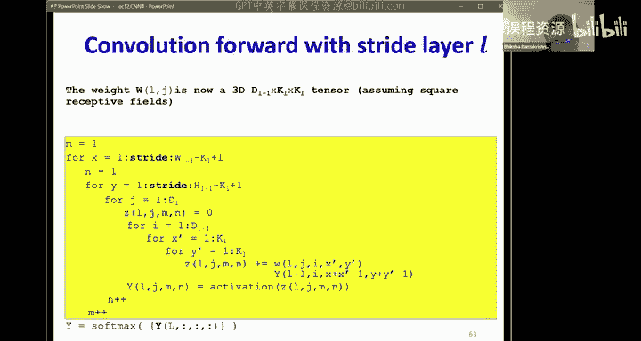

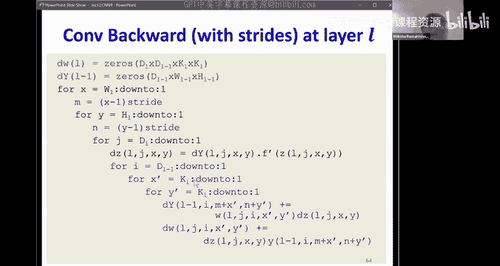

上采样（如插入零行零列）会增大特征图尺寸。插入的零值不是输入的函数。

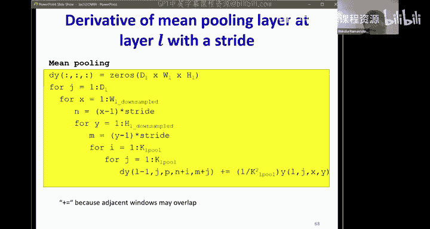

*   **梯度大小**：损失对层输入的梯度图大小与原始输入大小相同。
*   **梯度计算**：输出中由输入复制而来的位置，其梯度被直接复制回输入的对应位置。输出中由插入的零值构成的位置，其梯度对输入没有贡献，因此被忽略。
*   **操作实质**：上采样层的反向传播就像是**下采样**——从输出梯度中有选择地取出元素放回输入对应位置。

### 🎯 简化实现的关键洞见

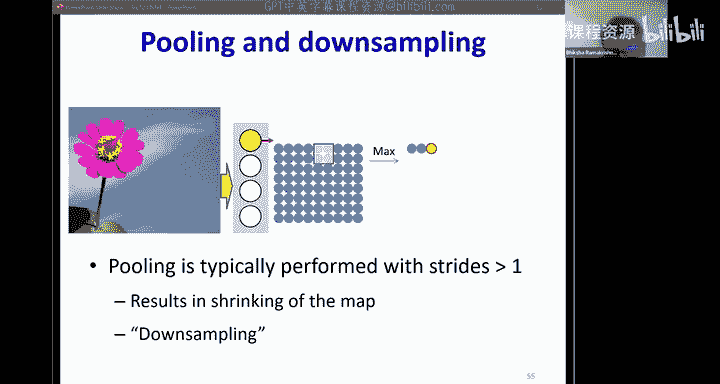

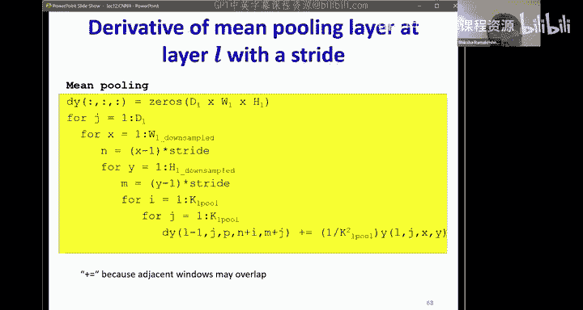

*   **步长大于1的卷积**：可以将其视为“标准步长为1的卷积”后接一个“下采样层”。这样，反向传播时先通过简单的下采样规则，再通过标准的卷积反向传播规则，比直接推导带步长的卷积反向传播公式更简单、不易出错。
*   **分数步长卷积（如步长0.5）**：可以将其视为“上采样层”后接一个“标准步长为1的卷积”。同样，这简化了反向传播的实现。
*   **带步长的池化**：可以视为“标准池化”后接“下采样”。分别处理这两个操作的反向传播更为简便。

**重要提示**：虽然概念上下采样的反向传播类似上采样，但由于边界效应（例如输入尺寸可能无法被下采样因子整除），不能直接使用同一个上采样层代码来实现反向传播，需要额外注意边界处理。

---

## 🔄 超越平移不变性：其他变换

标准CNN通过在不同位置共享滤波器权重来实现**平移不变性**。如果我们还希望网络对旋转、缩放等变换具有不变性，理论上可以这样做：

*   **方法**：对于每个基础滤波器，显式地创建其经过各种所需变换（如旋转45度、60度，缩放1.2倍等）后的多个副本。每个副本作为一个独立的通道，扫描输入。
*   **结果**：这样，无论目标图案如何变换，总有一个变换后的滤波器能与之匹配。
*   **局限性**：这种方法**不可扩展**。需要枚举所有可能的离散变换，导致参数数量和计算量急剧增加，且无法泛化到未枚举的变换。

**实际做法**：我们通常使用**数据增强**。在训练时，对输入数据随机施加各种变换（旋转、平移、缩放、翻转等），然后训练一个更大的标准CNN模型。模型通过接触大量变换后的样本，**学习**到对这些变换的鲁棒性，这是一种更可行且有效的方法。

---

## 📍 目标检测与定位

标准的分类CNN可以判断“图片中是否有花”，但无法指出“花在哪里”。位置信息其实存在于最后一个全连接层之前的**扁平化特征向量**中。

*   **定位原理**：这个特征向量编码了输入图像的空间信息。我们可以在此向量后接一个额外的子网络（例如另一个小型MLP），来预测目标的位置，通常表示为一个边界框的坐标 `(x, y, width, height)`。
*   **训练**：这需要多任务学习。训练数据不仅要有类别标签，还要有边界框标注。损失函数是分类损失（如交叉熵）和定位损失（如边界框坐标的L2损失或IoU损失）的加权和。
*   **应用**：此原理也可用于人体姿态估计，即预测关节点的坐标，然后连接成骨骼图。

---

## 🧩 模型变体：深度可分离卷积

为了进一步提升参数效率和计算效率，人们提出了深度可分离卷积。它将标准卷积分解为两个步骤：

1.  **深度卷积**：每个输入通道使用一个独立的二维滤波器进行卷积，产生与输入通道数相同的中间特征图。**滤波器权重在此步骤中所有输出通道间共享**。
2.  **逐点卷积**：使用 `1x1` 的卷积核，对上述中间特征图进行线性组合，以产生最终数量的输出通道。**此步骤的权重决定了不同输出通道的特性**。

**优势**：
*   **参数更少**：标准卷积参数约为 `N * M * K²`，而深度可分离卷积约为 `M * K² + N * M`（`N`：输出通道数，`M`：输入通道数，`K`：滤波器尺寸）。
*   **计算量更小**：大幅减少了乘加操作次数。

**核心思想**：将空间特征的学习（深度卷积）和通道组合的学习（逐点卷积）解耦，是参数共享思想的进一步延伸。

---

## 🏛️ CNN简史与影响

*   **开端（1989）**：Yann LeCun 提出的 LeNet-5 首次成功将CNN应用于手写数字识别，奠定了基础结构（卷积、池化、全连接）。
*   **复兴（2012）**：AlexNet 在 ImageNet 大赛上取得突破性胜利，将Top-5错误率从约25%大幅降至15.5%，震惊学界。它引入了 ReLU、Dropout、数据增强等关键技术，并证明了在大规模数据上训练深层CNN的可行性。
*   **快速发展**：随后涌现了 VGGNet（探索深度）、GoogLeNet（Inception 模块）、ResNet（残差连接解决深层网络梯度消失/爆炸问题，允许训练数百甚至上千层网络）、DenseNet（密集连接）等一系列重要工作，错误率持续快速下降。
*   **深远影响**：
    *   CNN 不仅是强大的视觉工具，其学到的特征表示具有语义信息，可用于图像检索等任务。
    *   CNN 的结构与哺乳动物视觉皮层处理信息的方式（从简单边缘到复杂物体）有惊人的相似性。
    *   CNN 的成功复兴了深度学习，其设计原则（局部连接、权重共享、层次化特征提取）深刻影响了后续其他架构（如用于序列处理的RNN、Transformer）。

---

## 📝 总结

本节课中，我们一起学习了卷积神经网络（CNNs）的收尾内容：

1.  **完成了反向传播**：详细分析了上采样和下采样层的梯度传播规则，并强调了通过分解操作（如将带步长卷积视为卷积+下采样）来简化实现的重要性。
2.  **探讨了变换不变性**：理解了理论上实现旋转/缩放不变性的方法及其局限性，以及实践中采用数据增强的可行性。
3.  **扩展了CNN应用**：学习了如何通过多任务学习，使CNN不仅能分类，还能进行目标定位和姿态估计。
4.  **认识了高效模型变体**：了解了深度可分离卷积如何通过解耦空间和通道维度的学习来大幅提升效率。
5.  **回顾了CNN历程**：从 LeNet 到 AlexNet 再到 ResNet，看到了CNN如何推动深度学习革命，并理解了其核心思想为何如此强大和持久。

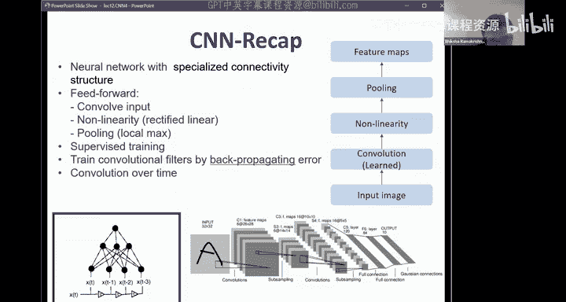

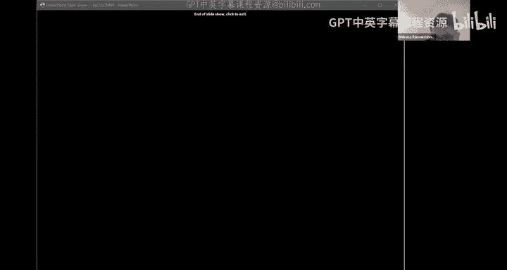

CNN 是深度学习的基石之一，其思想已广泛应用于图像、语音、文本等多个领域。从下一讲开始，我们将进入循环神经网络（RNNs）的世界。