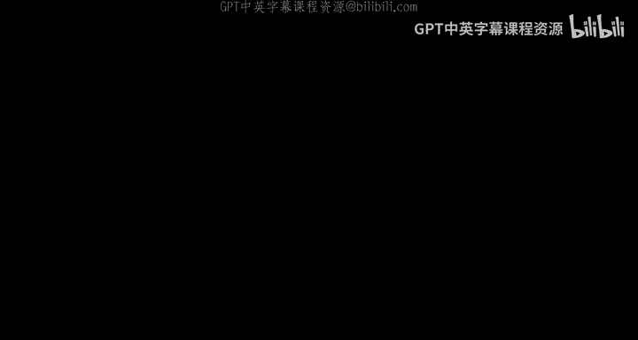
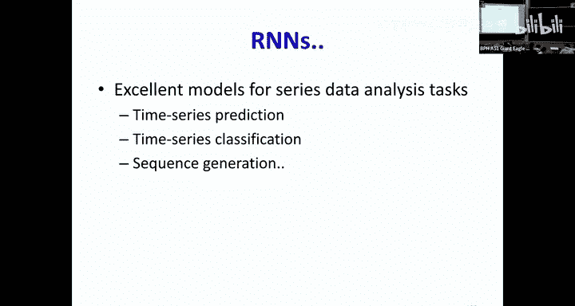

# 13：循环神经网络（RNNs）第一部分 🧠



在本节课中，我们将要学习循环神经网络（RNNs）的基本概念。我们将探讨为什么在处理序列数据（如语音、文本或时间序列）时，传统的多层感知机（MLPs）和卷积神经网络（CNNs）存在局限性，并介绍如何通过引入“记忆”或“状态”来构建能够分析整个输入序列的模型。

---

## 概述：从静态输入到序列分析

我们之前已经学习了多层感知机（MLPs）如何分析静态输入，以及卷积神经网络（CNNs）如何扫描模式。然而，许多现实世界的问题需要我们考虑一系列输入来产生输出，而这个输出本身也可能是一个序列。

例如，在语音识别中，我们需要分析整个频谱向量序列来决定是否包含某个词。在情感分析中，我们需要阅读整个句子来判断其情感倾向。在股票市场预测中，我们需要分析过去多天的指数模式来决定今天是否投资。

这些问题都属于分类和预测问题，其特点是考虑一个输入向量序列，并产生一个或多个输出。这本质上是一个函数计算问题，而函数可以用神经网络来建模。

---

## 有限记忆与无限记忆

上一节我们介绍了处理静态模式的基本网络。本节中，我们来看看如何处理随时间变化的序列模式。

一种直观的方法是使用时间延迟神经网络（TDNN），它本质上是一个卷积神经网络（CNN）。这种网络在每一天，都会查看当前输入以及过去几天的输入，然后基于这个模式做出决定。

**公式表示：**
`输出(t) = 函数(输入(t), 输入(t-1), ..., 输入(t-N))`

然而，这是一个**有限响应系统**。发生在某一天的事件只会影响未来有限时间（N天）内的输出。对于需要捕捉长期趋势（如周趋势、月趋势、季节性趋势）的任务（如股票市场），这显然不够。

我们想要的是一个**无限响应系统**，即今天发生的事情应该能够永远影响未来的输出。但简单地增加输入窗口（例如，回顾过去10年的数据）会导致参数数量爆炸式增长，这是不现实的。

---

## 引入递归：从输出反馈到状态记忆

为了获得无限记忆而不需要无限参数，我们需要引入递归的概念。

### 非线性自回归外生模型（NARX）

一个简单的想法是：让当前时刻 `t` 的输出不仅依赖于当前输入 `X(t)`，还依赖于上一个时刻的输出 `Y(t-1)`。

**公式表示：**
`Y(t) = 函数( X(t), Y(t-1) )`

这被称为NARX网络。它是一个无限响应系统，因为 `t=0` 时刻的输入会影响 `Y(0)`，而 `Y(0)` 又会影响 `Y(1)`，如此循环下去，影响会持续传播。

在这种模型中，**关于过去的所有“记忆”都存储在输出序列中**，网络内部本身并没有一个变量来记录它已经处理了多长的序列。

### 早期递归网络：乔丹网络与埃尔曼网络

为了将“记忆”内化到网络本身，研究人员引入了显式的记忆变量。

*   **乔丹网络**：引入一个记忆单元 `μ`，它简单地存储所有过去输出的运行平均值。
    *   **公式表示**：`μ(t) = α * μ(t-1) + β * Y(t-1)`
    *   隐藏状态 `H(t)` 依赖于当前输入 `X(t)` 和记忆 `μ(t)`。
    *   **局限性**：在训练时，误差导数在记忆单元处停止反向传播，无法追踪远期事件的影响。记忆本质上是输出的副产品。

*   **埃尔曼网络**：不再使用输出，而是将上一时刻的隐藏状态 `H(t-1)` 复制到一个“上下文单元”，并作为当前时刻的额外输入。
    *   **公式表示**：`H(t) = 函数( X(t), H(t-1) )`
    *   **局限性**：虽然隐藏状态看起来携带了信息，但在训练时，上下文单元是被“克隆”的，误差导数同样不会通过它反向传播到更早的时间步。因此，它被称为**部分递归网络**。

这两种早期模型的共同问题是：网络内部没有真正能够学习并传播长期依赖关系的记忆机制。

---

## 真正的解决方案：状态空间模型（循环神经网络）

真正的突破来自于状态空间模型，也就是我们现在所说的**循环神经网络（RNN）**。

其核心思想是：网络拥有一个**隐藏状态 `H(t)`**，这个状态是网络的“记忆”。在每一时刻 `t`：
1.  新的隐藏状态 `H(t)` 由当前输入 `X(t)` 和上一时刻的隐藏状态 `H(t-1)` 共同决定。
2.  输出 `Y(t)` 则由当前的隐藏状态 `H(t)` 决定。

**核心公式：**
```
H(t) = 激活函数( W_ih * X(t) + W_hh * H(t-1) + b_h )
Y(t) = 输出函数( W_ho * H(t) + b_o )
```
其中：
*   `W_ih`：连接输入到隐藏层的权重（当前权重）。
*   `W_hh`：连接上一时刻隐藏状态到当前时刻隐藏层的权重（循环权重）。
*   `W_ho`：连接隐藏层到输出的权重。

现在，网络内部的状态 `H(t)` 明确地总结了所有过去输入的信息。这是一个**完全递归网络**，因为误差导数可以通过 `W_hh` 这条路径，从当前时刻一直反向传播到序列的起始点，从而能够学习长期的依赖关系。

---

## 训练循环神经网络：随时间反向传播（BPTT）

训练RNN在概念上并不神秘。将RNN按时间步展开后，它就变成了一个非常深的、但**权重共享**的前馈神经网络。

**关键点：**
*   **输入**：一个序列 `[X(1), X(2), ..., X(T)]`。
*   **目标输出**：一个对应的序列 `[Y_target(1), Y_target(2), ..., Y_target(T)]`。
*   **网络输出**：网络会产生一个序列 `[Y(1), Y(2), ..., Y(T)]`。
*   **损失函数**：我们需要最小化网络输出序列和目标序列之间的差异（损失）。这个损失通常是各时间步损失的总和，但本质上衡量的是两个序列的整体差异。

训练算法称为**随时间反向传播（Backpropagation Through Time, BPTT）**，其步骤可概括为：
1.  **前向传播**：将整个输入序列按时间步输入网络，计算所有时刻的隐藏状态和输出。
2.  **计算损失**：计算网络输出序列与目标序列之间的总损失。
3.  **反向传播**：
    *   从最后一个时间步 `T` 开始，计算损失对输出 `Y(T)` 的梯度。
    *   将这个梯度通过网络反向传播，计算对权重 `W_ho`，`W_hh`，`W_ih` 以及各时刻隐藏状态的梯度。
    *   **关键**：由于权重是共享的（例如，连接 `H(1)->H(2)` 的 `W_hh` 和连接 `H(2)->H(3)` 的 `W_hh` 是同一个矩阵），所以在反向传播时，**来自不同时间步对同一权重的梯度必须累加（求和）**。
4.  **参数更新**：使用累积的梯度更新所有权重参数。

BPTT使得网络能够学习到“某个遥远过去的事件如何影响当前输出”，从而捕捉长期依赖。

---

## 双向循环神经网络（Bi-RNN）

到目前为止，我们介绍的RNN都是**单向的**，即 `H(t)` 只依赖于过去 `(X(1)...X(t-1))` 和当前 `X(t)` 的信息。这对于股票预测等任务很合适，因为无法预知未来。

但在许多任务中，整个输入序列是已知的（如机器翻译、词性标注），当前时刻的输出可能同时依赖于其上下文（左边和右边的信息）。例如，判断“red”是形容词还是名词，需要看它后面跟着的是“car”还是“Carpenter”。

**双向RNN** 通过组合两个独立的RNN来解决这个问题：
1.  **前向RNN**：从左到右处理序列，计算前向隐藏状态 `H_forward(t)`，它编码了到时刻 `t` 为止的过去信息。
2.  **后向RNN**：从右到左处理序列，计算后向隐藏状态 `H_backward(t)`，它编码了从时刻 `t` 到序列结束的未来信息。

在每一时刻 `t`，最终的输出或特征表示是前向和后向隐藏状态的拼接或组合。

**公式表示（简化）：**
```
H_forward(t) = RNN_forward( X(t), H_forward(t-1) )
H_backward(t) = RNN_backward( X(t), H_backward(t+1) )
Output_representation(t) = [ H_forward(t); H_backward(t) ]
```

**训练**：训练双向RNN需要对前向和后向网络分别进行BPTT。在反向传播时，损失函数的梯度会被拆分，分别流向两个方向独立的网络路径。

---

## 总结

本节课中我们一起学习了循环神经网络的基础知识：
1.  **动机**：处理序列数据需要能够考虑历史信息的模型。
2.  **演进**：从有限记忆的TDNN，到通过输出反馈实现无限记忆的NARX，再到将记忆内化为网络状态的RNN。
3.  **核心**：RNN通过隐藏状态 `H(t)` 来记忆和总结历史信息，其更新依赖于当前输入和前一状态。
4.  **训练**：使用随时间反向传播（BPTT）算法，通过展开网络并累加共享权重的梯度来训练。
5.  **扩展**：对于需要利用整个上下文的任务，可以使用双向RNN，它同时从前向和后向处理序列。



在接下来的课程中，我们将探讨RNN在实际应用中的表现、可能遇到的问题（如梯度消失/爆炸），以及如何将它们用于时间序列预测、分类和生成等更复杂的任务。