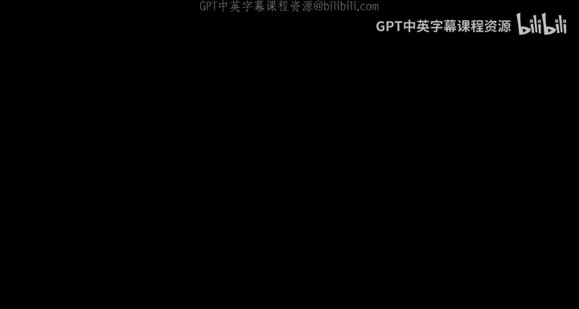
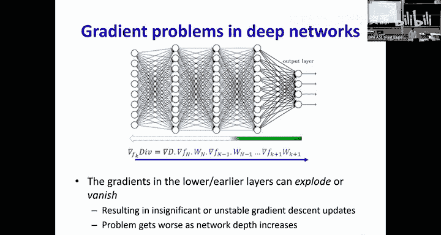
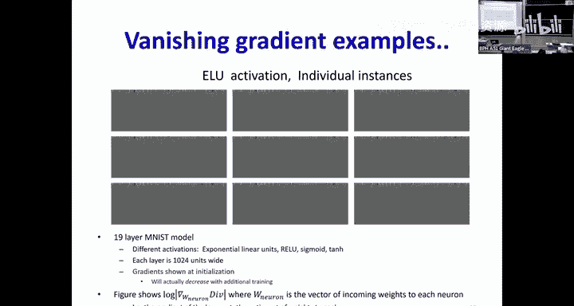
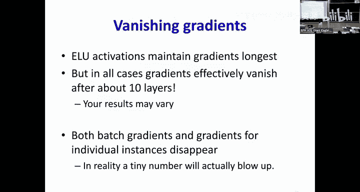
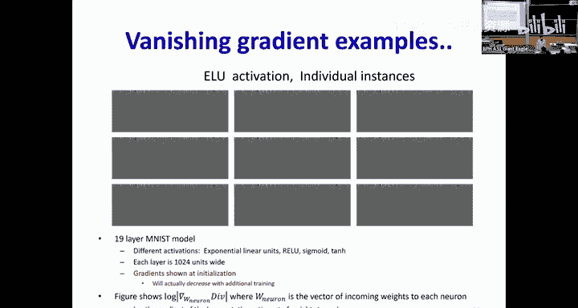
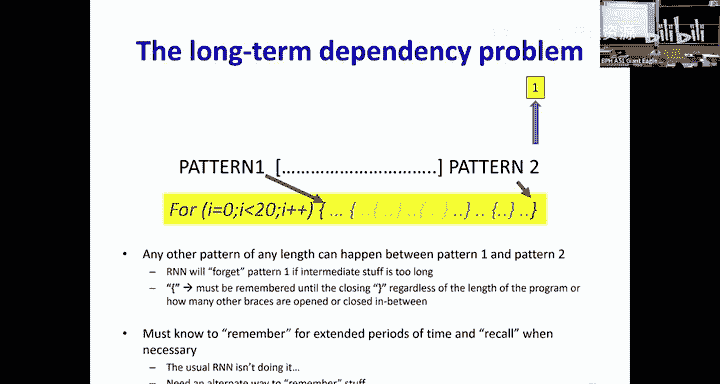
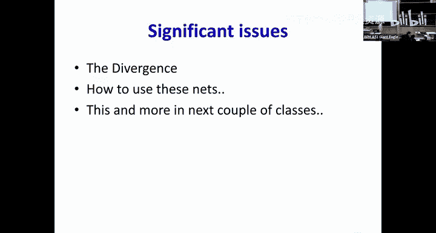

# 14：循环神经网络 (RNNs) 第二部分 🧠



在本节课中，我们将继续探讨循环神经网络。我们将了解为什么简单的RNN在记忆长期信息方面存在困难，以及如何通过更先进的架构（如长短期记忆网络）来解决这些问题。

---

## 概述

上一节我们介绍了循环神经网络的基本概念，以及它们如何通过循环结构处理序列数据。本节中，我们将深入探讨RNN在长期记忆方面面临的挑战，并介绍一种强大的解决方案——长短期记忆网络。

---

## RNN的局限性：记忆与梯度问题

我们之前看到，循环结构理论上可以记住来自“时间起点”的信息。但在实践中，简单的RNN在记忆方面表现不佳。

### 线性系统的行为分析

为了理解问题所在，我们先分析一个简化的线性RNN。假设我们有一个没有非线性激活函数的循环层，其操作可以表示为：

**公式：**
`h_t = W_h * h_{t-1} + W_x * x_t`

其中，`h_t` 是时间步 `t` 的隐藏状态，`W_h` 是循环权重矩阵，`W_x` 是输入权重矩阵，`x_t` 是时间步 `t` 的输入。

如果我们只考虑在时间 `0` 有一个输入 `x_0`，而后续输入均为 `0`，那么经过 `t` 个时间步后，隐藏状态变为：

**公式：**
`h_t = (W_h)^t * W_x * x_0`

这个公式揭示了关键问题：隐藏状态 `h_t` 的行为完全取决于循环权重矩阵 `W_h` 的 `t` 次幂。

### 特征值的影响

通过对权重矩阵 `W_h` 进行特征值分解，我们可以发现：
*   如果 `W_h` 的最大特征值（按模计算）**大于1**，`(W_h)^t` 会随着 `t` 增大而**爆炸式增长**，导致隐藏状态值变得极大（爆炸）。
*   如果最大特征值**小于1**，`(W_h)^t` 会随着 `t` 增大而**趋近于0**，导致隐藏状态值消失（梯度消失）。

这意味着，在简单的线性RNN中，网络要么很快忘记过去的输入，要么状态值变得不稳定，无法有效保留长期信息。

### 加入非线性激活函数

在实际的RNN中，我们会使用非线性激活函数（如 `tanh` 或 `sigmoid`）。分析表明：
*   **`sigmoid` 激活函数**：容易饱和，网络在几个时间步后就会忘记输入，最终状态仅取决于权重和偏置。
*   **`tanh` 激活函数**：比 `sigmoid` 稍好，能记住信息更久一些，但最终仍然会忘记。
*   **`ReLU` 激活函数**：可能导致输出爆炸或消失。

结论是：**无论使用哪种激活函数，简单RNN都难以维持长期记忆**。记忆的持续时间取决于循环权重矩阵和激活函数，而不是输入数据本身，这与许多任务（如代码解析中需要配对括号）的需求不符。

---

## 深度网络中的梯度问题

RNN在时间上展开后，本质上是一个非常深的网络。训练深度网络时，反向传播梯度会遇到不稳定问题。

### 梯度消失与爆炸

在反向传播过程中，误差梯度需要从输出层逐层传递回输入层。每一步都涉及与权重矩阵和激活函数雅可比矩阵的乘法。
*   **激活函数雅可比矩阵**：通常是对角矩阵，其对角线元素是激活函数的导数。对于 `sigmoid`、`tanh` 等函数，其导数值通常**小于或等于1**，这会导致梯度**收缩**。
*   **权重矩阵**：通过奇异值分解分析，乘以权重矩阵会使梯度在某些方向**扩张**（奇异值>1），在另一些方向**收缩**（奇异值<1）。

由于各层的收缩方向通常不对齐，经过多层反向传播后，**大多数参数的梯度会变得非常小（消失）**，而少数方向的梯度可能变得非常大（爆炸）。这使得网络深层参数难以得到有效更新。



实验表明，即使是改进的激活函数如 `ELU`，梯度在反向传播约10层后也基本会消失。





---



## 解决方案：长短期记忆网络 (LSTM)

为了解决简单RNN的长期记忆和梯度问题，我们引入了长短期记忆网络。其核心思想是：**让记忆的更新由输入数据本身触发和控制，而不是固定的网络参数**。

### LSTM 的核心概念

LSTM 引入了一个称为“细胞状态”的**恒定误差传送带**。信息在这个传送带上流动，只受到一些“门”结构的轻微调节。这些门由输入数据和当前上下文决定，从而实现了长期记忆。




以下是LSTM单元的关键组件图示：

```
输入 (x_t)          上一时刻隐藏状态 (h_{t-1})
      |                    |
      ---------------|--------------
                    \|/
                 [LSTM 单元]
                    /|\
      ---------------|--------------
      |                    |
当前隐藏状态 (h_t)       细胞状态 (C_t)
```

一个LSTM单元内部主要包含以下部分：

1.  **细胞状态**：记忆的“主线”，信息在其中相对不变地流动。
2.  **遗忘门**：一个 `sigmoid` 层，决定从细胞状态中丢弃哪些信息。它查看 `h_{t-1}` 和 `x_t`，并为细胞状态 `C_{t-1}` 中的每个元素输出一个0到1之间的数（1表示“完全保留”，0表示“完全遗忘”）。
    *   **公式**：`f_t = σ(W_f · [h_{t-1}, x_t] + b_f)`
3.  **输入门**：一个 `sigmoid` 层，决定哪些新信息将被存储到细胞状态中。
    *   **公式**：`i_t = σ(W_i · [h_{t-1}, x_t] + b_i)`
4.  **候选值**：一个 `tanh` 层，创建一个新的候选值向量，可能会被添加到细胞状态中。
    *   **公式**：`\tilde{C}_t = tanh(W_C · [h_{t-1}, x_t] + b_C)`
5.  **更新细胞状态**：将旧状态 `C_{t-1}` 更新为新状态 `C_t`。首先将旧状态乘以遗忘门 `f_t`（丢弃部分信息），然后加上输入门 `i_t` 和候选值 `\tilde{C}_t` 的乘积（添加新信息）。
    *   **公式**：`C_t = f_t * C_{t-1} + i_t * \tilde{C}_t`
6.  **输出门**：一个 `sigmoid` 层，基于细胞状态决定输出什么。
    *   **公式**：`o_t = σ(W_o · [h_{t-1}, x_t] + b_o)`
7.  **最终隐藏状态输出**：将细胞状态 `C_t` 通过 `tanh` 函数（将值缩放到-1到1之间），然后乘以输出门 `o_t`，得到当前时刻的隐藏状态 `h_t`，并作为输出。
    *   **公式**：`h_t = o_t * tanh(C_t)`

### LSTM 的优势

*   **解决长期依赖**：通过精心设计的门控机制，LSTM可以选择性地记住或忘记信息，从而有效捕捉长期依赖关系。
*   **缓解梯度问题**：细胞状态上的线性循环连接（`C_t = f_t * C_{t-1} + ...`）使得梯度可以更稳定地流动，缓解了梯度消失问题。

### 简化版：门控循环单元

由于LSTM结构相对复杂，后来出现了其简化变体——**门控循环单元**。GRU将遗忘门和输入门合并为一个“更新门”，同时将细胞状态和隐藏状态合并，使结构更加简洁，但在许多任务上仍能取得与LSTM相当的性能。

---

## 训练 LSTM

训练LSTM与训练标准RNN类似，都使用基于时间的反向传播算法。虽然LSTM单元内部计算复杂，但现代深度学习框架（如PyTorch、TensorFlow）可以自动计算梯度，我们只需定义前向传播过程即可。

关键点在于，将LSTM的前向传播过程分解为一系列**线性运算后接激活函数**的基本操作。这样，反向传播就可以通过框架的自动微分功能轻松实现，无需手动推导复杂的梯度公式。

---

## 总结

本节课中我们一起学习了：
1.  **简单RNN的局限性**：分析了其在长期记忆方面的不足，以及训练时面临的梯度消失/爆炸问题。
2.  **LSTM的原理**：介绍了长短期记忆网络如何通过细胞状态和门控机制（遗忘门、输入门、输出门）来解决长期依赖问题。
3.  **LSTM的优势**：LSTM能够选择性地保留和遗忘信息，使梯度流动更稳定，非常适合需要长程记忆的任务，如机器翻译、文本生成、代码解析等。
4.  **训练与应用**：LSTM可以通过BPTT进行训练，并且可以像标准RNN一样堆叠成多层或构建双向网络。



通过引入LSTM，我们获得了处理长序列数据的强大工具，为后续学习更复杂的序列模型奠定了基础。